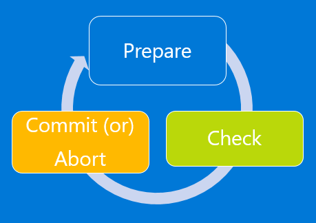

<properties
	pageTitle="Platform-supported migration of IaaS resources from classic to Azure Resource Manager | Microsoft Azure"
	description="This article walks through the platform-supported migration of resources from classic to Azure Resource Manager"
	services="virtual-machines-windows"
	documentationCenter=""
	authors="mahthi"
	manager="drewm"
	editor=""
	tags="azure-resource-manager"/>

<tags
	ms.service="virtual-machines-windows"
	ms.workload="infrastructure-services"
	ms.tgt_pltfrm="vm-windows"
	ms.devlang="na"
	ms.topic="article"
	ms.date="05/04/2016"
	ms.author="mahthi"/>

# Platform-supported migration of IaaS resources from classic to Azure Resource Manager

It’s been almost a year since we announced the support for virtual machines under Azure Resource Manager. You can read more about the advancements and the additional capabilities that it supports here. In addition, we gave guidance around how to best connect and have resources from the two deployment models coexist in your subscription by using virtual network site-to-site gateways. In this article, we describe how we're enabling migration of infrastructure as a service (IaaS) resources from classic to Resource Manager.

## Goal for migration

With the release of the new model, you can deploy, manage, and monitor related services in a resource group. Resource Manager enables deploying complex applications through templates, configures virtual machines by using VM extensions, and incorporates access management and tagging. It also includes scalable, parallel deployment for virtual machines into availability sets. In addition, the new model provides lifecycle management of compute, network, and storage independently. Finally, there’s a focus on enabling security by default with the enforcement of virtual machines in a virtual network.

Almost all the features from the classic deployment model are supported for compute, network, and storage under Azure Resource Manager. Because of this new capability and the growing deployment base in Azure Resource Manager, we want customers to be able to migrate existing deployments in the classic deployment model.

## Changes to your automation and tooling after migration

As part of migrating your resources from the classic model to the Resource Manager model, you'll have to update your existing automation or tooling to ensure that it continues to work after the migration.

## Meaning of migration of IaaS resources from classic to Resource Manager

Before we drill down into the details, we’d like to briefly explain the difference between data-plane and management-plane operations on the IaaS resources. Understanding these differences is critical because this explains how we are planning to support migration.

- *Management plane* describes the calls that come into the management plane or the API for modifying resources. For example, operations like creating a VM, restarting a VM, and updating a virtual network with a new subnet manage the running resources. They don't directly affect connecting to the instances.
- *Data plane* (application) describes the runtime of the application itself and involves interaction with instances that don’t go through the Azure API. Accessing your website or pulling data from a running SQL Server instance or a MongoDB server would be considered data plane or application interaction. Copying a blob from a storage account and accessing a public IP address to RDP or SSH into the virtual machine also are data plane. These operations keep the application running across compute, networking, and storage.

>[AZURE.NOTE] In some migration scenarios, we will stop, deallocate, and restart your virtual machines. This will incur a short data-plane downtime.

## Supported scopes of migration

There are three migration scopes that primarily target compute, network and storage. 

### Migration of virtual machines (not in a virtual network)

In the Resource Manager deployment model, we enforce security of your applications by default. All VMs need to be in a virtual network in the Resource Manager model. Therefore, we will be restarting (`Stop`, `Deallocate`, and `Start`) the VMs as part of the migration. You have two options for the virtual networks:

- You can request the platform to create a new virtual network and migrate the virtual machine into the new virtual network.
- You can migrate the virtual machine into an existing virtual network in Resource Manager.

>[AZURE.NOTE] In this migration scope, both the management-plane operations and the data-plane operations may not be allowed for a period of time during the migration.

### Migration of virtual machines (in a virtual network)

In this scope, for most VM configurations, we are migrating only the metadata between the classic deployment model and the Resource Manager deployment model. The underlying VMs are running on the same hardware, in the same network, and with the same storage. So when we refer to migration of the metadata from classic to Resource Manager, the management-plane operations may not be allowed for a certain period of time during the migration. However, the data plane will continue to work. That is, your applications running on top of VMs (classic) will not incur downtime during the migration.

At this time, the following configurations are not supported. If we add support for them in the future, some VMs in this configuration might incur downtime (will go through stop, deallocate, and restart VM operations).

-	You have more than one availability set in a single cloud service.
-	You have one or more availability sets and VMs that are not in an availability set in a single cloud service.

>[AZURE.NOTE] In this migration scope, the management plane may not be allowed for a period of time during the migration. For certain configurations as described earlier, this will incur data-plane downtime.

### Storage accounts migration

To allow seamless migration, we have enabled the capability to deploy Resource Manager VMs in a classic storage account. With this capability, compute and network resources can and should be migrated independently of storage accounts. Once you have migrated over your Virtual Machines and Virtual Network, you will need to migrate over your storage accounts to complete the migration process. 

>[AZURE.NOTE] Resource Manager deployment model doesn't have the concept of classic images and disks. When the storage account is migrated, these will not be visible in the Resource Manager stack but the backing VHDs will remain in the storage account. 

## Unsupported features and configurations

At this time, we do not support some features and configurations. The following sections describe our recommendations around them.

### Unsupported features

The following features are not currently supported. You can optionally remove these settings, migrate the VMs, and then re-enable the settings in the Resource Manager deployment model.

Resource provider | Feature
---------- | ------------
Compute | Unassociated virtual machine disks.
Compute | Virtual machine images.
Network | Unassociated reserved IPs (if not attached to a VM). Reserved IPs attached to VMs are supported.
Network | Unassociated network security groups (if not attached to a virtual network or network interface). NSGs referenced by virtual networks are supported.
Network | Endpoint ACLs.
Network | Virtual network gateways (site to site, Azure ExpressRoute, point to site).

### Unsupported configurations

The following configurations are not currently supported.

Service | Configuration | Recommendation
---------- | ------------ | ------------
Resource Manager | Role Based Access Control (RBAC) for classic resources | Because the URI of the resources are modified after migration, we recommend that you plan the RBAC policy updates that need to happen after migration.
Compute | Multiple subnets associated with a VM | You should update the subnet configuration to reference only subnets.
Compute | Virtual machines that belong to a virtual network but don't have an explicit subnet assigned | You can optionally delete the VM.
Compute | Virtual machines that have alerts, Autoscale policies | At this time, the migration will go through and these settings will be dropped. So we highly recommend that you evaluate your environment before you do the migration. Alternatively, you can reconfigure the alert settings after migration is complete.
Compute | XML VM extensions (Visual Studio Debugger, Web Deploy, and Remote Debugging) | This is not supported. We recommend that you remove these extensions from the virtual machine to continue migration.
Compute | Boot diagnostics with Premium storage | Please disable Boot Diagnostics feature for the VMs before continuing with migration. You can re-enable boot diagnostics in the Resource Manager stack after the migration is complete. Additionally, blobs that are being used for screenshot and serial logs should be deleted so you are no longer charged for those blobs.
Compute | Cloud services that contain web/worker roles | This is currently not supported.
Network | Virtual networks that contain virtual machines and web/worker roles |  This is currently not supported.
Azure App Service | Virtual networks that contain App Service environments | This is currently not supported.
Azure HDInsight | Virtual networks that contain HDInsight services | This is currently not supported.
Microsoft Dynamics Lifecycle Services | Virtual networks that contain virtual machines that are managed by Dynamics Lifecycle Services | This is currently not supported.

## The migration experience

Before you start the migration experience, we highly recommend the following:

- Ensure that the resources that you want to migrate don't use any unsupported features or configurations. In most cases, the platform detects these issues and throws an error.
- If you have VMs that are not in a virtual network, they will be stopped and deallocated as part of the prepare operation. If you don't want to lose the public IP address, please look into reserving the IP address before triggering the prepare operation. However, if the VMs are in a virtual network, they will not be stopped and deallocated.
- Plan your migration during non-business hours to accommodate for any unexpected failures that might happen during migration.
- Download the current configuration of your VMs by using PowerShell, command-line interface (CLI) commands, or REST APIs to make it easier for validation after the prepare step is complete.
- Update your automation/operationalization scripts to handle the Resource Manager deployment model before you start the migration. You can optionally do GET operations when the resources are in the prepared state.
- Evaluate the RBAC policies that are configured on the classic IaaS resources, and have a plan for after the migration is complete.

The migration workflow is as follows

>[AZURE.NOTE] All the operations described in the following sections are idempotent. If you have a problem other than an unsupported feature or a configuration error, we recommend that you retry the prepare, abort, or commit operation. The platform will then try the action again.

### Validate

The validate operation is the first step in the migration process. The goal of this step is to analyze data in the background for the resources under migration and return success/failure if the resources are capable of migration.

You will select the virtual network or the hosted service (if it’s not a virtual network) that you want to validate for migration.

* If the resource is not capable of migration, the platform will list all the reasons for why it’s not supported for migration.

### Prepare

The prepare operation is the second step in the migration process. The goal of this step is to simulate the transformation of the IaaS resources from classic to Resource Manager resources and present this side by side for you to visualize.

You will select the virtual network or the hosted service (if it’s not a virtual network) that you want to prepare for migration.

* If the resource is not capable of migration, the platform will list the stop the migration process and list the reason why the prepare operation failed.
* If the resource is capable of migration, the platform first locks down the management-plane operations for the resources under migration. For example, you will not able to add a data disk to a VM under migration.

The platform will then start the migration of metadata from classic to Resource Manager for the migrating resources.

After the prepare operation is complete, you will have the option of visualizing the resources in both classic and Resource Manager. For every cloud service in the classic deployment model, we will create a resource group name that has the pattern `cloud-service-name>-migrated`.

>[AZURE.NOTE] Virtual Machines that are not in a classic Virtual Network will be stopped deallocated in this phase of migration.

### Check (manual or scripted)

In the check step, you can optionally use the configuration that you downloaded earlier to validate that the migration looks correct. Alternatively, you can sign in to the portal and spot check the properties and resources to validate that metadata migration looks good.

If you are migrating a virtual network, most configuration of virtual machines will not be restarted. For applications on those VMs, you can validate that the application is still up and running.

You can test your monitoring/automation and operational scripts to see if the VMs are working as expected and if your updated scripts work correctly. Note that only GET operations are supported when the resources are in the prepared state.

There is no set time window before which you need to commit the migration. You can take as much time as you want in this state. However, note that the management plane will be locked for these resources until you either abort or commit.

If you see any issues, you can always abort the migration and go back to the classic deployment model. After you go back, we will open the management-plane operations on the resources so that you can resume normal operations on those VMs in the classic deployment model.

### Abort

Abort is an optional step that you can use to revert your changes to the classic deployment model and stop the migration.

>[AZURE.NOTE] This operation cannot be executed after you have triggered the commit operation. 	

### Commit

After you finish the validation, you can commit the migration. Resources will not appear anymore in classic and will be available only in the Resource Manager deployment model. This also means the migrated resources can be managed only in the new portal.

>[AZURE.NOTE] This is an idempotent operation. If it fails, we recommend that you retry this a couple of times. If it continues to fail, please create a support ticket or create a forum post with a ClassicIaaSMigration tag on our [VM forum](https://social.msdn.microsoft.com/Forums/azure/en-US/home?forum=WAVirtualMachinesforWindows).

## Frequently asked questions

**Does this migration plan affect any of my existing services or applications that run on Azure virtual machines?**

No. The VMs (classic) are fully supported services in general availability. You can continue to use these resources to expand your footprint on Microsoft Azure.

**What happens to my VMs if I don’t plan on migrating in the near future?**

We are not deprecating the existing classic APIs and resource model. We want to make migration easy, considering the advanced features that are available in the Resource Manager deployment model. We highly recommend that you review [some of the advancements](virtual-machines-windows-compare-deployment-models.md) that are part of IaaS under Resource Manager.

**What does this migration plan mean for my existing tooling?**

Updating your tooling to the Resource Manager deployment model is one of the most important changes that you have to account for in your migration plans.

**How long will the management-plane downtime be?**

It depends on the number of resources that are being migrated. For smaller deployments (a few tens of VMs), the whole migration should take less than an hour. For large-scale deployments (hundreds of VMs), the migration can take a few hours.

**Can I roll back after my migrating resources are committed in Resource Manager?**

You can abort your migration as long as the resources are in the prepared state. Rollback is not supported after the resources have been successfully migrated through the commit operation.

**Can I roll back my migration if the commit operation fails?**

You cannot abort migration if the commit operation fails. All migration operations, including the commit operation, are idempotent. So we recommend that you retry the operation after a short time. If you still face an error, please create a support ticket or create a forum post with the ClassicIaaSMigration tag on our [VM forum](https://social.msdn.microsoft.com/Forums/azure/en-US/home?forum=WAVirtualMachinesforWindows).

**Do I have to buy another express route circuit if I have to use IaaS under Resource Manager?**

No. We recently enabled [coexistence of an ExpressRoute circuit across classic and Resource Manager](../expressroute/expressroute-howto-coexist-resource-manager.md). You don’t have to buy a new ExpressRoute circuit if you already have one.

**What if I had configured Role-Based Access Control policies for my classic IaaS resources?**

During migration, the resources transform from classic to Resource Manager. So we recommend that you plan the RBAC policy updates that need to happen after migration.

**What if I’m using Azure Site Recovery or Azure Backup today?**

Azure Site Recovery and Backup support for VMs under Resource Manager was added recently. We are working to enable the capability to support migration of VMs into Resource Manager as well. At this time, we recommend that you don't run migration if you're using these functionalities.

**Can I validate my subscription or resources to see if they're capable of migration?**

At this time, the prepare operation does an implicit validation for the resources that are being prepared for migration. In the platform-supported migration option, the first step in preparing for migration is to validate that the resources are capable of migration. If the validation fails, the resources will not be touched at all.

**What happens if I run into a quota error while preparing the IaaS resources for migration?**

We recommend that you abort your migration and then log a support request to increase the quotas in the region where you are migrating the VMs. After the quota request is approved, you can start executing the migration steps again.

**How do I report an issue?**

Please post your issues and questions about migration to our [VM forum](https://social.msdn.microsoft.com/Forums/azure/en-US/home?forum=WAVirtualMachinesforWindows), with the keyword ClassicIaaSMigration. We recommend posting all your questions on this forum. If you have a support contract, you're welcome to log a support ticket as well.

**What if I don't like the names of the resources that the platform chose during migration?**

All the resources that you explicitly provide names for in the classic deployment model will be retained during migration. In some cases, new resources will be created. For example: a network interface will be created for every VM. At this moment, we don't support the ability to control the names of these new resources created during migration. Please log your votes for this feature on the [Azure feedback forum](http://feedback.azure.com).

## Next steps
Now that you understand the migration of classic IaaS resources to Resource Manager, you can start migrating resources.

- [Technical deep dive on platform-supported migration from classic to Azure Resource Manager](virtual-machines-windows-migration-classic-resource-manager-deep-dive.md)
- [Use PowerShell to migrate IaaS resources from classic to Azure Resource Manager](virtual-machines-windows-ps-migration-classic-resource-manager.md)
- [Use CLI to migrate IaaS resources from classic to Azure Resource Manager](virtual-machines-linux-cli-migration-classic-resource-manager.md)
- [Clone a classic virtual machine to Azure Resource Manager by using community PowerShell scripts](virtual-machines-windows-migration-scripts.md)
