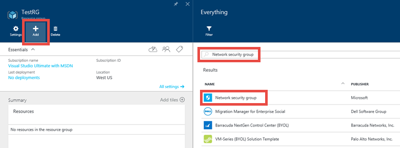
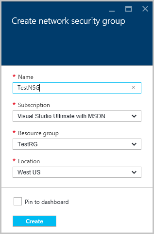
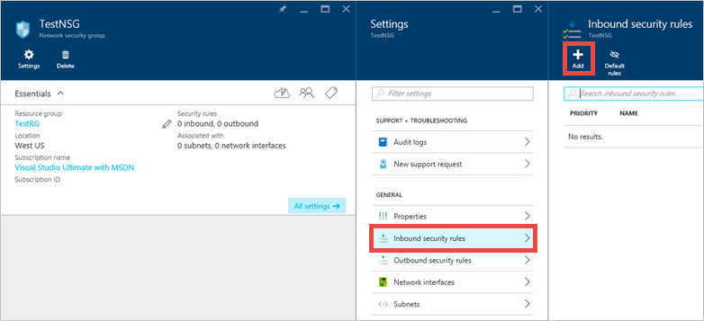
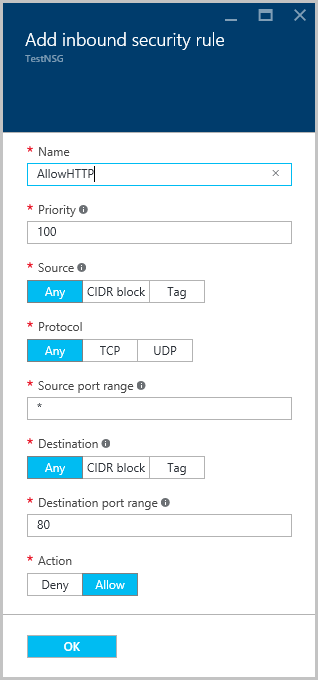
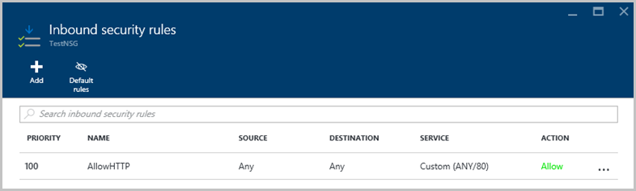
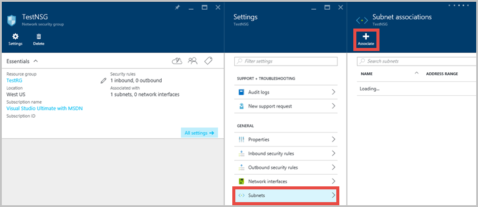
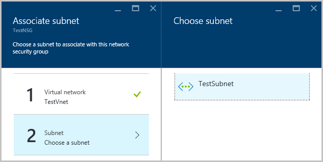

<properties
   pageTitle="Allow external access to a Windows VM | Microsoft Azure"
   description="Learn how to open a port for external access to your Windows VM using the resource manager deployment model"
   services="virtual-machines-windows"
   documentationCenter=""
   authors="iainfoulds"
   manager="timlt"
   editor=""/>

<tags
   ms.service="virtual-machines-windows"
   ms.devlang="na"
   ms.topic="article"
   ms.tgt_pltfrm="vm-windows"
   ms.workload="infrastructure-services"
   ms.date="05/24/2016"
   ms.author="iainfou"/>

# Allow external access to your Windows VM using the Azure Portal
To allow external traffic to reach your virtual machine (VM) when using the Resource Manager model, you create an Access Control List (ACL) rule in a Network Security Group that is associated with your virtual machine. This concept may also be known as creating an endpoint. This article provides quick steps to open the required ports to your VM and allow external access using the Azure Portal. You can also [perform these steps using Azure PowerShell](virtual-machines-windows-nsg-quickstart-powershell.md).

## Quick Commands
In the following example you will create a Network Security Group, create a rule to allow HTTP traffic to a webserver, then assign this rule to your VM.

First, create your Network Security Group. Select a resource group in the portal, click 'Add', then search for a select 'Network Security Group':

Enter a name for your Network Security Group and selection a location:

Select your new Network Security Group. You now create an inbound rule:

Provide a name for your new rule, and note that port 80 is already entered. This is where you would change the source, protocol, and destination when adding additional rules to your Network Security Group:

Once created, you will your new rule listed:

Your final step is to associate your Network Security Group with a subnet or a specific network interface. Lets associate the Network Security Group with a subnet:

Select your virtual network, then select the appropriate subnet:

You have now created a Network Security Group, created an inbound rule that allows traffic on port 80, and associated it with a subnet. Any VMs that you connect to that subnet will be reachable on prot 80.

## More Information on Network Security Groups
The quick commands here allow you to get up and running with traffic flowing to your VM. Network Security Groups provide a lot of great features and granularity for controlling access to the your resources. You can read more about [creating a Network Security Group and ACL rules here](../virtual-network/virtual-networks-create-nsg-arm-ps.md).

Network Security Groups and ACL rules can also be defined as part of Azure Resouce Manager templates. Read more about [creating Network Security Groups with templates](../virtual-network/virtual-networks-create-nsg-arm-template.md).

If you need to use port-forwarding to map a unique external port to an internal port on your VM, you need use a load balancer and Network Address Translation (NAT) rules. For example, you may want to expose TCP port 8080 externally and have traffic directed to TCP port 80 on a VM. You can learn about [creating an Internet-facing load balancer](../load-balancer/load-balancer-get-started-internet-arm-ps.md).

## Next Steps

- [Azure Resource Manager overview](../resource-group-overview.md)
- [What is a Network Security Group (NSG)?](../virtual-network/virtual-networks-nsg.md)
- [Azure Resource Manager Overview for Load Balancers](../load-balancer/load-balancer-arm.md)