<properties
	pageTitle="Configure Always On availability group in Azure VM manually - Resource Manager"
	description="Create an Always On Availability Group with Azure Virtual Machines. This tutorial primarily uses the user interface and tools rather than scripting."
	services="virtual-machines"
	documentationCenter="na"
	authors="MikeRayMSFT"
	manager="jeffreyg"
	editor="monicar"
	tags="azure-service-management" />
<tags
	ms.service="virtual-machines"
	ms.devlang="na"
	ms.topic="article"
	ms.tgt_pltfrm="vm-windows-sql-server"
	ms.workload="infrastructure-services"
	ms.date="06/15/2016"
	ms.author="MikeRayMSFT" />

# Configure Always On availability group in Azure VM manually - Resource Manager

> [AZURE.SELECTOR]
- [Resource Manager: Auto](virtual-machines-windows-portal-sql-alwayson-availability-groups.md)
- [Resource Manager: Manual](virtual-machines-windows-portal-sql-alwayson-availability-groups-manual.md)
- [Classic: UI](virtual-machines-windows-classic-portal-sql-alwayson-availability-groups.md)
- [Classic: PowerShell](virtual-machines-windows-classic-ps-sql-alwayson-availability-groups.md)

 

This end-to-end tutorial shows you how to implement SQL Server availability groups on Azure resource manager virtual machines. 

At the end of the tutorial, your solution will consist of the following elements:

- A virtual network containing two subnets, including a front-end and a back-end subnet

- Two domain controllers in an availability set with an Active Directory (AD) domain 

- Two SQL Server VMs in an availability set deployed to the back-end subnet and joined to the AD domain

- A 3-node WSFC cluster with the Node Majority quorum model

- An internal load balancer to provide an IP address to the availabiltiy groups

- An availability group with two synchronous-commit replicas of an availability database

The figure below is a graphical representation of the solution.

Note that this is one possible configuration. For example, you can minimize the number of VMs for a two-replica availability group in order to save on compute hours in Azure by using the domain controller as the quorum file share witness in a 2-node WSFC cluster. This method reduces the VM count by one from the above configuration.

>[AZURE.NOTE] Completing this tutorial takes a significant amount of time. You can also automatically build this entire solution. In the Azure Portal, there is a gallery setup for Always On availability groups with a listener. This configures everything you need for availability groups automatically. For more information, see [Portal - Resource Manager](virtual-machines-windows-portal-sql-alwayson-availability-groups.md). 

[AZURE.INCLUDE [availability-group-template](../../includes/virtual-machines-windows-portal-sql-alwayson-ag-template.md)]

This tutorial assumes the following:

- You already have an Azure account.

- You already know how to provision a SQL Server VM from the virtual machine gallery using the GUI. For more information, see [Provisioning a SQL Server Virtual Machine on Azure](virtual-machines-windows-portal-sql-server-provision.md)

- You already have a solid understanding of availability groups. For more information, see [Always On Availability Groups (SQL Server)](https://msdn.microsoft.com/library/hh510230.aspx).

>[AZURE.NOTE] If you are interested in using availability groups with SharePoint, also see [Configure SQL Server 2012 Always On Availability Groups for SharePoint 2013](https://technet.microsoft.com/library/jj715261.aspx).

## Create resource group

1. Sign in to the [Azure portal](http://portal.azure.com). 

1. Click **+New** and then type **Resource group** in the **Marketplace** search window.

    

1. Click **Resource group** 

    

1. Click **Create**. 

1. In the **Resource group** blade, under **Resource group name** type **SQL-HA-RG**

1. If you have multiple Azure subscriptions, verify that the subscription is the Azure subscription you want to create the availability group in. 

1. Select a location. The location is the Azure location where the availability group will run. For this tutorial we are going to build all resourcs in one Azure location. 

1. Verify **Pin to dashboard** is checked. This optional setting places a shortcut for the resource group on the Azure portal dashboard. 

1. Click **Create** to create the resource group.

Azure will create the new resource group and pin a shortcut to the resource group in the portal.

## Create network and subnets

The next step is to create the networks and subnets in the Azure resource group.

The solution uses one virtual network with two subnets. You should understand the basics of networks and how networks work in Azure. The [Virtual Network Overview](../virtual-network/virtual-networks-overview.md) provides more information about networks in Azure.

To create the virtual network:

1. On the Azure portal click click on the new resource group and click **+** to add a new item to the resource group. Azure opens the **Everything** blade. 

    

1. Search for **virtual network**.

    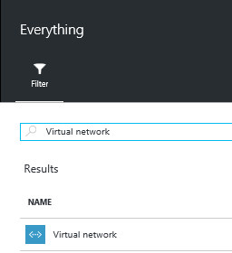

1. Click **Virtual network**.

1. In the **Virtual network** blade, click the **Resource Manager**  deployment model and click **Create**.

    
 

 
1. Configure the virtual network on the **Create virtual network** blade. 

    The table below shows the settings for the virtual network. 

    | **Field** | Value |
| ----- | ----- |
| **Name** | autoHAVNET |
| **Address space** | 10.0.0.0/16 |
| **Subnet name** | Subnet-1 |
| **Subnet address range** | 10.0.0.0/24 |
| **Subscription** | Specify the subscription that you intend to use. If you only have one subscription this may be blank. |
| **Location** | Specify the Azure location where you will deploy your availability group |

    Note that your address space and subnet address range may be different from the table. Depending on your subscription Azure will automatically specify an available address space and corresponding subnet address range. If no sufficient address space is available use a different subscription. 

1. Click **Create**

    

Azure will return you to the portal dashboard and notify you when the new network is created.

### Create the second subnet

At this point your virtual network contains one subnet, named Subnet-1. The domain controllers will use this subnet. The SQL Servers will use a second subnet named **Subnet-2**. To configure Subnet-2

1. On your dashboard, click on the resource group that you created, **SQL-HA-RG**. Locate the network in the resource group under **Resources**.

  If **SQL-HA-RG** is not visible you can find it by clicking **Resource Groups** and filtering by the resource group name that you created.

1.  Click **autoHAVNET** on the list of resources to open the network configuration blade.

1.  On **autoHAVNET** virtual network, click **All settings*.

1. On the **Settings** blade, click **Subnets**.

    Notice the subnet that you already created. 

    

1. Create a second subnet. Click **+ Subnet**. 

    In the **Add Subnet** blade configure the subnet by typing **subnet-2** under **Name**. Azure will automatically specify a valid **Address range**. Verify that this address range has at least 10 addresses in it. In a production environment you may require more addresses. 

1. Click **OK**.
 

   
Here is a summary of the configuration settings for the virtual network and both subnets.

| **Field** | Value |
| ----- | ----- |
| **Name** | **autoHAVNET** |
| **Address space** | Depends on available address spaces in your subscription. A typical value is 10.0.0.0/16 |
| **Subnet name** | **Subnet-1** |
| **Subnet address range** | Depends on available address ranges in your subscription. A typical value is 10.0.0.0/24. |
| **Subnet name** | **Subnet-2** |
| **Subnet address range** | Depends on available address ranges in your subscription. A typical value is 10.0.1.0/24. |
| **Subscription** | Specify the subscription that you intend to use. |
| **Resource Group** | **SQL-HA-RG** |
| **Location** | Specify the same location that you chose for the resource group. |

## Create availability sets

Before creating virtual machines, you need to create availability sets. Availablity sets reduce downtime for planned or unplanned maintenance events. An Azure availablity set is a logical group of resources that Azure places on physical fault domains and update domains. A fault domain ensures that the members of the availablity set have separate power and network resouces. An update domain ensures that members of the availabilty set are not brought down for maintenance at the same time. [Manage the availability of virtual machines](virtual-machines-windows-manage-availability.md).

You will need two availability sets. One is for the domain controllers, the second is for the SQL Servers.

To create an availablity set go to the resource group and click **Add**. Filter the results by typing **Availabilty Set**. Click **Availability Set** in the results. Click **Create**.

Configure two availablity sets according to the parameters in the following table.

| **Field** | Domain Controller Availabiltiy Set | SQL Server Availablity Set |
| ----- | ----- | ----- |
| **Name**  | adAvailablitySet | sqlAvailabilitySet|
| **Resource group** | SQL-HA-RG | SQL-HA-RG |
| **Fault domains** | 3 | 3 |
| **Update domains** | 5 | 3 |

After you create the availability sets, return to the resource group in the Azure portal.

## Create domain controllers

At this point you have created the network, subnets, availablity sets and an internet facing load balancer. You are ready to create the virtual machines for the domain controllers.

### Create the virutal machines for the domain controllers

To create and configure the domain controllers, return to the **SQL-HA-RG** resource group.

1. Click Add. The **Everything** blade opens.

1. Type **Windows Server 2012 R2 Datacenter**. 

1. Click **Windows Server 2012 R2 Datacenter**. In the **Windows Server 2012 R2 Datacenter** blade verify that the deployment model is set to **Resource Manager** and click **Create**. Azure opens the **Create virtual machine** blade. 

You will go through that process twice to create two virtual machines. Name the two virtual machine:

- ad-primary-dc
- ad-secondary-dc

 >[AZURE.NOTE] **ad-secondary-dc** is an optional component to provide high availability for Active Directory domain services. 

The following table shows the settings for these two machines.

| **Field** | Value 
| ----- | ---- 
| **User name**  | DomainAdmin
| **Password** | Contoso!0000 |
| **Subscription** | *your subscription* |
| **Resource group** | SQL-HA-RG |
| **Location** | *your location* 
| **Size** | D1_V2 (Standard)
| **Storage type** | standard
| **Storage account** | *Automatically created*
| **Virtual network** | autoHAVNET
| **Subnet** | subnet-1
| **Public IP address** |  *Same name as the VM*
| **Network Security Group** | *Same name as the VM*
| **Diagnostics** | Enabled
| **Diagnostics storage account** | *Automatically created*
| **Availability set** | adAvailabilitySet

>[AZURE.NOTE] You cannot change the availabilty set on a VM after it is created.

Azure will create the virtual machines.

After the virtual machines are created, configure the domain controller.

### Configure the domain controller

In the following steps, configure the **ad-primary-dc** machine as a domain controller for corp.contoso.com.

1. In the portal open the **SQL-HA-RG** resource group and select the **ad-primary-dc** machine. On the **ad-primary-dc** blade, click **Connect** to open an RDP file for remote desktop access.

	

1. Log in with your configured administrator account (**\DomainAdmin**) and password (**Contoso!0000**).

1. By default, the **Server Manager** dashboard should be displayed.

1. Click the **Add roles and features** link on the dashboard.

	

1. Select **Next** until you get to the **Server Roles** section.

1. Select the **Active Directory Domain Services** and **DNS Server** roles. When prompted, add any additional features required by these roles.

	>[AZURE.NOTE] You will get a validation warning that there is no static IP address. If you are testing the configuration, click continue. For production scenarios set the IP address to static in the Azure portal or [use PowerShell to set the static IP address of the domain controller machine](./virtual-network/virtual-networks-reserved-private-ip.md).

	

1. Click **Next** until you reach the **Confirmation** section. Select the **Restart the destination server automatically if required** checkbox.

1. Click **Install**.

1. After the features finish installing, return to the **Server Manager** dashboard.

1. Select the new **AD DS** option on the left-hand pane.

1. Click the **More** link on the yellow warning bar.

	

1. In the **Action** column of the **All Server Task Details** dialog, click **Promote this server to a domain controller**.

1. In the **Active Directory Domain Services Configuration Wizard**, use the following values:

| **Page** |Setting|
|---|---|
|**Deployment Configuration** |**Add a new forest** = Selected **Root domain name** = corp.contoso.com|
|**Domain Controller Options**|**DSRM Password** = Contoso!0000 **Confirm Password** = Contoso!0000|

1. Click **Next** to go through the other pages in the wizard. On the **Prerequisites Check** page, verify that you see the following message: **All prerequisite checks passed successfully**. Note that you should review any applicable warning messages, but it is possible to continue with the install.

1. Click **Install**. The **ad-primary-dc** virtual machine will automatically reboot.

### Configure the second domain controller

After the primary domain controller reboots, you can configure the second domain controller. This optional step is for high availability. To complete this step, you will need to know the private IP address for the domain controller. You can get this from the Azure portal.  Follow these steps to configure the second domain controller.

1. Log back into the **ad-primary-dc** machine. 

1. Open Remote desktop and connect to the secondary domain controller by IP address. If you do not know the IP address of the secondary domain controller, go to the Azure portal and check the address assigned to the network interface for the secondary domain controller. 

1. Change the preferred DNS server address to the address for the domain controller. 

1. Launch the RDP file to the primary domain controller (**ad-primary-dc**) and log into the VM using your configured administrator account (**BUILTIN\DomainAdmin**) and password (**Contoso!0000**).

1. From the primary domain controller, launch a remote desktop to **ad-secondary-dc** using the IP address. Use the same account and password.

1. Once you are logged in, you should see the **Server Manager** dashboard. Click **Local Server** in the left pane.

1. Select the **IPv4 address assigned by DHCP, IPv6 enabled** link.

1. In the **Network Connections** window, select the network icon.

	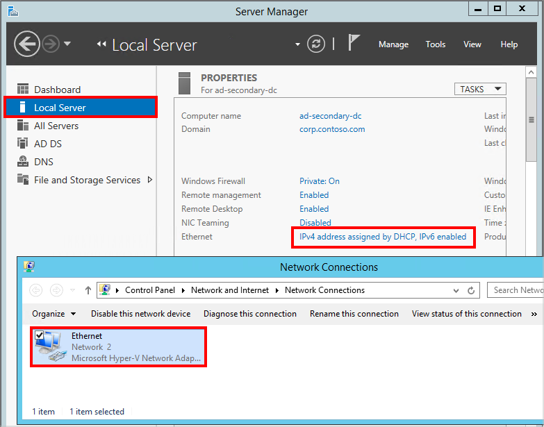

1. On the command bar, click **Change the settings of this connection** (depending on the size of your window, you might have to click the double right arrow to see this command).

1. Select **Internet Protocol Version 4 (TCP/IPv4)** and click Properties.

1. Select Use the following DNS server addresses and specify the address of the primary domain controller in **Preferred DNS server**.

1. The address is the address assigned to a VM in the subnet-1 subnet in the Azure virtual network, and that VM is **ad-primary-dc**. To verify **ad-primary-dc**'s IP address, use the **nslookup ad-primary-dc** in the command prompt, as shown below.

	

  >[AZURE.NOTE] After setting the DNS, you may loose the RDP session to the member server. If you do, reboot the VM from the Azure portal.

1. Click **OK** and then **Close** to commit the changes. You are now able to join the VM to **corp.contoso.com**.

1. Repeat the steps that you followed to create the first domain controller except, in the **Active Directory Domain Services Configuration Wizard**, use the following values:

|Page|Setting|
|---|---|
|**Deployment Configuration**|**Add a domain controller to an existing domain** = Selected **Root** = corp.contoso.com|
|**Domain Controller Options**|**DSRM Password** = Contoso!0000 **Confirm Password** = Contoso!0000|

### Configure Domain Accounts

The next steps configure the Active Directory (AD) accounts for later use.

1. Log back into the **ad-primary-dc** machine.

1. In **Server Manager** select **Tools** and then click **Active Directory Administrative Center**.

	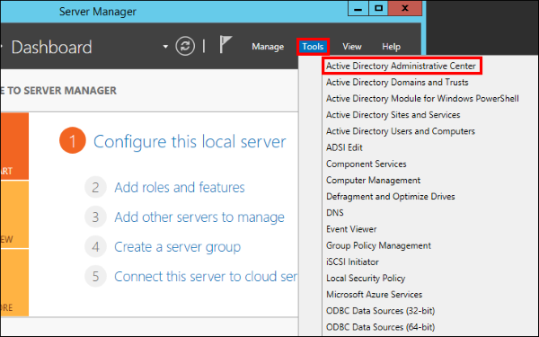

1. In the **Active Directory Administrative Center** select **corp (local)** from the left pane.

1. On the right **Tasks** pane, select **New** and then click **User**. Use the following settings:

|Setting|Value|
|---|---|
|**First Name**|Install|
|**User SamAccountName**|Install|
|**Password**|Contoso!0000|
|**Confirm password**|Contoso!0000|
|**Other password options**|Selected|
|**Password never expires**|Checked|

1. Click **OK** to create the **Install** user. This account will be used to configure the failover cluster and the availability group.

1. Create two additional users with the same steps: **CORP\SQLSvc1** and **CORP\SQLSvc2**. These accounts will be used for the SQL Server instances. Next, you need to give **CORP\Install** the necessary permissions for configuring Windows Service Failover Clustering (WSFC).

1. In the **Active Directory Administrative Center**, select **corp (local)** in the left pane. Then in the right-hand **Tasks** pane, click **Properties**.

	

1. Select **Extensions**, and then click the **Advanced** button on the **Security** tab.

1. On the **Advanced Security Settings for corp** dialog. Click **Add**.

1. Click **Select a principal**. Then search for **CORP\Install**. Click **OK**.

1. Select the **Read all properties** and **Create Computer objects** permissions.

	

1. Click **OK**, and then click **OK** again. Close the corp properties window.

Now that you have finished configuring Active Directory and the user objects, you will create two SQL Server VMs, and a witness server VM, and join all three to this domain.

## Create SQL Servers

###Create and configure the SQL Server VMs

Next, create three VMs, including two SQL Server VMs, and a WSFC cluster node. To create each of the VMs, go back to **SQL-HA-RG** resource group, click **Add**, search for the appropriate gallery item, **Virtual Machine**, and then **From Gallery**. Then use the templates in the following table to help you create the VMs.

|Page|VM1|VM2|VM3|
|---|---|---|---|
|Select the appropriate gallery item|**Windows Server 2012 R2 Datacenter**|**SQL Server 2014 SP1 Enterprise on Windows Server 2012 R2**|**SQL Server 2014 SP1 Enterprise on Windows Server 2012 R2**|
| Virtual machine configuraiton **Basics**  | **Name** = cluster-fsw **User Name** = DomainAdmin **Password** = Contoso!0000 **Subscription** = Your subscription **Resource group** = SQL-HA-RG **Location** = Your azure location | **Name** = sqlserver-0 **User Name** = DomainAdmin **Password** = Contoso!0000 **Subscription** = Your subscription **Resource group** = SQL-HA-RG **Location** = Your azure location  | **Name** = sqlserver-1 **User Name** = DomainAdmin **Password** = Contoso!0000 **Subscription** = Your subscription **Resource group** = SQL-HA-RG **Location** = Your azure location |
|Virtual machine configuration **Size** |DS1 (1 core, 3.5 GB memory)|**SIZE** = DS 2 (2 cores, 7 GB memory)|**SIZE** = DS 2 (2 cores, 7 GB memory)|
|Virtual machine configuration **Settings**|**Storage** = Premium (SSD) **NETWORK SUBNETS** = autoHAVNET **STORAGE ACCOUNT** = Use an automatically generated storage account **Subnet** = subnet-2(10.1.1.0/24) **Public IP address** = None **Network security group** = None **Monitoring Diagnostics** = Enabled **Diagnostics storage acccount** = Use an automatically generated storage account **AVAILABILITY SET** =  sqlAvailabilitySet |**Storage** = Premium (SSD) **NETWORK SUBNETS** = autoHAVNET **STORAGE ACCOUNT** = Use an automatically generated storage account **Subnet** = subnet-2(10.1.1.0/24) **Public IP address** = None **Network security group** = None **Monitoring Diagnostics** = Enabled **Diagnostics storage acccount** = Use an automatically generated storage account **AVAILABILITY SET** =  sqlAvailabilitySet |**Storage** = Premium (SSD) **NETWORK SUBNETS** = autoHAVNET **STORAGE ACCOUNT** = Use an automatically generated storage account **Subnet** = subnet-2(10.1.1.0/24) **Public IP address** = None **Network security group** = None **Monitoring Diagnostics** = Enabled **Diagnostics storage acccount** = Use an automatically generated storage account **AVAILABILITY SET** =  sqlAvailabilitySet 
|Virtual machine configuration **SQL Server settings**|Not applicable|**SQL connectivity** = Private (within Virtual Network) **Port** = 1433 **SQL Authentication** = Disable **Storage configuration** = General **Automated patching** = Sunday at 2:00 **Automated backup** = Disabled **Azure Key Vault integration** = Disabled|**SQL connectivity** = Private (within Virtual Network) **Port** = 1433 **SQL Authentication** = Disable **Storage configuration** = General **Automated patching** = Sunday at 2:00 **Automated backup** = Disabled **Azure Key Vault integration** = Disabled|

 

>[AZURE.NOTE] The previous configuration suggests STANDARD tier virtual machines because BASIC tier machines do not support load-balanced endpoints required by the availability group listener. Also, the machine sizes suggested here are meant for testing availability groups in Azure VMs. For the best performance on production workloads, see the recommendations for SQL Server machine sizes and configuration in [Performance best practices for SQL Server in Azure Virtual Machines](virtual-machines-windows-sql-performance.md).

Once the three VMs are fully provisioned, you need to join them to the **corp.contoso.com** domain and grant CORP\Install administrative rights to the machines.

To help you proceed, write  down the Azure virtual IP address for each VM. Get the IP address for each server. In the Azure SQL-HA-RG resource group click the **autohaVNET** resource. The **autohaVNET** blade will show the IP addresses for each machine in your network.
Record the IP addresses for the following devices: 

| VM Role | Device | IP Address
| ----- | ----- | -----
| Primary domain controller | ad-primary-dc |
| Secondary domain controller | ad-secondary-dc |
| Cluster file share witness | cluster-fsw |
| SQL Server | sqlserver-0 | 
| SQL Server | sqlserver-1 | 

You will use these addresses to configure the DNS service for each VM. To do this, use the following steps for each of the three VMs.

1. First, change the preferred DNS server address for each member server. 

1. Launch the RDP file to the primary domain controller (**ad-primary-dc**) and log into the VM using your configured administrator account (**BUILTIN\DomainAdmin**) and password (**Contoso!0000**).

1. From the primary domain controller, launch a remote desktop to **sqlserver-0** using the IP address. Use the same account and password.

1. Once you are logged in, you should see the **Server Manager** dashboard. Click **Local Server** in the left pane.

1. Select the **IPv4 address assigned by DHCP, IPv6 enabled** link.

1. In the **Network Connections** window, select the network icon.

	

1. On the command bar, click **Change the settings of this connection** (depending on the size of your window, you might have to click the double right arrow to see this command).

1. Select **Internet Protocol Version 4 (TCP/IPv4)** and click Properties.

1. Select Use the following DNS server addresses and specify the address of the primary domain controller in **Preferred DNS server**.

1. The address is the address assigned to a VM in the subnet-1 subnet in the Azure virtual network, and that VM is **ad-primary-dc**. To verify **ad-primary-dc**'s IP address, use the **nslookup ad-primary-dc** in the command prompt, as shown below.

	

  >[AZURE.NOTE] After setting the DNS, you may loose the RDP session to the member server. If you do, reboot the VM from the Azure portal.

1. Click **OK** and then **Close** to commit the changes. You are now able to join the VM to **corp.contoso.com**.

1. Back in the **Local Server** window, click the **WORKGROUP** link.

1. In the **Computer Name** section, click **Change**.

1. Select the **Domain** check box and type **corp.contoso.com** in the text box. Click **OK**.

1. In the **Windows Security** popup dialog, specify the credentials for the default domain administrator account (**CORP\DomainAdmin**) and the password (**Contoso!0000**).

1. When you see the "Welcome to the corp.contoso.com domain" message, click **OK**.

1. Click **Close**, and then click **Restart Now** in the popup dialog.

1. Repeat these steps for the file share witness server and each SQL Server. 

### Add the Corp\Install user as an administrator on each cluster VM:

1. Wait until the VM is restarted, then launch the RDP file again from the primary domain controller to log into **sqlserver-0** using the **BUILTIN\DomainAdmin** account.

1. In **Server Manager** select **Tools**, and then click **Computer Management**.

	

1. In the **Computer Management** window, expand **Local Users and Groups**, and then select **Groups**.

1. Double-click the **Administrators** group.

1. In the **Administrators Properties** dialog, click the **Add** button.

1. Enter the user **CORP\Install**, and then click **OK**. When prompted for credentials, use the **DomainAdmin** account with the **Contoso!0000** password.

1. Click **OK** to close the **Administrator Properties** dialog.

1. Repeat the above steps on **sqlserver-1**, and **cluster-fsw**.

## Create the cluster

### Add the **Failover Clustering** feature to each cluster VM.

1. RDP to **sqlserver-0**.

1. In the **Server Manager** dashboard, click **Add roles and features**.

1. In the **Add Roles and Features Wizard**, click **Next** until you get to the **Features** page.

1. Select **Failover Clustering**. When prompted, add any other dependent features.

	

1. Click **Next**, and then click **Install** on the **Confirmation** page.

1. When the **Failover Clustering** feature installation is completed, click **Close**.

1. Log out of the VM.

1. Repeat the steps in this section on **sqlserver-1**, and **cluster-fsw**.

The SQL Server VMs are now provisioned and running, but they are installed with SQL Server with default options.

### Create the WSFC Cluster

In this section, you create the WSFC cluster that will host the availability group you will create later. By now, you should have done the following to each of the three VMs you will use in the WSFC cluster:

- Fully provisioned in Azure

- Joined VM to the domain

- Added **CORP\Install** to the local Administrators group

- Added the Failover Clustering feature

All these are prerequisites on each VM before you can join it to the WSFC cluster.

Also, note that the Azure virtual network does not behave in the same way as an on-premises network. You need to create the cluster in the following order:

1. Create a single-node cluster on one of the nodes (**sqlserver-0**).

1. Modify the cluster IP address to an unused IP address in the **sqlsubnet**.

1. Bring the cluster name online.

1. Add the other nodes (**sqlserver-1** and **cluster-fsw**).

Follow the steps below to accomplish these tasks that fully configures the cluster.

1. Launch the RDP file for **sqlserver-0** and log in using the domain account **CORP\Install**.

1. In the **Server Manager** dashboard, select **Tools**, and then click **Failover Cluster Manager**.

1. In the left pane, right-click **Failover Cluster Manager**, and then click **Create a Cluster**, as shown below.

	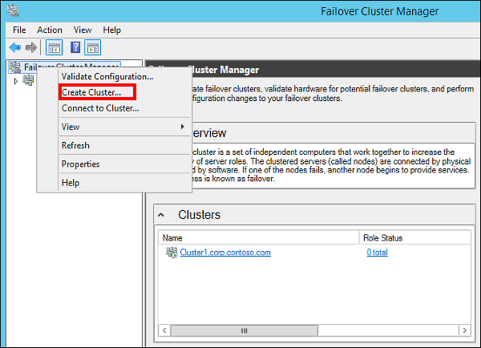

1. In the Create Cluster Wizard, create a one-node cluster by stepping through the pages with the settings below:

|Page|Settings|
|---|---|
|Before You Begin|Use defaults|
|Select Servers|Type **sqlserver-0** in **Enter server name** and click **Add**|
|Validation Warning|Select **No. I do not require support from Microsoft for this cluster, and therefore do not want to run the validation tests. When I click Next, continue creating the cluster**.|
|Access Point for Administering the Cluster|Type **Cluster1** in **Cluster Name**|
|Confirmation|Use defaults unless you are using Storage Spaces. See the note following this table.|

>[AZURE.NOTE] If you are using [Storage Spaces](https://technet.microsoft.com/library/hh831739), which groups multiple disks into storage pools, you must uncheck the **Add all eligible storage to the cluster** checkbox on the **Confirmation** page. If you do not uncheck this option, the virtual disks will be detached during the clustering process. As a result, they will also not appear in Disk Manager or Explorer until the storage spaces are removed from cluster and reattached using PowerShell.

Now that you have created the cluster, verify the configuration and add the remaining nodes. 

1. In the center pane, scroll down to **Cluster Core Resources** section and expand the **Name: Clutser1** details. You should see both the **Name** and the **IP Address** resources in the **Failed** state. The IP address resource cannot be brought online because the cluster is assigned the same IP address as that of the machine itself, which is a duplicate address.

1. Right-click the failed **IP Address** resource, and then click **Properties**.

	

1. Select **Static IP Address** and specify an available address from subnet-2 in the Address text box. Then, click **OK**.

1. In the **Cluster Core Resources** section, right-click **Name: Cluster1** and click **Bring Online**. Then, wait until both resources are online. When the cluster name resource comes online, it updates the DC server with a new AD computer account. This AD account will be used to run the availability group clustered service later.

1. Finally, you add the remaining nodes to the cluster. In the browser tree, right-click **Cluster1.corp.contoso.com** and click **Add Node**, as shown below.

	

1. In the **Add Node Wizard**, click **Next**. In the **Select Servers** page, add **sqlserver-1** and **cluster-fsw** to the list by typing the server name in **Enter server name** and then clicking **Add**. When you are done, click **Next**.

1. In the **Validation Warning** page, click **No** (in a production scenario you should perform the validation tests). Then, click **Next**.

1. In the **Confirmation** page, click **Next** to add the nodes.

	>[AZURE.WARNING] If you are using [Storage Spaces](https://technet.microsoft.com/library/hh831739), which groups multiple disks into storage pools, you must uncheck the **Add all eligible storage to the cluster** checkbox. If you do not uncheck this option, the virtual disks will be detached during the clustering process. As a result, they will also not appear in Disk Manager or Explorer until the storage spaces are removed from cluster and reattached using PowerShell.

1. Once the nodes are added to the cluster, click **Finish**. Failover Cluster Manager should now show that your cluster has three nodes and list them in the **Nodes** container.

1. Log out of the remote desktop session.

## Configure availability groups

In this section, you will do the following on both **sqlserver-0** and **sqlserver-1**:

- Add **CORP\Install** as a sysadmin role to the default SQL Server instance

- Open the firewall for remote access to SQL Server for the SQL Server process and the probe port 

- Enable the availability groups feature

- Change the SQL Server service account to **CORP\SQLSvc1** and **CORP\SQLSvc2**, respectively

These actions can be performed in any order. Nevertheless, the steps below will walk through them in order. Follow the steps for both **sqlserver-0** and **sqlserver-1**:

### Add installation account as sysadmin fixed server role on each SQL Server

1. If you have not logged out of the remote desktop session for the VM, do so now.

1. Launch the RDP files for **sqlserver-0** and **sqlserver-1** and log in as **BUILTIN\DomainAdmin**.

1. Launch **SQL Server Management Studio**, add **CORP\Install** as a **sysadmin** role to the default SQL Server instance. In **Object Explorer**, right-click **Logins** and click **New Login**.

1. Type **CORP\Install** in **Login name**.

1. In the **Server Roles** page, select **sysadmin**. Then, click **OK**. Once the login is created, you can see it by expanding **Logins** in **Object Explorer**.

### Open the firewall for remote access to SQL Server and the probe port on each SQL Server

This solution requires two firewall rules on each SQL Server. The first rule provides inbound access to SQL Server, the second provides inbound access for the load balancer and the listener. 

1. Next, you create a firewall rule for SQL Server. From the **Start** screen, launch **Windows Firewall with Advanced Security**.

1. In the left pane, select **Inbound Rules**. On the right pane, click **New Rule**.

1. In the **Rule Type** page, select **Program**, then click **Next**.

1. In the **Program** page, select **This program path** and type **%ProgramFiles%\Microsoft SQL Server\MSSQL12.MSSQLSERVER\MSSQL\Binn\sqlservr.exe** in the text box (if you are following these directions but using SQL Server 2012, the SQL Server directory is **MSSQL11.MSSQLSERVER**). Then click **Next**.

1. In the **Action** page, keep **Allow the connection** selected and click **Next**.

1. In the **Profile** page, accept the default settings and click **Next**.

1. In the **Name** page, specify a rule name, such as **SQL Server (Program Rule)** in the **Name** text box, then click **Finish**.

1. Create an additional inbound firewall rule for the probe port. This rule is an inbound rule to TCP port 59999, for the purposes of this tutorial. Name the rule **SQL Server Listener**.

Complete all steps on both SQL Servers.

### Enable availability groups feature on each SQL Server

Do these steps on both SQL Servers. 

1. Next, you enable the **AlwaysOn Availability Groups** feature. From the **Start** screen, launch **SQL Server Configuration Manager**.

1. In the browser tree, click **SQL Server Services**, then right-click the **SQL Server (MSSQLSERVER)** service and click **Properties**.

1. Click the **AlwaysOn High Availability** tab, then select **Enable AlwaysOn Availability Groups**, as shown below, and then click **Apply**. Click **OK** in the pop-up dialog, and do not close the properties window yet. You will restart the SQL Server service after you change the service account.

	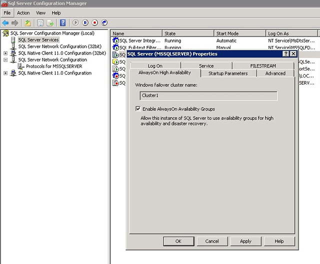

### Set the SQL Server service account on each SQL Server

Do these steps on both SQL Servers.

1. Next, you change the SQL Server service account. Click the **Log On** tab, then type **CORP\SQLSvc1** (for **sqlserver-0**) or **CORP\SQLSvc2** (for **sqlserver-1**) in **Account Name**, then fill in and confirm the password, and then click **OK**.

1. In the pop-up window, click **Yes** to restart the SQL Server service. After the SQL Server service is restarted, the changes you made in the properties window are effective.

1. Log out of the VMs.

### Create the Availability Group

You are now ready to configure an availability group. Below is an outline of what you will do:

- Create a new database (**MyDB1**) on **sqlserver-0**

- Take both a full backup and a transaction log backup of the database

- Restore the full and log backups to **sqlserver-1** with the **NORECOVERY** option

- Create the availability group (**AG1**) with synchronous commit, automatic failover, and readable secondary replicas

### Create the MyDB1 database on sqlserver-0:

1. If you have not already logged out of the remote desktop sessions for **sqlserver-0** and **sqlserver-1**, do so now.

1. Launch the RDP file for **sqlserver-0** and log in as **CORP\Install**.

1. In **File Explorer**, under **C:\**, create a directory called **backup**. You will use this directory use to back up and restore your database.

1. Right-click the new directory, point to **Share with**, and then click **Specific people**, as shown below.

	

1. Add **CORP\SQLSvc1** and give it **Read/Write** permission, then add **CORP\SQLSvc2** and give it the **Read/Write** permission, as shown below, and then click **Share**. Once the file sharing process is complete, click **Done**.

	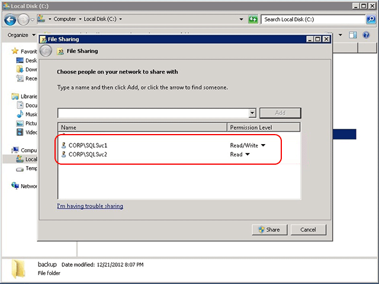

1. Next, you create the database. From the **Start** menu, launch **SQL Server Management Studio**, then click **Connect** to connect to the default SQL Server instance.

1. In the **Object Explorer**, right-click **Databases** and click **New Database**.

1. In **Database name**, type **MyDB1**, then click **OK**.

### Take a full backup of MyDB1 and restore it on sqlserver-1:

1. Next, you take a full backup of the database. In the **Object Explorer**, expand **Databases**, then right-click **MyDB1**, then point to **Tasks**, and then click **Back Up**.

1. In the **Source** section, keep **Backup type** set to **Full**. In the **Destination** section, click **Remove** to remove the default file path for the backup file.

1. In the **Destination** section, click **Add**.

1. In the **File name** text box, type **\\\\sqlserver-0\backup\MyDB1.bak**. Then, click **OK**, and then click **OK** again to backup the database. When the backup operation completes, click **OK** again to close the dialog.

1. Next, you take a transaction log backup of the database. In the **Object Explorer**, expand **Databases**, then right-click **MyDB1**, then point to **Tasks**, and then click **Back Up**.

1. In **Backup** type, select **Transaction Log**. Keep the **Destination** file path set to the one you specified earlier and click **OK**. Once the backup operation completes, click **OK** again.

1. Next, you restore the full and transaction log backups on **sqlserver-1**. Launch the RDP file for **sqlserver-1** and log in as **CORP\Install**. Leave the remote desktop session for **sqlserver-0** open.

1. From the **Start** menu, launch **SQL Server Management Studio**, then click **Connect** to connect to the default SQL Server instance.

1. In the **Object Explorer**, right-click **Databases** and click **Restore Database**.

1. In the **Source** section, select **Device**, and click the **…** button.

1. In **Select backup devices**, click **Add**.

1. In Backup file location, type **\\\\sqlserver-0\backup**, then click Refresh, then select MyDB1.bak, then click OK, and then click OK again. You should now see the full backup and the log backup in the Backup sets to restore pane.

1. Go to the Options page, then select RESTORE WITH NORECOVERY in Recovery state, and then click OK to restore the database. Once the restore operation completes, click OK.

### Create the availability group:

1. Go back to the remote desktop session for **sqlserver-0**. In the **Object Explorer** in SSMS, right-click **AlwaysOn High Availability** and click **New Availability Group Wizard**, as shown below.

	

1. In the **Introduction** page, click **Next**. In the **Specify Availability Group Name** page, type **AG1** in **Availability group name**, then click **Next** again.

	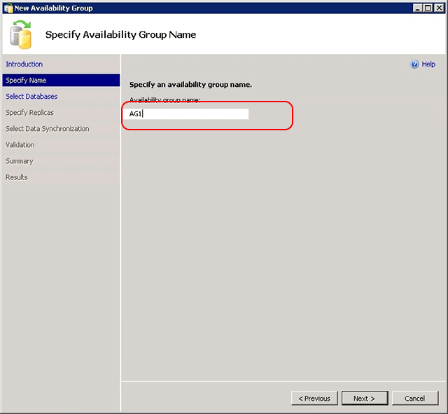

1. In the **Select Databases** page, select **MyDB1** and click **Next**. The database meets the prerequisites for an availability group because you have taken at least one full backup on the intended primary replica.

	

1. In the **Specify Replicas** page, click **Add Replica**.

	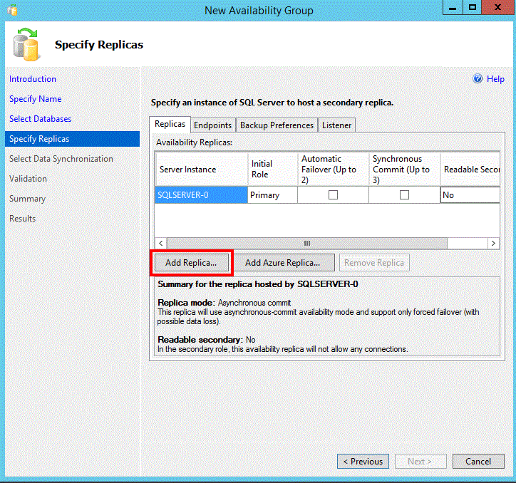

1. The **Connect to Server** dialog pops up. Type **sqlserver-1** in **Server name**, then click **Connect**.

	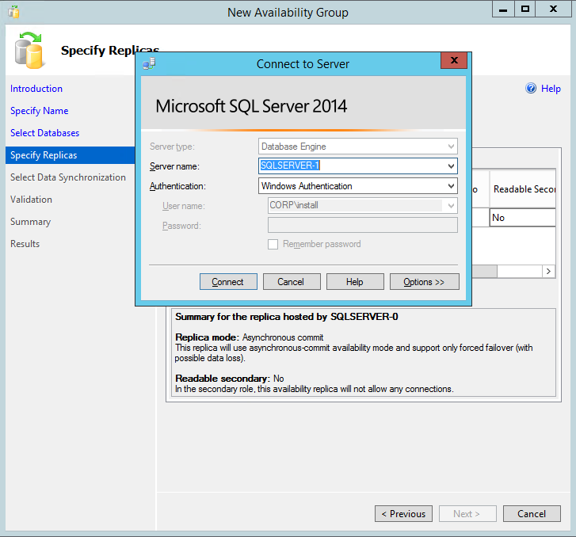

1. Back in the **Specify Replicas** page, you should now see **sqlserver-1** listed in **Availability Replicas**. Configure the replicas as shown below. When you are finished, click **Next**.

	

1. In the **Select Initial Data Synchronization** page, select **Join only** and click **Next**. You have already performed data synchronization manually when you took the full and transaction backups on **sqlserver-0** and restored them on **sqlserver-1**. You can instead choose not to perform the backup and restore operations on your database and select **Full** to let the New Availability Group Wizard perform data synchronization for you. However, this is not recommended for very large databases that are found in some enterprises.

	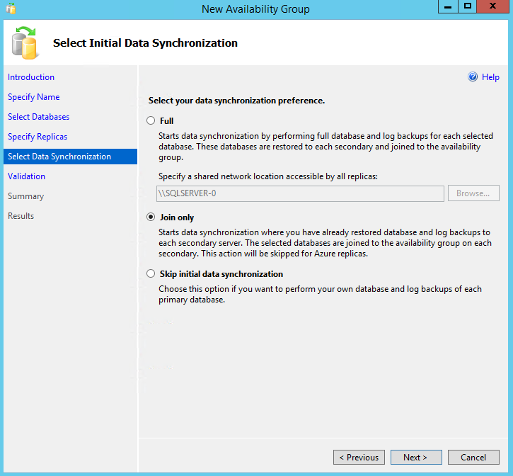

1. In the **Validation** page, click **Next**. This page should look similar to below. There is a warning for the listener configuration because you have not configured an availability group listener. You can ignore this warning, because this tutorial does not configure a listener. This tutorial will have you create the listener later. For details on how to configure a listener, see [Configure an internal load balancer for an AlwaysOn availability group in Azure](virtual-machines-windows-portal-sql-alwayson-int-listener.md).

	

1. In the **Summary** page, click **Finish**, then wait while the wizard configures the new availability group. In the **Progress** page, you can click **More details** to view the detailed progress. Once the wizard is finished, inspect the **Results** page to verify that the availability group is successfully created, as shown below, then click **Close** to exit the wizard.

	

1. In the **Object Explorer**, expand **AlwaysOn High Availability**, then expand **Availability Groups**. You should now see the new availability group in this container. Right-click **AG1 (Primary)** and click **Show Dashboard**.

	

1. Your **AlwaysOn Dashboard** should look similar to the one shown below. You can see the replicas, the failover mode of each replica and the synchronization state.

	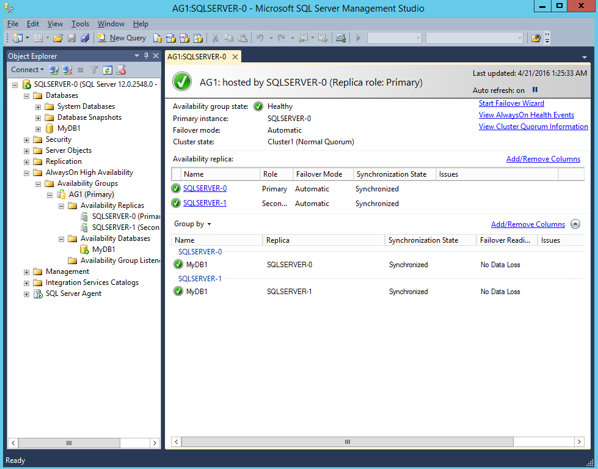

1. Return to **Server Manager**, select **Tools**, and then launch **Failover Cluster Manager**.

1. Expand **Cluster1.corp.contoso.com**, and then expand **Services and applications**. Select **Roles** and note that the **AG1** availability group role has been created. Note that AG1 does not have any IP address by which database clients can connect to the availability group, because you did not configure a listener. You can connect directly to the primary node for read-write operations and the secondary node for read-only queries.

	

>[AZURE.WARNING] Do not try to fail over the availability group from the Failover Cluster Manager. All failover operations should be performed from within **AlwaysOn Dashboard** in SSMS. For more information, see [Restrictions on Using The WSFC Failover Cluster Manager with Availability Groups](https://msdn.microsoft.com/library/ff929171.aspx).

## Configure internal load balancer

In order to connect to the availability group directly, you need to configure an internal load balancer in Azure and then create the listener on the cluster. This section provides a high level overview of those steps. For detailed instructions, see [Configure an internal load balancer for an AlwaysOn availability group in Azure](virtual-machines-windows-portal-sql-alwayson-int-listener.md).  

### Create the load balancer in Azure

1. In the Azure portal, go to **SQL-HA-RG** and click **+ Add**.

1. Search for **Load Balancer**. Choose the load balancer published by Microsoft and click **Create**.

1. Configure the following parameters for the load balancer.

| Setting | Field |
| --- | ---
| **Name** | sqlLB
| **Scheme** | Internal
| **Virtual network** | autoHAVNET
| **Subnet** | subnet-2. This is the IP address that you will set for the listener in the cluster resource.  
| **IP address assignment** | Static
| **IP address** | Use an available address from subnet-2.
| **Subscription** | Use the same subscription as all other resources in this solution.
| **Location** | Use the same location as all other resources in this solution.

Click **Create**.

Make the following settings on the load balancer:

| Setting | Field |
| --- | ---|
| **Backend pool** Name | sqlLBBE 
| **SQLLBBE Availability set** | sqlAvailabilitySet
| **SQLLBBE Virtual machines** | sqlserver-0, sqlserver-1
| **SQLLBBE Used by** | SQLAlwaysOnEndPointListener
| **Probe** Name | SQLAlwaysOnEndPointProbe
| **Probe Protocol** | TCP
| **Probe Port** | 59999 - Note that you can use any unused port.
| **Probe Interval** | 5
| **Probe Unhealthy threshold** | 2
| **Probe Used by** | SQLAlwaysOnEndPointListener
| **Load balancing rules** Name | SQLAlwaysOnEndPointListener
| **Load balancing rules Protocol** | TCP
| **Load balancing rules Port** | 1433 - Note that this is because this is the SQL Server default port.
| **Load balancing rules Port** | 1433 - Note that this is because this is the SQL Server default port.
| **Load balancing rules Backend Port** | 1433
| **Load balancing rules Probe** | SQLAlwaysOnEndPointProbe
| **Load balancing rules Session Persistence** | None
| **Load balancing rules Idle Timeout** | 4
| **Load balancing rules Floating IP (direct server return)** | Enabled

>[AZURE.NOTE] You must enable direct server return in the load balancing rules at creation time.

After you have configured the load balancer, configure the listener on the failover cluster. 

### Configure the load balancer on the failover cluster

The next thing to do is to configure an AlwaysOn availability group listener on the failover cluster. 

1. RDP to the SQL Server from ad-primary-dc to sqlserver-0.

1. In Failover Cluster Manager, note the name of the cluster network. To determine the cluster network name in **Failover Cluster Manager**, click **Networks** in the left pane. You will use this name in the `$ClusterNetworkName` variable in the PowerShell script.

1. In Failover Cluster Manager, expand the cluster name and click **Roles**.

1. In **Roles**, right click the availability group name and then select **Add Resource** > **Client Access Point**. 

1. For **Name**, type **aglistener**. Click **Next** twice and then click **Finish**. Do not bring the listener or resource online at this point.

1. Click the **Resources** tab, then expand the Client Access Point you just created. Right-click the IP resource and click properties. Note the name of the IP address. You will use this name in the `$IPResourceName` variable in the PowerShell script.

1. Under **IP Address** click **Static IP Address** and set the static IP address to the same address that you used on the Azure Portal for **sqlLB** load balancer. Note that you will also use this same IP address in the `$ILBIP` variable in the Powershell script.  Enable NetBIOS for this address and click OK. 

1. On the cluster node that currently hosts the primary replica, open an elevated PowerShell ISE and paste the following commands into a new script.

        $ClusterNetworkName = "<MyClusterNetworkName>" # the cluster network name (Use Get-ClusterNetwork on Windows Server 2012 of higher to find the name)
        $IPResourceName = "<IPResourceName>" # the IP Address resource name
        $ILBIP = "<X.X.X.X>" # the IP Address of the Internal Load Balancer (ILB). This is the static IP address for the load balancer you configured in the Azure portal.

        Import-Module FailoverClusters

        Get-ClusterResource $IPResourceName | Set-ClusterParameter -Multiple @{"Address"="$ILBIP";"ProbePort"="59999";"SubnetMask"="255.255.255.255";"Network"="$ClusterNetworkName";"EnableDhcp"=0}
    
1. Update the variables and run the PowerShell script to configure the IP address and port for the new listener.

1. In **Failover Cluster Manager**, right-click the availability group resource, and click **Properties**. On the **Dependencies** tab, set the resource group to be dependent on the listener network name.  

1. Set the listener port property to 1433. To do this, open SQL Server Management Studio, right click on the availability group listener, and select properties. Set **Port** to 1433.

1. At this point you can [bring the listener online](virtual-machines-windows-portal-sql-alwayson-int-listener.md#2-bring-the-listener-online).

### Test the connection to the listener

To test the connection:

1. RDP to the SQL Server that does not own the replica.

1. Use sqlcmd utility to test the connection. For example, the following script establishes a sqlcmd connection to the primary replica through the listener with Windows authentication:

        sqlcmd -S "<listenerName>" -E

## Next Steps

For other information about using SQL Server in Azure, see [SQL Server on Azure Virtual Machines](virtual-machines-windows-sql-server-iaas-overview.md).
