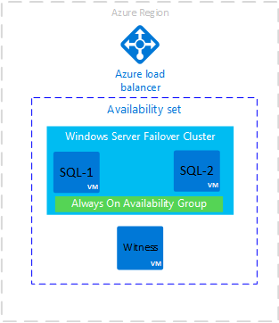
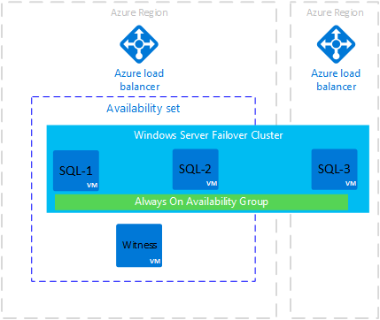

# Configure a SQL Server Always On Availability Group on Azure Virtual Machines in Different Regions

This article explains how to configure a SQL Server Always On Availability Group replica on Azure Virtual Machines in a remote Azure location. Use this configuration to support disaster recovery.

This article applies to Azure Virtual Machines in Resource Manager mode. 

The following image shows a common deployment of an availability group on Azure virtual machines:

   

In this deployment, all virtual machines are in one Azure region. The availability group replicas can have synchronous commit with automatic failover on SQL-1 and SQL-2. You can build this architecture [Availability Group template or tutorial](virtual-machines-windows-portal-sql-availability-group-overview.md).

This architecture is vulnerable downtime if the Azure region becomes inaccessible. To overcome this vulnerability, add a new replica in a different Azure region. The following diagram shows how the new architecture would look:

   

The preceding diagram shows a new virtual machine called SQL-3. SQL-3 is in a different Azure region. SQL-3 is added to the Windows Server Failover Cluster. SQL-3 can host an availability group replica. Also notice that SQL-3 is not in an availability set. An Azure availability set is required if more than one virtual machine in is in the same region. If only one virtual machine is in the region, then the availability set is not required. Finally, notice that the Azure region for SQL-3 has a new Azure load balancer. 

   >[!NOTE]
   >The replica in the remote region is normally configured with asynchronous commit and manual failover. 

When availability group replicas are on Azure virtual machines in different Azure regions, each region requires:

* A virtual network gateway 
* A virtual network gateway connection

The following diagram shows how the networks communicate between data centers.

   

## Create a replica in a remote data center: High-level instructions

To create a replica in a remote data center, do the following steps:

1. Create a SQL Server virtual machine in the new region.

1. Create a virtual network in the new region.

1. [Configure a VNet-to-VNet connection using the Azure portal](../vpn-gateway/vpn-gateway-howto-vnet-vnet-resource-manager-portal.md).
   >[!NOTE]
   >In some cases, you may have to use PowerShell to create the VNet-to-VNet connection. For example, if you use different Azure accounts you cannot configure the connection in the portal. In this case see, [Configure a VNet-to-VNet connection using the Azure portal](vpn-gateway-howto-vnet-vnet-resource-manager-portal.md.)

1. Create a domain controller in the new region.

1. [Create an Azure load balancer in the network on the new region](virtual-machines-windows-portal-sql-alwayson-availability-groups-manual.md#configure-internal-load-balancer)

1. Add Failover Clustering Role to the new SQL Server.

1. Join the new SQL Server to the domain.

1. Add the new SQL Server to the Windows Server Failover Cluster.

1. Set the new SQL Server service account to use a domain account.

1. In SQL Server Configuration Manager, enable the Always On Availability Groups feature.

1. Open firewall ports on the new SQL Server. Open ports for mirroring endpoint and for the load balancer health probe.

1. In Failover Cluster Manager, add the IP address on the load balancer frontend IP rule to the cluster resource.

1. Add the IP address resource as a dependency for the listener client access point (network name) cluster. 

   [!NOTE]
   The cluster resource group includes both IP addresses. Both IP addresses are dependencies for the listener client access point. Use the **OR** operator in the cluster dependency configuration.

   The following screenshot shows a properly configured IP address cluster resource:

   

## More Information

* [Always On Availability Groups](http://msdn.microsoft.com/library/hh510230.aspx)

* [Azure Virtual Machines](http://docs.microsoft.com/azure/virtual-machines/windows/)

* [Azure Load Balancers](virtual-machines-windows-portal-sql-alwayson-availability-groups-manual.md#configure-internal-load-balancer)

* [Azure Availability Sets](virtual-machines-windows-manage-availability.md)

