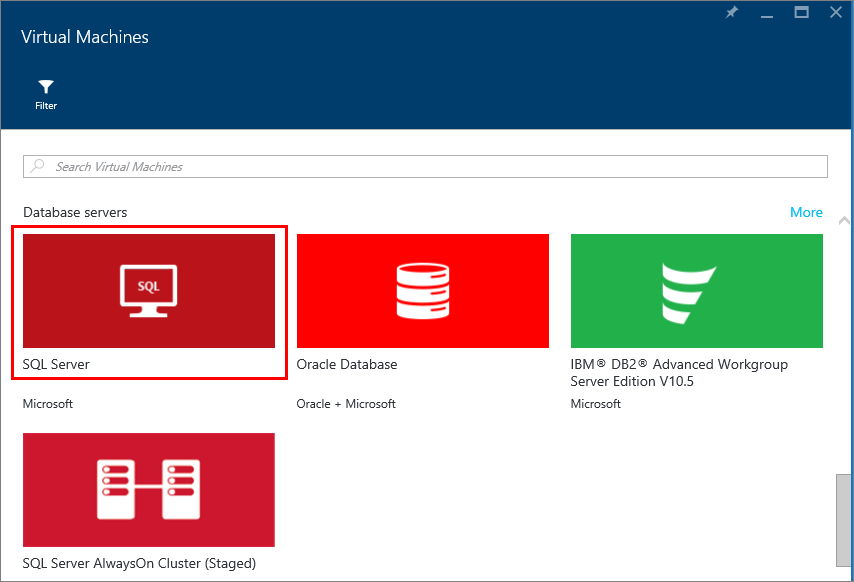
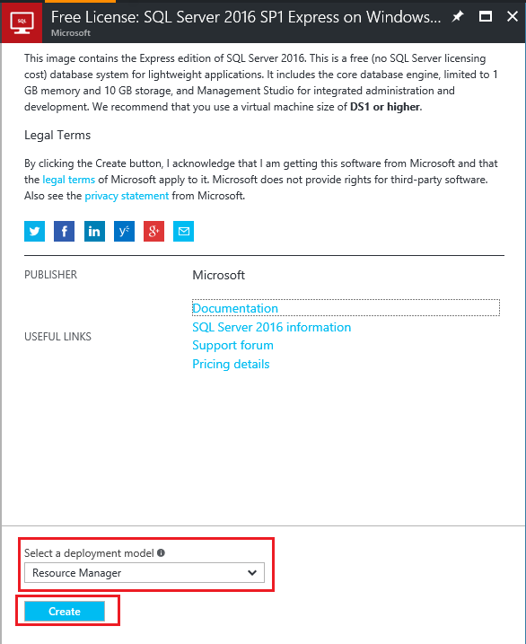
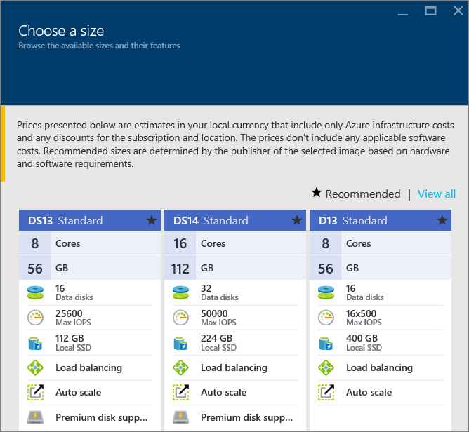
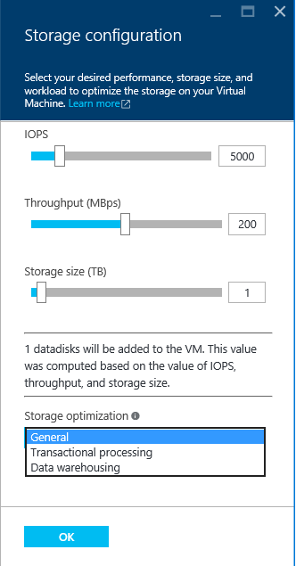

<properties
	pageTitle="Provision a SQL Server Virtual Machine | Microsoft Azure"
	description="Create and connect to a SQL Server virtual machine in Azure using the Portal. This tutorial uses the Resource Manager mode."
	services="virtual-machines-windows"
	documentationCenter="na"
	authors="rothja"
	editor=""
	manager="jhubbard"
	tags="azure-resource-manager" />
<tags
	ms.service="virtual-machines-windows"
	ms.devlang="na"
	ms.topic="hero-article"
	ms.tgt_pltfrm="vm-windows-sql-server"
	ms.workload="infrastructure-services"
	ms.date="06/21/2016"
	ms.author="jroth" />

# Provision a SQL Server virtual machine in the Azure Portal

> [AZURE.SELECTOR]
- [Portal](virtual-machines-windows-portal-sql-server-provision.md)
- [PowerShell](virtual-machines-windows-ps-sql-create.md)

This end-to-end tutorial shows you how to use the Azure Portal to provision a virtual machine running SQL Server.

The Azure virtual machine (VM) gallery includes several images that contain Microsoft SQL Server. With a few clicks, you can select one of the SQL VM images from the gallery and provision it in your Azure environment.

In this tutorial, you will:

- [Select a SQL VM image from the gallery](#select-a-sql-vm-image-from-the-gallery)
- [Configure and create the VM](#configure-the-vm)
- [Open the VM with Remote Desktop](#open-the-vm-with-remote-desktop)
- [Connect to SQL Server remotely](#connect-to-sql-server-remotely)

## Select a SQL VM image from the gallery

1. Log in to the [Azure portal](https://portal.azure.com) using your account.

	>[AZURE.NOTE] If you do not have an Azure account, visit [Azure free trial](https://azure.microsoft.com/pricing/free-trial/).

1. On the Azure portal, click **New**. The portal opens the **New** blade. The SQL Server VM resources are in the **Virtual Machines** group of the Marketplace.

1. In the **New** blade, click **Virtual Machines**.

1. To see all the available images, click **See all** on the **Virtual Machines** blade.

	

1. Under **Database servers**, click **SQL Server**. You might have to scroll down to locate **Database servers**. Review the available SQL Server templates.

	

1. Each template identifies a SQL Server version and an operating system. Select one of these images from the list. Then review the details blade that provides a description of the virtual machine image.

	>[AZURE.NOTE] SQL VM images include the licensing costs for SQL Server into the per-minute pricing of the VM you create. There is another option to bring-your-own-license (BYOL) and pay only for the VM. Those image names are prefixed with {BYOL}. For more information on this option, see  [Get started with SQL Server on Azure Virtual Machines](virtual-machines-windows-sql-server-iaas-overview.md).

1. Under **Select a deployment model**, verify that **Resource Manager** is selected. Resource Manager is the recommended deployment model for new virtual machines. Click **Create**.

	

## Configure the VM
There are five blades for configuring a SQL Server virtual machine.

| Step               | Description                          |
|---------------------|-------------------------------|
| **Basics**              | [Configure basic settings](#1-configure-basic-settings)      |
| **Size**                | [Choose virtual machine size](#2-choose-virtual-machine-size)   |
| **Settings**            | [Configure optional features](#3-configure-optional-features)   |
| **SQL Server settings** | [Configure SQL server settings](#4-configure-sql-server-settings) |
| **Summary**             | [Review the summary](#5-review-the-summary)            |

## 1. Configure basic settings
On the **Basics** blade, provide the following information:

* Enter a unique virtual machine **Name**.
* Specify a **User name** for the local administrator account on the VM. This account is also added to the SQL Server **sysadmin** fixed server role.
* Provide a strong **Password**.
* If you have multiple subscriptions, verify that the subscription is correct for the new VM.
* In the **Resource group** box, type a name for a new resource group. Alternatively, to use an existing resource group click **Select existing**. A resource group is a collection of related resources in Azure (virtual machines, storage accounts, virtual networks, etc.).

	>[AZURE.NOTE] Using a new resource group is helpful if you are just testing or learning about SQL Server deployments in Azure. After you finish with your test, delete the resource group to automatically delete the VM and all resources associated with that resource group. For more information about resource groups, see [Azure Resource Manager Overview](../resource-group-overview.md).

* Select a **Location** for this deployment.
* Click **OK** to save the settings.

	

## 2. Choose virtual machine size
On the **Size** step, choose a virtual machine size in the **Choose a size** blade. The blade initially displays recommended machine sizes based on the template you selected. It also estimates the monthly cost to run the VM.

For production workloads, we recommend selecting a virtual machine size that supports [Premium Storage](../storage/storage-premium-storage.md). If you do not require that level of performance, use the **View all** button, which shows all machine size options. For example, you might use a smaller machine size for a development or test environment.

>[AZURE.NOTE] For more information about virtual machine sizes see, [Sizes for virtual machines](virtual-machines-windows-sizes.md). For considerations about SQL Server VM sizes, see [Performance best practices for SQL Server in Azure Virtual Machines](virtual-machines-windows-sql-performance.md).

Choose your machine size, and then click **Select**.

## 3. Configure optional features
On the **Settings** blade, configure Azure storage, networking, and monitoring for the virtual machine.

- Under **Storage**, specify a **Disk type** of either Standard or Premium (SSD). Premium storage is recommended for production workloads.

>[AZURE.NOTE] If you select Premium (SSD) for a machine size that does not support Premium Storage, your machine size changes automatically.  

- Under **Storage account**, you can accept the automatically provisioned storage account name. You can also click on **Storage account** to choose an existing account and configure the storage account type. By default, Azure creates a new storage account with locally redundant storage. For more information about storage options, see [Azure Storage replication](../storage/storage-redundancy.md).

- Under **Network**, you can accept the automatically populated values. You can also click on each feature to manually configure the **Virtual network**, **Subnet**, **Public IP address**, and **Network Security Group**. For the purposes of this tutorial, keep the default values.

- Azure enables **Monitoring** by default with the same storage account designated for the VM. You can change these settings here.

- Under **Availability set**, specify an availability set. For the purposes of this tutorial, you can select **none**. If you plan to set up SQL AlwaysOn Availability Groups, configure the availability to avoid recreating the virtual machine.  For more information, see [Manage the Availability of Virtual Machines](virtual-machines-windows-manage-availability.md).

When you are done configuring these settings, click **OK**.

## 4. Configure SQL server settings
On the **SQL Server settings** blade, configure specific settings and optimizations for SQL Server. The settings that you can configure for SQL Server include the following.

| Setting               |
|---------------------|
| [Connectivity](#connectivity)              |
| [Authentication](#authentication)                |
| [Storage configuration](#storage-configuration)            |
| [Automated Patching](#automated-patching) |
| [Automated Backup](#automated-backup)             |
| [Azure Key Vault Integration](#azure-key-vault-integration)             |

### Connectivity
Under **SQL connectivity**, specify the type of access you want to the SQL Server instance on this VM. For the purposes of this tutorial, select **Public (internet)** to allow connections to SQL Server from machines or services on the internet. With this option selected, Azure automatically configures the firewall and the network security group to allow traffic on port 1433.  

To connect to SQL Server via the internet, you also must enable SQL Server Authentication, which is described in the next section.

>[AZURE.NOTE] It is possible to add more restrictions for the network communications to your SQL Server VM. You can do this by editing the Network Security Group after the VM is created. For more information, see [What is a Network Security Group (NSG)?](../virtual-network/virtual-networks-nsg.md)

If you would prefer to not enable connections to the Database Engine via the internet, choose one of the following options:

- **Local (inside VM only)** to allow connections to SQL Server only from within the VM.
- **Private (within Virtual Network)** to allow connections to SQL Server from machines or services in the same virtual network.

In general, improve security by choosing the most restrictive connectivity that your scenario allows. But all the options are securable through Network Security Group rules and SQL/Windows Authentication.

**Port** defaults to 1433. You can specify a different port number.
For more information, see [Connect to a SQL Server Virtual Machine (Resource Manager) | Microsoft Azure](virtual-machines-windows-sql-connect.md).

### Authentication
If you require SQL Server Authentication, click **Enable** under **SQL authentication**.

>[AZURE.NOTE] If you plan to access SQL Server over the internet (i.e. the Public connectivity option), you must enable SQL authentication here. Public access to the SQL Server requires the use of SQL Authentication.

If you enable SQL Server Authentication, specify a **Login name** and **Password**. This user name is configured as a SQL Server Authentication login and member of the **sysadmin** fixed server role. See [Choose an Authentication Mode](http://msdn.microsoft.com/library/ms144284.aspx) for more information about Authentication Modes.

If you do not enable SQL Server Authentication, then you can use the local Administrator account on the VM to connect to the SQL Server instance.

### Storage configuration
Click **Storage configuration** to specify the storage requirements.

>[AZURE.NOTE] If you select Standard storage, this option is not available. Automatic storage optimization is available only for Premium Storage.

You can specify requirements as input/output operations per second (IOPs), throughput in MB/s, and total storage size. Configure these values by using the sliding scales. The portal automatically calculates the number of disks based on these requirements.

By default, Azure optimizes the storage for 5000 IOPs, 200 MBs, and 1 TB of storage space. You can change these storage settings based on workload. Under **Storage optimized for**, select one of the following options:

- **General** is the default setting and supports most workloads.
- **Transactional** processing optimizes the storage for traditional database OLTP workloads.
- **Data warehousing** optimizes the storage for analytic and reporting workloads.

>[AZURE.NOTE] The upper limits on the sliders vary depending on your selected virtual machine size.

### Automated patching
**Automated patching** is enabled by default. Automated patching allows Azure to automatically patch SQL Server and the operating system. Specify a day of the week, time, and duration for a maintenance window. Azure performs patching in this maintenance window. The maintenance window schedule uses the VM locale for time. If you do not want Azure to automatically patch SQL Server and the operating system, click **Disable**.  

For more information, see [Automated Patching for SQL Server in Azure Virtual Machines](virtual-machines-windows-classic-sql-automated-patching.md).

### Automated backup
Enable automatic database backups for all databases under **Automated backup**. Automated backup is disabled by default.

When you enable SQL automated backup, you can configure the following:

- Retention period (days) for backups
- Storage account to use for backups
- Encryption option and password for backups

To encrypt the backup, click **Enable**. Then specify the **Password**. Azure creates a certificate to encrypt the backups and uses the specified password to protect that certificate.

 For more information, see [Automated Backup for SQL Server in Azure Virtual Machines](virtual-machines-windows-classic-sql-automated-backup.md).

### Azure Key Vault integration
To store security secrets in Azure for encryption, click **Azure key vault integration** and click **Enable**.

The following table lists the parameters required to configure Azure Key Vault Integration.

|PARAMETER|DESCRIPTION|EXAMPLE|
|----------|----------|-------|
|**Key Vault URL** |The location of the key vault.|https://contosokeyvault.vault.azure.net/ |
|**Principal name** |Azure Active Directory service principal name. This name is also referred to as the Client ID.  |fde2b411-33d5-4e11-af04eb07b669ccf2|
| **Principal secret**|Azure Active Directory service principal secret. This secret is also referred to as the Client Secret. | 9VTJSQwzlFepD8XODnzy8n2V01Jd8dAjwm/azF1XDKM=|
|**Credential name**|**Credential name**: AKV Integration creates a credential within SQL Server, allowing the VM to have access to the key vault. Choose a name for this credential.| mycred1|

For more information, see [Configure Azure Key Vault Integration for SQL Server on Azure VMs](virtual-machines-windows-classic-ps-sql-keyvault.md).

When you are finished configuring SQL Server settings, click **OK**.

## 5. Review the summary
On the **Summary** blade, review the summary and click **OK** to create SQL Server, resource group, and resources specified for this VM.

You can monitor the deployment from the azure portal. The **Notifications** button at the top of the screen shows basic status of the deployment.

>[AZURE.NOTE] To provide you with an idea on deployment times, I deployed a SQL VM to the East US region with default settings. This test deployment took a total of 26 minutes to complete. But you might experience a faster or slower deployment time based on your region and selected settings.

## Open the VM with Remote Desktop

Use the following steps to connect to the virtual machine with Remote Desktop:

1. After the Azure VM is built, the icon for the VM appears on your Azure dashboard. You can also find it by browsing your existing virtual machines. Click on your new SQL virtual machine. A **Virtual machine** blade displays your virtual machine details.
1. At the top of the **Virtual machine** blade, click **Connect**.
1. The browser downloads an RDP file for the VM. Open the RDP file.
	
1. The Remote Desktop Connection notifies you that the publisher of this remote connection cannot be identified. Click **Connect** to continue.
1. In the **Windows Security** dialog, click **Use another account**.
1. For **User name** type **\<user name>**, where <user name> is the user name that you specified when you configured the VM. You have to add an initial backslash before the name.
1. Type the **Password** that you previously configured for this VM, and then click **OK** to connect.
1. If another **Remote Desktop Connection** dialog asks you whether to connect, click **Yes**.

After you connect to the SQL Server virtual machine, you can launch SQL Server Management Studio and connect with Windows Authentication using your local administrator credentials. If you enabled SQL Server Authentication, you can also connect with SQL Authentication using the SQL login and password you configured during provisioning.

Access to the machine enables you to directly change machine and SQL Server settings based on your requirements. For example, you could configure the firewall settings or change SQL Server configuration settings.

## Connect to SQL Server remotely

In this tutorial, we selected **Public** access for the virtual machine and **SQL Server Authentication**. These settings automatically configured the virtual machine to allow SQL Server connections from any client over the internet (assuming they have the correct SQL login).

>[AZURE.NOTE] If you did not select Public during provisioning, then extra steps are required to access your SQL Server instance over the internet. For more information, see  [Connect to a SQL Server Virtual Machine](virtual-machines-windows-sql-connect.md).

The following sections show how to connect to your SQL Server instance on your VM from a different computer over the internet.

> [AZURE.INCLUDE [Connect to SQL Server in a VM Resource Manager](../../includes/virtual-machines-sql-server-connection-steps-resource-manager.md)]

## Next Steps
For other information about using SQL Server in Azure, see [SQL Server on Azure Virtual Machines](virtual-machines-windows-sql-server-iaas-overview.md) and the [Frequently Asked Questions](virtual-machines-windows-sql-server-iaas-faq.md).

For a video overview of SQL Server on Azure Virtual Machines, watch [Azure VM is the best platform for SQL Server 2016](https://channel9.msdn.com/Events/DataDriven/SQLServer2016/Azure-VM-is-the-best-platform-for-SQL-Server-2016).

[Explore the Learning Path](https://azure.microsoft.com/documentation/learning-paths/sql-azure-vm/) for SQL Server on Azure virtual machines.
