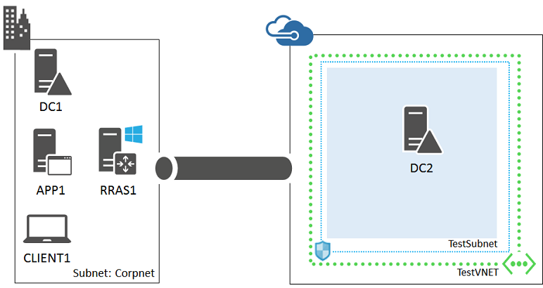
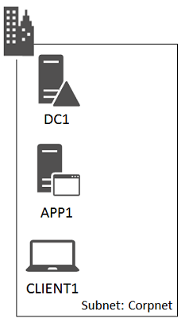
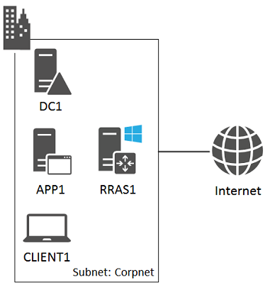
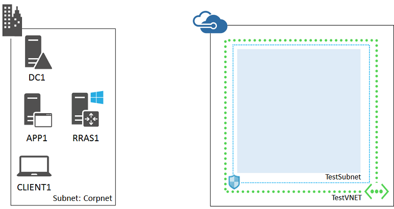
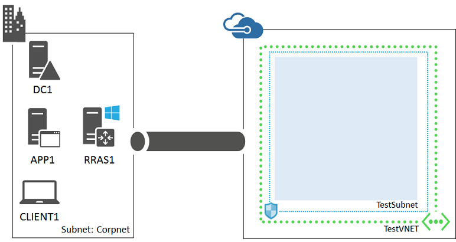

<properties 
	pageTitle="Hybrid cloud test environment | Microsoft Azure" 
	description="Learn how to create a hybrid cloud environment for IT pro or development testing, complete with a simplfied on-premises network." 
	services="virtual-machines-windows" 
	documentationCenter="" 
	authors="JoeDavies-MSFT" 
	manager="timlt" 
	editor=""
	tags="azure-resource-manager"/>

<tags 
	ms.service="virtual-machines-windows" 
	ms.workload="infrastructure-services" 
	ms.tgt_pltfrm="vm-windows" 
	ms.devlang="na" 
	ms.topic="article" 
	ms.date="07/19/2016" 
	ms.author="josephd"/>

# Set up a hybrid cloud environment for testing
 
This topic steps you through creating a hybrid cloud environment with Microsoft Azure for testing. Here is the resulting configuration.

This simulates a real hybrid production environment from your location on the Internet. It consists of:

-  A simplified on-premises network (the Corpnet subnet).
-  A cross-premises virtual network hosted in Azure (TestVNET).
-  A site-to-site VPN connection.
-  A secondary domain controller in the TestVNET virtual network.

This configuration provides a basis and common starting point from which you can:

-  Develop and test applications in a hybrid cloud environment.
-  Create test configurations of computers, some on the Corpnet subnet and some within the TestVNET virtual network, for hybrid cloud-based IT workloads.

There are five major phases to setting up this hybrid cloud test environment:

1.	Configure the computers on the Corpnet subnet.
2.	Configure RRAS1.
3.	Create the cross-premises Azure virtual network.
4.	Create the site-to-site VPN connection.
5.	Configure DC2. 

If you do not already have an Azure subscription, you can sign up for a free account at [Try Azure](https://azure.microsoft.com/pricing/free-trial/). If you have an MSDN or Visual Studio subscription, see [Monthly Azure credit for Visual Studio subscribers](https://azure.microsoft.com/pricing/member-offers/msdn-benefits-details/).

>[AZURE.NOTE] Virtual machines and virtual network gateways in Azure incur an ongoing monetary cost when they are running. An Azure VPN gateway is implemented as a set of two Azure virtual machines. For the details, see [Pricing - Virtual Network](https://azure.microsoft.com/pricing/details/virtual-network/). To minimize the costs of running the VPN gateway, create the test environment and perform your needed testing and demonstration as quickly as possible.

This configuration requires a test subnet of up to four computers connected directly to the Internet using a public IP address. If you don't have these resources, you can also set up a [simulated hybrid cloud environment for testing](virtual-machines-windows-ps-hybrid-cloud-test-env-sim.md). The simulated hybrid cloud test environment requires only an Azure subscription.

## Phase 1: Configure the computers on the Corpnet subnet

Use the instructions in the "Steps for Configuring the Corpnet Subnet" section of the [Test Lab Guide: Base Configuration for Windows Server 2012 R2](http://www.microsoft.com/download/details.aspx?id=39638) to configure the DC1, APP1, and CLIENT1 computers on a subnet named Corpnet. **This subnet must be isolated from your organization network because it will be connected directly to the Internet through the RRAS1 computer.** 

Next, log on to DC1 with the CORP\User1 credentials. To configure the CORP domain so that computers and users use their local domain controller for authentication, run these commands from an administrator-level Windows PowerShell command prompt.

	New-ADReplicationSite -Name "TestLab" 
	New-ADReplicationSite -Name "TestVNET"
	New-ADReplicationSubnet “Name "10.0.0.0/8" “Site "TestLab"
	New-ADReplicationSubnet “Name "192.168.0.0/16" “Site "TestVNET

This is your current configuration.

 
## Phase 2: Configure RRAS1

RRAS1 provides traffic routing and VPN device services between the computers on the Corpnet subnet and the TestVNET virtual network. RRAS1 must have two network adapters installed.

First, install the operating system on RRAS1.

1.	Start the installation of Windows Server 2012 R2.
2.	Follow the instructions to complete the installation, specifying a strong password for the local administrator account. Log on using the local administrator account.
3.	Connect RRAS1 to a network that has Internet access and run Windows Update to install the latest updates for Windows Server 2012 R2.
4.	Connect one network adapter to the Corpnet subnet and the other directly to the Internet. RRAS1 can be located behind an Internet firewall but must not be behind a network address translator (NAT).

Next, configure the TCP/IP properties of RRAS1. You will need a public IP address configuration, including an address, subnet mask (or prefix length), and the default gateway and DNS servers of your Internet service provider (ISP). You will need the public IP address for Phase 3.

Use these commands at an administrator-level Windows PowerShell command prompt on RRAS1. Prior to running these commands, fill in the variable values and remove the < and > characters. You can get the current names of the network adapters from the display of the **Get-NetAdapter** command.

	$corpnetAdapterName="<Name of the adapter attached to the Corpnet subnet>"
	$internetAdapterName="<Name of the adapter attached to the Internet>"
	[Ipaddress]$publicIP="<Your public IP address>"
	$publicIPpreflength=<Prefix length of your public IP address>
	[IPAddress]$publicDG="<Your ISP default gateway>"
	[IPAddress]$publicDNS="<Your ISP DNS server(s)>"
	Rename-NetAdapter -Name $corpnetAdapterName -NewName Corpnet
	Rename-NetAdapter -Name $internetAdapterName -NewName Internet
	New-NetIPAddress -InterfaceAlias "Internet" -IPAddress $publicIP -PrefixLength $publicIPpreflength “DefaultGateway $publicDG
	Set-DnsClientServerAddress -InterfaceAlias Internet -ServerAddresses $publicDNS
	New-NetIPAddress -InterfaceAlias "Corpnet" -IPAddress 10.0.0.2 -AddressFamily IPv4 -PrefixLength 24
	Set-DnsClientServerAddress -InterfaceAlias "Corpnet" -ServerAddresses 10.0.0.1
	Set-DnsClient -InterfaceAlias "Corpnet" -ConnectionSpecificSuffix corp.contoso.com
	New-NetFirewallRule -DisplayName "Allow ICMPv4-Input" -Protocol ICMPv4
	New-NetFirewallRule -DisplayName "Allow ICMPv4-Output" -Protocol ICMPv4 -Direction Outbound
	Disable-NetAdapterBinding -Name "Internet" -ComponentID ms_msclient
	Disable-NetAdapterBinding -Name "Internet" -ComponentID ms_server
	ping dc1.corp.contoso.com

For the last command, verify that there are four responses from the IP address 10.0.0.1.

This is your current configuration.

## Phase 3: Create the cross-premises Azure Virtual Network

Start an Azure PowerShell prompt.

> [AZURE.NOTE] The following command sets use Azure PowerShell 1.0 and later. For more information, see [Azure PowerShell 1.0](https://azure.microsoft.com/blog/azps-1-0/).

Log in to your account.

	Login-AzureRMAccount

Get your subscription name using the following command.

	Get-AzureRMSubscription | Sort SubscriptionName | Select SubscriptionName

Set your Azure subscription. Use the same subscription that you used to build you base configuration. Replace everything within the quotes, including the < and > characters, with the correct names.

	$subscr="<subscription name>"
	Get-AzureRmSubscription –SubscriptionName $subscr | Select-AzureRmSubscription

Next, create a new resource group for the hybrid test environment.

To determine a unique resource group name, use this command to list your existing resource groups.

	Get-AzureRMResourceGroup | Sort ResourceGroupName | Select ResourceGroupName

Create your new resource group with these commands.

	$rgName="<resource group name>"
	$locName="<an Azure location, such as West US>"
	New-AzureRMResourceGroup -Name $rgName -Location $locName

Resource Manager-based virtual machines require a Resource Manager-based storage account. You must pick a globally unique name for each storage account that contains only lowercase letters and numbers. You can use this command to list the existing storage accounts.

	Get-AzureRMStorageAccount | Sort Name | Select Name

Create a new storage account with these commands.

	$rgName="<your new resource group name>"
	$locName="<the location of your new resource group>"
	$saName="<unique storage account name >"
	New-AzureRMStorageAccount -Name $saName -ResourceGroupName $rgName –Type Standard_LRS -Location $locName

Next, you create the Azure Virtual Network that will host your hybrid cloud environment and protect it with a network security group.

	$locShortName="<the location of your new resource group in lowercase with spaces removed, example: westus>"
	$gwSubnet=New-AzureRMVirtualNetworkSubnetConfig -Name "GatewaySubnet" -AddressPrefix "192.168.255.248/29"
	$vmSubnet=New-AzureRMVirtualNetworkSubnetConfig -Name "TestSubnet" -AddressPrefix "192.168.0.0/24"
	New-AzureRMVirtualNetwork -Name "TestVNET" -ResourceGroupName $rgName -Location $locName -AddressPrefix "192.168.0.0/16" -Subnet $gwSubnet,$vmSubnet -DNSServer "10.0.0.1"
	$rule1=New-AzureRMNetworkSecurityRuleConfig -Name "RDPTraffic" -Description "Allow RDP to all VMs on the subnet" -Access Allow -Protocol Tcp -Direction Inbound -Priority 100 -SourceAddressPrefix Internet -SourcePortRange * -DestinationAddressPrefix * -DestinationPortRange 3389
	New-AzureRMNetworkSecurityGroup -Name "TestSubnet" -ResourceGroupName $rgName -Location $locShortName -SecurityRules $rule1
	$vnet=Get-AzureRMVirtualNetwork -ResourceGroupName $rgName -Name "TestVNET"
	$nsg=Get-AzureRMNetworkSecurityGroup -Name "TestSubnet" -ResourceGroupName $rgName
	Set-AzureRMVirtualNetworkSubnetConfig -VirtualNetwork $vnet -Name TestSubnet -AddressPrefix "192.168.0.0/24" -NetworkSecurityGroup $nsg

Next, use these commands to create the gateways for the site-to-site VPN connection. You will need the public IP address of RRAS1's Internet interface from Phase 2.

	$localGatewayIP="<the public IP address assigned to the Internet interface of RRAS1>"
	$vnet=Get-AzureRMVirtualNetwork -Name TestVNET -ResourceGroupName $rgName
	
	# Attach a virtual network gateway to a public IP address and the gateway subnet
	$publicGatewayVipName="HybCloudPublicIPAddress"
	$vnetGatewayIpConfigName="HybCloudPublicIPConfig"
	New-AzureRMPublicIpAddress -Name $vnetGatewayIpConfigName -ResourceGroupName $rgName -Location $locName -AllocationMethod Dynamic
	$publicGatewayVip=Get-AzureRMPublicIpAddress -Name $vnetGatewayIpConfigName -ResourceGroupName $rgName
	$vnetGatewayIpConfig=New-AzureRMVirtualNetworkGatewayIpConfig -Name $vnetGatewayIpConfigName -PublicIpAddressId $publicGatewayVip.Id -SubnetId $vnet.Subnets[0].Id
	
	# Create the Azure gateway
	$vnetGatewayName="HybCloudAzureGateway"
	$vnetGateway=New-AzureRMVirtualNetworkGateway -Name $vnetGatewayName -ResourceGroupName $rgName -Location $locName -GatewayType Vpn -VpnType RouteBased -IpConfigurations $vnetGatewayIpConfig
	
	# Create the gateway for the local network
	$localGatewayName="HybCloudLocalNetGateway"
	$localNetworkPrefix="10.0.0.0/8"
	$localGateway=New-AzureRMLocalNetworkGateway -Name $localGatewayName -ResourceGroupName $rgName -Location $locName -GatewayIpAddress $localGatewayIP -AddressPrefix $localNetworkPrefix

Keep in mind that new gateways can take 20 minutes or more to complete.

Next, use the following command to determine the public IP address of the Azure VPN gateway for your virtual network.

	Get-AzureRMPublicIpAddress -Name $vnetGatewayIpConfigName -ResourceGroupName $rgName

Note the IP address in the **IPAddress** field of the display. You will need it for Phase 4.

Next, obtain a random, cryptographically strong, 32-character pre-shared key from your network or security administrator. Alternately, use the information at [Create a random string for an IPsec preshared key](http://social.technet.microsoft.com/wiki/contents/articles/32330.create-a-random-string-for-an-ipsec-preshared-key.aspx) to obtain a pre-shared key.

Use these commands to create the site-to-site VPN connection in Azure.

	# Define the Azure virtual network VPN connection
	$vnetConnectionKey="<32-character pre-shared key>"
	$vnetConnectionName="HybCloudS2SConnection"
	$vnetConnection=New-AzureRMVirtualNetworkGatewayConnection -Name $vnetConnectionName -ResourceGroupName $rgName -Location $locName -ConnectionType IPsec -SharedKey $vnetConnectionKey -VirtualNetworkGateway1 $vnetGateway -LocalNetworkGateway2 $localGateway

This is your current configuration.

 
## Phase 4: Create the site-to-site VPN connection

First, configure RRAS1 with the Routing and Remote Access Service to act as the VPN device for the Corpnet subnet. Log on to RRAS1 as the local administrator and run these commands at a Windows PowerShell command prompt.

	Import-Module ServerManager
	Install-WindowsFeature RemoteAccess -IncludeManagementTools
	Add-WindowsFeature -name Routing -IncludeManagementTools

Next, configure RRAS1 to receive the site-to-site VPN connection from the Azure VPN gateway. Restart RRAS1, then log on as the local administrator and run these commands at a Windows PowerShell command prompt. You need to provide the public IP address of the Azure VPN gateway and the pre-shared key value from Phase 3.

	$PresharedKey="<32-character pre-shared key>"
	Import-Module RemoteAccess
	Install-RemoteAccess -VpnType VpnS2S
	Add-VpnS2SInterface -Protocol IKEv2 -AuthenticationMethod PSKOnly -Persistent -NumberOfTries 3 -ResponderAuthenticationMethod PSKOnly -Name S2StoTestVNET -Destination "<public IP address of the Azure VPN gateway>" -IPv4Subnet @("192.168.0.0/24:100") -SharedSecret $PresharedKey
	Set-VpnServerIPsecConfiguration -EncryptionType MaximumEncryption
	Set-VpnServerIPsecConfiguration -SADataSizeForRenegotiationKilobytes 33553408
	New-ItemProperty -Path HKLM:\System\CurrentControlSet\Services\RemoteAccess\Parameters\IKEV2 -Name SkipConfigPayload -PropertyType DWord -Value 1
	Restart-Service RemoteAccess

Allow a few minutes for the connection between RRAS1 and the Azure VPN gateway to be established.

Next, configure RRAS1 to support translated traffic to Internet locations. On RRAS1:

1.	From the Start screen, type **rras**, and then click **Routing and Remote Access**. 
2.	In the console tree, open the server name, and then click **IPv4**.
3.	Right-click **General**, and then click **New Routing Protocol**.
4.	Click **NAT**, and then click **OK**.
5.	In the console tree, right-click **NAT**, click **New Interface**, click **Corpnet**, and then click **OK** twice.
6.	Right-click **NAT**, click **New Interface**, click **Internet**, and then click **OK**.
7.	On the **NAT** tab, click **Public interface connected to the Internet**, select **Enable NAT on this interface**, and then click **OK**.

Next, configure DC1, APP1, and CLIENT1 to use RRAS1 as its default gateway.
 
On DC1, run these commands at an administrator-level Windows PowerShell command prompt.

	New-NetRoute -DestinationPrefix "0.0.0.0/0" -InterfaceAlias "Ethernet" -NextHop 10.0.0.2
	Set-DhcpServerv4OptionValue -Router 10.0.0.2

If the name of the interface is not Ethernet, use the **Get-NetAdapter** command to determine the interface name.

On APP1, run this command at an administrator-level Windows PowerShell command prompt.

	New-NetRoute -DestinationPrefix "0.0.0.0/0" -InterfaceAlias "Ethernet" -NextHop 10.0.0.2

On CLIENT1, run this command at an administrator-level Windows PowerShell command prompt.

	ipconfig /renew

This is your current configuration.
 

## Phase 5: Configure DC2

First, create an Azure Virtual Machine for DC2 with these commands at the Azure PowerShell command prompt on your local computer.

	$rgName="<your resource group name>"
	$locName="<your Azure location, such as West US>"
	$saName="<your storage account name>"
	
	$vnet=Get-AzureRMVirtualNetwork -Name "TestVNET" -ResourceGroupName $rgName
	$subnet=Get-AzureRmVirtualNetworkSubnetConfig -VirtualNetwork $vnet -Name "TestSubnet"
	$pip=New-AzureRMPublicIpAddress -Name DC2-NIC -ResourceGroupName $rgName -Location $locName -AllocationMethod Dynamic
	$nic=New-AzureRMNetworkInterface -Name DC2-NIC -ResourceGroupName $rgName -Location $locName -Subnet $subnet -PublicIpAddress $pip -PrivateIpAddress 192.168.0.4
	$vm=New-AzureRMVMConfig -VMName DC2 -VMSize Standard_A1
	$storageAcc=Get-AzureRMStorageAccount -ResourceGroupName $rgName -Name $saName
	$vhdURI=$storageAcc.PrimaryEndpoints.Blob.ToString() + "vhds/DC2-TestVNET-ADDSDisk.vhd"
	Add-AzureRMVMDataDisk -VM $vm -Name ADDS-Data -DiskSizeInGB 20 -VhdUri $vhdURI  -CreateOption empty
	$cred=Get-Credential -Message "Type the name and password of the local administrator account for DC2."
	$vm=Set-AzureRMVMOperatingSystem -VM $vm -Windows -ComputerName DC2 -Credential $cred -ProvisionVMAgent -EnableAutoUpdate
	$vm=Set-AzureRMVMSourceImage -VM $vm -PublisherName MicrosoftWindowsServer -Offer WindowsServer -Skus 2012-R2-Datacenter -Version "latest"
	$vm=Add-AzureRMVMNetworkInterface -VM $vm -Id $nic.Id
	$osDiskUri=$storageAcc.PrimaryEndpoints.Blob.ToString() + "vhds/DC2-TestLab-OSDisk.vhd"
	$vm=Set-AzureRMVMOSDisk -VM $vm -Name DC2-TestVNET-OSDisk -VhdUri $osDiskUri -CreateOption fromImage
	New-AzureRMVM -ResourceGroupName $rgName -Location $locName -VM $vm

Next, use the Azure portal to connect to the new DC2 virtual machine using the credentials of the local administrator account.

Next, configure a Windows Firewall rule to allow traffic for basic connectivity testing. From an administrator-level Windows PowerShell command prompt on DC2, run:

	Set-NetFirewallRule -DisplayName "File and Printer Sharing (Echo Request - ICMPv4-In)" -enabled True
	ping dc1.corp.contoso.com

The ping command should result in four successful replies from IP address 10.0.0.1. If you are using the *simulated hybrid cloud configuration*, you should see four successful replies from IP address 10.0.0.4. This is a test of traffic across the site-to-site VPN or VNet-to-VNet connection.

Next, add an extra data disk as a new volume with the drive letter F:.

1.	In the left pane of Server Manager, click **File and Storage Services**, and then click **Disks**.
2.	In the contents pane, in the **Disks** group, click **disk 2** (with the **Partition** set to **Unknown**).
3.	Click **Tasks**, and then click **New Volume**.
4.	On the Before you begin page of the New Volume Wizard, click **Next**.
5.	On the Select the server and disk page, click **Disk 2**, and then click **Next**. When prompted, click **OK**.
6.	On the Specify the size of the volume page, click **Next**.
7.	On the Assign to a drive letter or folder page, click **Next**.
8.	On the Select file system settings page, click **Next**.
9.	On the Confirm selections page, click **Create**.
10.	When complete, click **Close**.

Next, configure DC2 as a replica domain controller for the corp.contoso.com domain. Run these commands from the Windows PowerShell command prompt on DC2.

	Install-WindowsFeature AD-Domain-Services -IncludeManagementTools
	Install-ADDSDomainController -Credential (Get-Credential CORP\User1) -DomainName "corp.contoso.com" -InstallDns:$true -DatabasePath "F:\NTDS" -LogPath "F:\Logs" -SysvolPath "F:\SYSVOL"

Note that you will be prompted to supply both the CORP\User1 password and a Directory Services Restore Mode (DSRM) password and to restart DC2.

Now that the TestVNET virtual network has its own DNS server (DC2), you must configure the TestVNET virtual network to use this DNS server.

1.	In the left pane of the Azure Portal, click the virtual networks icon, and then click **TestVNET**.
2.	On the **Settings** tab, click **DNS servers**.
3.	In **Primary DNS server**, type **192.168.0.4** to replace 10.0.0.4.
4.	Click Save.

Next, restart DC2 so that it uses the new DNS server configuration with these commands at the Azure PowerShell command prompt.

	Stop-AzureRmVM -ResourceGroupName $rgName -Name DC2
	Start-AzureRmVM -ResourceGroupName $rgName -Name DC2

This is your current configuration.

Your hybrid cloud environment is now ready for testing.
 
## Next steps

- Set up a [SharePoint intranet farm](virtual-machines-windows-ps-hybrid-cloud-test-env-sp.md), a [web-based LOB application](virtual-machines-windows-ps-hybrid-cloud-test-env-lob.md), or an [Office 365 Directory Synchronization (DirSync) server](virtual-machines-windows-ps-hybrid-cloud-test-env-dirsync.md) in this environment.
