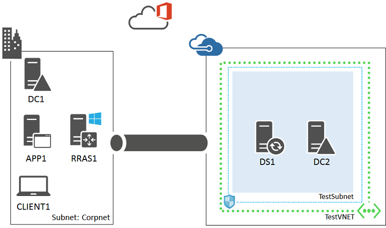
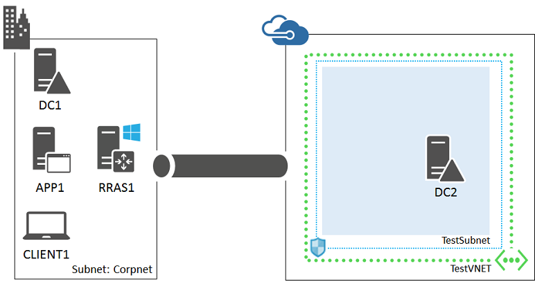
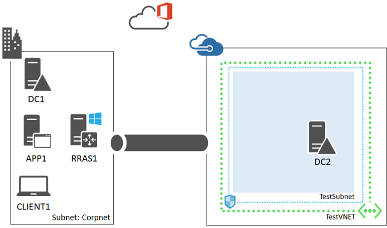

<properties 
	pageTitle="Office 365 DirSync test environment  | Microsoft Azure" 
	description="Learn how to configure an Office 365 Directory Synchronization (DirSync) server in a hybrid cloud for IT pro or development testing." 
	services="virtual-machines-windows" 
	documentationCenter="" 
	authors="JoeDavies-MSFT" 
	manager="timlt" 
	editor=""
	tags="azure-resource-manager"/>

<tags 
	ms.service="virtual-machines-windows" 
	ms.workload="infrastructure-services" 
	ms.tgt_pltfrm="vm-windows" 
	ms.devlang="na" 
	ms.topic="article" 
	ms.date="07/19/2016" 
	ms.author="josephd"/>

# Set up Office 365 Directory Synchronization (DirSync) in a hybrid cloud for testing
 
This topic steps you through creating a hybrid cloud environment for testing Office 365 Directory Synchronization (DirSync) with password synchronization hosted in Microsoft Azure. Here is the resulting configuration.

 
This configuration simulates a DirSync server in Azure production environment from your location on the Internet. It consists of:

- A simplified on-premises network (the Corpnet subnet).
- A cross-premises virtual network hosted in Azure (TestVNET).
- A site-to-site VPN connection.
- An Office 365 FastTrack trial subscription.
- A DirSync server running the Azure AD Connect tool and a secondary domain controller in the TestVNET virtual network.

This configuration provides a basis and common starting point from which you can:

- Develop and test applications for Office 365 that rely on synchronization with an on-premises Active Directory domain using password synchronization.
- Perform testing of this cloud-based IT workload.

There are three major phases to setting up this hybrid cloud test environment:

1.	Set up the hybrid cloud environment for testing.
2.	Configure the Office 365 FastTrack trial.
3.	Configure the DirSync server (DS1).

If you do not already have an Azure subscription, you can sign up for a free account at [Try Azure](https://azure.microsoft.com/pricing/free-trial/). If you have an MSDN or Visual Studio subscription, see [Monthly Azure credit for Visual Studio subscribers](https://azure.microsoft.com/pricing/member-offers/msdn-benefits-details/).

## Phase 1: Set up the hybrid cloud environment

Use the instructions in the [Set up a hybrid cloud environment for testing](virtual-machines-windows-ps-hybrid-cloud-test-env-base.md) topic. Because this test environment does not require the presence of the APP1 server on the Corpnet subnet, feel free to shut it down for now.

This is your current configuration.

> [AZURE.NOTE] For Phase 1, you can also set up the [simulated hybrid cloud test environment](virtual-machines-windows-ps-hybrid-cloud-test-env-sim.md).

## Phase 2: Configure the Office 365 FastTrack Trial

To start your Office 365 FastTrack trial, you need a fictitious company name and a Microsoft account. We recommend that you use a variant of the company name Contoso for your company name, which is a fictitious company used in Microsoft sample content, but this isn't required.

Next, sign up for a new Microsoft account. Go to **http://outlook.com** and create an account with an email address like user123@outlook.com. You will sign up for an Office 365 FastTrack trial using this account.

Next, sign up for a new Office 365 Enterprise E3 trial.

1.	Log on to CLIENT1 with the CORP\User1 account credentials.
2.	Open Internet Explorer and go to **https://go.microsoft.com/fwlink/p/?LinkID=403802**.
3.	Step through the process of signing up for the Office 365 Enterprise E3 trial.

When prompted for the **Business email address**, specify your new Microsoft account.

When prompted to create an ID, type the name of an initial Office 365 account, your fictitious company name, and then a password. Record the resulting email address (such as user123@contoso123.onmicrosoft.com) and the password in a secure location. You will need this information to complete the Azure AD Connect configuration in Phase 3.

When complete, you should see the main Office 365 portal page. In the top ribbon, click **Admin**, and then click **Office 365**. The Office 365 admin center page appears. Keep this page open on CLIENT1.

This is your current configuration.

## Phase 3: Configure the DirSync server (DS1)

From the Azure portal, start the DC2 computer if needed.

Next, create an Azure virtual machine for DS1 with these commands at the Azure PowerShell command prompt on your local computer. Prior to running these commands, fill in the variable values and remove the < and > characters.

	$rgName="<your resource group name>"
	$locName="<your Azure location, such as West US>"
	$saName="<your storage account name>"
	
	$vnet=Get-AzureRMVirtualNetwork -Name "TestVNET" -ResourceGroupName $rgName
	$subnet=Get-AzureRmVirtualNetworkSubnetConfig -VirtualNetwork $vnet -Name "TestSubnet"
	$pip=New-AzureRMPublicIpAddress -Name DS1-NIC -ResourceGroupName $rgName -Location $locName -AllocationMethod Dynamic
	$nic=New-AzureRMNetworkInterface -Name DS1-NIC -ResourceGroupName $rgName -Location $locName -Subnet $subnet -PublicIpAddress $pip
	$vm=New-AzureRMVMConfig -VMName DS1 -VMSize Standard_A1
	$storageAcc=Get-AzureRMStorageAccount -ResourceGroupName $rgName -Name $saName
	$cred=Get-Credential -Message "Type the name and password of the local administrator account for DS1."
	$vm=Set-AzureRMVMOperatingSystem -VM $vm -Windows -ComputerName DS1 -Credential $cred -ProvisionVMAgent -EnableAutoUpdate
	$vm=Set-AzureRMVMSourceImage -VM $vm -PublisherName MicrosoftWindowsServer -Offer WindowsServer -Skus 2012-R2-Datacenter -Version "latest"
	$vm=Add-AzureRMVMNetworkInterface -VM $vm -Id $nic.Id
	$osDiskUri=$storageAcc.PrimaryEndpoints.Blob.ToString() + "vhds/DS1-TestLab-OSDisk.vhd"
	$vm=Set-AzureRMVMOSDisk -VM $vm -Name DS1-TestVNET-OSDisk -VhdUri $osDiskUri -CreateOption fromImage
	New-AzureRMVM -ResourceGroupName $rgName -Location $locName -VM $vm

Next, use the Azure portal to connect to the DS1 virtual machine with the credentials of the local administrator account.

Next, configure a Windows Firewall rule to allow traffic for basic connectivity testing. From an administrator-level Windows PowerShell command prompt on DS1, run these commands.

	Set-NetFirewallRule -DisplayName "File and Printer Sharing (Echo Request - ICMPv4-In)" -enabled True
	ping dc2.corp.contoso.com

The ping command should result in four successful replies from IP address 192.168.0.4.

Next, join DS1 to the CORP Active Directory domain with these commands at the Windows PowerShell prompt.

	Add-Computer -DomainName corp.contoso.com
	Restart-Computer

Use the CORP\User1 account when prompted to supply domain account credentials for the **Add-Computer** command.

After restarting, use the Azure portal to connect to DS1 with the CORP\User1 account and password.

Next, install .NET 3.5 on DS1 with this command at an administrator-level Windows PowerShell command prompt.

	Add-WindowsFeature NET-Framework-Core

Next, enable Directory Synchronization for your Office 365 FastTrack trial.

1.	On CLIENT1, on the **Office 365 admin center** page, in the left pane, click **Users**, and then click **Active Users**.
2.	For **Active Directory synchronization**, click **Set up**.
3.	On the Set up and manage Active Directory synchronization page, in step 3, click **Activate**.
4.	When prompted with **Do you want to activate Active Directory synchronization?**, click **Activate**. After you do this, **Active Directory synchronization is activated** appears in step 3.
5.	Leave the **Set up and manage Active Directory synchronization** page open on CLIENT1.

Next, from the Windows PowerShell prompt on DC1, run these commands **one at a time** to create a new organizational unit called contoso_users and add two new user accounts for Marci Kaufman and Lynda Meyer.

	New-ADOrganizationalUnit -Name contoso_users -Path "DC=corp,DC=contoso,DC=com"
	New-ADUser -SamAccountName marcik -AccountPassword (Read-Host "Set user password" -AsSecureString) -name "Marci Kaufman" -enabled $true -PasswordNeverExpires $true -ChangePasswordAtLogon $false -Path "OU=contoso_users,DC=corp,DC=contoso,DC=com"
	New-ADUser -SamAccountName lyndam -AccountPassword (Read-Host "Set user password" -AsSecureString) -name "Lynda Meyer" -enabled $true -PasswordNeverExpires $true -ChangePasswordAtLogon $false -Path "OU=contoso_users,DC=corp,DC=contoso,DC=com"

When you run each **New-ADUser** Windows PowerShell command, you are prompted for the new user's password. Record these passwords and store them in a secure location. You will need them later.

Next, install and configure the Azure AD Connect tool on DS1.

1.	Run Internet Explorer, type **https://www.microsoft.com/download/details.aspx?id=47594** in the **Address** bar, and then press ENTER.
2.	Run the Microsoft Azure AD Connect Setup program.
3.	From the desktop, double-click **Azure AD Connect**.
4.	On the **Welcome** page, select **I agree to the license terms and privacy notice**, and then click **Continue**.
5.	On the **Express Settings** page, click **Use express settings**.
6.	On the **Connect to Azure AD** page, type the email address and password of the initial account you created when you set up the Office 365 FastTrack trial in Phase 2. Click **Next**.
7.	On the **Connect to AD DS** page, type **CORP\User1** in **Username** and the User1 account password in **Password**. Click Next.
8.	On the **Ready to configure** page, review the settings, and then click **Install**.
9.	On the **Configuration complete** page, click **Exit**.

Next, verify that the user accounts in the CORP domain are synchronized to Office 365. Note that it can take a few minutes before synchronization occurs.

On CLIENT1, on the **Set up and manage Active Directory synchronization** page, click the **users** link in step 6 of this page. If directory synchronization has occurred successfully, you should see something similar to this.

The **Status** column indicates that the account was obtained through synchronization with an Active Directory domain.

Next, demonstrate Office 365 password synchronization with the Lynda Myer Active Directory account.  

1.	On CLIENT1, on the **Active Users** page, select the **Lynda Meyer** account.
2.	In the properties of the Lynda Meyer account, under **Assigned license**, click **Edit**.
3.	In the **Assign License** tab, select a location in **Set user location** (such as United States).
4.	Select **Microsoft Office 365 Plan E3**, and then click **Save**.
5.	Close Internet Explorer.
6.	Run Internet Explorer and go to **http://portal.microsoftonline.com**. 
7.	Log on with Lynda Meyer's Office 365 credentials. Her user name will be lyndam@<*Your Fictional Name*>.onmicrosoft.com. The password is the Lynda Meyer Active Directory user account password.
8.	After the successful logon, you see the Office 365 main portal page with **Let's make a difference today**.

This is your current configuration.

 
This environment is now ready for you to perform testing of Office 365 applications that rely on Office 365 DirSync functionality or to test DirSync functionality and performance from DS1.

## Next step

- Deploy this workload [in production](http://technet.microsoft.com/library/dn635310.aspx).
