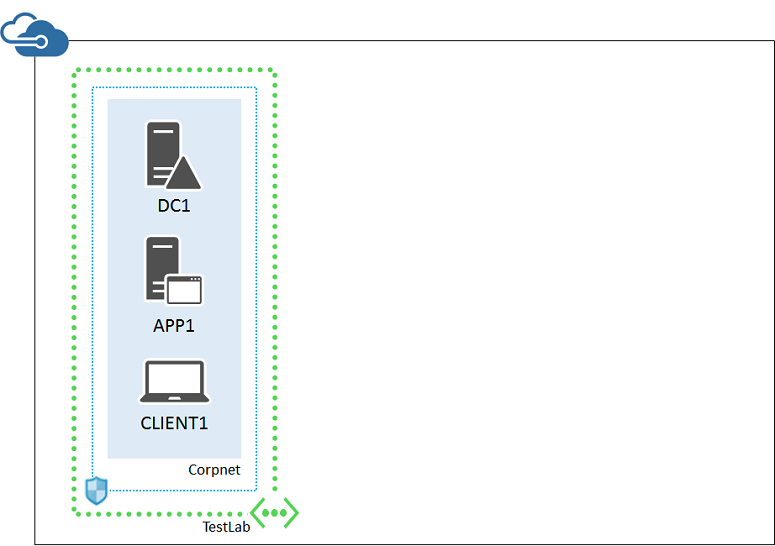
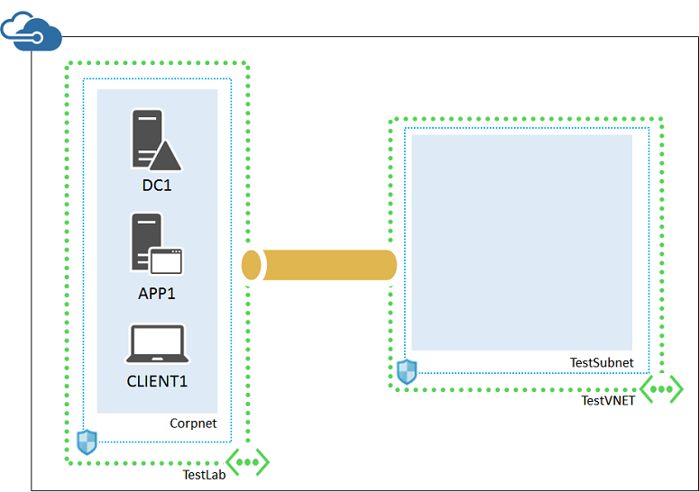

<properties 
	pageTitle="Simulated hybrid cloud test environment | Microsoft Azure" 
	description="Create a simulated hybrid cloud environment for IT pro or development testing, using two Azure virtual networks and a VNet-to-VNet connection." 
	services="virtual-machines-windows" 
	documentationCenter="" 
	authors="JoeDavies-MSFT" 
	manager="timlt" 
	editor=""
	tags="azure-resource-manager"/>

<tags 
	ms.service="virtual-machines-windows" 
	ms.workload="infrastructure-services" 
	ms.tgt_pltfrm="vm-windows" 
	ms.devlang="na" 
	ms.topic="article" 
	ms.date="08/05/2016" 
	ms.author="josephd"/>

# Set up a simulated hybrid cloud environment for testing

This article steps you through creating a simulated hybrid cloud environment with Microsoft Azure using two Azure virtual networks. Here is the resulting configuration.

This simulates a hybrid cloud production environment. It consists of:

- A simulated and simplified on-premises network hosted in an Azure virtual network (the TestLab virtual network).
- A simulated cross-premises virtual network hosted in Azure (TestVNET).
- A VNet-to-VNet connection between the two virtual networks.
- A secondary domain controller in the TestVNET virtual network.

This provides a basis and common starting point from which you can:

- Develop and test applications in a simulated hybrid cloud environment.
- Create test configurations of computers, some within the TestLab virtual network and some within the TestVNET virtual network, to simulate hybrid cloud-based IT workloads.

There are four major phases to setting up this hybrid cloud test environment:

1.	Configure the TestLab virtual network.
2.	Create the cross-premises virtual network.
3.	Create the VNet-to-VNet VPN connection.
4.	Configure DC2. 

This configuration requires an Azure subscription. If you have an MSDN or Visual Studio subscription, see [Monthly Azure credit for Visual Studio subscribers](https://azure.microsoft.com/pricing/member-offers/msdn-benefits-details/).

>[AZURE.NOTE] Virtual machines and virtual network gateways in Azure incur an ongoing monetary cost when they are running. This cost is billed against your free trial, MSDN subscription, or paid subscription. An Azure VPN gateway is implemented as a set of two Azure virtual machines. To minimize the costs, create the test environment and perform your needed testing and demonstration as quickly as possible.

## Phase 1: Configure the TestLab virtual network

Use the instructions in the [Base Configuration test environment](https://technet.microsoft.com/library/mt771177.aspx) topic to configure the DC1, APP1, and CLIENT1 computers in an Azure virtual network named TestLab. 

Next, start an Azure PowerShell prompt.

> [AZURE.NOTE] The following command sets use Azure PowerShell 1.0 and later.

Login to your account.

	Login-AzureRMAccount

Get your subscription name using the following command.

	Get-AzureRMSubscription | Sort SubscriptionName | Select SubscriptionName

Set your Azure subscription. Use the same subscription that you used to build your base configuration. Replace everything within the quotes, including the < and > characters, with the correct names.

	$subscr="<subscription name>"
	Get-AzureRmSubscription –SubscriptionName $subscr | Select-AzureRmSubscription

Next, add a gateway subnet to the TestLab virtual network of your base configuration, which will be used to host the Azure gateway.

	$rgName="<name of your resource group that you used for your TestLab virtual network>"
	$locName="<Azure location name where you placed the TestLab virtual network, such as West US>"
	$vnet=Get-AzureRmVirtualNetwork -ResourceGroupName $rgName -Name TestLab
	Add-AzureRmVirtualNetworkSubnetConfig -Name "GatewaySubnet" -AddressPrefix 10.255.255.248/29 -VirtualNetwork $vnet
	Set-AzureRmVirtualNetwork -VirtualNetwork $vnet

Next, request a public IP address to assign to the gateway for the TestLab virtual network.

	$gwpip=New-AzureRmPublicIpAddress -Name TestLab_pip -ResourceGroupName $rgName -Location $locName -AllocationMethod Dynamic

Next, create your gateway.

	$vnet=Get-AzureRmVirtualNetwork -Name TestLab -ResourceGroupName $rgName
	$subnet=Get-AzureRmVirtualNetworkSubnetConfig -Name "GatewaySubnet" -VirtualNetwork $vnet
	$gwipconfig=New-AzureRmVirtualNetworkGatewayIpConfig -Name TestLab_GWConfig -SubnetId $subnet.Id -PublicIpAddressId $gwpip.Id 
	New-AzureRmVirtualNetworkGateway -Name TestLab_GW -ResourceGroupName $rgName -Location $locName -IpConfigurations $gwipconfig -GatewayType Vpn -VpnType RouteBased

Keep in mind that new gateways can take 20 minutes or more to create.

From the Azure portal on your local computer, connect to DC1 with the CORP\User1 credentials. To configure the CORP domain so that computers and users use their local domain controller for authentication, run these commands from an administrator-level Windows PowerShell command prompt on DC1.

	New-ADReplicationSite -Name "TestLab" 
	New-ADReplicationSite -Name "TestVNET"
	New-ADReplicationSubnet -Name "10.0.0.0/8" -Site "TestLab"
	New-ADReplicationSubnet -Name "192.168.0.0/16" -Site "TestVNET"

This is your current configuration.

 
## Phase 2: Create the TestVNET virtual network

First, create the TestVNET virtual network and protect it with a network security group.

	$rgName="<name of the resource group that you used for your TestLab virtual network>"
	$locName="<Azure location name where you placed the TestLab virtual network, such as West US>"
	$locShortName="<Azure location name from $locName in all lowercase letters with spaces removed. Example:  westus>"
	$testSubnet=New-AzureRMVirtualNetworkSubnetConfig -Name "TestSubnet" -AddressPrefix 192.168.0.0/24
	$gatewaySubnet=New-AzureRmVirtualNetworkSubnetConfig -Name "GatewaySubnet" -AddressPrefix 192.168.255.248/29
	New-AzureRMVirtualNetwork -Name "TestVNET" -ResourceGroupName $rgName -Location $locName -AddressPrefix 192.168.0.0/16 -Subnet $testSubnet,$gatewaySubnet –DNSServer 10.0.0.4
	$rule1=New-AzureRMNetworkSecurityRuleConfig -Name "RDPTraffic" -Description "Allow RDP to all VMs on the subnet" -Access Allow -Protocol Tcp -Direction Inbound -Priority 100 -SourceAddressPrefix Internet -SourcePortRange * -DestinationAddressPrefix * -DestinationPortRange 3389
	New-AzureRMNetworkSecurityGroup -Name "TestSubnet" -ResourceGroupName $rgName -Location $locShortName -SecurityRules $rule1
	$vnet=Get-AzureRMVirtualNetwork -ResourceGroupName $rgName -Name TestVNET
	$nsg=Get-AzureRMNetworkSecurityGroup -Name "TestSubnet" -ResourceGroupName $rgName
	Set-AzureRMVirtualNetworkSubnetConfig -VirtualNetwork $vnet -Name "TestSubnet" -AddressPrefix 192.168.0.0/24 -NetworkSecurityGroup $nsg

Next, request a public IP address to be allocated to the gateway for the TestVNET virtual network and create your gateway.

	$gwpip=New-AzureRmPublicIpAddress -Name TestVNET_pip -ResourceGroupName $rgName -Location $locName -AllocationMethod Dynamic
	$vnet=Get-AzureRmVirtualNetwork -Name TestVNET -ResourceGroupName $rgName
	$subnet=Get-AzureRmVirtualNetworkSubnetConfig -Name "GatewaySubnet" -VirtualNetwork $vnet
	$gwipconfig=New-AzureRmVirtualNetworkGatewayIpConfig -Name "TestVNET_GWConfig" -SubnetId $subnet.Id -PublicIpAddressId $gwpip.Id
	New-AzureRmVirtualNetworkGateway -Name "TestVNET_GW" -ResourceGroupName $rgName -Location $locName -IpConfigurations $gwipconfig -GatewayType Vpn -VpnType RouteBased

This is your current configuration.

 
##Phase 3: Create the VNet-to-VNet connection

First, obtain a random, cryptographically strong, 32-character pre-shared key from your network or security administrator. Alternately, use the information at [Create a random string for an IPsec preshared key](http://social.technet.microsoft.com/wiki/contents/articles/32330.create-a-random-string-for-an-ipsec-preshared-key.aspx) to obtain a pre-shared key.

Next, use these commands to create the site-to-site VPN connection, which can take some time to complete.

	$sharedKey="<pre-shared key value>"
	$gwTestLab=Get-AzureRmVirtualNetworkGateway -Name TestLab_GW -ResourceGroupName $rgName
	$gwTestVNET=Get-AzureRmVirtualNetworkGateway -Name TestVNET_GW -ResourceGroupName $rgName
	New-AzureRmVirtualNetworkGatewayConnection -Name TestLab_to_TestVNET -ResourceGroupName $rgName -VirtualNetworkGateway1 $gwTestLab -VirtualNetworkGateway2 $gwTestVNET -Location $locName -ConnectionType Vnet2Vnet -SharedKey $sharedKey
	New-AzureRmVirtualNetworkGatewayConnection -Name TestVNET_to_TestLab -ResourceGroupName $rgName -VirtualNetworkGateway1 $gwTestVNET -VirtualNetworkGateway2 $gwTestLab -Location $locName -ConnectionType Vnet2Vnet -SharedKey $sharedKey

After a few minutes, the connection should be established.

This is your current configuration.

 
## Phase 4: Configure DC2

First, create an Azure Virtual Machine for DC2. Run these commands at the Azure PowerShell command prompt on your local computer.

	$rgName="<your resource group name>"
	$locName="<your Azure location, such as West US>"
	$saName="<the storage account name for the base configuration>"
	$vnet=Get-AzureRMVirtualNetwork -Name TestVNET -ResourceGroupName $rgName
	$pip=New-AzureRMPublicIpAddress -Name DC2-NIC -ResourceGroupName $rgName -Location $locName -AllocationMethod Dynamic
	$nic=New-AzureRMNetworkInterface -Name DC2-NIC -ResourceGroupName $rgName -Location $locName -SubnetId $vnet.Subnets[0].Id -PublicIpAddressId $pip.Id -PrivateIpAddress 192.168.0.4
	$vm=New-AzureRMVMConfig -VMName DC2 -VMSize Standard_A1
	$storageAcc=Get-AzureRMStorageAccount -ResourceGroupName $rgName -Name $saName
	$vhdURI=$storageAcc.PrimaryEndpoints.Blob.ToString() + "vhds/DC2-TestVNET-ADDSDisk.vhd"
	Add-AzureRMVMDataDisk -VM $vm -Name ADDS-Data -DiskSizeInGB 20 -VhdUri $vhdURI  -CreateOption empty
	$cred=Get-Credential -Message "Type the name and password of the local administrator account for DC2."
	$vm=Set-AzureRMVMOperatingSystem -VM $vm -Windows -ComputerName DC2 -Credential $cred -ProvisionVMAgent -EnableAutoUpdate
	$vm=Set-AzureRMVMSourceImage -VM $vm -PublisherName MicrosoftWindowsServer -Offer WindowsServer -Skus 2012-R2-Datacenter -Version "latest"
	$vm=Add-AzureRMVMNetworkInterface -VM $vm -Id $nic.Id
	$osDiskUri=$storageAcc.PrimaryEndpoints.Blob.ToString() + "vhds/DC2-TestLab-OSDisk.vhd"
	$vm=Set-AzureRMVMOSDisk -VM $vm -Name DC2-TestVNET-OSDisk -VhdUri $osDiskUri -CreateOption fromImage
	New-AzureRMVM -ResourceGroupName $rgName -Location $locName -VM $vm

Next, log on to the new DC2 virtual machine from the Azure portal.

Next, configure a Windows Firewall rule to allow traffic for basic connectivity testing. From an administrator-level Windows PowerShell command prompt on DC2, run these commands.

	Set-NetFirewallRule -DisplayName "File and Printer Sharing (Echo Request - ICMPv4-In)" -enabled True
	ping dc1.corp.contoso.com

The ping command should result in four successful replies from IP address 10.0.0.4. This is a test of traffic across the Vnet-to-Vnet connection.

Next, add the extra data disk as a new volume with the drive letter F:.

1.	In the left pane of Server Manager, click **File and Storage Services**, and then click **Disks**.
2.	In the contents pane, in the **Disks** group, click **disk 2** (with the **Partition** set to **Unknown**).
3.	Click **Tasks**, and then click **New Volume**.
4.	On the Before you begin page of the New Volume Wizard, click **Next**.
5.	On the Select the server and disk page, click **Disk 2**, and then click **Next**. When prompted, click **OK**.
6.	On the Specify the size of the volume page, click **Next**.
7.	On the Assign to a drive letter or folder page, click **Next**.
8.	On the Select file system settings page, click **Next**.
9.	On the Confirm selections page, click **Create**.
10.	When complete, click **Close**.

Next, configure DC2 as a replica domain controller for the corp.contoso.com domain. Run these commands from the Windows PowerShell command prompt on DC2.

	Install-WindowsFeature AD-Domain-Services -IncludeManagementTools
	Install-ADDSDomainController -Credential (Get-Credential CORP\User1) -DomainName "corp.contoso.com" -InstallDns:$true -DatabasePath "F:\NTDS" -LogPath "F:\Logs" -SysvolPath "F:\SYSVOL"

Note that you are prompted to supply both the CORP\User1 password and a Directory Services Restore Mode (DSRM) password, and to restart DC2.

Now that the TestVNET virtual network has its own DNS server (DC2), you must configure the TestVNET virtual network to use this DNS server.

1.	In the left pane of the Azure portal, click the virtual networks icon, and then click **TestVNET**.
2.	On the **Settings** tab, click **DNS servers**.
3.	In **Primary DNS server**, type **192.168.0.4** to replace 10.0.0.4.
4.	Click **Save**.

This is your current configuration. 

 
Your simulated hybrid cloud environment is now ready for testing.

## Next step

- Set up a [web-based, line of business application](virtual-machines-windows-ps-hybrid-cloud-test-env-lob.md) in this environment.
