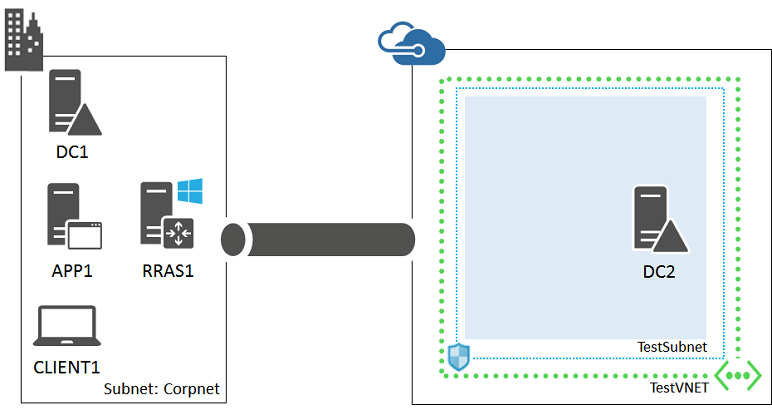
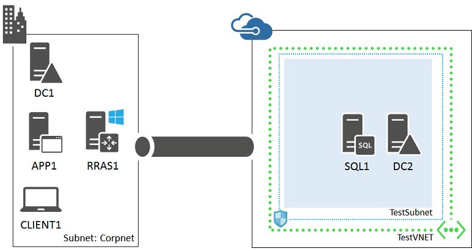

<properties 
	pageTitle="SharePoint 2013 farm test environment | Microsoft Azure" 
	description="Learn how to create a two-tier SharePoint Server 2013 intranet farm in a hybrid cloud environment for development or IT pro testing." 
	services="virtual-machines-windows" 
	documentationCenter="" 
	authors="JoeDavies-MSFT" 
	manager="timlt" 
	editor=""
	tags="azure-resource-manager"/>

<tags 
	ms.service="virtual-machines-windows" 
	ms.workload="infrastructure-services" 
	ms.tgt_pltfrm="vm-windows" 
	ms.devlang="na" 
	ms.topic="article" 
	ms.date="07/19/2016" 
	ms.author="josephd"/>

# Set up a SharePoint intranet farm in a hybrid cloud for testing

[AZURE.INCLUDE [learn-about-deployment-models](../../includes/learn-about-deployment-models-rm-include.md)] classic deployment model.

This topic steps you through creating a hybrid cloud environment for testing an intranet SharePoint 2013 or 2016 farm hosted in Microsoft Azure. Here is the resulting configuration.

 
This configuration simulates a SharePoint in Azure production environment from your location on the Internet. It consists of:

- A simplified on-premises network (the Corpnet subnet).
- A cross-premises virtual network hosted in Microsoft Azure (TestVNET).
- A site-to-site VPN connection.
- A two-tier SharePoint farm and secondary domain controller in the TestVNET virtual network.

This configuration provides a basis and common starting point from which you can:

- Develop and test applications on a SharePoint intranet farm in a hybrid cloud environment.
- Perform testing of this hybrid cloud-based IT workload.

There are three major phases to setting up this hybrid cloud test environment:

1.	Set up the hybrid cloud environment for testing.
2.	Configure the SQL server computer (SQL1).
3.	Configure the SharePoint server (SP1), running either SharePoint 2013 or SharePoint 2016.

This workload requires an Azure subscription. If you have an MSDN or Visual Studio subscription, see [Monthly Azure credit for Visual Studio subscribers](https://azure.microsoft.com/pricing/member-offers/msdn-benefits-details/).

## Phase 1: Set up the hybrid cloud environment

Use the instructions in the [Set up a hybrid cloud environment for testing](virtual-machines-windows-ps-hybrid-cloud-test-env-base.md) topic. Because this test environment does not require the presence of the APP1 server on the Corpnet subnet, feel free to shut it down for now.

This is your current configuration.

> [AZURE.NOTE] For Phase 1, you can also set up the [simulated hybrid cloud test environment](virtual-machines-windows-ps-hybrid-cloud-test-env-sim.md).
 
## Phase 2: Configure the SQL server computer (SQL1)

From the Azure portal, start the DC2 computer if needed.

From the Azure portal, connect to DC2 using the CORP\User1 credentials.

Next, create a SharePoint farm administrator account. Open an administrator-level Windows PowerShell prompt on DC2 and run this command.

	New-ADUser -SamAccountName SPFarmAdmin -AccountPassword (read-host "Set user password" -assecurestring) -name "SPFarmAdmin" -enabled $true -ChangePasswordAtLogon $false

When prompted to supply the SPFarmAdmin account password, type a strong password and record it in a secure location.

Next, create an Azure Virtual Machine for SQL1 with these commands at the Azure PowerShell command prompt on your local computer. Prior to running these commands, fill in the variable values and remove the < and > characters.

	$rgName="<your resource group name>"
	$locName="<the Azure location of your resource group>"
	$saName="<your storage account name>"
	
	$vnet=Get-AzureRMVirtualNetwork -Name "TestVNET" -ResourceGroupName $rgName
	$subnet=Get-AzureRmVirtualNetworkSubnetConfig -VirtualNetwork $vnet -Name "TestSubnet"
	$pip=New-AzureRMPublicIpAddress -Name SQL1-NIC -ResourceGroupName $rgName -Location $locName -AllocationMethod Dynamic
	$nic=New-AzureRMNetworkInterface -Name SQL1-NIC -ResourceGroupName $rgName -Location $locName -Subnet $subnet -PublicIpAddress $pip
	$vm=New-AzureRMVMConfig -VMName SQL1 -VMSize Standard_D4
	$storageAcc=Get-AzureRMStorageAccount -ResourceGroupName $rgName -Name $saName
	$vhdURI=$storageAcc.PrimaryEndpoints.Blob.ToString() + "vhds/SQL1-SQLDataDisk.vhd"
	Add-AzureRMVMDataDisk -VM $vm -Name "Data" -DiskSizeInGB 100 -VhdUri $vhdURI  -CreateOption empty
	
	$cred=Get-Credential -Message "Type the name and password of the local administrator account for the SQL Server computer." 
	$vm=Set-AzureRMVMOperatingSystem -VM $vm -Windows -ComputerName SQL1 -Credential $cred -ProvisionVMAgent -EnableAutoUpdate
	$vm=Set-AzureRMVMSourceImage -VM $vm -PublisherName MicrosoftSQLServer -Offer SQL2014-WS2012R2 -Skus Standard -Version "latest"
	$vm=Add-AzureRMVMNetworkInterface -VM $vm -Id $nic.Id
	$storageAcc=Get-AzureRMStorageAccount -ResourceGroupName $rgName -Name $saName
	$osDiskUri=$storageAcc.PrimaryEndpoints.Blob.ToString() + "vhds/SQL1-OSDisk.vhd"
	$vm=Set-AzureRMVMOSDisk -VM $vm -Name "OSDisk" -VhdUri $osDiskUri -CreateOption fromImage
	New-AzureRMVM -ResourceGroupName $rgName -Location $locName -VM $vm

When complete, use the Azure portal to connect to SQL1 using the local administrator account.

Next, configure Windows Firewall rules to allow traffic for basic connectivity testing and SQL Server. From an administrator-level Windows PowerShell command prompt on SQL1, run these commands.

	New-NetFirewallRule -DisplayName "SQL Server" -Direction Inbound -Protocol TCP -LocalPort 1433,1434,5022 -Action allow 
	Set-NetFirewallRule -DisplayName "File and Printer Sharing (Echo Request - ICMPv4-In)" -enabled True
	ping dc2.corp.contoso.com

The ping command should result in four successful replies from IP address 192.168.0.4.

Next, add the extra data disk as a new volume with the drive letter F:.

1.	In the left pane of Server Manager, click **File and Storage Services**, and then click **Disks**.
2.	In the contents pane, in the **Disks** group, click **disk 2** (with the **Partition** set to **Unknown**).
3.	Click **Tasks**, and then click **New Volume**.
4.	On the Before you begin page of the New Volume Wizard, click **Next**.
5.	On the Select the server and disk page, click **Disk 2**, and then click **Next**. When prompted, click **OK**.
6.	On the Specify the size of the volume page, click **Next**.
7.	On the Assign to a drive letter or folder page, click **Next**.
8.	On the Select file system settings page, click **Next**.
9.	On the Confirm selections page, click **Create**.
10.	When complete, click **Close**.

Run these commands at the Windows PowerShell command prompt on SQL1:

	md f:\Data
	md f:\Log
	md f:\Backup

Next, join SQL1 to the CORP Active Directory domain with these commands at the Windows PowerShell prompt.

	Add-Computer -DomainName corp.contoso.com
	Restart-Computer

Use the CORP\User1 account when prompted to supply domain account credentials for the **Add-Computer** command.

After restarting, use the Azure portal to connect to SQL1 using the *local administrator account*.

Next, configure SQL Server 2014 to use the F: drive for new databases and for user account permissions.

1.	From the Start screen, type **SQL Server Management**, and then click **SQL Server 2014 Management Studio**.
2.	In **Connect to Server**, click **Connect**.
3.	In the Object Explorer tree pane, right-click **SQL1**, and then click **Properties**.
4.	In the **Server Properties** window, click **Database Settings**.
5.	Locate the **Database default locations** and set these values: 
	- For **Data**, type the path **f:\Data**.
	- For **Log**, type the path **f:\Log**.
	- For **Backup**, type the path **f:\Backup**.
	- Note that only new databases use these locations.
6.	Click the **OK** to close the window.
7.	In the **Object Explorer** tree pane, open **Security**.
8.	Right-click **Logins** and then click **New Login**.
9.	In **Login name**, type **CORP\User1**.
10.	On the **Server Roles** page, click **sysadmin**, and then click **OK**.
11.	In the **Object Explorer** tree pane, right-click **Logins**, and then click **New Login**.
12.	On the **General** page, in **Login name**, type **CORP\SPFarmAdmin**.
13.	On the **Server Roles** page, select **dbcreator**, and then click **OK**.
14.	Close Microsoft SQL Server Management Studio.

This is your current configuration.

Proceed to the appropriate phase 3 for configuring a SharePoint 2013 or SharePoint 2016 server.

## Phase 3: Configure the SharePoint 2013 server (SP1)

First, create an Azure Virtual Machine for SP1 with these commands at the Azure PowerShell command prompt on your local computer.

	$rgName="<your resource group name>"
	$locName="<the Azure location of your resource group>"
	$saName="<your storage account name>"
	
	$vnet=Get-AzureRMVirtualNetwork -Name "TestVNET" -ResourceGroupName $rgName
	$subnet=Get-AzureRmVirtualNetworkSubnetConfig -VirtualNetwork $vnet -Name "TestSubnet"
	$pip=New-AzureRMPublicIpAddress -Name SP1-NIC -ResourceGroupName $rgName -Location $locName -AllocationMethod Dynamic
	$nic=New-AzureRMNetworkInterface -Name SP1-NIC -ResourceGroupName $rgName -Location $locName -Subnet $subnet -PublicIpAddress $pip
	$vm=New-AzureRMVMConfig -VMName SP1 -VMSize Standard_D3_V2
	$cred=Get-Credential -Message "Type the name and password of the local administrator account for the SharePoint 2013 server." 
	$vm=Set-AzureRMVMOperatingSystem -VM $vm -Windows -ComputerName SP1 -Credential $cred -ProvisionVMAgent -EnableAutoUpdate
	$vm=Set-AzureRMVMSourceImage -VM $vm -PublisherName MicrosoftSharePoint -Offer MicrosoftSharePointServer -Skus 2013 -Version "latest"
	$vm=Add-AzureRMVMNetworkInterface -VM $vm -Id $nic.Id
	$storageAcc=Get-AzureRMStorageAccount -ResourceGroupName $rgName -Name $saName
	$osDiskUri=$storageAcc.PrimaryEndpoints.Blob.ToString() + "vhds/SP1-OSDisk.vhd"
	$vm=Set-AzureRMVMOSDisk -VM $vm -Name "OSDisk" -VhdUri $osDiskUri -CreateOption fromImage
	New-AzureRMVM -ResourceGroupName $rgName -Location $locName -VM $vm

Next, use the Azure portal to connect to the SP1 virtual machine with the credentials of the local administrator account.

Next, configure a Windows Firewall rule to allow traffic for basic connectivity testing. From a Windows PowerShell command prompt on SP1, run these commands.

	Set-NetFirewallRule -DisplayName "File and Printer Sharing (Echo Request - ICMPv4-In)" -enabled True
	ping dc2.corp.contoso.com

The ping command should result in four successful replies from IP address 192.168.0.4.

Next, join SP1 to the CORP Active Directory domain with these commands at the Windows PowerShell prompt.

	Add-Computer -DomainName corp.contoso.com
	Restart-Computer

Use the CORP\User1 account when prompted to supply domain account credentials for the **Add-Computer** command.

After restarting, use the Azure portal to connect to SP1 with the CORP\User1 account and password.

Next, configure SP1 for a new SharePoint 2013 farm and a default team site.

1.	From the Start screen, type **SharePoint 2013 Products**, and then click **SharePoint 2013 Products Configuration Wizard**. When asked to allow the program to make changes to the computer, click **Yes**.
2.	On the Welcome to SharePoint Products page, click **Next**. 
3.	In the dialog box that notifies you that some services might need to be restarted during configuration, click **Yes**.
4.	On the Connect to a server farm page, click **Create a new server farm**, and then click **Next**.
5.	On the Specify Configuration Database Settings page, type **sql1.corp.contoso.com** in **Database server**, type **CORP\SPFarmAdmin** in **User name**, type the SPFarmAdmin account password in **Password**, and then click **Next**.
6.	On the Specify Farm Security Settings page, type **P@ssphrase** in both **Passphrase** and **Confirm passphrase**, and then click **Next**.
7.	On the Configure SharePoint Central Administration Web Application page, click **Next**.
8.	On the Completing the SharePoint Products Configuration Wizard page, click **Next**. The SharePoint Products Configuration Wizard might take a few minutes to complete.
9.	On the Configuration Successful page, click **Finish**. After completion, Internet Explorer launches with a tab named Initial Farm Configuration Wizard.
10.	In the **Help Make SharePoint Better** dialog box, click **No, I don't wish to participate**, and then click **OK**.
11.	For **How do you want to configure your SharePoint farm?**, click **Start the Wizard**.
12.	On the Configure your SharePoint farm page, in **Service account**, click **Use existing managed account**.
13.	In **Services**, clear all the check boxes except the box next to **State Service**, and then click **Next**. The Working on it page might display for a while before it completes.
14.	On the Create Site Collection page, in **Title and description**, type **Contoso Corporation** in **Title**, specify the URL **http://sp1**/, and then click **OK**. The Working on it page might display for a while before it completes. This step creates a team site at the URL http://sp1.
15.	On the This completes the Farm Configuration Wizard page, click **Finish**. The Internet Explorer tab shows the SharePoint 2013 Central Administration site.
16.	Log on to the CLIENT1 computer with the CORP\User1 account credentials, and then start Internet Explorer.
17.	In the Address bar, type **http://sp1/** and then press ENTER. You should see the SharePoint team site for the Contoso Corporation. The site might take a while to render.

This is your current configuration.

 
Your SharePoint 2013 intranet farm in a hybrid cloud environment is now ready for testing.

## Phase 3: Configure the SharePoint 2016 server (SP1)

First, create an Azure Virtual Machine for SP1 with these commands at the Azure PowerShell command prompt on your local computer.

	$rgName="<your resource group name>"
	$locName="<the Azure location of your resource group>"
	$saName="<your storage account name>"
	
	$vnet=Get-AzureRMVirtualNetwork -Name "TestVNET" -ResourceGroupName $rgName
	$subnet=Get-AzureRmVirtualNetworkSubnetConfig -VirtualNetwork $vnet -Name "TestSubnet"
	$pip=New-AzureRMPublicIpAddress -Name SP1-NIC -ResourceGroupName $rgName -Location $locName -AllocationMethod Dynamic
	$nic=New-AzureRMNetworkInterface -Name SP1-NIC -ResourceGroupName $rgName -Location $locName -Subnet $subnet -PublicIpAddress $pip
	$vm=New-AzureRMVMConfig -VMName SP1 -VMSize Standard_D3_V2
	$cred=Get-Credential -Message "Type the name and password of the local administrator account for the SharePoint 2016 server." 
	$vm=Set-AzureRMVMOperatingSystem -VM $vm -Windows -ComputerName SP1 -Credential $cred -ProvisionVMAgent -EnableAutoUpdate
	$vm=Set-AzureRMVMSourceImage -VM $vm -PublisherName MicrosoftSharePoint -Offer MicrosoftSharePointServer -Skus 2016 -Version "latest"
	$vm=Add-AzureRMVMNetworkInterface -VM $vm -Id $nic.Id
	$storageAcc=Get-AzureRMStorageAccount -ResourceGroupName $rgName -Name $saName
	$osDiskUri=$storageAcc.PrimaryEndpoints.Blob.ToString() + "vhds/SP1-OSDisk.vhd"
	$vm=Set-AzureRMVMOSDisk -VM $vm -Name "OSDisk" -VhdUri $osDiskUri -CreateOption fromImage
	New-AzureRMVM -ResourceGroupName $rgName -Location $locName -VM $vm

Next, use the Azure portal to connect to the SP1 virtual machine with the credentials of the local administrator account.

Next, configure a Windows Firewall rule to allow traffic for basic connectivity testing. From a Windows PowerShell command prompt on SP1, run these commands.

	Set-NetFirewallRule -DisplayName "File and Printer Sharing (Echo Request - ICMPv4-In)" -enabled True
	ping dc2.corp.contoso.com

The ping command should result in four successful replies from IP address 192.168.0.4.

Next, join SP1 to the CORP Active Directory domain with these commands at the Windows PowerShell prompt.

	Add-Computer -DomainName corp.contoso.com
	Restart-Computer

Use the CORP\User1 account when prompted to supply domain account credentials for the **Add-Computer** command.

After restarting, use the Azure portal to connect to SP1 with the CORP\User1 account and password.

Next, configure SP1 for a new SharePoint 2016 single-server farm and a default team site.

1. From the Start screen, type **SharePoint**, and then click **SharePoint 2016 Products Configuration Wizard**.
2. On the Welcome to SharePoint Products page, click **Next**.
3. A **SharePoint Products Configuration Wizard** dialog appears, warning that services (such as IIS) will be restarted or reset. Click **Yes**.
4. On the Connect to a server farm page, select **Create a new server farm**, and then click **Next**.
5. On the Specify Configuration Database Settings page: 
	- In **Database server**, type **SQL1**.
	- In **Username**, type **CORP\SPFarmAdmin**.
	- In **Password**, type the SPFarmAdmin account password.
6. Click **Next**.
7. On the Specify Farm Security Settings page, type **P@ssphrase** twice, and then click **Next**.
8. 	On the Specify Server Role page, in **Single-Server Farm**, click **Single-Server Farm**, and then click **Next**.
9. On the Configure SharePoint Central Administration Web Application page, click **Next**.
10. The Completing the SharePoint Products Configuration Wizard page appears. Click **Next**.
11. The Configuring SharePoint Products page appears. Wait until the configuration process completes.
12. On the Configuration Successful page, click **Finish.** The new administration website starts.
13. On the Help Make SharePoint Better page, click your choice to participate in the Customer Experience Improvement Program, and then click **OK**.
14. On the Welcome page, click **Start the Wizard**.
15. On the Service Applications and Services page, in **Service Account**, click **Use existing managed account**, and then click **Next**. It can take a few minutes to display the next page.
16. On the Create Site Collection page, type **Contoso** in **Title**, and then click **OK**.
17. On the This completes the Farm Configuration Wizard page, click **Finish**. The SharePoint Central Administration web page displays.
18. Log on to the CLIENT1 computer with the CORP\User1 account credentials, and then start Internet Explorer.
19.	In the Address bar, type **http://sp1/** and then press ENTER. You should see the SharePoint team site for the Contoso Corporation. The site might take a while to render.

This is your current configuration.

 
Your single-server SharePoint 2016 intranet farm in a hybrid cloud environment is now ready for testing.

## Next steps

- [Configure](https://technet.microsoft.com/library/ee836142.aspx) your SharePoint 2013 farm.

