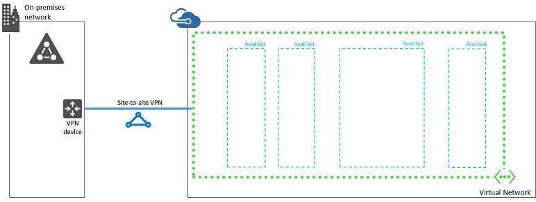

<properties
	pageTitle="SharePoint Server 2013 farm Phase 1 | Microsoft Azure"
	description="Create the virtual network and other Azure infrastructure elements in Phase 1 of the SharePoint Server 2013 farm in Azure."
	documentationCenter=""
	services="virtual-machines-windows"
	authors="JoeDavies-MSFT"
	manager="timlt"
	editor=""
	tags="azure-resource-manager"/>

<tags
	ms.service="virtual-machines-windows"
	ms.workload="infrastructure-services"
	ms.tgt_pltfrm="Windows"
	ms.devlang="na"
	ms.topic="article"
	ms.date="12/11/2015"
	ms.author="josephd"/>

# SharePoint Intranet Farm Workload Phase 1: Configure Azure

[AZURE.INCLUDE [learn-about-deployment-models](../../includes/learn-about-deployment-models-rm-include.md)] classic deployment model.

In this phase of deploying an intranet-only SharePoint 2013 farm with SQL Server AlwaysOn Availability Groups in Azure infrastructure services, you build out the Azure networking and storage infrastructure in Azure Service Management. You must complete this phase before moving on to [Phase 2](virtual-machines-windows-ps-sp-intranet-ph2.md). See [Deploying SharePoint with SQL Server AlwaysOn Availability Groups in Azure](virtual-machines-windows-sp-intranet-overview.md) for all of the phases.

Azure must be provisioned with these basic network components:

- A cross-premises virtual network with one subnet for hosting the Azure virtual machines
- One Azure storage account to store VHD disk images and extra data disks
- Four availability sets

## Before you begin

Before you begin configuring Azure components, fill in the following tables. To assist you in the procedures for configuring Azure, print this section and write down the needed information or copy this section to a document and fill it in.

For the settings of the virtual network (VNet), fill in Table V.

Item | Configuration element | Description | Value
--- | --- | --- | ---
1. | VNet name | A name to assign to the Azure Virtual Network (example SPFarmNet). | __________________
2. | VNet location | The Azure datacenter that will contain the virtual network. | __________________
3. | Local network name | A name to assign to your organization network. | __________________
4. | VPN device IP address | The public IPv4 address of your VPN device's interface on the Internet. Work with your IT department to determine this address. | __________________
5. | VNet address space | The address space (defined in a single private address prefix) for the virtual network. Work with your IT department to determine this address space. | __________________
6. | First final DNS server | The fourth possible IP address for the address space of the subnet of the virtual network (see Table S). Work with your IT department to determine these addresses. | __________________
7. | Second final DNS server | The fifth possible IP address for the address space of the subnet of the virtual network (see Table S). Work with your IT department to determine these addresses. | __________________
8. | IPsec shared key | A 32-character random, alphanumeric string that will be used to authenticate both sides of the site-to-site VPN connection. Work with your IT or security department to determine this key value. Alternately, see [Create a random string for an IPsec preshared key](http://social.technet.microsoft.com/wiki/contents/articles/32330.create-a-random-string-for-an-ipsec-preshared-key.aspx).| __________________

**Table V: Cross-premises virtual network configuration**

Fill in Table S for the subnets of this solution. 

- For the first subnet, determine a 29-bit address space (with a /29 prefix length) for the Azure gateway subnet.
- For the second subnet, specify a friendly name, a single IP address space based on the Virtual Network address space, and a descriptive purpose. 

Work with your IT department to determine these address spaces from the virtual network address space. Both address spaces should be in Classless Interdomain Routing (CIDR) format, also known as network prefix format. An example is 10.24.64.0/20.

Item | Subnet name | Subnet address space | Purpose 
--- | --- | --- | --- 
1. | Gateway subnet | _____________________________ | The subnet used by the Azure gateway virtual machines.
2. | _______________ | _____________________________ | _________________________

**Table S: Subnets in the virtual network**

> [AZURE.NOTE] This pre-defined architecture uses a single subnet for simplicity. If you want to overlay a set of traffic filters to emulate subnet isolation, you can use Azure [Network Security Groups](../virtual-network/virtual-networks-nsg.md).

For the two on-premises DNS servers that you want to use when initially setting up the domain controllers in your virtual network, fill in Table D. Note that two blank entries are listed, but you can add more. Work with your IT department to determine this list.

Item | DNS server IP address
--- | ---
1. | ___________________________
2. | ___________________________

**Table D: On-premises DNS servers**

To route packets from the cross-premises network to your organization network across the site-to-site VPN connection, you must configure the virtual network with a local network that contains a list of the address spaces (in CIDR notation) for all of the reachable locations on your organization's on-premises network. The list of address spaces that define your local network must be unique and must not overlap with the address space used for other virtual networks or other local networks.

For the set of local network address spaces, fill in Table L. Note that three blank entries are listed but you will typically need more. Work with your IT department to determine this list of address spaces.

Item | Local network address space
--- | ---
1. | ___________________________________
2. | ___________________________________
3. | ___________________________________

**Table L: Address prefixes for the local network**

> [AZURE.NOTE] The following command sets use Azure PowerShell 1.0 and later. For more information, see [Azure PowerShell 1.0](https://azure.microsoft.com/blog/azps-1-0/).

First, start an Azure PowerShell prompt and login to your account.

	Login-AzureRMAccount

Get your subscription name using the following command.

	Get-AzureRMSubscription | Sort SubscriptionName | Select SubscriptionName

Set your Azure subscription. Replace everything within the quotes, including the < and > characters, with the correct names.

	$subscr="<subscription name>"
	Get-AzureRmSubscription –SubscriptionName $subscr | Select-AzureRmSubscription

Next, create a new resource group for your intranet SharePoint farm. To determine a unique resource group name, use this command to list your existing resource groups.

	Get-AzureRMResourceGroup | Sort ResourceGroupName | Select ResourceGroupName

Create your new resource group with these commands.

	$rgName="<resource group name>"
	$locName="<an Azure location, such as West US>"
	New-AzureRMResourceGroup -Name $rgName -Location $locName

Resource Manager-based virtual machines require a Resource Manager-based storage account.

Item | Storage account name | Purpose 
--- | --- | ---
1. | ___________________________ | The standard storage account used by all of the virtual machines in the workload. 

**Table ST: Storage accounts**

You will need this name when you create the virtual machines in phases 2, 3, and 4.

You must pick a globally unique name for each storage account that contains only lowercase letters and numbers. You can use this command to list the existing storage accounts.

	Get-AzureRMStorageAccount | Sort StorageAccountName | Select StorageAccountName

To create the storage account, run these commands.

	$rgName="<your new resource group name>"
	$locName="<the location of your new resource group>"
	$saName="<Table ST – Item 1 - Storage account name column>"
	New-AzureRMStorageAccount -Name $saName -ResourceGroupName $rgName –Type Standard_LRS -Location $locName

Next, you create the Azure Virtual Network that will host your intranet SharePoint farm.

	$rgName="<name of your new resource group>"
	$locName="<Azure location of the new resource group>"
	$vnetName="<Table V – Item 1 – Value column>"
	$vnetAddrPrefix="<Table V – Item 5 – Value column>"
	$spSubnetName="<Table S – Item 2 – Subnet name column>"
	$spSubnetPrefix="<Table S – Item 2 – Subnet address space column>"
	$gwSubnetPrefix="<Table S – Item 1 – Subnet address space column>"
	$dnsServers=@( "<Table D – Item 1 – DNS server IP address column>", "<Table D – Item 2 – DNS server IP address column>" )
	$gwSubnet=New-AzureRMVirtualNetworkSubnetConfig -Name "GatewaySubnet" -AddressPrefix $gwSubnetPrefix
	$spSubnet=New-AzureRMVirtualNetworkSubnetConfig -Name $spSubnetName -AddressPrefix $spSubnetPrefix
	New-AzureRMVirtualNetwork -Name $vnetName -ResourceGroupName $rgName -Location $locName -AddressPrefix $vnetAddrPrefix -Subnet $gwSubnet,$spSubnet -DNSServer $dnsServers

Next, use these commands to create the gateways for the site-to-site VPN connection.

	$vnetName="<Table V – Item 1 – Value column>"
	$vnet=Get-AzureRMVirtualNetwork -Name $vnetName -ResourceGroupName $rgName
	
	# Attach a virtual network gateway to a public IP address and the gateway subnet
	$publicGatewayVipName="SPPublicIPAddress"
	$vnetGatewayIpConfigName="SPPublicIPConfig"
	New-AzureRMPublicIpAddress -Name $vnetGatewayIpConfigName -ResourceGroupName $rgName -Location $locName -AllocationMethod Dynamic
	$publicGatewayVip=Get-AzureRMPublicIpAddress -Name $vnetGatewayIpConfigName -ResourceGroupName $rgName
	$vnetGatewayIpConfig=New-AzureRMVirtualNetworkGatewayIpConfig -Name $vnetGatewayIpConfigName -PublicIpAddressId $publicGatewayVip.Id -SubnetId $vnet.Subnets[0].Id

	# Create the Azure gateway
	$vnetGatewayName="SPAzureGateway"
	$vnetGateway=New-AzureRMVirtualNetworkGateway -Name $vnetGatewayName -ResourceGroupName $rgName -Location $locName -GatewayType Vpn -VpnType RouteBased -IpConfigurations $vnetGatewayIpConfig
	
	# Create the gateway for the local network
	$localGatewayName="SPLocalNetGateway"
	$localGatewayIP="<Table V – Item 4 – Value column>"
	$localNetworkPrefix=@( <comma-separated, double-quote enclosed list of the local network address prefixes from Table L, example: "10.1.0.0/24", "10.2.0.0/24"> )
	$localGateway=New-AzureRMLocalNetworkGateway -Name $localGatewayName -ResourceGroupName $rgName -Location $locName -GatewayIpAddress $localGatewayIP -AddressPrefix $localNetworkPrefix
	
	# Define the Azure virtual network VPN connection
	$vnetConnectionName="SPS2SConnection"
	$vnetConnectionKey="<Table V – Item 8 – Value column>"
	$vnetConnection=New-AzureRMVirtualNetworkGatewayConnection -Name $vnetConnectionName -ResourceGroupName $rgName -Location $locName -ConnectionType IPsec -SharedKey $vnetConnectionKey -VirtualNetworkGateway1 $vnetGateway -LocalNetworkGateway2 $localGateway

Next, configure your on-premises VPN device to connect to the Azure VPN gateway. For more information, see [Configure your VPN device](../virtual-network/vpn-gateway-configure-vpn-gateway-mp.md#configure-your-vpn-device).

To configure your on-premises VPN device, you will need the following:

- The public IPv4 address of the Azure VPN gateway for your virtual network from the display of the **Get-AzureRMPublicIpAddress -Name $publicGatewayVipName -ResourceGroupName $rgName** command.
- The IPsec pre-shared key for the site-to-site VPN connection (Table V- Item 8 – Value column).

Next, ensure that the address space of the virtual network is reachable from your on-premises network. This is usually done by adding a route corresponding to the virtual network address space to your VPN device and then advertising that route to the rest of the routing infrastructure of your organization network. Work with your IT department to determine how to do this.

Next, define the names of four availability sets. Fill out Table A. 

Item | Purpose | Availability set name 
--- | --- | --- 
1. | Domain controllers | ___________________________
2. | SQL servers | ___________________________
3. | App servers | ___________________________
4. | Web servers | ___________________________

**Table A: Availability set names**

You will need these names when you create the virtual machines in phases 2, 3, and 4.

Create these new availability sets with these Azure PowerShell commands.

	$rgName="<your new resource group name>"
	$locName="<the Azure location for your new resource group>"
	$avName="<Table A – Item 1 – Availability set name column>"
	New-AzureRMAvailabilitySet –Name $avName –ResourceGroupName $rgName -Location $locName
	$avName="<Table A – Item 2 – Availability set name column>"
	New-AzureRMAvailabilitySet –Name $avName –ResourceGroupName $rgName -Location $locName
	$avName="<Table A – Item 3 – Availability set name column>"
	New-AzureRMAvailabilitySet –Name $avName –ResourceGroupName $rgName -Location $locName
	$avName="<Table A – Item 4 – Availability set name column>"
	New-AzureRMAvailabilitySet –Name $avName –ResourceGroupName $rgName -Location $locName

This is the configuration resulting from the successful completion of this phase.

## Next step

- Use [Phase 2](virtual-machines-windows-ps-sp-intranet-ph2.md) to continue with the configuration of this workload.

