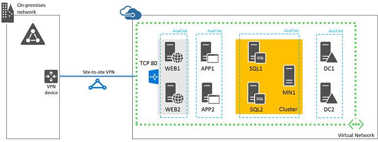

<properties
	pageTitle="SharePoint Server 2013 farm Phase 4 | Microsoft Azure"
	description="Create the SharePoint server virtual machines and a new SharePoint farm in Phase 4 of the SharePoint Server 2013 farm in Azure."
	documentationCenter=""
	services="virtual-machines-windows"
	authors="JoeDavies-MSFT"
	manager="timlt"
	editor=""
	tags="azure-resource-manager"/>

<tags
	ms.service="virtual-machines-windows"
	ms.workload="infrastructure-services"
	ms.tgt_pltfrm="Windows"
	ms.devlang="na"
	ms.topic="article"
	ms.date="04/01/2016"
	ms.author="josephd"/>

# SharePoint Intranet Farm Workload Phase 4: Configure SharePoint servers

[AZURE.INCLUDE [learn-about-deployment-models](../../includes/learn-about-deployment-models-rm-include.md)] classic deployment model.

In this phase of deploying an intranet-only SharePoint 2013 farm with SQL Server AlwaysOn Availability Groups in Azure infrastructure services, you build out the application and web tiers of the SharePoint farm and create the farm by using the SharePoint Configuration Wizard.

You must complete this phase before moving on to [Phase 5](virtual-machines-windows-ps-sp-intranet-ph5.md). See [Deploying SharePoint with SQL Server AlwaysOn Availability Groups in Azure](virtual-machines-windows-sp-intranet-overview.md) for all of the phases.

## Create the SharePoint server virtual machines in Azure

There are four SharePoint server virtual machines. Two SharePoint server virtual machines are for the front-end web servers, and two are for administration and hosting SharePoint applications. Two SharePoint servers in each tier provide high availability.

First, you configure internal load balancing so that Azure distributes the client traffic evenly among the two front end web servers. This requires you to specify an internal load balancing instance consisting of a name and its own IP address, obtained from the subnet address space that you assigned to your Azure virtual network. 

> [AZURE.NOTE] The following command sets use Azure PowerShell 1.0 and later. For more information, see [Azure PowerShell 1.0](https://azure.microsoft.com/blog/azps-1-0/).

Specify the values for the variables, removing the < and > characters. Note that the following Azure PowerShell command sets use values from the following tables:

- Table M, for your virtual machines
- Table V, for your virtual network settings
- Table S, for your subnet
- Table ST, for your storage accounts
- Table A, for your availability sets

Recall that you defined Table M in [Phase 2: Configure domain controllers](virtual-machines-windows-ps-sp-intranet-ph2.md) and Tables V, S, ST, and A in [Phase 1: Configure Azure](virtual-machines-windows-ps-sp-intranet-ph1.md).

When you have supplied all the proper values, run the resulting block at the Azure PowerShell command prompt.

	# Set up key variables
	$rgName="<resource group name>"
	$locName="<Azure location of your resource group>"
	$vnetName="<Table V – Item 1 – Value column>"
	$privIP="<available IP address on the subnet>"
	$vnet=Get-AzureRMVirtualNetwork -Name $vnetName -ResourceGroupName $rgName

	$frontendIP=New-AzureRMLoadBalancerFrontendIpConfig -Name SharePointWebServers-LBFE -PrivateIPAddress $privIP -SubnetId $vnet.Subnets[1].Id
	$beAddressPool=New-AzureRMLoadBalancerBackendAddressPoolConfig -Name SharePointWebServers-LBBE

	# This example assumes unsecured (HTTP-based) web traffic to the web servers.
	$healthProbe=New-AzureRMLoadBalancerProbeConfig -Name WebServersProbe -Protocol "TCP" -Port 80 -IntervalInSeconds 15 -ProbeCount 2
	$lbrule=New-AzureRMLoadBalancerRuleConfig -Name "WebTraffic" -FrontendIpConfiguration $frontendIP -BackendAddressPool $beAddressPool -Probe $healthProbe -Protocol "TCP" -FrontendPort 80 -BackendPort 80
	New-AzureRMLoadBalancer -ResourceGroupName $rgName -Name "SharePointWebServersInAzure" -Location $locName -LoadBalancingRule $lbrule -BackendAddressPool $beAddressPool -Probe $healthProbe -FrontendIpConfiguration $frontendIP

Next, add a DNS address record to your organization's internal DNS infrastructure that resolves the fully qualified domain name of the SharePoint farm (such as spfarm.corp.contoso.com) to the IP address assigned to the internal load balancer (the value of $privIP in the preceding Azure PowerShell command block).

Use the following block of Azure PowerShell commands to create the virtual machines for the four SharePoint servers. When you have supplied all the proper values, run the resulting block at the Azure PowerShell command prompt.

	# Set up key variables
	$rgName="<resource group name>"
	$locName="<Azure location of your resource group>"
	$saName="<Table ST – Item 2 – Storage account name column>"
	$vnetName="<Table V – Item 1 – Value column>"
	$avName="<Table A – Item 3 – Availability set name column>"
	
	# Create the first application server
	$vmName="<Table M – Item 6 - Virtual machine name column>"
	$vmSize="<Table M – Item 6 - Minimum size column>"
	$vnet=Get-AzureRMVirtualNetwork -Name $vnetName -ResourceGroupName $rgName
	$nic=New-AzureRMNetworkInterface -Name ($vmName +"-NIC") -ResourceGroupName $rgName -Location $locName -SubnetId $vnet.Subnets[1].Id
	$avSet=Get-AzureRMAvailabilitySet –Name $avName –ResourceGroupName $rgName 
	$vm=New-AzureRMVMConfig -VMName $vmName -VMSize $vmSize -AvailabilitySetId $avset.Id
	$cred=Get-Credential -Message "Type the name and password of the local administrator account for the first application server." 
	$vm=Set-AzureRMVMOperatingSystem -VM $vm -Windows -ComputerName $vmName -Credential $cred -ProvisionVMAgent -EnableAutoUpdate
	$vm=Set-AzureRMVMSourceImage -VM $vm -PublisherName MicrosoftSharePoint -Offer MicrosoftSharePointServer -Skus 2013 -Version "latest"
	$vm=Add-AzureRMVMNetworkInterface -VM $vm -Id $nic.Id
	$storageAcc=Get-AzureRMStorageAccount -ResourceGroupName $rgName -Name $saName
	$osDiskUri=$storageAcc.PrimaryEndpoints.Blob.ToString() + "vhds/" + $vmName + "-OSDisk.vhd"
	$vm=Set-AzureRMVMOSDisk -VM $vm -Name "OSDisk" -VhdUri $osDiskUri -CreateOption fromImage
	New-AzureRMVM -ResourceGroupName $rgName -Location $locName -VM $vm

	# Create the second application server
	$vmName="<Table M – Item 7 - Virtual machine name column>"
	$vmSize="<Table M – Item 7 - Minimum size column>"
	$vnet=Get-AzureRMVirtualNetwork -Name $vnetName -ResourceGroupName $rgName
	$nic=New-AzureRMNetworkInterface -Name ($vmName +"-NIC") -ResourceGroupName $rgName -Location $locName -SubnetId $vnet.Subnets[1].Id
	$avSet=Get-AzureRMAvailabilitySet –Name $avName –ResourceGroupName $rgName 
	$vm=New-AzureRMVMConfig -VMName $vmName -VMSize $vmSize -AvailabilitySetId $avset.Id
	$cred=Get-Credential -Message "Type the name and password of the local administrator account for the second application server." 
	$vm=Set-AzureRMVMOperatingSystem -VM $vm -Windows -ComputerName $vmName -Credential $cred -ProvisionVMAgent -EnableAutoUpdate
	$vm=Set-AzureRMVMSourceImage -VM $vm -PublisherName MicrosoftSharePoint -Offer MicrosoftSharePointServer -Skus 2013 -Version "latest"
	$vm=Add-AzureRMVMNetworkInterface -VM $vm -Id $nic.Id
	$storageAcc=Get-AzureRMStorageAccount -ResourceGroupName $rgName -Name $saName
	$osDiskUri=$storageAcc.PrimaryEndpoints.Blob.ToString() + "vhds/" + $vmName + "-OSDisk.vhd"
	$vm=Set-AzureRMVMOSDisk -VM $vm -Name "OSDisk" -VhdUri $osDiskUri -CreateOption fromImage
	New-AzureRMVM -ResourceGroupName $rgName -Location $locName -VM $vm

	# Change the availability set
	$avName="<Table A – Item 4 – Availability set name column>"

	# Set up key variables
	$beSubnetName="<Table S - Item 2 - Name column>"
	$webLB=Get-AzureRMLoadBalancer -ResourceGroupName $rgName -Name "SharePointWebServersInAzure"	
	$vnet=Get-AzureRMVirtualNetwork -Name $vnetName -ResourceGroupName $rgName
	$backendSubnet=Get-AzureRMVirtualNetworkSubnetConfig -Name $beSubnetName -VirtualNetwork $vnet
	
	# Create the first front end web server virtual machine
	$vmName="<Table M – Item 8 - Virtual machine name column>"
	$vmSize="<Table M – Item 8 - Minimum size column>"
	$nic=New-AzureRMNetworkInterface -Name ($vmName + "-NIC") -ResourceGroupName $rgName -Location $locName -Subnet $backendSubnet -LoadBalancerBackendAddressPool $webLB.BackendAddressPools[0]
	$avSet=Get-AzureRMAvailabilitySet -Name $avName –ResourceGroupName $rgName 
	$vm=New-AzureRMVMConfig -VMName $vmName -VMSize $vmSize -AvailabilitySetId $avset.Id
	$cred=Get-Credential -Message "Type the name and password of the local administrator account for the first front end web server." 
	$vm=Set-AzureRMVMOperatingSystem -VM $vm -Windows -ComputerName $vmName -Credential $cred -ProvisionVMAgent -EnableAutoUpdate
	$vm=Set-AzureRMVMSourceImage -VM $vm -PublisherName MicrosoftSharePoint -Offer MicrosoftSharePointServer -Skus 2013 -Version "latest"
	$vm=Add-AzureRMVMNetworkInterface -VM $vm -Id $nic.Id
	$storageAcc=Get-AzureRMStorageAccount -ResourceGroupName $rgName -Name $saName
	$osDiskUri=$storageAcc.PrimaryEndpoints.Blob.ToString() + "vhds/" + $vmName + "-OSDisk.vhd"
	$vm=Set-AzureRMVMOSDisk -VM $vm -Name "OSDisk" -VhdUri $osDiskUri -CreateOption fromImage
	New-AzureRMVM -ResourceGroupName $rgName -Location $locName -VM $vm
	
	# Create the second front end web server virtual machine
	$vmName="<Table M – Item 9 - Virtual machine name column>"
	$vmSize="<Table M – Item 9 - Minimum size column>"
	$nic=New-AzureRMNetworkInterface -Name ($vmName + "-NIC") -ResourceGroupName $rgName -Location $locName -Subnet $backendSubnet -LoadBalancerBackendAddressPool $webLB.BackendAddressPools[0]
	$vm=New-AzureRMVMConfig -VMName $vmName -VMSize $vmSize -AvailabilitySetId $avset.Id
	$cred=Get-Credential -Message "Type the name and password of the local administrator account for the second front end web server." 
	$vm=Set-AzureRMVMOperatingSystem -VM $vm -Windows -ComputerName $vmName -Credential $cred -ProvisionVMAgent -EnableAutoUpdate
	$vm=Set-AzureRMVMSourceImage -VM $vm -PublisherName MicrosoftSharePoint -Offer MicrosoftSharePointServer -Skus 2013 -Version "latest"
	$vm=Add-AzureRMVMNetworkInterface -VM $vm -Id $nic.Id
	$storageAcc=Get-AzureRMStorageAccount -ResourceGroupName $rgName -Name $saName
	$osDiskUri=$storageAcc.PrimaryEndpoints.Blob.ToString() + "vhds/" + $vmName + "-OSDisk.vhd"
	$vm=Set-AzureRMVMOSDisk -VM $vm -Name "OSDisk" -VhdUri $osDiskUri -CreateOption fromImage
	New-AzureRMVM -ResourceGroupName $rgName -Location $locName -VM $vm

> [AZURE.NOTE] Because these virtual machines are for an intranet application, they are not assigned a public IP address or a DNS domain name label and exposed to the Internet. However, this also means that you cannot connect to them from the Azure portal. The **Connect** button will be unavailable when you view the properties of the virtual machine. 

Use the remote desktop client of your choice and create a remote desktop connection to each virtual machine. Use its intranet DNS or computer name and the credentials of the local administrator account.

Next, for each virtual machine, join them to the appropriate Active Directory domain with these commands at the Windows PowerShell prompt.

	$domName="<Active Directory domain name to join, such as corp.contoso.com>"
	Add-Computer -DomainName $domName
	Restart-Computer

Note that you must supply domain account credentials after entering the **Add-Computer** command.

After they restart, use the [Logging on to a virtual machine with a Remote Desktop connection procedure](virtual-machines-windows-ps-sp-intranet-ph2.md#logon) four times, once for each SharePoint server, to log on by using the [Domain]\sp_farm_db account credentials. You created these credentials in [Phase 2: Configure domain controllers](virtual-machines-windows-ps-sp-intranet-ph2.md).

Use the [To test connectivity procedure](virtual-machines-windows-ps-sp-intranet-ph2.md#testconn) four times, once for each SharePoint server, to test connectivity to locations on your organization network.

> [AZURE.NOTE] The SharePoint servers are created from the SharePoint Server 2013 Trial image. You need to convert the installation to use a Retail or Volume License key for either the Standard or Enterprise edition of SharePoint Server 2013. 

## Configure the SharePoint farm

Use these steps to configure the first SharePoint server in the farm:

1.	From the desktop of the first SharePoint application server, double-click **SharePoint 2013 Products Configuration Wizard**. When you're asked to allow the program to make changes to the computer, click **Yes**.
2.	On the **Welcome to SharePoint Products** page, click **Next**.
3.	A **SharePoint Products Configuration Wizard** dialog appears, warning that services (such as IIS) will be restarted or reset. Click **Yes**.
4.	On the **Connect to a server farm** page, select **Create a new server farm**, and then click **Next**.
5.	On the **Specify Configuration Database Settings** page:
 - In **Database server**, type the name of the primary database server.
 - In **Username**, type [Domain]**\sp_farm_db** (created in [Phase 2: Configure domain controllers](virtual-machines-windows-ps-sp-intranet-ph2.md)). Recall that the sp_farm_db account has sysadmin privileges on the database server.
 - In **Password**, type the sp_farm_db account password.
6.	Click **Next**.
7.	On the **Specify Farm Security Settings** page, type a passphrase twice. Record the passphrase and store it in a secure location for future reference. Click **Next**.
8.	On the **Configure SharePoint Central Administration Web Application** page, click **Next**.
9.	The **Completing the SharePoint Products Configuration Wizard** page appears. Click **Next**.
10.	The **Configuring SharePoint Products** page appears. Wait until the configuration process finishes, about 8 minutes.
11.	After the farm is successfully configured, click **Finish**. The new administration website starts.
12.	To start configuring the SharePoint farm, click **Start the Wizard**.

Perform the following procedure on the second SharePoint application server and the two front-end web servers:

1.	From the desktop, double-click **SharePoint 2013 Products Configuration Wizard**. When you're asked to allow the program to make changes to the computer, click **Yes**.
2.	On the **Welcome to SharePoint Products** page, click **Next**.
3.	A **SharePoint Products Configuration Wizard** dialog appears, warning that services (such as IIS) will be restarted or reset. Click **Yes**.
4.	On the **Connect to a server farm** page, click **Connect to an existing server farm**, and then click **Next**.
5.	On the **Specify Configuration Database Settings** page, type the name of the primary database server in **Database server**, and then click **Retrieve Database Names**.
6.	Click **SharePoint_Config** in the database name list, and then click **Next**.
7.	On the **Specify Farm Security Settings** page, type the passphrase from the previous procedure. Click **Next**.
8.	The **Completing the SharePoint Products Configuration Wizard** page appears. Click **Next**.
9.	On the **Configuration Successful** page, click **Finish**.

When SharePoint creates the farm, it configures a set of server logins on the primary SQL Server virtual machine. SQL Server 2012 introduces the concept of users with passwords for contained databases. The database itself stores all the database metadata and user information, and a user who is defined in this database does not need to have a corresponding login. The information in this database is replicated by the availability group and is available after a failover. For more information, see [Contained databases](http://go.microsoft.com/fwlink/p/?LinkId=262794).

However, by default, SharePoint databases are not contained databases. Therefore, you will need to manually configure the secondary database server so that it has the same set of logins for SharePoint farm accounts as the primary database server. You can perform this synchronization from SQL Server Management Studio by connecting to both servers at the same time.

After you finish this initial setup, more configuration options for the capabilities of the SharePoint farm are available. For more information, see [Planning for SharePoint 2013 on Azure infrastructure services](http://msdn.microsoft.com/library/dn275958.aspx).

This is the configuration that results from the successful completion of this phase. 

## Next step

- Use [Phase 5](virtual-machines-windows-ps-sp-intranet-ph5.md) to continue with the configuration of this workload.
