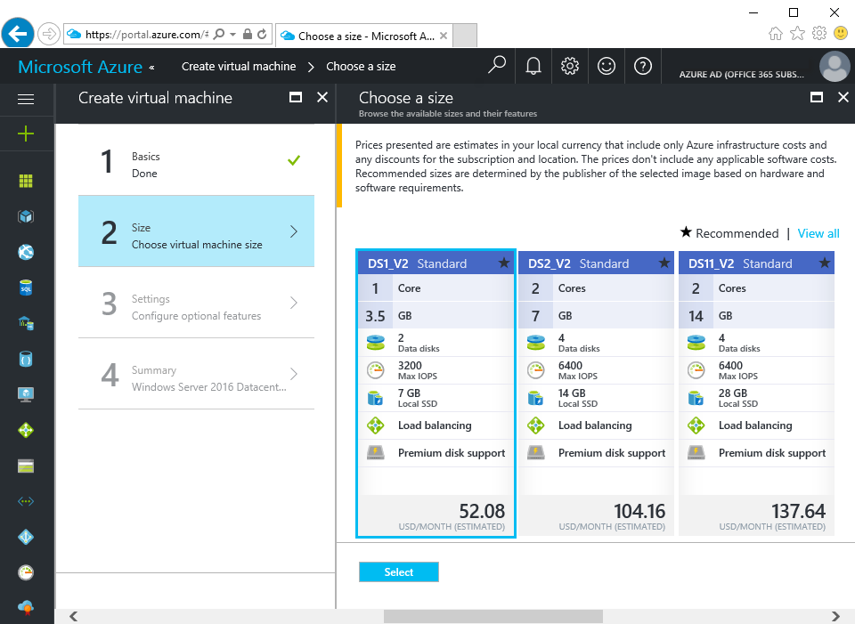
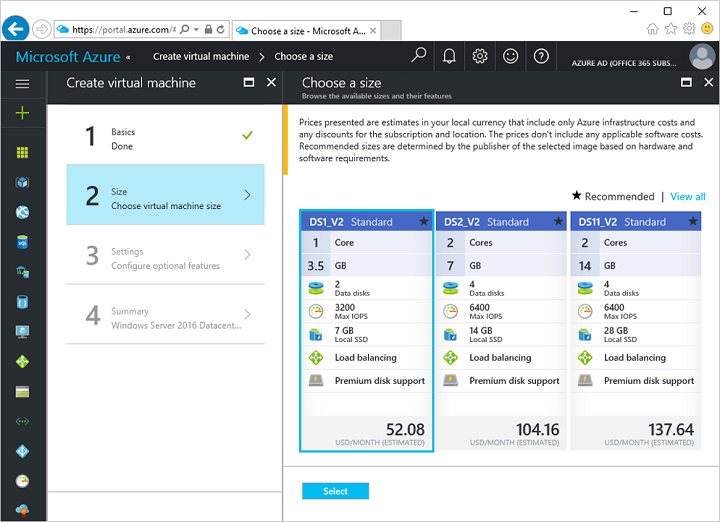
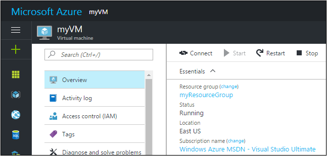

# Create a Windows virtual machine with the Azure portal

Azure virtual machines can be created through the Azure portal. This method provides a browser-based user interface for creating and configuring VMs, and all related Azure resources.

## Log in to Azure 

Log in to the Azure portal at http://portal.azure.com.

## Create virtual machine

2. Click the **New** button found on the upper left-hand corner of the Azure portal.

3. Select **Compute** from the **New** blade, select **Windows Server 2016 Datacenter** from the **Compute** blade, and then click the **Create** button.

4. Fill out the virtual machine **Basics** form. For **Resource group**, create a new one. A resource group is a logical container into which Azure resources are created and collectively managed. When complete, click **OK**.

      

5. Choose a size for the VM and click **Select**. 

    

6. On the settings blade, select **Yes** under **Use managed disks**, keep the defaults for the rest of the settings, and click **OK**.

7. On the summary page, click **Ok** to start the virtual machine deployment.

8. Click the virtual machine. The VM can be found on the Azure portal dashboard, or by selecting **Virtual Machines** from the left-hand menu. When the VM has been created, the status will change from **Deploying** to **Running**.

## Connect to virtual machine

After the deployment has completed, create a remote desktop connection with the virtual machine.

1. Click the **Connect** button on the virtual machine blade. The connect button initializes a Windows remote desktop connection with the virtual machine. 

     

3. Click **Connect** on the remote desktop connection wizard, enter the user name and password specified when creating the virtual machine, and then click **Ok**.

## Delete virtual machine

When no longer needed, delete the resource group, virtual machine, and all related resources. To do so, select the resource group from the virtual machine blade and click **Delete**.

## Next steps

[Install a role and configure firewall tutorial](./virtual-machines-windows-hero-role.md?toc=%2fazure%2fvirtual-machines%2fwindows%2ftoc.json)

[Explore VM deployment CLI samples](./virtual-machines-windows-cli-samples.md?toc=%2fazure%2fvirtual-machines%2fwindows%2ftoc.json)