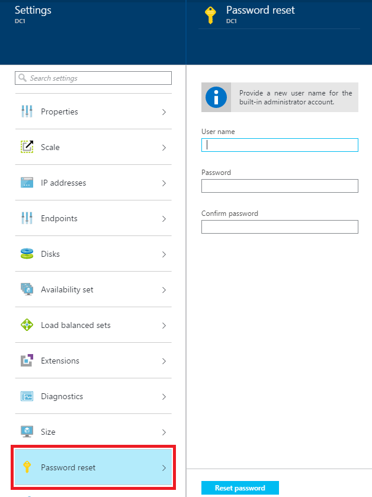

<properties
	pageTitle="How to reset a password or the Remote Desktop service for Windows virtual machines"
	description="Quickly reset a local administrator password or the Remote Desktop service for Windows virtual machines using the Azure preview portal or PowerShell commands."
	services="virtual-machines"
	documentationCenter=""
	authors="dsk-2015"
	manager="timlt"
	editor=""
	tags="azure-service-management"/>

<tags
	ms.service="virtual-machines"
	ms.workload="infrastructure-services"
	ms.tgt_pltfrm="na"
	ms.devlang="na"
	ms.topic="article"
	ms.date="07/21/2015"
	ms.author="dkshir"/>

# How to reset a password or the Remote Desktop service for Windows virtual machines

If you can't connect to a Windows virtual machine because of a forgotten password or a problem with the Remote Desktop service configuration, use the Azure preview portal or the VMAccess extension to reset the local administrator password or reset the Remote Desktop service configuration.

> [AZURE.NOTE] This article does not apply to virtual machines created in Azure Resource Manager.

## Preview portal

To reset the Remote Desktop service in the [preview portal](https://portal.azure.com), click **Browse all** > **Virtual machines (classic)** > *your Windows virtual machine* > **Reset Remote Access**. The following page appears.

To reset the name and password of the local administrator account in the [preview portal](https://portal.azure.com), click **Browse all** > **Virtual machines (classic)** > *your Windows virtual machine* > **All settings** > **Password reset**. The following page appears.

## VMAccess extension and PowerShell

Before you begin, you'll need the following:

- The Azure PowerShell module, version 0.8.5 or later. You can check the version of Azure PowerShell that you have installed with the **Get-Module azure | format-table version** command. For instructions and a link to the latest version, see [How to install and configure Azure PowerShell](http://go.microsoft.com/fwlink/p/?linkid=320552&clcid=0x409).
- The new local administrator account password. You don't need this if you want to reset the Remote Desktop service configuration.
- The VM Agent.

The VMAccess extension doesn't need to be installed before you can use it. As long as the VM Agent is installed on the virtual machine, the extension is loaded automatically when you run an Azure PowerShell command that uses the **Set-AzureVMExtension** cmdlet.

First, verify that the VM Agent is already installed. Add the cloud service name and virtual machine name, and then run the following commands at an administrator-level Azure PowerShell command prompt. Replace everything within the quotes, including the < and > characters.

	$csName = "<cloud service name>"
	$vmName = "<virtual machine name>"
	$vm = Get-AzureVM -ServiceName $csName -Name $vmName
	write-host $vm.VM.ProvisionGuestAgent

If you don't know the cloud service and virtual machine name, run **Get-AzureVM** to display that information for all the virtual machines in your current subscription.

If the **write-host** command displays **True**, the VM Agent is installed. If it displays **False**, see the instructions and a link to the download in the [VM Agent and Extensions - Part 2](http://go.microsoft.com/fwlink/p/?linkid=403947&clcid=0x409) Azure blog post.

If you created the virtual machine with the Azure portal, run the following additional command.

	$vm.GetInstance().ProvisionGuestAgent = $true

This command will prevent the “Provision Guest Agent must be enabled on the VM object before setting IaaS VM Access Extension” error when running the **Set-AzureVMExtension** command in the following sections.

Now, you can do these tasks:

- Reset a local administrator account password.
- Reset the Remote Desktop service configuration.

## Reset the local administrator account password

Add the current local administrator account name and the new password, and then run the following commands.

	$cred=Get-Credential –Message "Type the name of the current local administrator account and the new password."
	Set-AzureVMAccessExtension –vm $vm -UserName $cred.GetNetworkCredential().Username -Password $cred.GetNetworkCredential().Password  | Update-AzureVM

- If you type a different name than the current account, the VMAccess extension renames the local administrator account, assigns the password to that account, and issues a Remote Desktop log off.
- If the local administrator account is disabled, the VMAccess extension enables it.

These commands also reset the Remote Desktop service configuration.

## Reset the Remote Desktop service configuration

To reset the Remote Desktop service configuration, run the following command.

	Set-AzureVMAccessExtension –vm $vm | Update-AzureVM

The VMAccess extension runs these two commands on the virtual machine:

- **netsh advfirewall firewall set rule group="Remote Desktop" new enable=Yes**

	This command enables the built-in Windows Firewall group that allows incoming Remote Desktop traffic, which uses TCP port 3389.

- **Set-ItemProperty -Path 'HKLM:\System\CurrentControlSet\Control\Terminal Server' -name "fDenyTSConnections" -Value 0**

	This command sets the fDenyTSConnections registry value to 0, enabling Remote Desktop connections.

If this did not solve your Remote Desktop access problem, run the [Azure IaaS (Windows) diagnostics package](https://home.diagnostics.support.microsoft.com/SelfHelp?knowledgebaseArticleFilter=2976864).

1.	In the diagnostics package, click **Microsoft Azure IaaS (Windows) diagnostics package** to create a new diagnostics session.
2.	On the **Which of the following issues are you experiencing with your Azure VM?** page, select the **RDP connectivity to an Azure VM (Reboot Required)** issue.

For more information, see the [Microsoft Azure IaaS (Windows) diagnostics package](http://support.microsoft.com/kb/2976864) Knowledge Base article.

If you were unable to run the Azure IaaS (Windows) diagnostics package or running it did not solve your problem, see [Troubleshoot Remote Desktop connections to a Windows-based Azure virtual machine](virtual-machines-troubleshoot-remote-desktop-connections.md).

## Additional resources

[Azure VM extensions and features](http://msdn.microsoft.com/library/azure/dn606311.aspx)

[Connect to an Azure virtual machine with RDP or SSH](http://msdn.microsoft.com/library/azure/dn535788.aspx)

[Troubleshoot Remote Desktop connections to a Windows-based Azure virtual machine](virtual-machines-troubleshoot-remote-desktop-connections.md)
