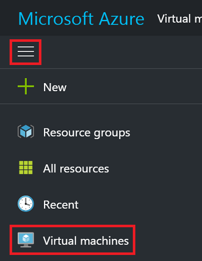
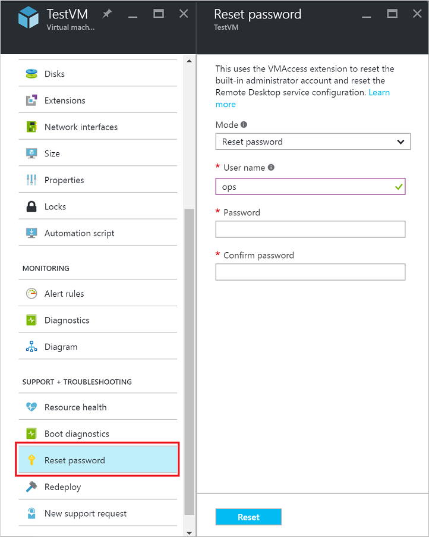

# How to reset the Remote Desktop service or its login password in a Windows VM
[!INCLUDE [learn-about-deployment-models](../../includes/learn-about-deployment-models-both-include.md)]

If you can't connect to a Windows virtual machine (VM), you can reset the local administrator password or reset the Remote Desktop service configuration. You can use either the Azure portal or the VM Access extension in Azure PowerShell to reset the password. If you are using PowerShell, make sure you have the latest PowerShell module installed on your work computer and are signed in to your Azure subscription. For detailed steps, read [How to install and configure Azure PowerShell](/powershell/azureps-cmdlets-docs).

> [!TIP]
> You can check the version of PowerShell that you have installed by using:
>
> `Import-Module Azure, AzureRM; Get-Module Azure, AzureRM | Format-Table Name, Version`


## Ways to reset configuration or credentials
You can reset Remote Desktop services and credentials in a few different ways, depending on your needs. For VMs created using the Resource Manager deployment model:

- [Reset using the Azure portal](#azure-portal---resource-manager)
- [Reset using Azure PowerShell](#vmaccess-extension-and-powershell---resource-manager)

For VMs created using the Classic deployment model:

- [Reset using the Azure portal](#azure-portal---classic)
- [Reset using Azure PowerShell](#vmaccess-extension-and-powershell---classic)

## Azure portal - Resource Manager
To expand the portal menu, click the three bars in the upper left corner and then click **Virtual machines**:



Select your Windows virtual machine then click **Support + Troubleshooting** > **Reset password**. The password reset blade is displayed:



Enter the username and a new password, then click **Save**. Try connecting to your VM again.


## VMAccess extension and PowerShell - Resource Manager
Make sure you have Azure PowerShell 1.0 or later installed, and you have signed in to your account using the `Login-AzureRmAccount` cmdlet.

### **Reset the local administrator account password**
You can reset the administrator password or user name by using the [Set-AzureRmVMAccessExtension](https://msdn.microsoft.com/library/mt619447.aspx) PowerShell command.

Create your local administrator account credentials by using the following command:

```powershell
$cred=Get-Credential
```

If you type a different name than the current account, the following VMAccess extension command renames the local administrator account, assigns the password to that account, and issues a Remote Desktop logoff event. If the local administrator account is disabled, the VMAccess extension enables it.

Use the VM access extension to set the new credentials as follows:

```powershell
Set-AzureRmVMAccessExtension -ResourceGroupName "myResourceGroup" -VMName "myVM" `
    -Name "myVMAccess" -Location WestUS -UserName $cred.GetNetworkCredential().Username `
    -Password $cred.GetNetworkCredential().Password -typeHandlerVersion "2.0"
```

Replace `myResourceGroup`, `myVM`, `myVMAccess`, and location with values relevant to your setup.

### **Reset the Remote Desktop service configuration**
You can reset remote access to your VM by using either [Set-AzureRmVMExtension](https://msdn.microsoft.com/library/mt603745.aspx) or [Set-AzureRmVMAccessExtension](https://msdn.microsoft.com/library/mt619447.aspx), as follows. (Replace the `myResourceGroup`, `myVM`, `myVMAccess` and location with your own values.)

```powershell
Set-AzureRmVMExtension -ResourceGroupName "myResourceGroup" -VMName "myVM" `
    -Name "myVMAccess" -ExtensionType "VMAccessAgent" -Location WestUS `
    -Publisher "Microsoft.Compute" -typeHandlerVersion "2.0"
```

Or:

```powershell
Set-AzureRmVMAccessExtension -ResourceGroupName "myResoureGroup" -VMName "myVM" `
    -Name "myVMAccess" -Location WestUS -typeHandlerVersion "2.0
```

> [!TIP]
> Both commands add a new named VM access agent to the virtual machine. At any point, a VM can have only a single VM access agent. To set the VM access agent properties successfully, remove the access agent set previously by using either `Remove-AzureRmVMAccessExtension` or `Remove-AzureRmVMExtension`. 
>
> Starting from Azure PowerShell version 1.2.2, you can avoid this step when using `Set-AzureRmVMExtension` with a `-ForceRerun` option. When using `-ForceRerun`, make sure to use the same name for the VM access agent as set by the previous command.

If you still can't connect remotely to your virtual machine, see more steps to try at [Troubleshoot Remote Desktop connections to a Windows-based Azure virtual machine](virtual-machines-windows-troubleshoot-rdp-connection.md?toc=%2fazure%2fvirtual-machines%2fwindows%2ftoc.json).


## Azure portal - Classic
For virtual machines created using the classic deployment model, you can use the [Azure portal](https://portal.azure.com) to reset the Remote Desktop service. To expand the portal menu, click the three bars in the upper left corner and then click **Virtual machines (classic)**:


Select your Windows virtual machine and then click **Reset Remote...**. The following dialog appears to reset the Remote Desktop configuration:


You can also reset the username and password of the local administrator account. From your VM, click **Support + Troubleshooting** > **Reset password**. The password reset blade is displayed:


After you enter the new user name and password, click **Save**.

## VMAccess extension and PowerShell - Classic
Make sure the VM Agent is installed on the virtual machine. The VMAccess extension doesn't need to be installed before you can use it, as long as the VM Agent is available. Verify that the VM Agent is already installed by using the following command. (Replace "myCloudService" and "myVM" by the names of your cloud service and your VM, respectively. You can learn these names by running `Get-AzureVM` without any parameters.)

```powershell
$vm = Get-AzureVM -ServiceName "myCloudService" -Name "myVM"
write-host $vm.VM.ProvisionGuestAgent
```

If the **write-host** command displays **True**, the VM Agent is installed. If it displays **False**, see the instructions and a link to the download in the [VM Agent and Extensions - Part 2](http://go.microsoft.com/fwlink/p/?linkid=403947&clcid=0x409) Azure blog post.

If you created the virtual machine by using the portal, check whether `$vm.GetInstance().ProvisionGuestAgent` returns **True**. If not, you can set it by using this command:

```powershell
$vm.GetInstance().ProvisionGuestAgent = $true
```

This command prevents the following error when you're running the **Set-AzureVMExtension** command in the next steps: “Provision Guest Agent must be enabled on the VM object before setting IaaS VM Access Extension.”

### **Reset the local administrator account password**
Create a sign-in credential with the current local administrator account name and a new password, and then run the `Set-AzureVMAccessExtension` as follows.

```powershell
$cred=Get-Credential
Set-AzureVMAccessExtension –vm $vm -UserName $cred.GetNetworkCredential().Username `
    -Password $cred.GetNetworkCredential().Password  | Update-AzureVM
```

If you type a different name than the current account, the VMAccess extension renames the local administrator account, assigns the password to that account, and issues a Remote Desktop sign-out. If the local administrator account is disabled, the VMAccess extension enables it.

These commands also reset the Remote Desktop service configuration.

### **Reset the Remote Desktop service configuration**
To reset the Remote Desktop service configuration, run the following command:

```powershell
Set-AzureVMAccessExtension –vm $vm | Update-AzureVM
```

The VMAccess extension runs two commands on the virtual machine:

```powershell
netsh advfirewall firewall set rule group="Remote Desktop" new enable=Yes
```

This command enables the built-in Windows Firewall group that allows incoming Remote Desktop traffic, which uses TCP port 3389.

```powershell
Set-ItemProperty -Path 'HKLM:\System\CurrentControlSet\Control\Terminal Server' -name "fDenyTSConnections" -Value 0
```

This command sets the fDenyTSConnections registry value to 0, enabling Remote Desktop connections.

## Next steps
If the Azure VM access extension does not respond and you are unable to reset the password, you can [reset the local Windows password offline](virtual-machines-windows-reset-local-password-without-agent.md?toc=%2fazure%2fvirtual-machines%2fwindows%2ftoc.json). This method is a more advanced process and requires you to connect the virtual hard disk of the problematic VM to another VM. Follow the steps documented in this article first, and only attempt the offline password reset method as a last resort.

[Azure VM extensions and features](virtual-machines-windows-extensions-features.md?toc=%2fazure%2fvirtual-machines%2fwindows%2ftoc.json)

[Connect to an Azure virtual machine with RDP or SSH](http://msdn.microsoft.com/library/azure/dn535788.aspx)

[Troubleshoot Remote Desktop connections to a Windows-based Azure virtual machine](virtual-machines-windows-troubleshoot-rdp-connection.md?toc=%2fazure%2fvirtual-machines%2fwindows%2ftoc.json)

