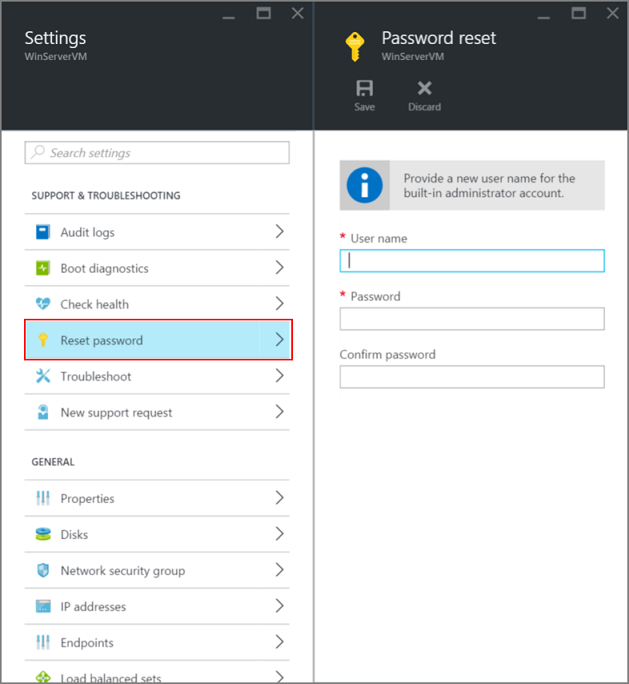

<properties
	pageTitle="Reset the password or Remote Desktop on a Windows VM | Microsoft Azure"
	description="Reset the administrator password or Remote Desktop services on a Windows VM created with the Resource Manager deployment model."
	services="virtual-machines-windows"
	documentationCenter=""
	authors="dsk-2015"
	manager="timlt"
	editor=""
	tags="azure-resource-manager"/>

<tags
	ms.service="virtual-machines-windows"
	ms.workload="infrastructure-services"
	ms.tgt_pltfrm="vm-windows"
	ms.devlang="na"
	ms.topic="article"
	ms.date="03/17/2016"
	ms.author="dkshir"/>

# How to reset the Remote Desktop service or its login password in a Windows-based Azure VM

[AZURE.INCLUDE [learn-about-deployment-models](../../includes/learn-about-deployment-models-both-include.md)].

If you can't connect to a Windows virtual machine because of a forgotten password or a problem with the Remote Desktop service configuration, this article describes how to reset the local administrator password or reset the Remote Desktop service configuration.

Depending on the deployment model of your virtual machine, you can either use the portal or the VM Access extension in Azure PowerShell. If you are using Azure PowerShell, make sure you have the latest Azure PowerShell module installed on your work computer and are signed in to your Azure subscription. For detailed steps, read [How to install and configure Azure PowerShell](../powershell-install-configure.md). 

> [AZURE.TIP] You can check the version of Azure PowerShell that you have installed with the `Get-Module azure | format-table version` command. 

## Windows VMs in classic deployment model

### Azure portal

For the virtual machines created using the classic deployment model, you can use the [Azure portal](https://portal.azure.com) to reset the Remote Desktop service. Click **Browse** > **Virtual machines (classic)** > *your Windows virtual machine* > **Reset Remote...**. The following page appears.

You can also try resetting the name and password of the local administrator account. Click **Browse** > **Virtual machines (classic)** > *your Windows virtual machine* > **All settings** > **Reset password**. The following page appears.

Click on **Save** after entering the new username and password. 

### VMAccess extension and PowerShell

Make sure the VM Agent is installed on the virtual machine. The VMAccess extension doesn't need to be installed before you can use it, as long as the VM Agent is available. Verify that the VM Agent is already installed by using the following command. Replace the "myCloudService" and "myVM" by the names of your cloud service and your VM respectively. You can find these out by running `Get-AzureVM` without any parameters. 

	$vm = Get-AzureVM -ServiceName "myCloudService" -Name "myVM"
	write-host $vm.VM.ProvisionGuestAgent

If the **write-host** command displays **True**, the VM Agent is installed. If it displays **False**, see the instructions and a link to the download in the [VM Agent and Extensions - Part 2](http://go.microsoft.com/fwlink/p/?linkid=403947&clcid=0x409) Azure blog post.

If you created the virtual machine with the portal, check whether `$vm.GetInstance().ProvisionGuestAgent` returns **True**. Else set it using this command:

	$vm.GetInstance().ProvisionGuestAgent = $true

This command will prevent the “Provision Guest Agent must be enabled on the VM object before setting IaaS VM Access Extension” error when running the **Set-AzureVMExtension** command in the following sections.

#### **Reset the local administrator account password**

Create a login credential with the current local administrator account name and a new password, and then run the `Set-AzureVMAccessExtension` as follows.

	$cred=Get-Credential
	Set-AzureVMAccessExtension –vm $vm -UserName $cred.GetNetworkCredential().Username -Password $cred.GetNetworkCredential().Password  | Update-AzureVM

If you type a different name than the current account, the VMAccess extension renames the local administrator account, assigns the password to that account, and issues a Remote Desktop log off. If the local administrator account is disabled, the VMAccess extension enables it.

These commands also reset the Remote Desktop service configuration.

#### **Reset the Remote Desktop service configuration**

To reset the Remote Desktop service configuration, run the following command.

	Set-AzureVMAccessExtension –vm $vm | Update-AzureVM

The VMAccess extension runs these two commands on the virtual machine:

a. `netsh advfirewall firewall set rule group="Remote Desktop" new enable=Yes`

This command enables the built-in Windows Firewall group that allows incoming Remote Desktop traffic, which uses TCP port 3389.

b. `Set-ItemProperty -Path 'HKLM:\System\CurrentControlSet\Control\Terminal Server' -name "fDenyTSConnections" -Value 0`

This command sets the fDenyTSConnections registry value to 0, enabling Remote Desktop connections.

## Windows VMs in Resource Manager deployment model

The Azure portal currently does not support resetting the remote access or login credentials for virtual machines created using the Resource Manager. 

### VMAccess extension and PowerShell

Make sure you have Azure PowerShell 1.0 or above installed and you have logged in to your account using the `Login-AzureRmAccount` cmdlet. 

#### **Reset the local administrator account password**

You can reset the admin password and/or username by using the [Set-AzureRmVMAccessExtension](https://msdn.microsoft.com/library/mt619447.aspx) PowerShell command.

Create your local admin account credentials by using the following command:

	$cred=Get-Credential

If you type a different name than the current account, the VMAccess extension command below will rename the local administrator account, assign the password to that account, and issue a Remote Desktop log off. If the local administrator account is disabled, the VMAccess extension will enable it.
	
Use the VM access extension to set the new credentials as follows:

	Set-AzureRmVMAccessExtension -ResourceGroupName "myRG" -VMName "myVM" -Name "myVMAccess" -Location Westus -UserName $cred.GetNetworkCredential().Username -Password $cred.GetNetworkCredential().Password

Replace `myRG`, `myVM`, `myVMAccess` and location with values relevant to your setup.

#### **Reset the Remote Desktop service configuration**

You can reset remote access to your VM, by using either [Set-AzureRmVMExtension](https://msdn.microsoft.com/library/mt603745.aspx) or Set-AzureRmVMAccessExtension as follows. Replace the `myRG`, `myVM`, `myVMAccess` and location with your own values.

	Set-AzureRmVMExtension -ResourceGroupName "myRG" -VMName "myVM" -Name "myVMAccess" -ExtensionType "VMAccessAgent" -Publisher "Microsoft.Compute" -typeHandlerVersion "2.0" -Location Westus

OR 

	Set-AzureRmVMAccessExtension -ResourceGroupName "myRG" -VMName "myVM" -Name "myVMAccess" -Location Westus

	
> [AZURE.TIP] Both the `Set-AzureRmVMAccessExtension` and `Set-AzureRmVMExtension` add a new named VM access agent to the virtual machine. At any point, a VM can only have a single VM access agent. To set the VM access agent properties successively, remove the access agent set previously by using either `Remove-AzureRmVMAccessExtension` or `Remove-AzureRmVMExtension`. Starting from Azure PowerShell version 1.2.2, you can avoid this step when using `Set-AzureRmVMExtension` with a `-ForceRerun` option. Make sure to use the same name for the VM access agent as set by the previous command when using the `-ForceRerun` option.

If you still cannot connect remotely to your virtual machine, see more steps to try at [Troubleshoot Remote Desktop connections to a Windows-based Azure virtual machine](virtual-machines-windows-troubleshoot-rdp-connection.md).

## Additional resources

[Azure VM extensions and features](virtual-machines-windows-extensions-features.md)

[Connect to an Azure virtual machine with RDP or SSH](http://msdn.microsoft.com/library/azure/dn535788.aspx)

[Troubleshoot Remote Desktop connections to a Windows-based Azure virtual machine](virtual-machines-windows-troubleshoot-rdp-connection.md)
