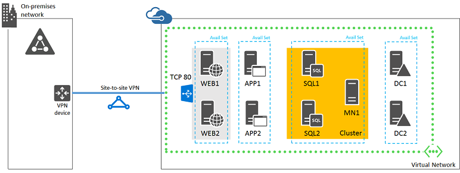

<properties
	pageTitle="Deploy a SharePoint Server 2013 farm | Microsoft Azure"
	description="Deploy a high-availability SharePoint Server 2013 farm using SQL Server AlwaysOn Availability Groups in Azure in five phases."
	documentationCenter=""
	services="virtual-machines-windows"
	authors="JoeDavies-MSFT"
	manager="timlt"
	editor=""
	tags="azure-resource-manager"/>

<tags
	ms.service="virtual-machines-windows"
	ms.workload="infrastructure-services"
	ms.tgt_pltfrm="Windows"
	ms.devlang="na"
	ms.topic="article"
	ms.date="04/25/2016"
	ms.author="josephd"/>

# Deploying SharePoint with SQL Server AlwaysOn Availability Groups in Azure

[AZURE.INCLUDE [learn-about-deployment-models](../../includes/learn-about-deployment-models-rm-include.md)] classic deployment model.

This topic contains links to the step-by-step instructions for deploying an intranet-only SharePoint 2013 farm with SQL Server AlwaysOn Availability Groups. The farm contains these computers:

- Two SharePoint web servers
- Two SharePoint application servers
- Two database servers
- One cluster majority node server
- Two domain controllers

This is the configuration, with placeholder names for each server.

Two machines for each role ensure high availability. All of the virtual machines are in a single region. Each group of virtual machines for a specific role is in its own availability set.

## Bill of materials

This baseline configuration requires the following set of Azure services and components:

- Nine virtual machines.
- Four extra data disks for the domain controllers and SQL servers.
- Four availability sets.
- One cross-premises virtual network.
- One storage account.
- One Azure subscription.

Here are the virtual machines and thier default sizes for this configuration.

Item | Virtual machine description | Gallery image | Default size
--- | --- | --- | ---
1. | First domain controller | Windows Server 2012 R2 Datacenter | A2
2. | Second domain controller | Windows Server 2012 R2 Datacenter | A2
3. | First database server | Microsoft SQL Server 2014 Enterprise – Windows Server 2012 R2 | A5
4. | Second database server | Microsoft SQL Server 2014 Enterprise – Windows Server 2012 R2 | A5
5. | Majority node for the cluster | Windows Server 2012 R2 Datacenter | A1
6. | First SharePoint application server | Microsoft SharePoint Server 2013 Trial – Windows Server 2012 R2 | A4
7. | Second SharePoint application server | Microsoft SharePoint Server 2013 Trial – Windows Server 2012 R2 | A4
8. | First SharePoint web server | Microsoft SharePoint Server 2013 Trial – Windows Server 2012 R2 | A4
9. | Second SharePoint web server | Microsoft SharePoint Server 2013 Trial – Windows Server 2012 R2 | A4

To compute the estimated costs for this configuration, see the [Azure pricing calculator](https://azure.microsoft.com/pricing/calculator/). 

1. In **Modules**, click **Compute**, and then click **Virtual Machines** enough times to create a list of nine virtual machines.
2. For each virtual machine, select:
	- Your intended region
	- **Windows** for the type
	- **Standard** for the pricing tier
	- The default size in the previous table or your intended size for the **Instance size**

> [AZURE.NOTE] The Azure Pricing Calculator does not include the additional costs for the SQL Server license for the two virtual machines running SQL Server 2014 Enterprise. See [Virtual Machines Pricing-SQL](https://azure.microsoft.com/pricing/details/virtual-machines/#Sql) for more information.

## Phases of deployment

You deploy this configuration in the following phases:

- [Phase 1: Configure Azure](virtual-machines-windows-ps-sp-intranet-ph1.md). Create a storage account, availability sets, and a cross-premises virtual network.
- [Phase 2: Configure domain controllers](virtual-machines-windows-ps-sp-intranet-ph2.md). Create and configure replica Active Directory Domain Services (AD DS) domain controllers.
- [Phase 3: Configure SQL Server infrastructure](virtual-machines-windows-ps-sp-intranet-ph3.md). Create and configure the SQL Server virtual machines, prepare them for use with SharePoint, and create the cluster.
- [Phase 4: Configure SharePoint servers](virtual-machines-windows-ps-sp-intranet-ph4.md). Create and configure the four SharePoint virtual machines.
- [Phase 5: Create the availability group and add the SharePoint databases](virtual-machines-windows-ps-sp-intranet-ph5.md). Prepare databases and create a SQL Server AlwaysOn availability group.

This deployment of SharePoint with SQL Server AlwaysOn is designed to accompany the [SharePoint with SQL Server AlwaysOn infographic](http://go.microsoft.com/fwlink/?LinkId=394788) and incorporate the latest recommendations.

This configuration is a prescriptive, phase-by-phase guide for a predefined architecture to create a functional, highly available intranet SharePoint farm in Azure infrastructure services. For additional architectural guidance on implementing SharePoint 2013 in Azure, see [Microsoft Azure architectures for SharePoint 2013](https://technet.microsoft.com/library/dn635309.aspx).

Keep the following in mind:

- If you are an experienced SharePoint implementer, please feel free to adapt the instructions in phases 3 through 5 and build the farm that best suits your needs.
- If you already have an existing Azure hybrid cloud deployment, feel free to adapt or skip the instructions in phases 1 and 2 to host the new SharePoint farm on the appropriate subnet.
- All of the servers are located on a single subnet in the Azure virtual network. If you want to provide additional security equivalent to subnet isolation, you can use [network security groups](../virtual-network/virtual-networks-nsg.md).

To build a dev/test environment or a proof-of-concept of this configuration, see [Set up a SharePoint intranet farm in a hybrid cloud for testing](virtual-machines-windows-ps-hybrid-cloud-test-env-sp.md).

For additional information about SharePoint with SQL Server AlwaysOn Availability Groups, see [Configure SQL Server 2012 AlwaysOn Availability Groups for SharePoint 2013](https://technet.microsoft.com/library/jj715261.aspx).

## Next step

- Start the configuration of this workload with [Phase 1](virtual-machines-windows-ps-sp-intranet-ph1.md).

