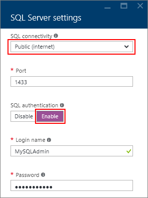

<properties
	pageTitle="Connect to a SQL Server Virtual Machine (Resource Manager) | Microsoft Azure"
	description="Learn how to connect to SQL Server running on a Virtual Machine in Azure. This topic uses the classic deployment model. The scenarios differ depending on the networking configuration and the location of the client."
	services="virtual-machines-windows"
	documentationCenter="na"
	authors="rothja"
	manager="jhubbard"    
	tags="azure-resource-manager"/>
<tags
	ms.service="virtual-machines-windows"
	ms.devlang="na"
	ms.topic="article"
	ms.tgt_pltfrm="vm-windows-sql-server"
	ms.workload="infrastructure-services"
	ms.date="06/23/2016"
	ms.author="jroth" />

# Connect to a SQL Server Virtual Machine on Azure (Resource Manager)

> [AZURE.SELECTOR]
- [Resource Manager](virtual-machines-windows-sql-connect.md)
- [Classic](virtual-machines-windows-classic-sql-connect.md)

## Overview

This topic describes how to connect to your SQL Server instance running on an Azure virtual machine. It covers some [general connectivity scenarios](#connection-scenarios) and then provides [detailed steps for configuring SQL Server connectivity in an Azure VM](#steps-for-manually-configuring-sql-server-connectivity-in-an-azure-vm).

[AZURE.INCLUDE [learn-about-deployment-models](../../includes/learn-about-deployment-models-rm-include.md)] classic deployment model. To view the classic version of this article, see [Connect to a SQL Server Virtual Machine on Azure Classic](virtual-machines-windows-classic-sql-connect.md).

If you would rather have a full walk-through of both provisioning and connectivity, see [Provisioning a SQL Server Virtual Machine on Azure](virtual-machines-windows-portal-sql-server-provision.md).

## Connection scenarios

The way a client connects to SQL Server running on a Virtual Machine differs depending on the location of the client and the machine/networking configuration. These scenarios include:

- [Connect to SQL Server over the internet](#connect-to-sql-server-over-the-internet)
- [Connect to SQL Server in the same virtual network](#connect-to-sql-server-in-the-same-virtual-network)

### Connect to SQL Server over the Internet

If you want to connect to your SQL Server database engine from the Internet, there are several steps required, such as configuring the firewall, enabling SQL Authentication, and configuring your network security group you must have a Network Security Group rule to allow TCP traffic on port 1433.

If you use the portal to provision a SQL Server virtual machine image with the resource manager, these steps are done for you when you select **Public** for the SQL connectivity option:

If this was not one during provisioning, then you can manually configure SQL Server and your virtual machines by following the [steps in this article to manually configure connectivity](#steps-for-manually-configuring-sql-server-connectivity-in-an-azure-vm).

Once this is done, any client with internet access can connect to the SQL Server instance by specifying either the public IP address of the virtual machine or the DNS label assigned to that IP address. If the SQL Server port is 1433, you do not need to specify it in the connection string.

	"Server=sqlvmlabel.eastus.cloudapp.azure.com;Integrated Security=false;User ID=<login_name>;Password=<your_password>"

Although this enables connectivity for clients over the internet, this does not imply that anyone can connect to your SQL Server. Outside clients have to the correct username and password. For additional security, you can avoid the well-known port 1433. For example, if you configured SQL Server to listen on port 1500 and established proper firewall and network security group rules, you could connect by appending the port number to the Server name as in the following example:

	"Server=sqlvmlabel.eastus.cloudapp.azure.com,1500;Integrated Security=false;User ID=<login_name>;Password=<your_password>"

>[AZURE.NOTE] It is important to note that when you use this technique to communicate with SQL Server, all outgoing data from the Azure datacenter is subject to normal [pricing on outbound data transfers](https://azure.microsoft.com/pricing/details/data-transfers/).

### Connect to SQL Server in the same virtual network

[Virtual Network](../virtual-network/virtual-networks-overview.md) enables additional scenarios. You can connect VMs in the same virtual network, even if those VMs exist in different resource groups. And with a [site-to-site VPN](../vpn-gateway/vpn-gateway-site-to-site-create.md), you can create a hybrid architecture that connects VMs with on-premises networks and machines.

Virtual networks also enables you to join your Azure VMs to a domain. This is the only way to use Windows Authentication to SQL Server. The other connection scenarios require SQL Authentication with user names and passwords.

If you use the portal to provision a SQL Server virtual machine image with the resource manager, the proper firewall rules for communication on the virtual network are setup when you select **Private** for the SQL connectivity option. If this was not one during provisioning, then you can manually configure SQL Server and your virtual machines by following the [steps in this article to manually configure connectivity](#steps-for-manually-configuring-sql-server-connectivity-in-an-azure-vm). But if you are planning to configure a domain environment and Windows Authentication, you do not need to use the steps in this article to configure SQL Authentication and logins. You also do not need to configure Network Security Group rules for access over the internet.

Assuming that you have configured DNS in your virtual network, you can connect to your SQL Server instance by specifying the SQL Server VM computer name in the connection string. The following example also assumes that Windows Authentication has also been configured and that the user has been granted access to the SQL Server instance.

	"Server=mysqlvm;Integrated Security=true"

Note that in this scenario, you could also specify the IP address of the VM.

## Steps for manually configuring SQL Server connectivity in an Azure VM

The following steps demonstrate how to manually setup connectivity to the SQL Server instance and then optionally connect over the internet using SQL Server Management Studio (SSMS). Note that many of these steps are done for you when you select the appropriate SQL Server connectivity options in the portal.

Before you can connect to the instance of SQL Server from another VM or the internet, you must complete the following tasks as described in the sections that follow:

- [Open TCP ports in the Windows firewall](#open-tcp-ports-in-the-windows-firewall-for-the-default-instance-of-the-database-engine)
- [Configure SQL Server to listen on the TCP protocol](#configure-sql-server-to-listen-on-the-tcp-protocol)
- [Configure SQL Server for mixed mode authentication](#configure-sql-server-for-mixed-mode-authentication)
- [Create SQL Server authentication logins](#create-sql-server-authentication-logins)
- [Configure a DNS Label for the public IP address](#configure-a-dns-label-for-the-public-ip-address)
- [Connect to the Database Engine from another computer](#connect-to-the-database-engine-from-another-computer)

[AZURE.INCLUDE [Connect to SQL Server in a VM](../../includes/virtual-machines-sql-server-connection-steps.md)]

[AZURE.INCLUDE [Connect to SQL Server in a VM Resource Manager](../../includes/virtual-machines-sql-server-connection-steps-resource-manager-nsg-rule.md)]

[AZURE.INCLUDE [Connect to SQL Server in a VM Resource Manager](../../includes/virtual-machines-sql-server-connection-steps-resource-manager.md)]

## Next Steps

To see provisioning instructions along with these connectivity steps, see [Provisioning a SQL Server Virtual Machine on Azure](virtual-machines-windows-portal-sql-server-provision.md).

[Explore the Learning Path](https://azure.microsoft.com/documentation/learning-paths/sql-azure-vm/) for SQL Server on Azure virtual machines.

For other topics related to running SQL Server in Azure VMs, see [SQL Server on Azure Virtual Machines](virtual-machines-windows-sql-server-iaas-overview.md).
