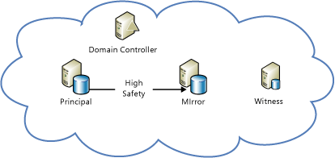
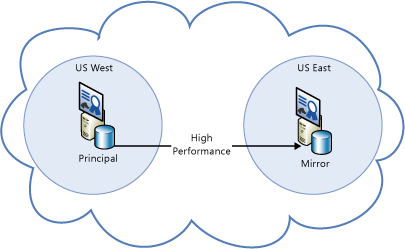
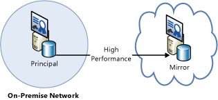
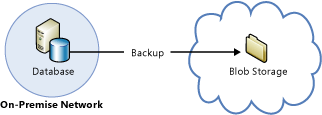

<properties
	pageTitle="High Availability and Disaster Recovery for SQL Server | Microsoft Azure"
	description="A discussion of the various types of HADR strategies for SQL Server running in Azure Virtual Machines."
	services="virtual-machines-windows"
	documentationCenter="na"
	authors="MikeRayMSFT"
	manager="jhubbard"
	editor=""
	tags="azure-service-management"/>
<tags
	ms.service="virtual-machines-windows"
	ms.devlang="na"
	ms.topic="article"
	ms.tgt_pltfrm="vm-windows-sql-server"
	ms.workload="infrastructure-services"
	ms.date="07/12/2016"
	ms.author="MikeRayMSFT" />

# High availability and disaster recovery for SQL Server in Azure Virtual Machines

## Overview

Microsoft Azure virtual machines (VMs) with SQL Server can help lower the cost of a high availability and disaster recovery (HADR) database solution. Most SQL Server HADR solutions are supported in Azure virtual machines, both as Azure-only and as hybrid solutions. In an Azure-only solution, the entire HADR system runs in Azure. In a hybrid configuration, part of the solution runs in Azure and the other part runs on-premises in your organization. The flexibility of the Azure environment enables you to move partially or completely to Azure to satisfy the budget and HADR requirements of your SQL Server database systems.

[AZURE.INCLUDE [learn-about-deployment-models](../../includes/learn-about-deployment-models-both-include.md)]

## Understanding the need for an HADR solution

It is up to you to ensure that your database system possesses the HADR capabilities that the service-level agreement (SLA) requires. The fact that Azure provides high availability mechanisms, such as service healing for cloud services and failure recovery detection for the Virtual Machines, does not itself guarantee you can meet the desired SLA.  These mechanisms protect the high availability of the VMs but not the high availability of SQL Server running inside the VMs. It is possible for the SQL Server instance to fail while the VM is online and healthy. Moreover, even the high availability mechanisms provided by Azure allow for  downtime of the VMs due to events such as recovery from software or hardware failures and operating system upgrades.

In addition, Geo Redundant Storage (GRS) in Azure, which is implemented with a feature called geo-replication, may not be an adequate disaster recovery solution for your databases. Because geo-replication sends data asynchronously, recent updates can be lost in the event of disaster.  More information regarding geo-replication limitations are covered in the [Geo-replication not supported for data and log files on separate disks](#geo-replication-support) section.

## HADR deployment architectures

SQL Server HADR technologies that are supported in Azure include:

- [Always On Availability Groups](https://technet.microsoft.com/library/hh510230.aspx)
- [Database Mirroring](https://technet.microsoft.com/library/ms189852.aspx)
- [Log Shipping](https://technet.microsoft.com/library/ms187103.aspx)
- [Backup and Restore with Azure Blob Storage Service](https://msdn.microsoft.com/library/jj919148.aspx)
- [Always On Failover Cluster Instances](https://technet.microsoft.com/library/ms189134.aspx)

It is possible to combine the technologies together to implement a SQL Server solution that has both high availability and disaster recovery capabilities.  Depending on the technology you use, a hybrid deployment may require a VPN tunnel with the Azure virtual network. The sections below show you some of the example deployment architectures.

## Azure-only: High availability solutions

You can have a high availability solution for your SQL Server databases in Azure using Always On Availability Groups or database mirroring.

|Technology|Example Architectures|
|---|---|
|**Always On Availability Groups**|All availability replicas running in Azure VMs for high availability within the same region. You need to configure a domain controller VM, because Windows Server Failover Clustering (WSFC) requires an Active Directory domain.   For more information, see [Configure Always On Availability Groups in Azure (GUI)](virtual-machines-windows-classic-portal-sql-alwayson-availability-groups.md).|**Database Mirroring**|Principal, mirror, and witness servers all running in the same Azure datacenter for high availability. You can deploy using a domain controller.  You can also deploy the same database mirroring configuration without a domain controller by using server certificates instead. |
|**Always On Failover Cluster Instances**|Failover Cluster Instances (FCI), which require shared storage, can be created in 2 different ways.  1. An FCI on a two-node WSFC running in Azure VMs with storage supported by a third-party clustering solution. For a specific example that uses SIOS DataKeeper, see [High availability for a file share using WSFC and 3rd party software SIOS Datakeeper](https://azure.microsoft.com/blog/high-availability-for-a-file-share-using-wsfc-ilb-and-3rd-party-software-sios-datakeeper/).  2. An FCI on a two-node WSFC running in Azure VMs with remote iSCSI Target shared block storage via ExpressRoute. For example, NetApp Private Storage (NPS) exposes an iSCSI target via ExpressRoute with Equinix to Azure VMs.  For third-party shared storage and data replication solutions, you should contact the vendor for any issues related to accessing data on failover.  Note that using FCI on top of [Azure File storage](https://azure.microsoft.com/services/storage/files/) is not supported yet, because this solution does not utilize Premium Storage. We are working to support this soon.|

## Azure-only: Disaster recovery solutions

You can have a disaster recovery solution for your SQL Server databases in Azure using Always On Availability Groups, database mirroring, or backup and restore with storage blobs.

|Technology|Example Architectures|
|---|---|
|**Always On Availability Groups**|Availability replicas running across multiple datacenters in Azure VMs for disaster recovery.  This cross-region solution protects against complete site outage.    Within a region, all replicas should be within the same cloud service and the same VNet. Because each region will have a separate VNet, these solutions require VNet to VNet connectivity. For more information, see [Configure a Site-to-Site VPN in the Azure classic portal](../vpn-gateway/vpn-gateway-site-to-site-create.md).|
|**Database Mirroring**|Principal and mirror and servers running in different  datacenters for disaster recovery. You must deploy using server certificates because an active directory domain cannot span multiple  datacenters. |
|**Backup and Restore with Azure Blob Storage Service**|Production databases backed up directly to blob storage in a different  datacenter for disaster recovery.  For more information, see [Backup and Restore  for SQL Server in Azure Virtual Machines](virtual-machines-windows-sql-backup-recovery.md).|

## Hybrid IT: Disaster recovery solutions

You can have a disaster recovery solution for your SQL Server databases in a hybrid-IT environment using Always On Availability Groups, database mirroring, log shipping, and backup and restore with Azure blog storage.

|Technology|Example Architectures|
|---|---|
|**Always On Availability Groups**|Some availability replicas running in Azure VMs and other replicas running on-premises for cross-site disaster recovery. The production site can be either on-premises or in an Azure datacenter.  Because all availability replicas must be in the same WSFC cluster, the WSFC cluster must span both networks (a multi-subnet WSFC cluster). This configuration requires a VPN connection between Azure and the on-premises network.  For successful disaster recovery of your databases, you should also install a replica domain controller at the disaster recovery site.  It is possible to use the Add Replica Wizard in SSMS to add an Azure replica to an existing Always On Availability Group. For more information, see Tutorial: Extend your Always On Availability Group to Azure.|
|**Database Mirroring**|One partner running in an Azure VM and the other running on-premises for cross-site disaster recovery using server certificates. Partners do not need to be in the same Active Directory domain, and no VPN connection is required.  Another database mirroring sceanario involves one partner running in an Azure VM and the other running on-premises in the same Active Directory domain for cross-site disaster recovery. A [VPN connection between the Azure virtual network and the on-premises network](../vpn-gateway/vpn-gateway-site-to-site-create.md) is required.  For successful disaster recovery of your databases, you should also install a replica domain controller at the disaster recovery site.|
|**Log Shipping**|One server running in an Azure VM and the other running on-premises for cross-site disaster recovery. Log shipping depends on Windows file sharing, so a VPN connection between the Azure virtual network and the on-premises network is required.  For successful disaster recovery of your databases, you should also install a replica domain controller at the disaster recovery site.|
|**Backup and Restore with Azure Blob Storage Service**|On-premises production databases backed up directly to Azure blob storage for disaster recovery.  For more information, see [Backup and Restore  for SQL Server in Azure Virtual Machines](virtual-machines-windows-sql-backup-recovery.md).|

## Important considerations for SQL Server HADR in Azure

Azure VMs, storage, and networking have different operational characteristics than an on-premises, non-virtualized IT infrastructure. A successful implementation of a HADR SQL Server solution in Azure requires that you understand these differences and design your solution to accommodate them.

### High availability nodes in an availability set

Availability sets in Azure enable you to place the high availability nodes into separate Fault Domains (FDs) and Update Domains (UDs). For Azure VMs to be placed in the same availability set, you must deploy them in the same cloud service. Only nodes in the same cloud service can participate in the same availability set. For more information, see [Manage the Availability of Virtual Machines](virtual-machines-windows-manage-availability.md).

### WSFC cluster behavior in Azure networking

The non-RFC-compliant DHCP service in Azure can cause the creation of certain WSFC cluster configurations to fail, due to the cluster network name being assigned a duplicate IP address, such as the same IP address as one of the cluster nodes. This is an issue when you implement Always On Availability Groups, which depends on the WSFC feature.

Consider the scenario when a two-node cluster is created and brought online:

1. The cluster comes online, then NODE1 requests a dynamically assigned IP address for the cluster network name.

1. No IP address other than NODE1’s own IP address is given by the DHCP service, since the DHCP service recognizes that the request comes from NODE1 itself.

1. Windows detects that a duplicate address is assigned both to NODE1 and to the cluster network name, and the default cluster group fails to come online.

1. The default cluster group moves to NODE2, which treats NODE1’s IP address as the cluster IP address and brings the default cluster group online.

1. When NODE2 attempts to establish connectivity with NODE1, packets directed at NODE1 never leave NODE2 because it resolves NODE1’s IP address to itself. NODE2 cannot establish connectivity with NODE1, then loses quorum and shuts down the cluster.

1. In the meantime, NODE1 can send packets to NODE2, but NODE2 cannot reply. NODE1 loses quorum and shuts down the cluster.

This scenario can be avoided by assigning an unused static IP address, such as a link-local IP address like 169.254.1.1, to the cluster network name in order to bring the cluster network name online. To simplify this process, see [Configuring Windows Failover Cluster in Azure for Always On Availability Groups](http://social.technet.microsoft.com/wiki/contents/articles/14776.configuring-windows-failover-cluster-in-windows-azure-for-alwayson-availability-groups.aspx).

For more information, see [Configure Always On Availability Groups in Azure (GUI)](virtual-machines-windows-classic-portal-sql-alwayson-availability-groups.md).

### Availability group listener support

Availability group listeners are supported on Azure VMs running Windows Server 2008 R2, Windows Server 2012, and Windows Server 2012 R2. This support is made possible by the use of load-balanced endpoints enabled on the Azure VMs that are availability group nodes. You must follow special configuration steps for the listeners to work for both client applications that are running in Azure as well as those running on-premises.

There are two main options for setting up your listener: external (public) or internal. The external (public) listener is associated with a public Virtual IP (VIP) that is accessible over the internet. With an external listener, you must enable Direct Server Return, which means that you must connect to the listener from a machine that is not in the same cloud service as the Always On Availability Group nodes. The other option is an internal listener that uses the Internal Load Balancer (ILB). An internal listener only support clients within the same Virtual Network.

If the Availability Group spans multiple Azure subnets (such as a deployment that crosses Azure regions), the client connection string must include "**MultisubnetFailover=True**". This results in parallel connection attempts to the replicas in the different subnets. For instructions on setting up a listener, see

- [Configure an ILB listener for Always On Availability Groups in Azure](virtual-machines-windows-classic-ps-sql-int-listener.md).
- [Configure an external listener for Always On Availability Groups in Azure](virtual-machines-windows-classic-ps-sql-ext-listener.md).

You can still connect to each availability replica separately by connecting directly to the service instance. Also, since Always On Availability Groups are backward compatible with database mirroring clients, you can connect to the availability replicas like database mirroring partners as long as the replicas are configured similar to database mirroring:

- One primary replica and one secondary replica

- The secondary replica is configured as non-readable (**Readable Secondary** option set to **No**)

An example client connection string that corresponds to this database mirroring-like configuration using ADO.NET or SQL Server Native Client is below:

	Data Source=ReplicaServer1;Failover Partner=ReplicaServer2;Initial Catalog=AvailabilityDatabase;

For more information on client connectivity, see:

- [Using Connection String Keywords with SQL Server Native Client](https://msdn.microsoft.com/library/ms130822.aspx)
- [Connect Clients to a Database Mirroring Session (SQL Server)](https://technet.microsoft.com/library/ms175484.aspx)
- [Connecting to Availability Group Listener in Hybrid IT](http://blogs.msdn.com/b/sqlalwayson/archive/2013/02/14/connecting-to-availability-group-listener-in-hybrid-it.aspx)
- [Availability Group Listeners, Client Connectivity, and Application Failover (SQL Server)](https://technet.microsoft.com/library/hh213417.aspx)
- [Using Database-Mirroring Connection Strings with Availability Groups](https://technet.microsoft.com/library/hh213417.aspx)

### Network latency in hybrid IT

You should deploy your HADR solution with the assumption that there may be periods of time with high network latency between your on-premises network and Azure. When deploying replicas to Azure, you should use asynchronous commit instead of synchronous commit for the synchronization mode. When deploying database mirroring servers both on-premises and in Azure, use the high performance mode instead of the high safety mode.

### Geo-replication support

Geo-replication in Azure disks does not support the data file and log file of the same database to be stored on separate disks. GRS replicates changes on each disk independently and asynchronously. This mechanism guarantees the write order within a single disk on the geo-replicated copy, but not across geo-replicated copies of multiple disks. If you configure a database to store its data file and its log file on separate disks, the recovered disks after a disaster may contain a more up-to-date copy of the data file than the log file, which breaks the write-ahead log in SQL Server and the ACID properties of transactions. If you do not have the option to disable geo-replication on the storage account, you should keep all data and log files for a given database on the same disk. If you must use more than one disk due to the size of the database, you need to deploy one of the disaster recovery solutions listed above to ensure data redundancy.

## Next steps

If you need to create an Azure virtual machine with SQL Server, see [Provisioning a SQL Server Virtual Machine on Azure](virtual-machines-windows-portal-sql-server-provision.md).

To get the best performance from SQL Server running on an Azure VM, see the guidance in [Performance Best Practices for SQL Server in Azure Virtual Machines](virtual-machines-windows-sql-performance.md).

For other topics related to running SQL Server in Azure VMs, see [SQL Server on Azure Virtual Machines](virtual-machines-windows-sql-server-iaas-overview.md).

### Other resources

- [Install a new Active Directory forest in Azure](../active-directory/active-directory-new-forest-virtual-machine.md)
- [Create WSFC Cluster for Always On Availability Groups in Azure VM](http://gallery.technet.microsoft.com/scriptcenter/Create-WSFC-Cluster-for-7c207d3a)
