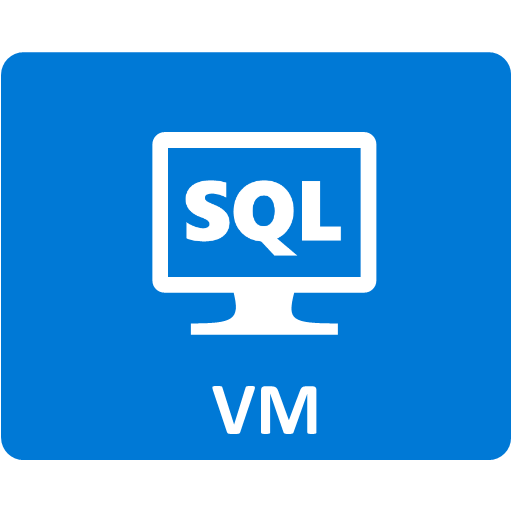
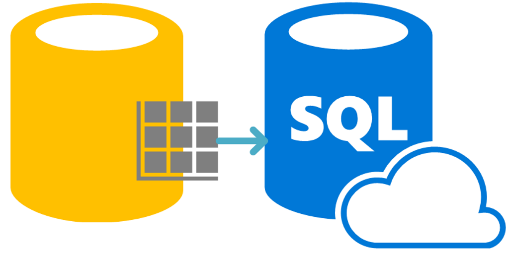

<properties
	pageTitle="Overview of SQL Server on Virtual Machines | Microsoft Azure"
	description="Get started with running SQL Server databases in the Cloud on Azure Virtual Machines. This Infrastructure-as-a-Service (IaaS) model enables you to run SQL Server workload in Azure."
	services="virtual-machines-windows"
	documentationCenter=""
	authors="rothja"
	manager="jhubbard"
	editor=""
	tags="azure-service-management"/>

<tags
	ms.service="virtual-machines-windows"
	ms.devlang="na"
	ms.topic="article"
	ms.tgt_pltfrm="vm-windows-sql-server"
	ms.workload="infrastructure-services"
	ms.date="05/18/2016"
	ms.author="jroth"/>

# SQL Server on Azure Virtual Machines overview

[SQL Server running on Azure Virtual Machines](https://azure.microsoft.com/services/virtual-machines/sql-server/) enables you host your SQL Server databases in the Cloud. For example, you can migrate an on-premises database to an Azure VM preconfigured with Windows Server 2012 R2 and SQL Server 2014 Enterprise edition. But there are many other possible scenarios, such as multi-machine configurations that support high availability or hybrid architectures with connectivity to on-premises networks.

For a great overview, watch the following video:

> [AZURE.VIDEO data-driven-sql-server-2016-azure-vm-is-the-best-platform-for-sql-server-2016]

## SQL offerings

Running SQL Server on an Azure VM is one option for storing relational data in Azure. The following table summarizes the different offerings.

|&nbsp;&nbsp;&nbsp;&nbsp;&nbsp;&nbsp;&nbsp;&nbsp;&nbsp;&nbsp;&nbsp;&nbsp;&nbsp;&nbsp;&nbsp;&nbsp;&nbsp;&nbsp;&nbsp;&nbsp;| SQL offering | Description |
|---:|---|---|
||[SQL Server on Azure Virtual Machines](https://azure.microsoft.com/services/virtual-machines/sql-server/)|Run SQL Server on Azure Virtual Machines. Directly manage the virtual machine and run your database on retail versions of SQL Server. |
||[SQL Database](https://azure.microsoft.com/services/sql-database/)|Use the SQL Database service to access and scale your database without having to manage the underlying infrastructure.|
||[SQL Data Warehouse](https://azure.microsoft.com/en-us/services/sql-data-warehouse/)|Use Azure SQL Data Warehouse to process large amounts of relational and non-relational data. Provides scalable data warehousing capabilities as a service.|
||[SQL Server Stretch Database](https://azure.microsoft.com/en-us/services/sql-server-stretch-database/)|Dynamically stretch on-premises transactional data from Microsoft SQL Server 2016 to Azure.|

>[AZURE.NOTE] For a detailed comparison between SQL VMs and SQL Database, see [Choose a cloud SQL Server option: Azure SQL (PaaS) Database or SQL Server on Azure VMs (IaaS)](../sql-database/data-management-azure-sql-database-and-sql-server-iaas.md).

## Deploy a SQL Server VM

To create a SQL Server virtual machine in Azure, you must first obtain an Azure Platform subscription. You can purchase an Azure subscription at [Purchase Options](https://azure.microsoft.com/pricing/purchase-options/). To try it free, visit [Azure free trial](https://azure.microsoft.com/pricing/free-trial/).

After signing up for a subscription, the easiest way to deploy a SQL Server virtual machine in Azure is to [provision a SQL Server machine gallery image in the Azure](virtual-machines-windows-portal-sql-server-provision.md). Those images include licensing of SQL Server in the pricing for the VM.

It is important to note that there are two models for creating and managing Azure virtual machines: classic and Resource Manager. Microsoft recommends that most new deployments use the Resource Manager model. For more information, see [Understanding Resource Manager deployment and classic deployment](../resource-manager-deployment-model.md). Each topic should clearly state its targeted model, unless it applies to both classic and Resource Manager, such as this article.

## Choose a SQL VM image
The following table provides a matrix of available SQL Server images in the virtual machine gallery. Click on any of the links in the table to create a VM for that version, edition, and operating system.

|SQL Server version|Operating system|SQL Server edition|
|---|---|---|
|**SQL Server 2016 RC**|Windows Server 2012 R2|[Evaluation](https://azure.microsoft.com/marketplace/partners/microsoft/sqlserver2016rc3evaluationwindowsserver2012r2/)|
|**SQL Server 2014 SP1**|Windows Server 2012 R2|[Enterprise](https://azure.microsoft.com//marketplace/partners/microsoft/sqlserver2014sp1enterprisewindowsserver2012r2/), [Standard](https://azure.microsoft.com//marketplace/partners/microsoft/sqlserver2014sp1standardwindowsserver2012r2/), [Web](https://azure.microsoft.com//marketplace/partners/microsoft/sqlserver2014sp1webwindowsserver2012r2/), [Express](https://azure.microsoft.com//marketplace/partners/microsoft/sqlserver2014sp1expresswindowsserver2012r2/)|
|**SQL Server 2014**|Windows Server 2012 R2|[Enterprise](https://azure.microsoft.com//marketplace/partners/microsoft/sqlserver2014enterprisewindowsserver2012r2/), [Standard](https://azure.microsoft.com//marketplace/partners/microsoft/sqlserver2014standardwindowsserver2012r2/), [Web](https://azure.microsoft.com//marketplace/partners/microsoft/sqlserver2014webwindowsserver2012r2/)|
|**SQL Server 2012 SP2**|Windows Server 2012 R2|[Enterprise](https://azure.microsoft.com//marketplace/partners/microsoft/sqlserver2012sp2enterprisewindowsserver2012r2/), [Standard](https://azure.microsoft.com//marketplace/partners/microsoft/sqlserver2012sp2standardwindowsserver2012r2/), [Web](https://azure.microsoft.com//marketplace/partners/microsoft/sqlserver2012sp2webwindowsserver2012r2/)|
|**SQL Server 2012 SP2**|Windows Server 2012|[Enterprise](https://azure.microsoft.com//marketplace/partners/microsoft/sqlserver2012sp2enterprisewindowsserver2012/), [Standard](https://azure.microsoft.com//marketplace/partners/microsoft/sqlserver2012sp2standardwindowsserver2012/), [Web](https://azure.microsoft.com//marketplace/partners/microsoft/sqlserver2012sp2webwindowsserver2012/), [Express](https://azure.microsoft.com//marketplace/partners/microsoft/sqlserver2012sp2expresswindowsserver2012/)|
|**SQL Server 2008 R2 SP3**|Windows Server 2008 R2|[Enterprise](https://azure.microsoft.com//marketplace/partners/microsoft/sqlserver2008r2sp3enterprisewindowsserver2008r2/), [Standard](https://azure.microsoft.com//marketplace/partners/microsoft/sqlserver2008r2sp3standardwindowsserver2008r2/), [Web](https://azure.microsoft.com//marketplace/partners/microsoft/sqlserver2008r2sp3webwindowsserver2008r2/)|
|**SQL Server 2008 R2 SP3**|Windows Server 2012|[Express](https://azure.microsoft.com//marketplace/partners/microsoft/sqlserver2008r2sp3expresswindowsserver2012/)|

>[AZURE.NOTE] The Customer Experience Improvement Program (CEIP) is enabled by default. If necessary, you can customize or disable the CEIP after provisioning the virtual machine. Connect to the VM with remote desktop, and run the **SQL Server Error and Usage Reporting** utility.

In addition to these preconfigured images, you can also [create an Azure virtual machine](virtual-machines-windows-hero-tutorial.md) without SQL Server pre-installed. You can install any instance of SQL Server for which you have a license. You migrate your license to Azure for running SQL Server in an Azure Virtual Machine using [License Mobility through Software Assurance on Azure](https://azure.microsoft.com/pricing/license-mobility/). In this scenario, you only pay for Azure compute and storage [costs](https://azure.microsoft.com/pricing/details/virtual-machines/) associated with the virtual machine.

In order to determine the best virtual machine configuration settings for your SQL Server image, review the [Performance best practices for SQL Server in Azure Virtual Machines](virtual-machines-windows-sql-performance.md). For production workloads, **DS3** is the minimum recommended virtual machine size for SQL Server Enterprise edition, and **DS2** is the minimum recommended virtual machine size for Standard edition.

## Migrate your data

After your SQL Server virtual machine is up and running, you might want to migrate existing databases to the machine. For a list of migration options and guidance, see [Migrating a Database to SQL Server on an Azure VM](virtual-machines-windows-migrate-sql.md).

## High availability

If you require high availability, consider configuring SQL Server Availability Groups. This involves multiple Azure VMs in a virtual network. The Azure portal has a template that sets up this configuration for you. For more information, see [Configure an AlwaysOn availability group in Azure Resource Manager virtual machines](virtual-machines-windows-portal-sql-alwayson-availability-groups.md).

If you want to manually configure your Availability Group and associated listener, see [Configure AlwaysOn Availability Groups in Azure VM](virtual-machines-windows-portal-sql-alwayson-availability-groups-manual.md).

For other high availability considerations, see [High Availability and Disaster Recovery for SQL Server in Azure Virtual Machines](virtual-machines-windows-sql-high-availability-dr.md).

## Backup and restore
For on-premises databases, Azure can act as a secondary data center to store SQL Server backup files. For an overview of backup and restore options, see [Backup and Restore for SQL Server in Azure Virtual Machines](virtual-machines-windows-sql-backup-recovery.md).

[SQL Server Backup to URL](https://msdn.microsoft.com/library/dn435916.aspx) stores Azure backup files in Azure blob storage. [SQL Server Managed Backup](https://msdn.microsoft.com/library/dn449496.aspx) allows you to schedule backup and retention in Azure. These services can be used with either on-premises SQL Server instances or SQL Server running on Azure VMs. Azure VMs can also take advantage of [Automated Backup](virtual-machines-windows-classic-sql-automated-backup.md) and [Automated Patching](virtual-machines-windows-classic-sql-automated-patching.md) for SQL Server.

## Next steps

First, [create your own SQL Server VM in the Azure Portal](virtual-machines-windows-portal-sql-server-provision.md).

Then review [performance best practices](virtual-machines-windows-sql-performance.md) and [migration techniques](virtual-machines-windows-migrate-sql.md) as you consider moving your SQL Server workloads to Azure VMs.

If you have more questions about SQL Server on Azure virtual machines, see the [SQL Server on Azure Virtual Machines FAQ](virtual-machines-windows-sql-server-iaas-faq.md). Or add your comments to the bottom of any of the SQL VM topics to interact with Microsoft and the community.
