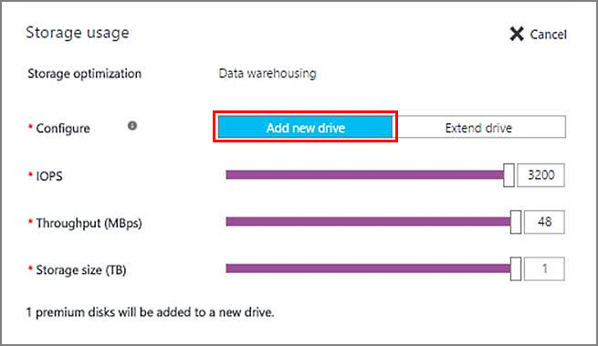

<properties
	pageTitle="Storage configuration for SQL Server VMs | Microsoft Azure"
	description="This topic describes how Azure configures storage for SQL Server VMs during provisioning (Resource Manager deployment model). It also explains how you can configure storage for your existing SQL Server VMs."
	services="virtual-machines-windows"
	documentationCenter="na"
	authors="ninarn"
	manager="jhubbard"    
	tags="azure-resource-manager"/>
<tags
	ms.service="virtual-machines-windows"
	ms.devlang="na"
	ms.topic="article"
	ms.tgt_pltfrm="vm-windows-sql-server"
	ms.workload="infrastructure-services"
	ms.date="08/03/2016"
	ms.author="ninarn" />

# Storage configuration for SQL Server VMs

When you configure a SQL Server virtual machine image in Azure, the Portal helps to automate your storage configuration. This includes attaching storage to the VM, making that storage accessible to SQL Server, and configuring it to optimize for your specific performance requirements.

This topic explains how Azure configures storage for your SQL Server VMs both during provisioning and for existing VMs. This configuration is based on the [performance best practices](virtual-machines-windows-sql-performance.md) for Azure VMs running SQL Server.

[AZURE.INCLUDE [learn-about-deployment-models](../../includes/learn-about-deployment-models-rm-include.md)] classic deployment model.

## Prerequisites
To use the automated storage configuration settings, your virtual machine requires the following characteristics:

- Provisioned with a [SQL Server gallery image](virtual-machines-windows-sql-server-iaas-overview.md#option-1-deploy-a-sql-vm-per-minute-licensing).
- Uses the [Resource Manager deployment model](../resource-manager-deployment-model.md).
- Uses [Premium Storage](../storage/storage-premium-storage.md).

## New VMs
The following sections describe how to configure storage for new SQL Server virtual machines.

### Azure Portal
When provisioning an Azure VM using a SQL Server gallery image, you can choose to automatically configure the storage for your new VM. You specify the storage size, performance limits, and workload type. The following screenshot shows the Storage configuration blade used during SQL VM provisioning.

Based on your choices, Azure performs the following storage configuration tasks after creating the VM:

- Creates and attaches premium storage data disks to the virtual machine.
- Configures the data disks to be accessible to SQL Server.
- Configures the data disks into a storage pool based on the specified size and performance (IOPS and throughput) requirements.
- Associates the storage pool with a new drive on the virtual machine.
- Optimizes this new drive based on your specified workload type (Data warehousing, Transactional processing, or General).

For further details on how Azure configures storage settings, see the [Storage configuration section](#storage-configuration). For a full walkthrough of how to create a SQL Server VM in the Azure Portal, see [the provisioning tutorial](virtual-machines-windows-portal-sql-server-provision.md).

### Resource Manage templates
If you use the following Resource Manager templates, two premium data disks are attached by default, with no storage pool configuration. However, you can customize these templates to change the number of premium data disks that are attached to the virtual machine.

- [Create VM with Automated Backup](https://github.com/Azure/azure-quickstart-templates/tree/master/201-vm-sql-full-autobackup)
- [Create VM with Automated Patching](https://github.com/Azure/azure-quickstart-templates/tree/master/201-vm-sql-full-autopatching)
- [Create VM with AKV Integration](C:\Users\ninarn\AppData\Roaming\Microsoft\Word\virtual-machines-windows-configure-sql-server-stor305324952019322905\-	https:\github.com\Azure\azure-quickstart-templates\tree\master\201-vm-sql-full-keyvault)

## Existing VMs
For existing SQL Server VMs, you can modify some storage settings in the Azure portal. Select your VM, go to the Settings area, and then select SQL Server Configuration. The SQL Server Configuration blade shows the current storage usage of your VM. All drives that exist on your VM are displayed in this chart. For each drive, the storage space displays in four sections:

- SQL data
- SQL log
- Other (non-SQL storage)
- Available

To configure the storage to add a new drive or extend an existing drive, click the Edit link above the chart.

The configuration options that you see varies depending on whether you have used this feature before. When using for the first time, you can specify your storage requirements for a new drive. If you previously used this feature to create a drive, you can choose to extend that drive’s storage.

### Use for the first time
If it is your first time using this feature, you can specify the storage size and performance limits for a new drive. This experience is similar to what you would see at provisioning time. The main difference is that you are not permitted to specify the workload type. This restriction prevents disrupting any existing SQL Server configurations on the virtual machine.

Azure creates a new drive based on your specifications. In this scenario, Azure performs the following storage configuration tasks:

- Creates and attaches premium storage data disks to the virtual machine.
- Configures the data disks to be accessible to SQL Server.
- Configures the data disks into a storage pool based on the specified size and performance (IOPS and throughput) requirements.
- Associates the storage pool with a new drive on the virtual machine.

For further details on how Azure configures storage settings, see the [Storage configuration section](#storage-configuration).

### Add a new drive
If you have already configured storage on your SQL Server VM, expanding storage brings up two new options. The first option is to add a new drive, which can increase the performance level of your VM.

However, after adding the drive, you must perform some extra manual configuration to achieve the performance increase.

### Extend the drive
The other option for expanding storage is to extend the existing drive. This option increases the available storage for your drive, but it does not increase performance. With storage pools, you cannot alter the number of columns after the storage pool is created. The number of columns determines the number of parallel writes, which can be striped across the data disks. Therefore, any added data disks cannot increase performance. They can only provide more storage for the data being written. This limitation also means that, when extending the drive, the number of columns determines the minimum number of data disks that you can add. So if you create a storage pool with four data disks, the number of columns is also four. Any time you extend the storage, you must add at least four data disks.

## Storage configuration
This section provides a reference for the storage configuration changes that Azure automatically performs during SQL VM provisioning or configuration in the Azure Portal.

- If you have selected fewer than two TBs of storage for your VM, Azure does not create a storage pool.
- If you have selected at least two TBs of storage for your VM, Azure configures a storage pool. The next section of this topic provides the details of the storage pool configuration.
- Automatic storage configuration always uses [premium storage](../storage/storage-premium-storage.md) P30 data disks. Consequently, there is a 1:1 mapping between your selected number of Terabytes and the number of data disks attached to your VM.

For pricing information, see the [Storage pricing](https://azure.microsoft.com/pricing/details/storage) page on the **Disk Storage** tab.

### Creation of the storage pool
Azure uses the following settings to create the storage pool on SQL Server VMs.

| Setting | Value |
|-----|-----|
| Stripe size  | 256 KB (Data warehousing); 64 KB (Transactional) |
| Disk sizes | 1 TB each |
| Cache | Read |
| Allocation size | 64 KB NTFS allocation unit size |
| Instant file initialization | Enabled |
| Lock pages in memory | Enabled |
| Recovery | Simple recovery (no resiliency) |
| Number of columns | Number of data disks1 |
| TempDB location | Stored on data disks2 |

1 After the storage pool is created, you cannot alter the number of columns in the storage pool.

2 This setting only applies to the first drive you create using the storage configuration feature.

## Workload optimization settings
The following table describes the three workload type options available and their corresponding optimizations:

| Workload type | Description | Optimizations |
|-----|-----|-----|
| **General** | Default setting that supports most workloads | None |
| **Transactional processing** | Optimizes the storage for traditional database OLTP workloads | Trace Flag 1117 Trace Flag 1118 |
| **Data warehousing** | Optimizes the storage for analytic and reporting workloads | Trace Flag 610 Trace Flag 1117 |

>[AZURE.NOTE] You can only specify the workload type when you provision a SQL virtual machine by selecting it in the storage configuration step.

## Next steps
For other topics related to running SQL Server in Azure VMs, see [SQL Server on Azure Virtual Machines](virtual-machines-windows-sql-server-iaas-overview.md).
