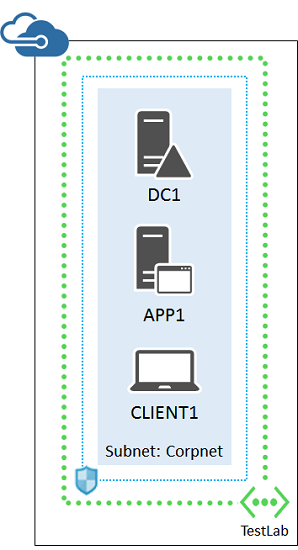
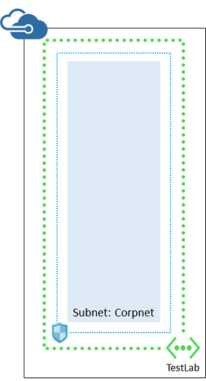
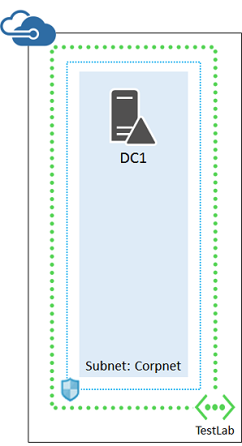
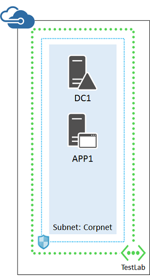

<properties
	pageTitle="Base Configuration Test Environment with Azure Resource Manager"
	description="Learn how to create a simple dev/test environment that simulates a simplified intranet in Microsoft Azure."
	documentationCenter=""
	services="virtual-machines-windows"
	authors="JoeDavies-MSFT"
	manager="timlt"
	editor=""
	tags="azure-resource-manager"/>

<tags
	ms.service="virtual-machines-windows"
	ms.workload="infrastructure-services"
	ms.tgt_pltfrm="vm-windows"
	ms.devlang="na"
	ms.topic="article"
	ms.date="07/19/2016"
	ms.author="josephd"/>

# Base Configuration test environment

This article provides you with step-by-step instructions to create the Base Configuration test environment in a Microsoft Azure virtual network, using virtual machines created in Resource Manager.

You can use the resulting test environment:

- For application development and testing.
- As the initial configuration of an extended test environment of your own design that includes additional virtual machines and Azure services.

The Base Configuration test environment consists of the Corpnet subnet in a cloud-only virtual network named TestLab that simulates a simplified, private intranet connected to the Internet.

It contains:

- An Azure virtual machine running Windows Server 2012 R2 named DC1 that is configured as an intranet domain controller and Domain Name System (DNS) server.
- An Azure virtual machine running Windows Server 2012 R2 named APP1 that is configured as a general application and web server.
- An Azure virtual machine running Windows Server 2012 R2 named CLIENT1 that acts as an intranet client.

This configuration allows DC1, APP1, CLIENT1, and additional Corpnet subnet computers to be:  

- Connected to the Internet to install updates, access Internet resources in real time, and participate in public cloud technologies such as Microsoft Office 365 and other Azure services.
- Remotely managed using Remote Desktop Connections from your computer that is connected to the Internet or your organization network.

There are four phases to setting up the Corpnet subnet of the Windows Server 2012 R2 Base Configuration test environment in Azure.

1.	Create the virtual network.
2.	Configure DC1.
3.	Configure APP1.
4.	Configure CLIENT1.

If you do not already have an Azure account, you can sign up for a free trial at [Try Azure](https://azure.microsoft.com/pricing/free-trial/). If you have an MSDN or Visual Studio subscription, see [Monthly Azure credit for Visual Studio subscribers](https://azure.microsoft.com/pricing/member-offers/msdn-benefits-details/).

> [AZURE.NOTE] Virtual machines in Azure incur an ongoing monetary cost when they are running. This cost is billed against your free trial, MSDN subscription, or paid subscription. For more information about the costs of running Azure virtual machines, see [Virtual Machines Pricing Details](https://azure.microsoft.com/pricing/details/virtual-machines/) and [Azure Pricing Calculator](https://azure.microsoft.com/pricing/calculator/). To keep costs down, see [Minimizing the costs of test environment virtual machines in Azure](#costs).

## Phase 1: Create the virtual network

First, start an Azure PowerShell prompt.

> [AZURE.NOTE] The following command sets use Azure PowerShell 1.0 and later. For more information, see [Azure PowerShell 1.0](https://azure.microsoft.com/blog/azps-1-0/).

Login to your account.

	Login-AzureRMAccount

Get your subscription name using the following command.

	Get-AzureRMSubscription | Sort SubscriptionName | Select SubscriptionName

Set your Azure subscription. Replace everything within the quotes, including the < and > characters, with the correct names.

	$subscr="<subscription name>"
	Get-AzureRmSubscription –SubscriptionName $subscr | Select-AzureRmSubscription

Next, create a new resource group for your Base Configuration test lab. To determine a unique resource group name, use this command to list your existing resource groups.

	Get-AzureRMResourceGroup | Sort ResourceGroupName | Select ResourceGroupName

Create your new resource group with these commands. Replace everything within the quotes, including the < and > characters, with the correct names.

	$rgName="<resource group name>"
	$locName="<location name, such as West US>"
	New-AzureRMResourceGroup -Name $rgName -Location $locName

Resource Manager-based virtual machines require a Resource Manager-based storage account. You must pick a globally unique name for your storage account that contains only lowercase letters and numbers. You can use this command to list the existing storage accounts.

	Get-AzureRMStorageAccount | Sort StorageAccountName | Select StorageAccountName

Create a new storage account for your new test environment with these commands.

	$rgName="<your new resource group name>"
	$locName="<the location of your new resource group>"
	$saName="<storage account name>"
	New-AzureRMStorageAccount -Name $saName -ResourceGroupName $rgName –Type Standard_LRS -Location $locName

Next, you create the TestLab virtual network that will host the Corpnet subnet of the base configuration and protect it with a network security group.

	$rgName="<name of your new resource group>"
	$locName="<Azure location name, such as West US>"
	$locShortName="<the location of your new resource group in lowercase with spaces removed, example: westus>"
	$corpnetSubnet=New-AzureRMVirtualNetworkSubnetConfig -Name Corpnet -AddressPrefix 10.0.0.0/24
	New-AzureRMVirtualNetwork -Name TestLab -ResourceGroupName $rgName -Location $locName -AddressPrefix 10.0.0.0/8 -Subnet $corpnetSubnet –DNSServer 10.0.0.4
	$rule1=New-AzureRMNetworkSecurityRuleConfig -Name "RDPTraffic" -Description "Allow RDP to all VMs on the subnet" -Access Allow -Protocol Tcp -Direction Inbound -Priority 100 -SourceAddressPrefix Internet -SourcePortRange * -DestinationAddressPrefix * -DestinationPortRange 3389
	New-AzureRMNetworkSecurityGroup -Name Corpnet -ResourceGroupName $rgName -Location $locShortName -SecurityRules $rule1
	$vnet=Get-AzureRMVirtualNetwork -ResourceGroupName $rgName -Name TestLab
	$nsg=Get-AzureRMNetworkSecurityGroup -Name Corpnet -ResourceGroupName $rgName
	Set-AzureRMVirtualNetworkSubnetConfig -VirtualNetwork $vnet -Name Corpnet -AddressPrefix "10.0.0.0/24" -NetworkSecurityGroup $nsg

This is your current configuration.

## Phase 2: Configure DC1

DC1 is a domain controller for the corp.contoso.com Active Directory Domain Services (AD DS) domain and a DNS server for the virtual machines of the TestLab virtual network.

First, fill in the name of your resource group, Azure location, and storage account name and run these commands at the Azure PowerShell command prompt on your local computer to create an Azure Virtual Machine for DC1.

	$rgName="<resource group name>"
	$locName="<Azure location, such as West US>"
	$saName="<storage account name>"
	$vnet=Get-AzureRMVirtualNetwork -Name TestLab -ResourceGroupName $rgName
	$pip = New-AzureRMPublicIpAddress -Name DC1-NIC -ResourceGroupName $rgName -Location $locName -AllocationMethod Dynamic
	$nic = New-AzureRMNetworkInterface -Name DC1-NIC -ResourceGroupName $rgName -Location $locName -SubnetId $vnet.Subnets[0].Id -PublicIpAddressId $pip.Id -PrivateIpAddress 10.0.0.4
	$vm=New-AzureRMVMConfig -VMName DC1 -VMSize Standard_A1
	$storageAcc=Get-AzureRMStorageAccount -ResourceGroupName $rgName -Name $saName
	$vhdURI=$storageAcc.PrimaryEndpoints.Blob.ToString() + "vhds/DC1-TestLab-ADDSDisk.vhd"
	Add-AzureRMVMDataDisk -VM $vm -Name ADDS-Data -DiskSizeInGB 20 -VhdUri $vhdURI  -CreateOption empty
	$cred=Get-Credential -Message "Type the name and password of the local administrator account for DC1."
	$vm=Set-AzureRMVMOperatingSystem -VM $vm -Windows -ComputerName DC1 -Credential $cred -ProvisionVMAgent -EnableAutoUpdate
	$vm=Set-AzureRMVMSourceImage -VM $vm -PublisherName MicrosoftWindowsServer -Offer WindowsServer -Skus 2012-R2-Datacenter -Version "latest"
	$vm=Add-AzureRMVMNetworkInterface -VM $vm -Id $nic.Id
	$osDiskUri=$storageAcc.PrimaryEndpoints.Blob.ToString() + "vhds/DC1-TestLab-OSDisk.vhd"
	$vm=Set-AzureRMVMOSDisk -VM $vm -Name DC1-TestLab-OSDisk -VhdUri $osDiskUri -CreateOption fromImage
	New-AzureRMVM -ResourceGroupName $rgName -Location $locName -VM $vm

Next, connect to the DC1 virtual machine.

1.	In the Azure portal, click **Virtual machines**, and then click the **DC1** virtual machine.  
2.	In the **DC1** pane, click **Connect**.
3.	When prompted, open the DC1.rdp downloaded file.
4.	When prompted with a Remote Desktop Connection message box, click **Connect**.
5.	When prompted for credentials, use the following:
- Name: **DC1\\**[Local administrator account name]
- Password: [Local administrator account password]
6.	When prompted with a Remote Desktop Connection message box referring to certificates, click **Yes**.

Next, add an extra data disk as a new volume with the drive letter F:.

1.	In the left pane of Server Manager, click **File and Storage Services**, and then click **Disks**.
2.	In the contents pane, in the **Disks** group, click **disk 2** (with the **Partition** set to **Unknown**).
3.	Click **Tasks**, and then click **New Volume**.
4.	On the Before you begin page of the New Volume Wizard, click **Next**.
5.	On the Select the server and disk page, click **Disk 2**, and then click **Next**. When prompted, click **OK**.
6.	On the Specify the size of the volume page, click **Next**.
7.	On the Assign to a drive letter or folder page, click **Next**.
8.	On the Select file system settings page, click **Next**.
9.	On the Confirm selections page, click **Create**.
10.	When complete, click **Close**.

Next, configure DC1 as a domain controller and DNS server for the corp.contoso.com domain. Run these commands at an administrator-level Windows PowerShell command prompt.

	Install-WindowsFeature AD-Domain-Services -IncludeManagementTools
	Install-ADDSForest -DomainName corp.contoso.com -DatabasePath "F:\NTDS" -SysvolPath "F:\SYSVOL" -LogPath "F:\Logs"

Note that these commands can take a few minutes to complete.

After DC1 restarts, reconnect to the DC1 virtual machine.

1.	In the Azure portal, click **Virtual machines**, and then click the **DC1** virtual machine.
2.	In the **DC1** pane, click **Connect**.
3.	When prompted to open DC1.rdp, click **Open**.
4.	When prompted with a Remote Desktop Connection message box, click **Connect**.
5.	When prompted for credentials, use the following:
- Name: **CORP\\**[Local administrator account name]
- Password: [Local administrator account password]
6.	When prompted by a Remote Desktop Connection message box referring to certificates, click **Yes**.

Next, create a user account in Active Directory that will be used when logging in to CORP domain member computers. Run this command at an administrator-level Windows PowerShell command prompt.

	New-ADUser -SamAccountName User1 -AccountPassword (read-host "Set user password" -assecurestring) -name "User1" -enabled $true -PasswordNeverExpires $true -ChangePasswordAtLogon $false

Note that this command prompts you to supply the User1 account password. Because this account will be used for remote desktop connections for all CORP domain member computers, *choose a strong password*. To check its strength, see [Password Checker: Using Strong Passwords](https://www.microsoft.com/security/pc-security/password-checker.aspx). Record the User1 account password and store it in a secured location.

Next, configure the new User1 account as an Enterprise Administrator. Run this command at the administrator-level Windows PowerShell command prompt.

	Add-ADPrincipalGroupMembership -Identity "CN=User1,CN=Users,DC=corp,DC=contoso,DC=com" -MemberOf "CN=Enterprise Admins,CN=Users,DC=corp,DC=contoso,DC=com","CN=Domain Admins,CN=Users,DC=corp,DC=contoso,DC=com"

Close the Remote Desktop session with DC1 and then reconnect using the CORP\User1 account.

Next, to allow traffic for the Ping tool, run this command at an administrator-level Windows PowerShell command prompt.

	Set-NetFirewallRule -DisplayName "File and Printer Sharing (Echo Request - ICMPv4-In)" -enabled True

This is your current configuration.

## Phase 3: Configure APP1

APP1 provides web and file sharing services.

First, fill in the name of your resource group, Azure location, and storage account name and run these commands at the Azure PowerShell command prompt on your local computer to create an Azure Virtual Machine for APP1.

	$rgName="<resource group name>"
	$locName="<Azure location, such as West US>"
	$saName="<storage account name>"
	$vnet=Get-AzureRMVirtualNetwork -Name TestLab -ResourceGroupName $rgName
	$pip = New-AzureRMPublicIpAddress -Name APP1-NIC -ResourceGroupName $rgName -Location $locName -AllocationMethod Dynamic
	$nic = New-AzureRMNetworkInterface -Name APP1-NIC -ResourceGroupName $rgName -Location $locName -SubnetId $vnet.Subnets[0].Id -PublicIpAddressId $pip.Id
	$vm=New-AzureRMVMConfig -VMName APP1 -VMSize Standard_A1
	$storageAcc=Get-AzureRMStorageAccount -ResourceGroupName $rgName -Name $saName
	$cred=Get-Credential -Message "Type the name and password of the local administrator account for APP1."
	$vm=Set-AzureRMVMOperatingSystem -VM $vm -Windows -ComputerName APP1 -Credential $cred -ProvisionVMAgent -EnableAutoUpdate
	$vm=Set-AzureRMVMSourceImage -VM $vm -PublisherName MicrosoftWindowsServer -Offer WindowsServer -Skus 2012-R2-Datacenter -Version "latest"
	$vm=Add-AzureRMVMNetworkInterface -VM $vm -Id $nic.Id
	$osDiskUri=$storageAcc.PrimaryEndpoints.Blob.ToString() + "vhds/APP1-TestLab-OSDisk.vhd"
	$vm=Set-AzureRMVMOSDisk -VM $vm -Name APP1-TestLab-OSDisk -VhdUri $osDiskUri -CreateOption fromImage
	New-AzureRMVM -ResourceGroupName $rgName -Location $locName -VM $vm

Next, connect to the APP1 virtual machine using the APP1 local administrator account name and password, and then open an administrator-level Windows PowerShell command prompt.

To check name resolution and network communication between APP1 and DC1, run the **ping dc1.corp.contoso.com** command and verify that there are four replies.

Next, join the APP1 virtual machine to the CORP domain with these commands at the Windows PowerShell prompt.

	Add-Computer -DomainName corp.contoso.com
	Restart-Computer

Note that you must supply your CORP\User1 domain account credentials after entering the Add-Computer command.

After APP1 restarts, connect to it using the CORP\User1 account name and password, and then open an administrator-level Windows PowerShell command prompt.

Next, make APP1 a web server with this command at the Windows PowerShell command prompt.

	Install-WindowsFeature Web-WebServer –IncludeManagementTools

Next, create a shared folder and a text file within the folder on APP1 with these commands.

	New-Item -path c:\files -type directory
	Write-Output "This is a shared file." | out-file c:\files\example.txt
	New-SmbShare -name files -path c:\files -changeaccess CORP\User1

This is your current configuration.

## Phase 4: Configure CLIENT1

CLIENT1 acts as a typical laptop, tablet, or desktop computer on the Contoso intranet.

> [AZURE.NOTE] The following command set creates CLIENT1 running Windows Server 2012 R2 Datacenter, which can be done for all types of Azure subscriptions. If you have an MSDN-based Azure subscription, you can create CLIENT1 running Windows 10, Windows 8, or Windows 7 using the [Azure portal](virtual-machines-windows-hero-tutorial.md).

First, fill in the name of your resource group, Azure location, and storage account name and run these commands at the Azure PowerShell command prompt on your local computer to create an Azure Virtual Machine for CLIENT1.

	$rgName="<resource group name>"
	$locName="<Azure location, such as West US>"
	$saName="<storage account name>"
	$vnet=Get-AzureRMVirtualNetwork -Name TestLab -ResourceGroupName $rgName
	$pip = New-AzureRMPublicIpAddress -Name CLIENT1-NIC -ResourceGroupName $rgName -Location $locName -AllocationMethod Dynamic
	$nic = New-AzureRMNetworkInterface -Name CLIENT1-NIC -ResourceGroupName $rgName -Location $locName -SubnetId $vnet.Subnets[0].Id -PublicIpAddressId $pip.Id
	$vm=New-AzureRMVMConfig -VMName CLIENT1 -VMSize Standard_A1
	$storageAcc=Get-AzureRMStorageAccount -ResourceGroupName $rgName -Name $saName
	$cred=Get-Credential -Message "Type the name and password of the local administrator account for CLIENT1."
	$vm=Set-AzureRMVMOperatingSystem -VM $vm -Windows -ComputerName CLIENT1 -Credential $cred -ProvisionVMAgent -EnableAutoUpdate
	$vm=Set-AzureRMVMSourceImage -VM $vm -PublisherName MicrosoftWindowsServer -Offer WindowsServer -Skus 2012-R2-Datacenter -Version "latest"
	$vm=Add-AzureRMVMNetworkInterface -VM $vm -Id $nic.Id
	$osDiskUri=$storageAcc.PrimaryEndpoints.Blob.ToString() + "vhds/CLIENT1-TestLab-OSDisk.vhd"
	$vm=Set-AzureRMVMOSDisk -VM $vm -Name CLIENT1-TestLab-OSDisk -VhdUri $osDiskUri -CreateOption fromImage
	New-AzureRMVM -ResourceGroupName $rgName -Location $locName -VM $vm

Next, connect to the CLIENT1 virtual machine using the CLIENT1 local administrator account name and password, and then open an administrator-level Windows PowerShell command prompt.

To check name resolution and network communication between CLIENT1 and DC1, run the **ping dc1.corp.contoso.com** command at a Windows PowerShell command prompt and verify that there are four replies.

Next, join the CLIENT1 virtual machine to the CORP domain with these commands at the Windows PowerShell prompt.

	Add-Computer -DomainName corp.contoso.com
	Restart-Computer

Note that you must supply your CORP\User1 domain account credentials after entering the Add-Computer command.

After CLIENT1 restarts, connect to it using the CORP\User1 account name and password, and then open an administrator-level Windows PowerShell command prompt.

Next, verify that you can access web and file share resources on APP1 from CLIENT1.

1.	In Server Manager, in the tree pane, click **Local Server**.
2.	In **Properties for CLIENT1**, click **On** next to **IE Enhanced Security Configuration**.
3.	In **Internet Explorer Enhanced Security Configuration**, click **Off** for **Administrators** and **Users**, and then click **OK**.
4.	From the Start screen, click **Internet Explorer**, and then click **OK**.
5.	In the Address bar, type **http://app1.corp.contoso.com/**, and then press ENTER.  You should see the default Internet Information Services web page for APP1.
6.	From the desktop taskbar, click the File Explorer icon.
7.	In the address bar, type **\\\app1\Files**, and then press ENTER.
8.	You should see a folder window with the contents of the Files shared folder.
9.	In the **Files** shared folder window, double-click the **Example.txt** file. You should see the contents of the Example.txt file.
10.	Close the **example.txt - Notepad** and the **Files** shared folder windows.

This is your final configuration.

Your base configuration in Azure is now ready for application development and testing or for additional test environments.

## Next steps

- Add a new virtual machine using the the [Azure portal](virtual-machines-windows-hero-tutorial.md).
- Build the [simulated hybrid cloud test environment](virtual-machines-setup-simulated-hybrid-cloud-environment-testing.md).

## Minimizing the costs of test environment virtual machines in Azure

To minimize the cost of running the test environment virtual machines, you can do one of the following:

- Create the test environment and perform your needed testing and demonstration as quickly as possible. When complete, delete the test environment virtual machines.
- Shut down your test environment virtual machines into a deallocated state.

To shut down the virtual machines with Azure PowerShell, fill in the resource group name and run these commands.

	$rgName="<your resource group name>"
	Stop-AzureRMVM -ResourceGroupName $rgName -Name "CLIENT1"
	Stop-AzureRMVM -ResourceGroupName $rgName -Name "APP1"
	Stop-AzureRMVM -ResourceGroupName $rgName -Name "DC1" -Force -StayProvisioned

To ensure that your virtual machines work properly when starting all of them from the Stopped (Deallocated) state, you should start them in the following order:

1.	DC1
2.	APP1
3.	CLIENT1

To start the virtual machines in order with Azure PowerShell, fill in the resource group name and run these commands.

	$rgName="<your resource group name>"
	Start-AzureRMVM -ResourceGroupName $rgName -Name "DC1"
	Start-AzureRMVM -ResourceGroupName $rgName -Name "APP1"
	Start-AzureRMVM -ResourceGroupName $rgName -Name "CLIENT1"
