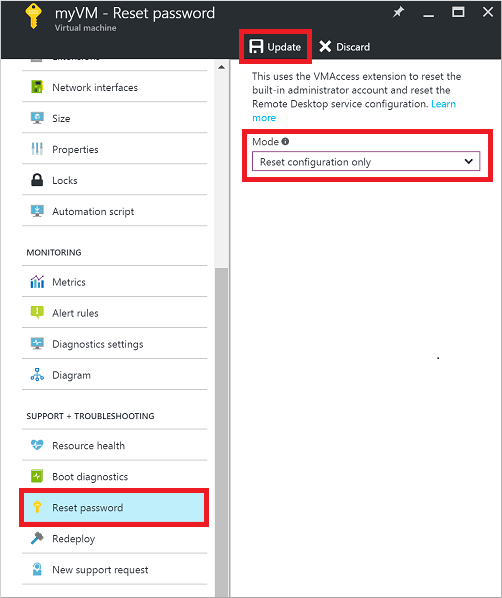

<properties
	pageTitle="Cannot RDP to an Azure VM | Microsoft Azure"
	description="Troubleshoot issues when you cannot connect to your Windows virtual machine in Azure using Remote Desktop"
	keywords="Remote desktop error,remote desktop connection error,cannot connect to VM,remote desktop troubleshooting"
	services="virtual-machines-windows"
	documentationCenter=""
	authors="iainfoulds"
	manager="timlt"
	editor=""
	tags="top-support-issue,azure-service-management,azure-resource-manager"/>

<tags
	ms.service="virtual-machines-windows"
	ms.workload="infrastructure-services"
	ms.tgt_pltfrm="vm-windows"
	ms.devlang="na"
	ms.topic="support-article"
	ms.date="10/14/2016"
	ms.author="iainfou"/>

# Troubleshoot Remote Desktop connections to an Azure virtual machine

The Remote Desktop Protocol (RDP) connection to your Windows-based Azure virtual machine (VM) can fail for various reasons, leaving you unable to access your VM. The issue can be with the Remote Desktop service on the VM, the network connection, or the Remote Desktop client on your host computer. This article guides you through some of the most common methods to resolve RDP connection issues. If your issue isn't listed here or you still can't connect to your VM via RDP, you can read [more detailed RDP troubleshooting concepts and steps](virtual-machines-windows-detailed-troubleshoot-rdp.md).

If you need more help at any point in this article, you can contact the Azure experts on [the MSDN Azure and Stack Overflow forums](https://azure.microsoft.com/support/forums/). Alternatively, you can file an Azure support incident. Go to the [Azure support site](https://azure.microsoft.com/support/options/) and select **Get Support**.

<a id="quickfixrdp"></a>

## Quick troubleshooting steps
After each troubleshooting step, try reconnecting to the VM:

1. Reset remote access configuration
2. Check Network Security Group rules
3. Review VM console logs
4. Check the VM Resource Health
5. Reset your VM password
6. Restart your VM
7. Redeploy your VM

Continue reading if you need more detailed steps and explanations. Most of this article is focused on troubleshooting VMs created using the Resource Manager deployment model. You can also find steps on troubleshooting VMs created using the [Classic deployment model](#troubleshoot-vms-created-using-the-classic-deployment-model).


## Available methods to troubleshoot RDP connection issues
You can reset credentials or RDP configuration using one of the following methods:

- [Azure portal](#using-the-azure-portal) - great if you need to quickly reset the RDP configuration or user credentials and you don't have the Azure tools installed.
- [Azure PowerShell](#using-azure-powershell) - if you are comfortable with a PowerShell prompt, quickly reset the RDP configuration or user credentials using the Azure PowerShell cmdlets.


<a id="fix-common-remote-desktop-errors"></a>
## Troubleshoot using the Azure portal
After each troubleshooting step, try connecting to your VM again. If you still cannot connect, try the next step.

> [AZURE.TIP] If the 'Connect' button in the portal is grayed out and you are not connected to Azure via an [Express Route](../expressroute/expressroute-introduction.md) or [Site-to-Site VPN](../vpn-gateway/vpn-gateway-howto-site-to-site-resource-manager-portal.md) connection, you need to create and assign your VM a public IP address before you can use RDP. You can read more about [public IP addresses in Azure](../virtual-network/virtual-network-ip-addresses-overview-arm.md).

1. **Reset your RDP connection**. This troubleshooting step resets the RDP configuration in the event that Remote Connections are disabled, Windows Firewall rules are blocking RDP, etc.

	Select your VM in the Azure portal. Scroll down the settings pane to the **Support + Troubleshooting** section near buttom of the list. Click the **Reset password** button. Set the **Mode** to **Reset configuration only** and then click the **Update** button:

	

2. **Verify Network Security Group rules**. This troubleshooting step verifies that you have a rule in your Network Security Group to permit RDP traffic. The default port for RDP is TCP port 3389. A rule to permit RDP traffic may not be created automatically when you create your VM.

	Select your VM in the Azure portal. Click the **Network interfaces** from the settings pane.

	

	Select your network interface from the list (there is typically only one):

	

	Select **Network Security Group** to view the Network Security Group associated with your network interface:

	

	Verify that an inbound rule exists that allows RDP traffic on TCP port 3389. The following example shows a valid security rule that permits RDP traffic. You can see `Service` and `Action` are configured correctly:

	

3. Review your VM's console log or screenshot to correct boot problems. Select **Virtual machines** > *your Windows virtual machine* > **Support + Troubleshooting** > **Boot diagnostics**.

4. **Check the VM Resource Health**. This troubleshooting step verifies there are no known issues with the Azure platform that may impacting connectivity to the VM.

	Select your VM in the Azure portal. Scroll down the settings pane to the **Support + Troubleshooting** section near buttom of the list. Click the **Resource Health** button. A healthy VM reports as being **Available**:

	

5. **Reset user credentials**. This troubleshooting step resets the password on the local administrator that you specify in the event that you are unsure or have forgotten the credentials.

	Select your VM in the Azure portal. Scroll down the settings pane to the **Support + Troubleshooting** section near buttom of the list. Click the **Reset password** button. Make sure the **Mode** is set to **Reset password** and then enter your username and a new password. Finally, click the **Update** button:

	

6. **Restart your VM**. This troubleshooting step can correct any underlying issues the VM itself is having.

	Select your VM in the Azure portal and click on the **Overview** tab. Click the **Restart** button:

	

7. **Redeploy your VM**. This troubleshooting redeploys your VM to another host within Azure to correct any underlying platform or networking issues.

	Select your VM in the Azure portal. Scroll down the settings pane to the **Support + Troubleshooting** section near buttom of the list. Click on the **Redeploy** button, and then click on **Redeploy**:

	

	After this operation finishes, ephemeral disk data is lost and dynamic IP addresses that are associated with the VM are updated.

If you are still encountering RDP issues, you can [open a support request](https://azure.microsoft.com/support/options/) or read [more detailed RDP troubleshooting concepts and steps](virtual-machines-windows-detailed-troubleshoot-rdp.md).


## Troubleshoot using Azure PowerShell
If you haven't already, [install and configure the latest Azure PowerShell](../powershell-install-configure.md). The following examples use variables such as `myResourceGroup`, `myVM`, and `myVMAccessExtension`. Replace these variable names and locations with your own values.

> [AZURE.NOTE] You reset the user credentials and the RDP configuration by using the [Set-AzureRmVMAccessExtension](https://msdn.microsoft.com/library/mt619447.aspx) PowerShell command. In the following examples, `myVMAccessExtension` is a name that you specify as part of the process. If you have previously worked with the VMAccessAgent, you can get the name of the existing extension by using `Get-AzureRmVM -ResourceGroupName "myResourceGroup" -Name "myVM"` to check the properties of the VM. Look under the 'Extensions' section of the output to view the name.

After each troubleshooting step, try connecting to your VM again. If you still cannot connect, try the next step.

1. **Reset your RDP connection**. This troubleshooting step resets the RDP configuration in the event that Remote Connections are disabled, Windows Firewall rules are blocking RDP, etc.

	The follow example resets the RDP connection on a VM named `myVM` in the `WestUS` location and in the resource group named `myResourceGroup`:

	```powershell
	Set-AzureRmVMAccessExtension -ResourceGroupName "myResourceGroup" `
		-VMName "myVM" -Name "myVMAccessExtension" -Location Westus
	```

2. **Verify Network Security Group rules**. This troubleshooting step verifies that you have a rule in your Network Security Group to permit RDP traffic. The default port for RDP is TCP port 3389. A rule to permit RDP traffic may not be created automatically when you create your VM.

	First, assign all the configuration data for your Network Security Group to the `$rules` variable. The following example obtains information about the Network Security Group named `myNetworkSecurityGroup` in the resource group named `myResourceGroup`:

	```powershell
	$rules = Get-AzureRmNetworkSecurityGroup -ResourceGroupName "myResourceGroup" `
		-Name "myNetworkSecurityGroup"
	```

	Now, view the rules that have been for this Network Security Group. Verify that a rule exists to allow (`Access`), TCP (`Protocol`) port 3389 (`DestinationPortRange`) for inbound (`Direction`) connections as follows:

	```powershell
	$rules.SecurityRules
	```

	The following example shows a valid security rule that permits RDP traffic. You can see `Protocol`, `DestinationPortRange`, `Access`, and `Direction` are configured correctly:

	```powershell
	Name                     : default-allow-rdp
	Id                       : /subscriptions/guid/resourceGroups/myResourceGroup/providers/Microsoft.Network/networkSecurityGroups/myNetworkSecurityGroup/securityRules/default-allow-rdp
	Etag                     : 
	ProvisioningState        : Succeeded
	Description              : 
	Protocol                 : TCP
	SourcePortRange          : *
	DestinationPortRange     : 3389
	SourceAddressPrefix      : *
	DestinationAddressPrefix : *
	Access                   : Allow
	Priority                 : 1000
	Direction                : Inbound
	```

3. **Reset user credentials**. This troubleshooting step resets the password on the local administrator that you specify in the event that you are unsure or have forgotten the credentials.

	First, specify the username and a new password by assigning credentials to the `$cred` variable as follows:

	```powershell
	$cred=Get-Credential
	```

	Now, update the credentials on your VM. The following examples updates the credentials on a VM named `myVM` in the `WestUS` location and in the resource group named `myResourceGroup`:

	```powershell
	Set-AzureRmVMAccessExtension -ResourceGroupName "myResourceGroup" `
		-VMName "myVM" -Name "myVMAccessExtension" -Location WestUS `
		-UserName $cred.GetNetworkCredential().Username `
		-Password $cred.GetNetworkCredential().Password
	```

4. **Restart your VM**. This troubleshooting step can correct any underlying issues the VM itself is having.

	The following examples restarts the VM named `myVM` in the resource group named `myResourceGroup`::

	```powershell
	Restart-AzureRmVM -ResourceGroup "myResourceGroup" -Name "myVM"
	```

5. **Redeploy your VM**. This troubleshooting redeploys your VM to another host within Azure to correct any underlying platform or networking issues.

	The following example redeploys the VM named `myVM` in the `WestUS` location and in the resource group named `myResourceGroup`:

	```powershell
	Set-AzureRmVM -Redeploy -ResourceGroupName "myResourceGroup" -Name "myVM"
	```

If you are still encountering RDP issues, you can [open a support request](https://azure.microsoft.com/support/options/) or read [more detailed RDP troubleshooting concepts and steps](virtual-machines-windows-detailed-troubleshoot-rdp.md).


## Troubleshoot VMs created using the Classic deployment model

After each troubleshooting step, try reconnecting to the VM.

1. Reset the Remote Desktop service from the [Azure portal](https://portal.azure.com). Select **Browse** > **Virtual machines (classic)** > *your VM* > **Reset Remote...**.

2. Restart your VM to address other startup issues. Select **Browse** > **Virtual machines (classic)** > *your VM* > **Restart**.

3. [Redeploy VM to a new Azure node](virtual-machines-windows-redeploy-to-new-node.md).

	After this operation finishes, ephemeral disk data is lost and dynamic IP addresses that are associated with the virtual machine are updated.
	
4. Verify that your [Cloud Services endpoint allow RDP traffic](../cloud-services/cloud-services-role-enable-remote-desktop.md).

5. Review your VM’s console log or screenshot to correct boot problems. Select **Browse** > **Virtual machines (classic**) > *your VM* > **Settings** > **Boot diagnostics**.

6. Check your VM's Resource Health for any platform issues. Select **Browse** > **Virtual machines (classic)** > *your VM* > **Settings** > **Check Health**.

7. [Reset your VM's password](virtual-machines-windows-reset-rdp.md).

If you are still encountering RDP issues, you can [open a support request](https://azure.microsoft.com/support/options/) or read [more detailed RDP troubleshooting concepts and steps](virtual-machines-windows-detailed-troubleshoot-rdp.md).


## Troubleshoot specific Remote Desktop connection errors
You may encounter a specific error when trying to connect to your VM via RDP. The following are the most common error messages:

- [The remote session was disconnected because there are no Remote Desktop License Servers available to provide a license](virtual-machines-windows-troubleshoot-specific-rdp-errors.md#rdplicense).
- [Remote Desktop can't find the computer "name"](virtual-machines-windows-troubleshoot-specific-rdp-errors.md#rdpname).
- [An authentication error has occurred. The Local Security Authority cannot be contacted](virtual-machines-windows-troubleshoot-specific-rdp-errors.md#rdpauth).
- [Windows Security error: Your credentials did not work](virtual-machines-windows-troubleshoot-specific-rdp-errors.md#wincred).
- [This computer can't connect to the remote computer](virtual-machines-windows-troubleshoot-specific-rdp-errors.md#rdpconnect).


## Troubleshoot generic Remote Desktop errors
If none of these errors occurred and you still can't connect to the VM via Remote Desktop, read the detailed [troubleshooting guide for Remote Desktop](virtual-machines-windows-detailed-troubleshoot-rdp.md).


## Additional resources
- [Azure IaaS (Windows) diagnostics package](https://home.diagnostics.support.microsoft.com/SelfHelp?knowledgebaseArticleFilter=2976864)
- For troubleshooting steps in accessing applications running on a VM, see [Troubleshoot access to an application running on an Azure VM](virtual-machines-linux-troubleshoot-app-connection.md).
- If you are having issues using Secure Shell (SSH) to connect to a Linux VM in Azure, see [Troubleshoot SSH connections to a Linux VM in Azure](virtual-machines-linux-troubleshoot-ssh-connection.md).
