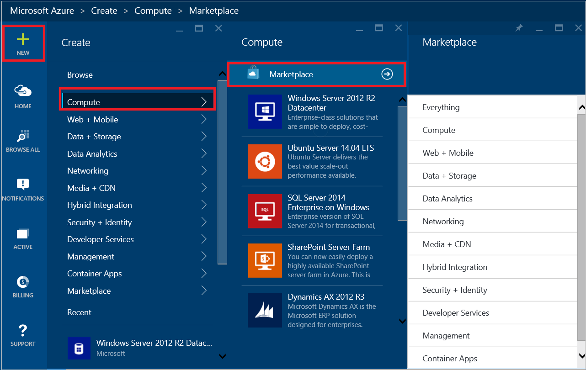
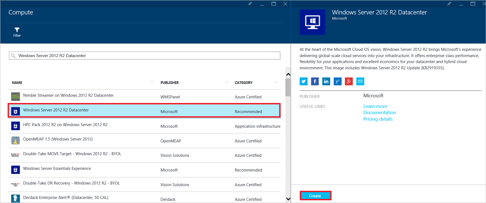
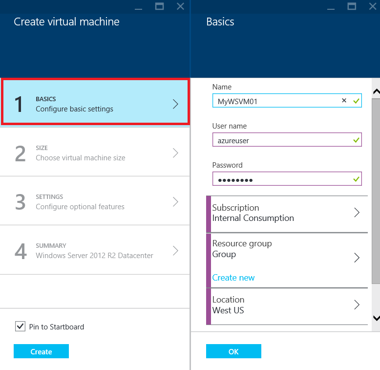
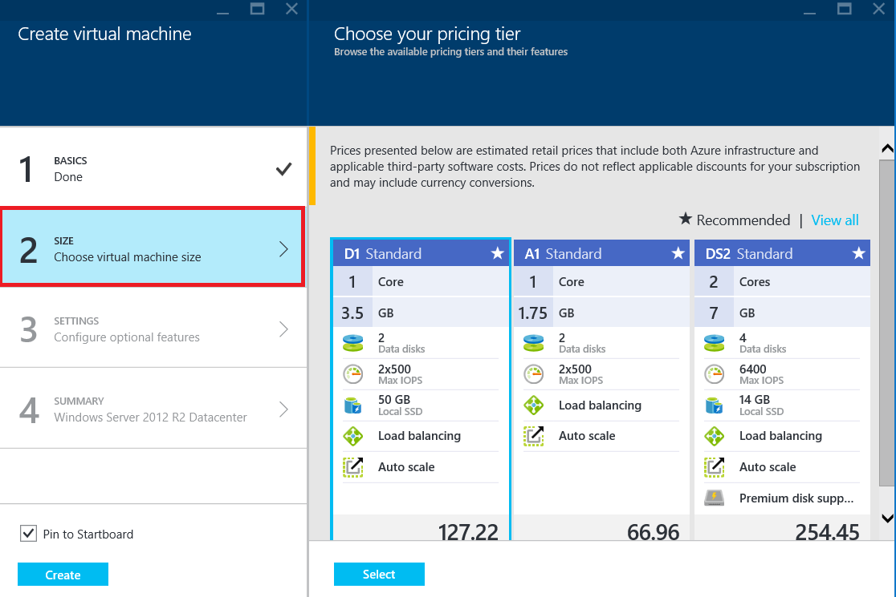
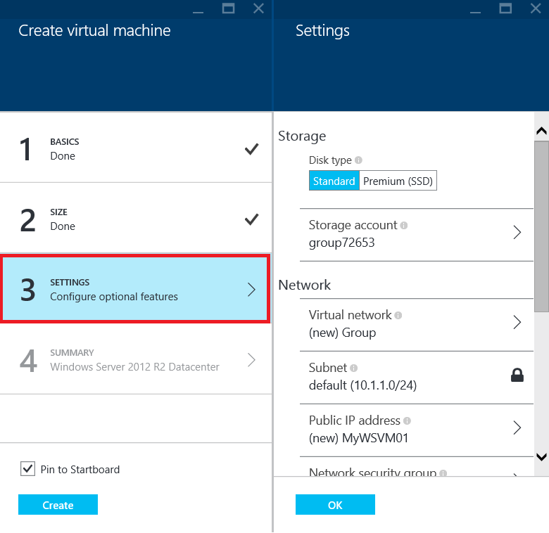
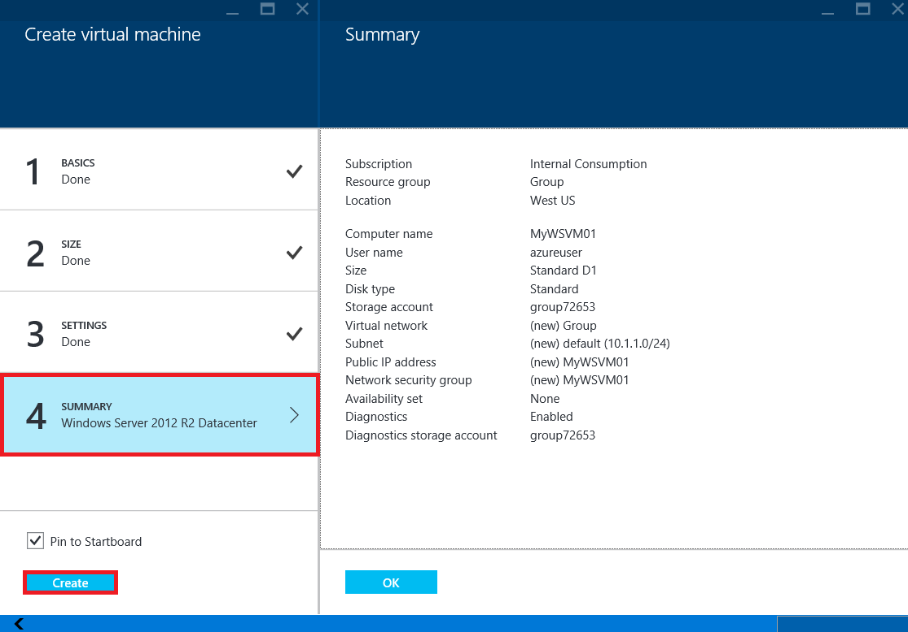

<properties
	pageTitle="Create a virtual machine running Windows in the Azure preview portal | Microsoft Azure"
	description="Learn how to create an Azure virtual machine running Windows, using the Azure Marketplace in the Azure preview portal"
	services="virtual-machines"
	documentationCenter=""
	authors="cynthn"
	manager="timlt"
	editor=""
	tags="azure-resource-manager"/>
<tags
	ms.service="virtual-machines"
	ms.workload="infrastructure-services"
	ms.tgt_pltfrm="vm-windows"
	ms.devlang="na"
	ms.topic="hero-article"
	ms.date="08/14/2015"
	ms.author="cynthn"/>

# Create a virtual machine running Windows in the Azure preview portal#

> [AZURE.SELECTOR]
- [Azure preview portal](virtual-machines-windows-tutorial.md)
- [Azure portal](virtual-machines-windows-tutorial-classic-portal.md)
- [PowerShell: Resource Manager deployment](virtual-machines-deploy-rmtemplates-powershell.md)
- [PowerShell: Classic deployment](virtual-machines-ps-create-preconfigure-windows-vms.md)

This tutorial shows you how easy it is to create an Azure virtual machine in just a few minutes in the preview portal. We'll use a Windows Server 2012 R2 Datacenter image as an example to create the virtual machine, but that's just one of the many images Azure offers. Your image choices depend on your subscription. For example, desktop images may be available to MSDN subscribers.

You can also create virtual machines using your own images, with Resource Manager templates, or with automation tools. To learn about the different methods, see [Different Ways to Create a Windows Virtual Machine](virtual-machines-windows-choices-create-vm.md).

This tutorial uses the Resource Manager deployment model to create the virtual machine. This is recommended instead of the classic deployment model, which is based on Service Management APIs. For details about Resource Manager, see [Azure Resource Manager Overview](resource-group-overview.md). To learn about the benefits of using Resource Manager for virtual machines, see [Azure Compute, Network & Storage Providers under Azure Resource Manager](virtual-machines-azurerm-versus-azuresm.md).

[AZURE.INCLUDE [free-trial-note](../../includes/free-trial-note.md)]

## Video walkthrough

Here's a walkthrough of this tutorial.

[AZURE.VIDEO create-a-virtual-machine-running-windows-in-the-azure-preview-portal]

## Select the image

1. Sign in to the [preview portal](https://portal.azure.com).

2. On the Hub menu, click **New** > **Compute** > **Windows Server 2012 R2 Datacenter**.

	

	>[AZURE.TIP] To find additional images, click **Marketplace** and then search or filter for available items.

3. On the **Windows Server 2012 R2 Datacenter** page, under **Select a deployment model**, select **Resource Manager**. Click **Create**.

	

## Create the virtual machine

After you select the image, you can use Azure's default settings for most of the configuration and quickly create the virtual machine.

1. On the **Create virtual machine** blade, click **Basics**. Enter a **Name** you want for the virtual machine, the administrative **User name**, and a strong **Password**. If you have more than one subscription, specify the one for the new virtual machine, as well as a new or existing **Resource group** and an Azure datacenter **Location**.

	

	>[AZURE.NOTE]**User name** refers to the administrative account that you'll use to manage the server. Create a password that's hard for others to guess but that you can remember. **You'll need the user name and password to log on to the virtual machine**.

2. Click **Size** and select an appropriate virtual machine size for your needs. Each size specifies the number of compute cores, memory, and other features, such as support for Premium Storage, which will affect the price. Azure recommends certain sizes automatically depending on the image you choose.

	

	>[AZURE.NOTE] Premium storage is available for DS-series virtual machines in certain regions. Premium storage is the best storage option for data intensive workloads such as a database. For details, see [Premium Storage: High-Performance Storage for Azure Virtual Machine Workloads](storage-premium-storage-preview-portal.md).

3. Click **Settings** to see storage and networking settings for the new virtual machine. For a first virtual machine you can generally accept the default settings. If you selected a virtual machine size that supports it, you can try out Premium Storage by selecting **Premium (SSD)** under **Disk type**.

	

6. Click **Summary** to review your configuration choices. When you're done reviewing or updating the settings, click **Create**.

	

8. While Azure creates the virtual machine, you can track the progress in **Notifications**, in the Hub menu. After Azure creates the virtual machine, you'll see it on your Startboard unless you cleared **Pin to Startboard** in the **Create virtual machine** blade.

## Log on to the virtual machine

After you create the virtual machine, you'll want to log on to it so you can manage its settings and the applications that you'll run on it.

>[AZURE.NOTE] For requirements and troubleshooting tips, see [Connect to an Azure virtual machine with RDP or SSH](https://msdn.microsoft.com/library/azure/dn535788.aspx).

1. If you haven't already done so, sign in to the [preview portal](https://portal.azure.com).

2. Click your virtual machine on the Startboard. If you need to find it, click **Browse All** > **Recent** or **Browse All** > **Virtual machines**. Then, select your virtual machine from the list.

3. On the virtual machine blade, click **Connect**.

	

4. Click **Open** to use the Remote Desktop Protocol file that's automatically created for the Windows Server virtual machine.

5. Click **Connect**.

6. Type the user name and password you set when you created the virtual machine, and then click **OK**.

7. Click **Yes** to verify the identity of the virtual machine.

	You can now work with the virtual machine just as you would with any other server.

## Next steps

* Use Azure PowerShell and the Azure CLI to [find and select virtual machine images](resource-groups-vm-searching.md).
* Automate virtual machine and workload deployment and management using [Azure Resource Manager](virtual-machines-how-to-automate-azure-resource-manager.md) and [Azure Resource Manager templates](http://azure.microsoft.com/en-us/documentation/templates/).
