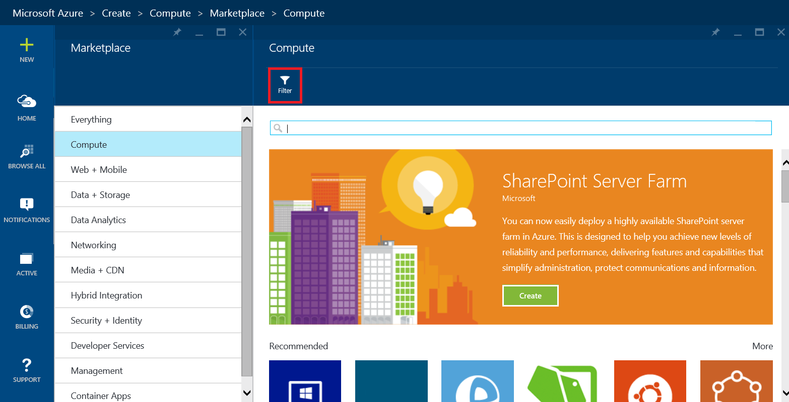
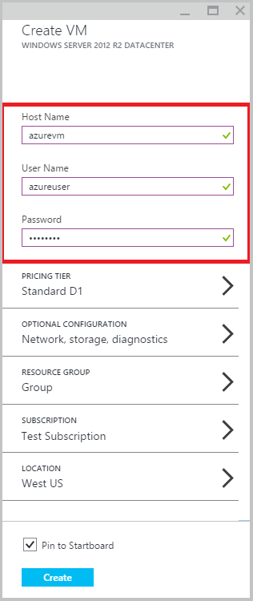

<properties
	pageTitle="Create a virtual machine running Windows in the Azure Preview Portal"
	description="Learn how to create an Azure virtual machine (VM) running Windows, using the Azure Marketplace in the Azure Preview Portal"
	services="virtual-machines"
	documentationCenter=""
	authors="KBDAzure"
	manager="timlt"
	editor=""/>
<tags
	ms.service="virtual-machines"
	ms.workload="infrastructure-services"
	ms.tgt_pltfrm="vm-windows"
	ms.devlang="na"
	ms.topic="get-started-article"
	ms.date="06/03/2015"
	ms.author="kathydav"/>

# Create a Virtual Machine Running Windows in the Azure Preview Portal#

> [AZURE.SELECTOR]
- [Azure Preview Portal](virtual-machines-windows-tutorial.md)
- [Azure Portal](virtual-machines-windows-tutorial-classic-portal.md)
- [PowerShell - Resource Management](virtual-machines-deploy-rmtemplates-powershell.md)
- [PowerShell - Service Management](virtual-machines-ps-create-preconfigure-windows-vms.md)

This tutorial shows you how easy it is to create an Azure virtual machine (VM) in the Azure Preview portal. We'll use a Windows Server image as an example, but that's just one of the many images Azure offers. Note that your image choices depend on your subscription. For example, desktop images may be available to MSDN subscribers.

You can also create VMs using [your own images](virtual-machines-create-upload-vhd-windows-server.md). To learn about this and other methods, see [Different Ways to Create a Windows Virtual Machine](virtual-machines-windows-choices-create-vm.md).

[AZURE.INCLUDE [free-trial-note](../../includes/free-trial-note.md)]

## Create the virtual machine

Using Windows Server 2012 R2 Datacenter as an example, you can create a VM to try out in just a few minutes. You can use Azure's default settings for most of the configuration.

1. Sign in to the [Preview portal](https://portal.azure.com).

2. On the Hub menu, click **New**.

3. In the **New** blade, click **Compute** **>** **Windows Server 2012 R2 Datacenter**.

	

4. On the **Create VM** blade, fill in the **Host Name** you want for the VM, the administrative **User Name**, and a strong **Password**. **User Name** refers to the administrative account that you'll use to manage the server. Create a password that's hard for others to guess but that you can remember. **You'll need the user name and password to log on to the virtual machine**. If you forget the password, you can reset it using [these instructions](virtual-machines-windows-reset-password.md)

	

5. Review the default settings, such as the **Pricing Tier** and **Optional Configuration**. These choices affect the size of VM as well as networking options such as domain membership. For example, to try out Premium Storage on a virtual machine, you'll need to pick a region and size that supports it. For your first virtual machine, the defaults are usually fine.

	>[AZURE.NOTE] Premium storage is available for DS-series virtual machines in certain regions. Premium storage is the best storage option for data intensive workloads such as a database. For details, see [Premium Storage: High-Performance Storage for Azure Virtual Machine Workloads](storage-premium-storage-preview-portal.md).

6. When you're done reviewing or updating the settings, click **Create**.

7. While Azure creates the VM, you can keep track of the progress in **Notifications**, in the Hub menu. After Azure creates the VM, you'll see it on your Startboard unless you cleared **Pin to Startboard** in the **Create VM** blade.

## Log on to the virtual machine

After you create the VM, you'll want to log on to it so you can manage its settings and the applications that you'll run on it.

>[AZURE.NOTE] For requirements and troubleshooting tips, see [Connect to an Azure virtual machine with RDP or SSH](https://msdn.microsoft.com/library/azure/dn535788.aspx).

1. If you haven't already done so, sign in to the [Preview portal](https://portal.azure.com).

2. Click your VM on the Startboard. If you need to find it, click **Browse** > **Virtual machines**. Then, select your VM from the list.

3. On the VM blade, click **Connect**.

	

4. Click **Open** to use the Remote Desktop Protocol file that's automatically created for the virtual machine.

5. Click **Connect**.

6. Type the user name and password you created when you created the virtual machine, and then click **OK**.

7. Click **Yes** to verify the identity of the virtual machine.

	You can now work with the virtual machine just as you would with any other server.

## Next steps

To learn more about configuring Windows virtual machines on Azure, see these articles:

[Connect Virtual Machines with a Virtual Network or Cloud Service](cloud-services-connect-virtual-machine.md)

[Attach Data Disks to a Virtual Machine](storage-windows-attach-disk.md)

[Manage the Availability of Virtual Machines](../manage-availability-virtual-machines.md)

[About Azure VM configuration settings](http://msdn.microsoft.com/library/azure/dn763935.aspx)
 