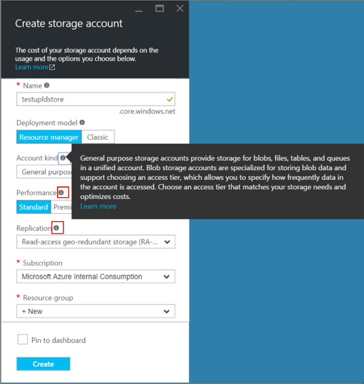
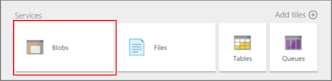

<properties
	pageTitle="Upload a Windows VHD for Resource Manager | Microsoft Azure"
	description="Learn to upload a Windows virtual machine image to use with the Resource Manager deployment model."
	services="virtual-machines-windows"
	documentationCenter=""
	authors="cynthn"
	manager="timlt"
	editor="tysonn"
	tags="azure-resource-manager"/>

<tags
	ms.service="virtual-machines-windows"
	ms.workload="infrastructure-services"
	ms.tgt_pltfrm="vm-windows"
	ms.devlang="na"
	ms.topic="article"
	ms.date="05/06/2016"
	ms.author="cynthn"/>

# Upload a Windows VM image to Azure for Resource Manager deployments

This article shows you how to upload a virtual hard disk (VHD) with a Windows operating system so that you can use it to create new Windows virtual machines (VMs) by using the Azure Resource Manager deployment model. For more details about disks and VHDs in Azure, see [About disks and VHDs for virtual machines](virtual-machines-linux-about-disks-vhds.md).

## Prerequisites

This article assumes that you have:

- **An Azure subscription** - If you don't already have one, [open an Azure account for free](/pricing/free-trial/?WT.mc_id=A261C142F) and [activate MSDN subscriber benefits](/pricing/member-offers/msdn-benefits-details/?WT.mc_id=A261C142F).

- **Azure PowerShell version 1.4 or above** - If you don't already have it installed, read [How to install and configure Azure PowerShell](../powershell-install-configure.md).

- **A virtual machine running Windows** - There are many tools for creating virtual machines on-premises. For example, see [Install the Hyper-V Role and configure a virtual machine](http://technet.microsoft.com/library/hh846766.aspx). To know which Windows operating systems are supported by Azure, see [Microsoft server software support for Microsoft Azure virtual machines](https://support.microsoft.com/kb/2721672).

## Make sure that the VM has the right file format

Azure can accept images only for [generation 1 virtual machines](http://blogs.technet.com/b/ausoemteam/archive/2015/04/21/deciding-when-to-use-generation-1-or-generation-2-virtual-machines-with-hyper-v.aspx) that are saved in the VHD file format. The VHD size must be fixed and a whole number of megabytes, i.e. a number divisible by 8. The maximum size allowed for the VHD is 1,023 GB.

- If you have a Windows VM image in VHDX format, convert it to a VHD using either of the following:

	- Hyper-V: Open Hyper-V and select your local computer on the left. Then in the menu above it, click **Action** > **Edit Disk...**. Navigate through the screens by clicking **Next** and entering these options: *Path for your VHDX file* > **Convert** > **VHD** > **Fixed size** > *Path for the new VHD file*. Click **Finish** to close.

	- [Convert-VHD PowerShell cmdlet](http://technet.microsoft.com/library/hh848454.aspx): Read the blog post [Converting Hyper-V .vhdx to .vhd file formats](https://blogs.technet.microsoft.com/cbernier/2013/08/29/converting-hyper-v-vhdx-to-vhd-file-formats-for-use-in-windows-azure/) for more information.

- If you have a Windows VM image in the [VMDK file format](https://en.wikipedia.org/wiki/VMDK), convert it to a VHD by using the [Microsoft Virtual Machine Converter](https://www.microsoft.com/download/details.aspx?id=42497). Read the blog [How to Convert a VMware VMDK to Hyper-V VHD](http://blogs.msdn.com/b/timomta/archive/2015/06/11/how-to-convert-a-vmware-vmdk-to-hyper-v-vhd.aspx) for more information.

## Prepare the VHD for upload

This section shows you how to generalize your Windows virtual machine. This removes all your personal account information, among other things. You will typically want to do this when you want to use this VM image to quickly deploy similar virtual machines. For details about Sysprep, see [How to Use Sysprep: An Introduction](http://technet.microsoft.com/library/bb457073.aspx).

1. Sign in to the Windows virtual machine.

2. Open the Command Prompt window as an administrator. Change the directory to **%windir%\system32\sysprep**, and then run `sysprep.exe`.

3. In the **System Preparation Tool** dialog box, do the following:

	1. In **System Cleanup Action**, select **Enter System Out-of-Box Experience (OOBE)**, and make sure that the **Generalize** check box is selected.

	2. In **Shutdown Options**, select **Shutdown**.

	3. Click **OK**.

	

 

## Create or find an Azure storage account

You will need a storage account in Azure to upload the VM image. You can either use an existing storage account or create a new one. You can use either the Azure portal or PowerShell to do this.

### To create or find an Azure storage account by using the Azure portal

1. Sign in to the [portal](https://portal.azure.com).

2. Click **Browse** > **Storage accounts**.

3. Check to see if a storage account exists that you want to use for uploading this image. Note the name of this storage account. You can proceed to the [Upload the VM image](#uploadvm) section if you are using an existing storage account.

4. If you want to create a new storage account, click **Add** and enter the following information:

	1. Enter the **Name** for the storage account. It should contain between 3 to 24 lowercase letters and numbers only. This name becomes part of the URL that you will use to access blobs, files, and other resources from the storage account.
	
	2. Select *Resource Manager* as the **Deployment model**. 

	3. Select the appropriate **Account kind**, **Performance**, and **Replication** values. You can hower over the information icons to know more about these values.

	4. Select either *+ New* for the **Resource Group** or an existing one. Enter the name of the new resource group if you want to create a new one.

	5. Choose the **Location** for the storage account and click **Create**. The account now appears under the **Storage accounts** panel.

		

	6. This step and the next steps show you how to create a blob container in this storage account. This is optional because you can also use the PowerShell command that uploads the image to create a new blob container for your image. If you don't want to create it yourself, proceed to the [Upload the VM image](#uploadvm) section. Otherwise, click **Blobs** in the **Services** tile.

		

	7. When the Blob panel shows up, click **+ Container** to create a new blob storage container. Enter the name of the container and the access type.

		

  		> [AZURE.NOTE] By default, the container is private and can be accessed only by the account owner. To allow public read permission to the blobs in the container, but not to the container properties and metadata, use the **Blob** option. To allow full public read permission for the container and blobs, use the **Container** option.

	8. The **Blob service** panel will list the new blob container. Note the URL of this container--you will need this for the PowerShell command to upload the image. Depending on the length of the URL and your screen resolution, the URL might get partly hidden. If that happens, maximize the panel by clicking the **Maximize** icon in the upper-right corner.

### To create or find an Azure storage account by using PowerShell

1. Open Azure PowerShell and sign in to your Azure account.

		Login-AzureRmAccount

	This command will open a pop-up window for you to enter your Azure credentials.

2. If the subscription ID that is selected by default is different from the one that you want to work in, use either of the following commands to set the right subscription.

		Set-AzureRmContext -SubscriptionId "xxxx-xxxx-xxxx-xxxx"

	or

		Select-AzureRmSubscription -SubscriptionId "xxxx-xxxx-xxxx-xxxx"

	You can find the subscriptions that your Azure account has by using the command `Get-AzureRmSubscription`.

3. Find the storage accounts that are available under this subscription.

		Get-AzureRmStorageAccount

	If you want to use an existing storage account, proceed to the [Upload the VM image](#uploadvm) section.

4. If you want to create a new storage account to hold this image, follow these steps:

	1. Make sure that you have a resource group for this storage account. Find out all the resource groups that are in your subscription by using:

			Get-AzureRmResourceGroup

	2. If you want to create a new resource group, use this command:

			New-AzureRmResourceGroup -Name YourResourceGroup -Location "West US"

	3. Create a new storage account in this resource group by using:

			New-AzureRmStorageAccount -ResourceGroupName YourResourceGroup -Name YourStorageAccountName -Location "West US" -SkuName "Standard_GRS" -Kind "Storage"

 

## Upload the VM image to your storage account

Use these steps in Azure PowerShell to upload the VM image to your storage account. Your image will be uploaded to a blob storage container in this account. You can either use an existing container or create a new one.

1. Sign in to Azure PowerShell 1.0.x by using `Login-AzureRmAccount`. Make sure that you are using the right subscription by using `Set-AzureRmContext -SubscriptionId "xxxx-xxxx-xxxx-xxxx"`, as mentioned in the previous section.

2. Add the generalized Azure VHD to the storage account by using the [Add-AzureRmVhd](https://msdn.microsoft.com/library/mt603554.aspx) cmdlet:

		Add-AzureRmVhd -ResourceGroupName YourResourceGroup -Destination "<StorageAccountURL>/<BlobContainer>/<TargetVHDName>.vhd" -LocalFilePath <LocalPathOfVHDFile>

	Where:
	- **StorageAccountURL** is the URL for the storage account. It will typically be in this format: `https://YourStorageAccountName.blob.core.windows.net`. Note that you will need to use the name of the existing or new storage account in place of *YourStorageAccountName*.
	- **BlobContainer** is the blob container where you want to store your images. If the cmdlet does not find an existing blob container with this name, it will create a new one for you.
	- **TargetVHDName** is the name that you want to save the image as.
	- **LocalPathOfVHDFile** is the full path and name of the .vhd file on your local machine.

	A successful `Add-AzureRmVhd` execution will look similar to the following:

		C:\> Add-AzureRmVhd -ResourceGroupName testUpldRG -Destination https://testupldstore2.blob.core.windows.net/testblobs/WinServer12.vhd -LocalFilePath "C:\temp\WinServer12.vhd"
		MD5 hash is being calculated for the file C:\temp\WinServer12.vhd.
		MD5 hash calculation is completed.
		Elapsed time for the operation: 00:03:35
		Creating new page blob of size 53687091712...
		Elapsed time for upload: 01:12:49

		LocalFilePath           DestinationUri
		-------------           --------------
		C:\temp\WinServer12.vhd https://testupldstore2.blob.core.windows.net/testblobs/WinServer12.vhd

	This command will take some time to complete, depending on your network connection and the size of your VHD file.

 
## Deploy a new VM from the uploaded image

Now you can use the uploaded image to create a new Windows VM. These steps show you how to use Azure PowerShell and the VM image that you uploaded in the above steps to create a VM in a new virtual network.

>[AZURE.NOTE] The VM image should be present in the same storage account as the actual virtual machine that will be created.

### Create network resources

Use the following sample PowerShell script to set up a virtual network and NIC for your new VM. Use values for the variables that are represented by **$**, as appropriate to your application.

	$pip = New-AzureRmPublicIpAddress -Name $pipName -ResourceGroupName $rgName -Location $location -AllocationMethod Dynamic

	$subnetconfig = New-AzureRmVirtualNetworkSubnetConfig -Name $subnet1Name -AddressPrefix $vnetSubnetAddressPrefix

	$vnet = New-AzureRmVirtualNetwork -Name $vnetName -ResourceGroupName $rgName -Location $location -AddressPrefix $vnetAddressPrefix -Subnet $subnetconfig

	$nic = New-AzureRmNetworkInterface -Name $nicname -ResourceGroupName $rgName -Location $location -SubnetId $vnet.Subnets[0].Id -PublicIpAddressId $pip.Id

### Create a new VM

The following PowerShell script shows how to set up the virtual machine configurations and use the uploaded VM image as the source for the new installation.
 

	#Enter a new user name and password in the pop-up window for the following
	$cred = Get-Credential

	#Get the storage account where the uploaded image is stored
	$storageAcc = Get-AzureRmStorageAccount -ResourceGroupName $rgName -AccountName $storageAccName

	#Set the VM name and size
	#Use "Get-Help New-AzureRmVMConfig" to know the available options for -VMsize
	$vmConfig = New-AzureRmVMConfig -VMName $vmName -VMSize "Standard_A4"

	#Set the Windows operating system configuration and add the NIC
	$vm = Set-AzureRmVMOperatingSystem -VM $vmConfig -Windows -ComputerName $computerName -Credential $cred -ProvisionVMAgent -EnableAutoUpdate

	$vm = Add-AzureRmVMNetworkInterface -VM $vm -Id $nic.Id

	#Create the OS disk URI
	$osDiskUri = '{0}vhds/{1}{2}.vhd' -f $storageAcc.PrimaryEndpoints.Blob.ToString(), $vmName.ToLower(), $osDiskName

	#Configure the OS disk to be created from the image (-CreateOption fromImage), and give the URL of the uploaded image VHD for the -SourceImageUri parameter
	#You can find this URL in the result of the Add-AzureRmVhd cmdlet above
	$vm = Set-AzureRmVMOSDisk -VM $vm -Name $osDiskName -VhdUri $osDiskUri -CreateOption fromImage -SourceImageUri $urlOfUploadedImageVhd -Windows

	#Create the new VM
	New-AzureRmVM -ResourceGroupName $rgName -Location $location -VM $vm

For example, your workflow might look something like this:

		C:\> $pipName = "testpip6"
		C:\> $pip = New-AzureRmPublicIpAddress -Name $pipName -ResourceGroupName $rgName -Location $location -AllocationMethod Dynamic
		C:\> $subnet1Name = "testsub6"
		C:\> $nicname = "testnic6"
		C:\> $vnetName = "testvnet6"
		C:\> $subnetconfig = New-AzureRmVirtualNetworkSubnetConfig -Name $subnet1Name -AddressPrefix $vnetSubnetAddressPrefix
		C:\> $vnet = New-AzureRmVirtualNetwork -Name $vnetName -ResourceGroupName $rgName -Location $location -AddressPrefix $vnetAddressPrefix -Subnet $subnetconfig
		C:\> $nic = New-AzureRmNetworkInterface -Name $nicname -ResourceGroupName $rgName -Location $location -SubnetId $vnet.Subnets[0].Id -PublicIpAddressId $pip.Id
		C:\> $vmName = "testupldvm6"
		C:\> $vmConfig = New-AzureRmVMConfig -VMName $vmName -VMSize "Standard_A4"
		C:\> $computerName = "testupldcomp6"
		C:\> $vm = Set-AzureRmVMOperatingSystem -VM $vmConfig -Windows -ComputerName $computerName -Credential $cred -ProvisionVMAgent -EnableAutoUpdate
		C:\> $vm = Add-AzureRmVMNetworkInterface -VM $vm -Id $nic.Id
		C:\> $osDiskName = "testupos6"
		C:\> $osDiskUri = '{0}vhds/{1}{2}.vhd' -f $storageAcc.PrimaryEndpoints.Blob.ToString(), $vmName.ToLower(), $osDiskName
		C:\> $urlOfUploadedImageVhd = "https://testupldstore2.blob.core.windows.net/testblobs/WinServer12.vhd"
		C:\> $vm = Set-AzureRmVMOSDisk -VM $vm -Name $osDiskName -VhdUri $osDiskUri -CreateOption fromImage -SourceImageUri $urlOfUploadedImageVhd -Windows
		C:\> $result = New-AzureRmVM -ResourceGroupName $rgName -Location $location -VM $vm
		C:\> $result
		RequestId IsSuccessStatusCode StatusCode ReasonPhrase
		--------- ------------------- ---------- ------------
		                         True         OK OK

You should see the newly created VM in the [Azure portal](https://portal.azure.com) under **Browse** > **Virtual machines**, or by using the following PowerShell commands:

	$vmList = Get-AzureRmVM -ResourceGroupName $rgName
	$vmList.Name

## Next steps

To manage your new virtual machine by using Azure PowerShell, read [Manage virtual machines using Azure Resource Manager and PowerShell](virtual-machines-windows-ps-manage.md).
