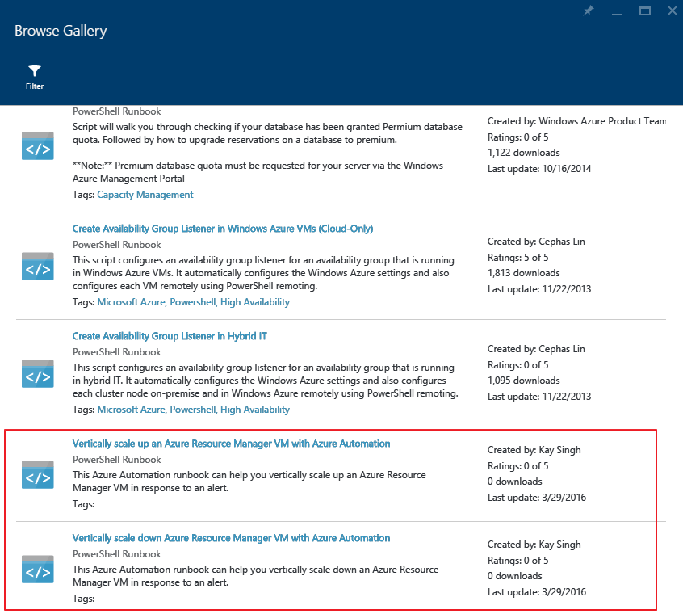
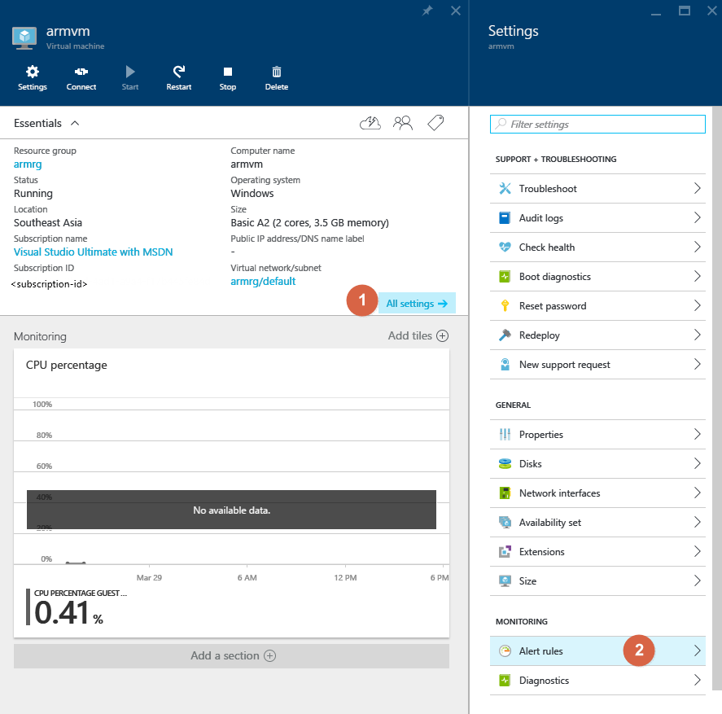
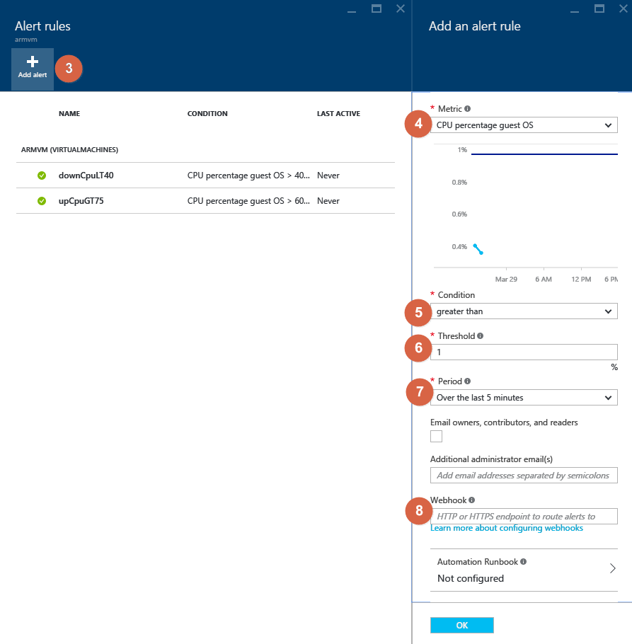

<properties
	pageTitle="Vertically scale Azure virtual machines with Azure Automation | Microsoft Azure"
	description="How to vertically scale a Windows Virtual Machine in response to monitoring alerts with Azure Automation"
	services="virtual-machines-windows"
	documentationCenter=""
	authors="singhkay"
	manager="drewm"
	editor=""
	tags="azure-resource-manager"/>

<tags
	ms.service="virtual-machines-windows"
	ms.workload="infrastructure-services"
	ms.tgt_pltfrm="vm-windows"
	ms.devlang="na"
	ms.topic="article"
	ms.date="03/29/2016"
	ms.author="singhkay"/>

# Vertically scale Azure virtual machines with Azure Automation

Vertical scaling is the process of increasing or decreasing the resources of a machine in response to the workload. In Azure this can be accomplished by changing the size of the Virtual Machine. This can help in the following scenarios

- If the Virtual Machine is not being used frequently, you can resize it down to a smaller size to reduce your monthly costs
- If the Virtual Machine is seeing a peak load, it can be resized to a larger size to increase its capacity

The outline for the steps to accomplish this is as below

1. Setup Azure Automation to access your Virtual Machines
2. Import the Azure Automation Vertical Scale runbooks into your subscription
3. Add a webhook to your runbook
4. Add an alert to your Virtual Machine

> [AZURE.NOTE] Because of the size of the first Virtual Machine, the sizes it can be scaled to, may be limited due to the availability of the other sizes in the cluster current Virtual Machine is deployed in. In the published automation runbooks used in this article we take care of this case and only scale within the below VM size pairs. This means that a Standard_D1v2 Virtual Machine will not suddenly be scaled up to Standard_G5 or scaled down to Basic_A0.

>| VM sizes scaling pair |   |
|---|---|
|  Basic_A0 |  Basic_A4 |
|  Standard_A0 | Standard_A4 |
|  Standard_A5 | Standard_A7  |
|  Standard_A8 | Standard_A9  |
|  Standard_A10 |  Standard_A11 |
|  Standard_D1 |  Standard_D4 |
|  Standard_D11 | Standard_D14  |
|  Standard_DS1 |  Standard_DS4 |
|  Standard_DS11 | Standard_DS14  |
|  Standard_D1v2 |  Standard_D5v2 |
|  Standard_D11v2 |  Standard_D14v2 |
|  Standard_G1 |  Standard_G5 |
|  Standard_GS1 |  Standard_GS5 |

## Setup Azure Automation to access your Virtual Machines

The first thing you need to do is create an Azure Automation account that will host the runbooks used to scale a Virtual Machine. Recently the Automation service introduced the "Run As account" feature which makes setting up the Service Principal for automatically running the runbooks on the user's behalf very easy. You can read more about this in the article below:

* [Authenticate Runbooks with Azure Run As account](../automation/automation-sec-configure-azure-runas-account.md)

## Import the Azure Automation Vertical Scale runbooks into your subscription

The runbooks that are needed for Vertically Scaling your Virtual Machine are already published in the Azure Automation Runbook Gallery. You will need to import them into your subscription. You can learn how to import runbooks by reading the following article.

* [Runbook and module galleries for Azure Automation](../automation/automation-runbook-gallery.md)

The runbooks that need to be imported are shown in the image below

## Add a webhook to your runbook

Once you've imported the runbooks you'll need to add a webhook to the runbook so it can be triggered by an alert from a Virtual Machine. The details of creating a webhook for your Runbook can be read here

* [Azure Automation webhooks](../automation/automation-webhooks.md)

Make sure you copy the webhook before closing the webhook dialog as you will need this in the next section.

## Add an alert to your Virtual Machine

1. Select Virtual Machine settings
2. Select "Alert rules"
3. Select "Add alert"
4. Select a metric to fire the alert on
5. Select a condition, which when fulfilled will cause the alert to fire
6. Select a threshold for the condition in Step 5. to be fulfilled
7. Select a period over which the monitoring service will check for the condition and threshold in Steps 5 & 6
8. Paste in the webhook you copied from the previous section.

