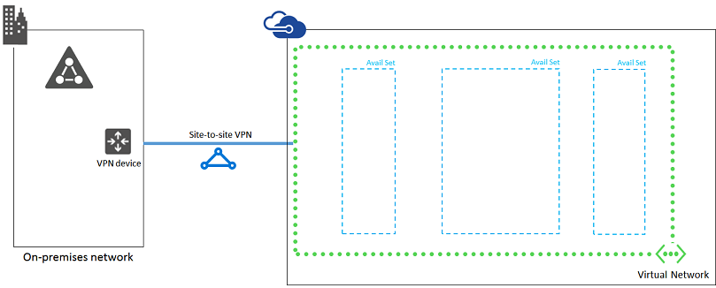

<properties 
	pageTitle="Line of business application Phase 1 | Microsoft Azure" 
	description="Create the virtual network and other Azure infrastructure elements in Phase 1 of the line of business application in Azure." 
	documentationCenter=""
	services="virtual-machines" 
	authors="JoeDavies-MSFT" 
	manager="timlt" 
	editor=""/>

<tags 
	ms.service="virtual-machines" 
	ms.workload="infrastructure-services" 
	ms.tgt_pltfrm="na" 
	ms.devlang="na" 
	ms.topic="article" 
	ms.date="08/11/2015" 
	ms.author="josephd"/>

# Line of Business Application Workload Phase 1: Configure Azure

In this phase of deploying an intranet-only, high-availability line of business application in Azure infrastructure services, you build out the Azure networking and storage infrastructure. You must complete this phase before moving on to [Phase 2](virtual-machines-workload-high-availability-LOB-application-phase2.md). See [Deploy a High-Availability Line of Business Application in Azure](virtual-machines-workload-high-availability-LOB-application-overview.md) for all of the phases.

Azure must be provisioned with these basic network components:

- A cross-premises virtual network with one subnet for hosting the Azure virtual machines
- Two Azure storage accounts to store VHD disk images and extra data disks
- Three availability sets

## Before you begin

Before you begin configuring Azure components, fill in the following tables. To assist you in the procedures for configuring Azure, print this section and write down the needed information or copy this section to a document and fill it in.

For the settings of the virtual network (VNet), fill in Table V. 

Item | Configuration element | Description | Value 
--- | --- | --- | --- 
1. | VNet name | A name to assign to the Azure Virtual Network (example SPFarmNet). | __________________
2. | VNet location | The Azure datacenter that will contain the virtual network. | __________________
3. | Local network name | A name to assign to your organization network. | __________________
4. | VPN device IP address | The public IPv4 address of your VPN device's interface on the Internet. Work with your IT department to determine this address. | __________________
5. | VNet address space | The address space (defined in a single private address prefix) for the virtual network. Work with your IT department to determine this address space. | __________________
6. | The first DNS server for the virtual network | The fourth possible IP address for the address space of the second subnet of the virtual network (see Table S). Work with your IT department to determine this address. | __________________
7. | The second DNS server for the virtual network | The fifth possible IP address for the address space of the second subnet of the virtual network (see Table S). Work with your IT department to determine this address. | __________________
8. | IPsec shared key | A 128-character random, alphanumeric string that will be used to authenticate both sides of the site-to-site VPN connection. Work with your IT or security department to determine this key value. | __________________

**Table V: Cross-premises virtual network configuration**

Fill in Table S for the subnet of this solution. 

- For the first subnet, determine a 29-bit address space (with a /29 prefix length) for the Azure gateway subnet.
- For the second subnet, specify a friendly name, a single IP address space based on the Virtual Network address space, and a descriptive purpose. 

Work with your IT department to determine these address spaces from the virtual network address space. Both address spaces should be in Classless Interdomain Routing (CIDR) format, also known as network prefix format. An example is 10.24.64.0/20.

Item | Subnet name | Subnet address space | Purpose 
--- | --- | --- | --- 
1. | Gateway subnet | _____________________________ | The subnet used by the Azure gateway virtual machines.
2. | _______________ | _____________________________ | _________________________

**Table S: Subnets in the virtual network**

> [AZURE.NOTE] This pre-defined architecture uses a single subnet for simplicity. If you want to overlay a set of traffic filters to emulate subnet isolation, you can use Azure [Network Security Groups](virtual-networks-nsg.md).

For the two on-premises DNS servers that you want to use when initially setting up the domain controllers in your virtual network, fill in Table D. Give each DNS server a friendly name and a single IP address. This friendly name does not need to match the host name or computer name of the DNS server. Note that two blank entries are listed, but you can add more. Work with your IT department to determine this list. 

Item | DNS server friendly name | DNS server IP address 
--- | --- | ---
1. | ___________________________ | ___________________________
2. | ___________________________ | ___________________________ 

**Table D: On-premises DNS servers**

To route packets from the Azure virtual network to your organization network across the site-to-site VPN connection, you must configure the virtual network with a local network that contains a list of the address spaces (in CIDR notation) for all of the reachable locations on your organization's on-premises network. The list of address spaces that define your local network must be unique and must not overlap with the address space used for other virtual networks or other local networks.

For the set of local network address spaces, fill in Table L. Note that three blank entries are listed but you will typically need more. Work with your IT department to determine this list of address spaces.

Item | Local network address space 
--- | ---
1. | ___________________________________
2. | ___________________________________
3. | ___________________________________

**Table L: Address prefixes for the local network**

Next, you need to have Azure PowerShell version 0.9.5 or later installed. To check your version of Azure PowerShell, run this command.

	Get-Module azure | format-table version

If you need to install the latest version of Azure PowerShell, use **Control Panel-Programs and Features** to remove the current version. Then, use the instructions in [How to install and configure Azure PowerShell](../install-configure-powershell.md) to install Azure PowerShell on your local computer. Open an Azure PowerShell prompt.

First, select the correct Azure subscription with these commands. Replace everything within the quotes, including the < and > characters, with the correct names.

	$subscr="<Subscription name>"
	Select-AzureSubscription -SubscriptionName $subscr –Current

You can get the subscription name from the **SubscriptionName** property of the output of the **Get-AzureSubscription** command.

Next, switch Azure PowerShell into Resource Manager mode with this command.

	Switch-AzureMode AzureResourceManager 

Next, create a new resource group for your line of business application.

To determine a unique resource group name, use this command to list your existing resource groups.

	Get-AzureResourceGroup | Sort ResourceGroupName | Select ResourceGroupName

To list the Azure locations where you can create Resource Manager-based virtual machines, use these commands.

	$loc=Get-AzureLocation | where { $_.Name –eq "Microsoft.Compute/virtualMachines" }
	$loc.Locations

Create your new resource group with these commands.

	$rgName="<resource group name>"
	$locName="<an Azure location, such as West US>"
	New-AzureResourceGroup -Name $rgName -Location $locName

Resource Manager-based virtual machines require a Resource Manager-based storage account.

Item | Storage account name | Purpose 
--- | --- | ---
1. | ___________________________ | The premium storage account used by the SQL server virtual machines.
2. | ___________________________ | The standard storage account used by all the other virtual machines in the workload. 

**Table ST: Storage accounts**

You will need these names when you create the virtual machines in phases 2, 3, and 4.

You must pick a globally unique name for each storage account that contains only lowercase letters and numbers. You can use this command to list the existing storage accounts.

	Get-AzureStorageAccount | Sort Name | Select Name

To test whether a chosen storage account name is globally unique, you need to run the **Test-AzureName** command in the Azure Service Management mode of PowerShell. Use these commands.

	Switch-AzureMode AzureServiceManagement
	Test-AzureName -Storage <Proposed storage account name>

If the Test-AzureName command displays **False**, your proposed name is unique. When you have determined a unique name for both storage accounts, update table ST, and then switch Azure PowerShell back to Resource Manager mode with this command.

	Switch-AzureMode AzureResourceManager 

To create the first storage account, run these commands.

	$rgName="<your new resource group name>"
	$locName="<the location of your new resource group>"
	$saName="<Table ST – Item 1 - Storage account name column>"
	New-AzureStorageAccount -Name $saName -ResourceGroupName $rgName –Type Premium_LRS -Location $locName

To create the second storage account, run these commands.

	$rgName="<your new resource group name>"
	$locName="<the location of your new resource group>"
	$saName="<Table ST – Item 2 - Storage account name column>"
	New-AzureStorageAccount -Name $saName -ResourceGroupName $rgName –Type Standard_LRS -Location $locName

Next, you create the Azure Virtual Network that will host your line of business application.

	$rgName="<name of your new resource group>"
	$locName="<Azure location of the new resource group>"
	$vnetName="<Table V – Item 1 – Value column>"
	$vnetAddrPrefix="<Table V – Item 5 – Value column>"
	$lobSubnetName="<Table S – Item 2 – Subnet name column>"
	$lobSubnetPrefix="<Table S – Item 2 – Subnet address space column>"
	$gwSubnetPrefix="<Table S – Item 1 – Subnet address space column>"
	$dnsServers=@( "<Table D – Item 1 – DNS server IP address column>", "<Table D – Item 2 – DNS server IP address column>" )
	$gwSubnet=New-AzureVirtualNetworkSubnetConfig -Name "GatewaySubnet" -AddressPrefix $gwSubnetPrefix
	$lobSubnet=New-AzureVirtualNetworkSubnetConfig -Name $lobSubnetName -AddressPrefix $lobSubnetPrefix
	New-AzurevirtualNetwork -Name $vnetName -ResourceGroupName $rgName -Location $locName -AddressPrefix $vnetAddrPrefix -Subnet $gwSubnet,$lobSubnet -DNSServer $dnsServers

Next, use these commands to create the gateways for the site-to-site VPN connection.

	$vnetName="<Table V – Item 1 – Value column>"
	$vnet=Get-AzureVirtualNetwork -Name $vnetName -ResourceGroupName $rgName
	
	# Attach a virtual network gateway to a public IP address and the gateway subnet
	$publicGatewayVipName="LOBAppPublicIPAddress"
	$vnetGatewayIpConfigName="LOBAppPublicIPConfig"
	New-AzurePublicIpAddress -Name $vnetGatewayIpConfigName -ResourceGroupName $rgName -Location $locName -AllocationMethod Dynamic
	$publicGatewayVip=Get-AzurePublicIpAddress -Name $vnetGatewayIpConfigName -ResourceGroupName $rgName
	$vnetGatewayIpConfig=New-AzureVirtualNetworkGatewayIpConfig -Name $vnetGatewayIpConfigName -PublicIpAddressId $publicGatewayVip.Id -SubnetId $vnet.Subnets[0].Id

	# Create the Azure gateway
	$vnetGatewayName="LOBAppAzureGateway"
	$vnetGateway=New-AzureVirtualNetworkGateway -Name $vnetGatewayName -ResourceGroupName $rgName -Location $locName -GatewayType Vpn -VpnType RouteBased -IpConfigurations $vnetGatewayIpConfig
	
	# Create the gateway for the local network
	$localGatewayName="LOBAppLocalNetGateway"
	$localGatewayIP="<Table V – Item 4 – Value column>"
	$localNetworkPrefix=@( <comma-separated, double-quote enclosed list of the local network address prefixes from Table L, example: "10.1.0.0/24", "10.2.0.0/24"> )
	$localGateway=New-AzureLocalNetworkGateway -Name $localGatewayName -ResourceGroupName $rgName -Location $locName -GatewayIpAddress $localGatewayIP -AddressPrefix $localNetworkPrefix
	
	# Define the Azure virtual network VPN connection
	$vnetConnectionName="LOBAppS2SConnection"
	$vnetConnectionKey="<Table V – Item 8 – Value column>"
	$vnetConnection=New-AzureVirtualNetworkGatewayConnection -Name $vnetConnectionName -ResourceGroupName $rgName -Location $locName -ConnectionType IPsec -SharedKey $vnetConnectionKey -VirtualNetworkGateway1 $vnetGateway -LocalNetworkGateway2 $localGateway

Next, configure on-premises VPN device to connect to the Azure VPN gateway. For more information, see [Configure your VPN device](../virtual-networks/vpn-gateway-configure-vpn-gateway-mp.md#configure-your-vpn-device).

To configure your on-premises VPN device, you will need the following:

- The public IPv4 address of the Azure VPN gateway for your virtual network (from the display of the **Get-AzurePublicIpAddress -Name $publicGatewayVipName -ResourceGroupName $rgName** command)
- The IPsec pre-shared key for the site-to-site VPN connection (Table V- Item 8 – Value column)

Next, ensure that the address space of the virtual network is reachable from your on-premises network. This is usually done by adding a route corresponding to the virtual network address space to your VPN device and then advertising that route to the rest of the routing infrastructure of your organization network. Work with your IT department to determine how to do this.

Next, define the names of three availability sets. Fill out Table A. 

Item | Purpose | Availability set name 
--- | --- | --- 
1. | Domain controllers | ___________________________
2. | SQL servers | ___________________________
3. | Web servers | ___________________________

**Table A: Availability set names**

You will need these names when you create the virtual machines in phases 2, 3, and 4.

Create these new availability sets with these Azure PowerShell commands.

	$rgName="<your new resource group name>"
	$locName="<the Azure location for your new resource group>"
	$avName="<Table A – Item 1 – Availability set name column>"
	New-AzureAvailabilitySet –Name $avName –ResourceGroupName $rgName -Location $locName
	$avName="<Table A – Item 2 – Availability set name column>"
	New-AzureAvailabilitySet –Name $avName –ResourceGroupName $rgName -Location $locName
	$avName="<Table A – Item 3 – Availability set name column>"
	New-AzureAvailabilitySet –Name $avName –ResourceGroupName $rgName -Location $locName

This is the configuration resulting from the successful completion of this phase.

## Next step

To continue with the configuration of this workload, go to [Phase 2: Configure Domain Controllers](virtual-machines-workload-high-availability-LOB-application-phase2.md).

## Additional resources

[Deploy a high-availability line of business application in Azure](virtual-machines-workload-high-availability-LOB-application-overview.md)

[Line of Business Applications architecture blueprint](http://msdn.microsoft.com/dn630664)

[Set up a web-based LOB application in a hybrid cloud for testing](../virtual-network/virtual-networks-setup-lobapp-hybrid-cloud-testing.md)

[Azure infrastructure services implementation guidelines](virtual-machines-infrastructure-services-implementation-guidelines.md)

[Azure Infrastructure Services Workload: SharePoint Server 2013 farm](virtual-machines-workload-intranet-sharepoint-farm.md)
