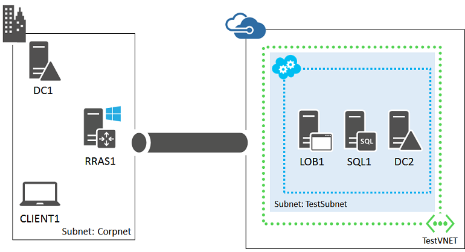

<properties 
	pageTitle="Line of business application in Azure | Microsoft Azure" 
	description="Learn the value of a line of business application in Azure, set up a test environment, and deploy a high-availability configuration." 
	services="virtual-machines" 
	documentationCenter="" 
	authors="JoeDavies-MSFT" 
	manager="timlt" 
	editor=""
	tags="azure-resource-manager"/>

<tags 
	ms.service="virtual-machines" 
	ms.workload="infrastructure-services" 
	ms.tgt_pltfrm="na" 
	ms.devlang="na" 
	ms.topic="article" 
	ms.date="08/11/2015" 
	ms.author="josephd"/>

# Azure Infrastructure Services Workload: High-availability line of business application

Set up your first or next web-based, intranet-only line of business application in Microsoft Azure and take advantage of ease of configuration and the ability to quickly expand the application to include new capacity.
 
With the Virtual Machines and Virtual Network features of Azure infrastructure services, you can quickly deploy and run a line of business application that is accessible by your organization's users. For example, you can set this up.

 
Because the Azure Virtual Network is an extension of your on-premises network with all of the correct naming and traffic routing in place, your users will access the servers of the line of business application in the same way as if it were located in an on-premises datacenter.

This configuration allows you to easily expand the capacity of the application by adding new Azure virtual machines in which the ongoing costs of both hardware and maintenance are lower than running the equivalent in your datacenter.

Your next step is to set up a dev/test line of business application hosted in Azure.

## Create a dev/test line of business application hosted in Azure

A cross-premises virtual network is connected to an on-premises network with a site-to-site VPN or ExpressRoute connection. If you want to create a dev/test environment that mimics the final configuration and experiment with accessing the application and performing remote administration over a VPN connection, see [Set up a web-based LOB application in a hybrid cloud for testing](../virtual-network/virtual-networks-setup-lobapp-hybrid-cloud-testing.md). 

 
You can create this dev/test environment for free with your [MSDN subscription](http://azure.microsoft.com/pricing/member-offers/msdn-benefits/) or an [Azure Trial Subscription](http://azure.microsoft.com/pricing/free-trial/).

Your next step is to create a high-availability line of business application in Azure.

## Deploy a line of business application hosted in Azure

The baseline, representative configuration for a high-availability line of business application in Azure looks like this.

 
This consists of:

- An intranet-only line of business application with two servers at the web and database tiers.
- A SQL Server AlwaysOn configuration with two virtual machines running SQL Server and a majority node computer in a cluster.
- Active Directory Domain Services in the virtual network with two replica domain controllers.

For an overview of line of business applications, see the [Line of Business Applications architecture blueprint](http://msdn.microsoft.com/dn630664).

### Bill of materials

This baseline configuration requires the following set of Azure services and components:

- Seven virtual machines
- Four extra data disks for the domain controllers and virtual machines running SQL Server
- Three availability sets
- One cross-premises virtual network
- Two storage accounts

### Deployment phases

To deploy this configuration, use the following process:

- Phase 1: Configure Azure 

	Use Azure PowerShell to create the storage accounts, availability sets, and a cross-premises virtual network. For the detailed configuration steps, see [Phase 1](virtual-machines-workload-high-availability-LOB-application-phase1.md).

- Phase 2: Configure the domain controllers 

	Configure two Active Directory replica domain controllers and DNS settings for the virtual network. For the detailed configuration steps, see [Phase 2](virtual-machines-workload-high-availability-LOB-application-phase2.md).

- Phase 3: Configure the SQL Server infrastructure.  

	Create the virtual machines running SQL Server and the cluster. For the detailed configuration steps, see [Phase 3](virtual-machines-workload-high-availability-LOB-application-phase3.md).

- Phase 4: Configure the web servers.

	Create the web server virtual machines and add your line of business application to it. For the detailed configuration, see [Phase 4](virtual-machines-workload-high-availability-LOB-application-phase4.md).

- Phase 5: Configure a SQL Server AlwaysOn Availability Group.

	Prepare the application databases, create a SQL Server AlwaysOn Availability Group, and then add the application databases to it. For the detailed configuration steps, see [Phase 5](virtual-machines-workload-high-availability-LOB-application-phase5.md).

Once configured, you can easily expand this line of business application by adding more web servers or virtual machines running SQL Servers to the cluster.

## Additional resources

[Deploy a high-availability line of business application in Azure](virtual-machines-workload-high-availability-LOB-application-overview.md)

[Line of Business Applications architecture blueprint](http://msdn.microsoft.com/dn630664)

[Set up a web-based LOB application in a hybrid cloud for testing](../virtual-network/virtual-networks-setup-lobapp-hybrid-cloud-testing.md)

[Azure infrastructure services implementation guidelines](virtual-machines-infrastructure-services-implementation-guidelines.md)

[Azure Infrastructure Services Workload: SharePoint Server 2013 farm](virtual-machines-workload-intranet-sharepoint-farm.md)