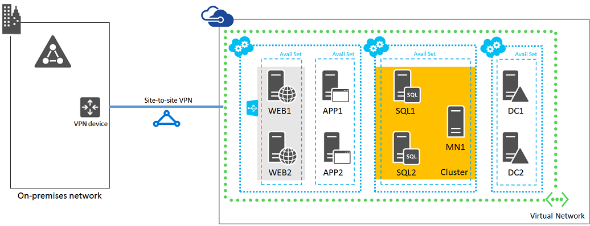

<properties
	pageTitle="SharePoint Server 2013 farm in Azure | Microsoft Azure"
	description="Learn the value of a SharePoint Server 2013 farm in Azure, set up a test environment, and deploy a high-availability configuration."
	services="virtual-machines"
	documentationCenter=""
	authors="JoeDavies-MSFT"
	manager="timlt"
	editor=""
	tags="azure-service-management"/>

<tags
	ms.service="virtual-machines"
	ms.workload="infrastructure-services"
	ms.tgt_pltfrm="vm-windows-sharepoint"
	ms.devlang="na"
	ms.topic="article"
	ms.date="08/11/2015"
	ms.author="josephd"/>

# Azure Infrastructure Services Workload: Intranet SharePoint farm

Set up your first or next SharePoint farm in Microsoft Azure and take advantage of ease of configuration and the ability to quickly expand the farm to include new capacity or optimization of key functionality. Many SharePoint farms grow from a standard, highly-available, three-tier configuration to a farm with possibly a dozen or more servers optimized for performance or separate roles, such as distributed caching or search.

With the virtual machines and virtual network features of Azure infrastructure services, you can quickly deploy and run a SharePoint farm that is transparently connected to your on-premises network. For example, you can set up the following network.

Because the Azure Virtual Network is an extension of your on-premises network with all of the correct naming and traffic routing in place, your users will access it in the same way as if it were located in an on-premises datacenter.

This configuration allows you to easily expand the SharePoint farm by adding new Azure virtual machines in which the ongoing costs of both hardware and maintenance are lower than running an equivalent farm in your datacenter.

Hosting an intranet SharePoint farm in Azure infrastructure services is an example of a line of business application. For an overview, see the [Line of Business Applications architecture blueprint](http://msdn.microsoft.com/dn630664).

Your next step is to set up a dev/test intranet SharePoint farm hosted in Azure.

## Create a dev/test intranet SharePoint farm hosted in Azure

You have two choices for creating a dev/test environment for a SharePoint farm hosted in Azure:

- Cloud-only virtual network
- Cross-premises virtual network

You can create these dev/test environments for free with your [MSDN subscription](http://azure.microsoft.com/pricing/member-offers/msdn-benefits/) or an [Azure Trial Subscription](http://azure.microsoft.com/pricing/free-trial/).

### Cloud-only virtual network

A cloud-only virtual network is not connected to an on-premises network. If you just want to quickly create a basic or high-availability SharePoint farm, see [SharePoint Server Farm](virtual-machines-sharepoint-farm-azure-preview.md). The following example shows the basic SharePoint farm configuration.

### Cross-premises virtual network

A cross-premises virtual network is connected to an on-premises network with a site-to-site VPN or ExpressRoute connection. If you want to create a dev/test environment that mimics the final configuration and experiment with accessing the SharePoint server and performing remote administration over a VPN connection, see [Set up a SharePoint intranet farm in a hybrid cloud for testing](../virtual-network/virtual-networks-setup-sharepoint-hybrid-cloud-testing.md).

Your next step is to create a high-availability intranet SharePoint farm in Azure.

## Deploy an intranet SharePoint farm hosted in Azure

The baseline, representative configuration for a functional, high-availability intranet SharePoint farm appears in the following example.

This consists of:

- An intranet SharePoint farm with two servers at the web, application, and database tiers.
- A SQL Server AlwaysOn Availability Groups configuration with two SQL servers and a majority node computer in a cluster.
- An Azure Active Directory in the virtual network with two replica domain controllers.

To see this configuration as an infographic, see [SharePoint with SQL Server AlwaysOn](http://go.microsoft.com/fwlink/?LinkId=394788).

### Bill of materials

This baseline configuration requires the following set of Azure services and components:

- Nine virtual machines.
- Four extra data disks for the domain controllers and SQL servers.
- Three cloud services.
- Four availability sets.
- One cross-premises virtual network.
- One storage account.
- One Azure subscription.

### Deployment phases

To deploy this configuration, use the following process:

- Phase 1: Configure Azure.

	Use the Azure portal and Azure PowerShell to create a storage account, cloud services, and a cross-premises virtual network. For the detailed configuration steps, see [Phase 1](virtual-machines-workload-intranet-sharepoint-phase1.md).

- Phase 2: Configure the domain controllers.

	Configure two Azure Active Directory replica domain controllers and DNS settings for the virtual network. For the detailed configuration steps, see [Phase 2](virtual-machines-workload-intranet-sharepoint-phase2.md).

- Phase 3: Configure the SQL Server infrastructure.  

	Prepare the SQL Server virtual machines for use with SharePoint and create the SQL Server cluster. For the detailed configuration steps, see [Phase 3](virtual-machines-workload-intranet-sharepoint-phase3.md).

- Phase 4: Configure the SharePoint servers.

	Configure the four SharePoint virtual machines for a new SharePoint farm. For the detailed configuration, see [Phase 4](virtual-machines-workload-intranet-sharepoint-phase4.md).

- Phase 5: Create an AlwaysOn Availability Group.

	Prepare the SharePoint databases, create an AlwaysOn Availability Group, and then add the SharePoint databases to it. For the detailed configuration steps, see [Phase 5](virtual-machines-workload-intranet-sharepoint-phase5.md).

Once configured, you can expand this SharePoint farm with guidance from [Microsoft Azure architectures for SharePoint 2013](http://technet.microsoft.com/library/dn635309.aspx).

## Additional resources

[Deploying SharePoint with SQL Server AlwaysOn Availability Groups in Azure](virtual-machines-workload-deploy-spsqlao-overview.md)

[Set up a SharePoint intranet farm in a hybrid cloud for testing](../virtual-network/virtual-networks-setup-sharepoint-hybrid-cloud-testing.md)

[Microsoft Azure architectures for SharePoint 2013](https://technet.microsoft.com/library/dn635309.aspx)

[SharePoint with SQL Server AlwaysOn Infographic](http://go.microsoft.com/fwlink/?LinkId=394788)

[SharePoint farms hosted in Azure infrastructure services](virtual-machines-sharepoint-infrastructure-services.md)

[Azure infrastructure services implementation Guidelines](virtual-machines-infrastructure-services-implementation-guidelines.md)

[Azure Infrastructure Services Workload: High-availability line of business application](virtual-machines-workload-high-availability-lob-application.md)
