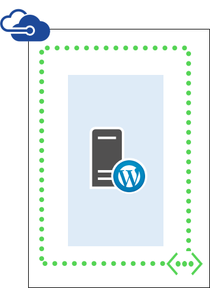
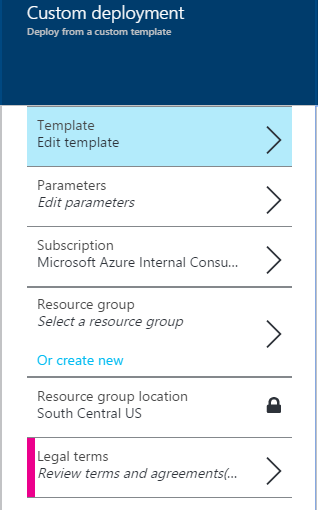

<properties
	pageTitle="Deploy a WordPress server on Ubuntu with an Azure Resource Manager template"
	description="Easily deploy a single WordPress server running Ubuntu using a Resource Manager Template and the Azure Preview Portal, Azure PowerShell, or the Azure CLI."
	services="virtual-machines"
	documentationCenter=""
	authors="davidmu1"
	manager="timlt"
	editor=""
	tags="azure-resource-manager"/>

<tags
	ms.service="virtual-machines"
	ms.workload="infrastructure-services"
	ms.tgt_pltfrm="na"
	ms.devlang="na"
	ms.topic="article"
	ms.date="06/29/2015"
	ms.author="davidmu"/>

# Deploy a WordPress server on Ubuntu with an Azure Resource Manager template

Use the instructions in this article to deploy a WordPress server running on Ubuntu using a Resource Manager template. This template creates a single virtual machine in a new virtual network.

You can run the template with the Azure Preview portal, Azure PowerShell, or the Azure CLI.

## Azure Preview portal

To deploy this workload using a Resource Manager template and the Azure Preview portal, click [here](https://portal.azure.com/#create/Microsoft.Template/uri/https%3A%2F%2Fraw.githubusercontent.com%2FAzure%2Fazure-quickstart-templates%2Fmaster%2Fwordpress-single-vm-ubuntu%2Fazuredeploy.json).

1.	For the **Template** pane, click **Save**.
2.	Click **Parameters**. On the **Parameters** pane, enter new values, select from allowed values, or accept default values, and then click **OK**.
3.	If needed, click **Subscription** and select the correct Azure subscription.
4.	Click **Resource group** and select an existing resource group. Alternately, click **Or create new** to create a new one for this workload.
5.	If needed, click **Resource group location** and select the correct Azure location.
6.	If needed, click **Legal terms** to review the terms and agreement for using the template.
7.	Click **Create**.

Depending on the template, it can take some time for Azure to build the workload. When complete, you have a new WordPress server running on Ubuntu in your existing or new resource group.

## Azure PowerShell

Before you begin, make sure you have the right version of Azure PowerShell installed, you have logged in, and you have switched to the new Resource Manager mode. For the details, click [here](virtual-machines-deploy-rmtemplates-powershell.md#setting-up-powershell-for-resource-manager-templates).

Fill in an Azure deployment name, a new Resource Group name, and an Azure datacenter location in the following set of commands. Remove everything within the quotes, including the < and > characters.

	$deployName="<deployment name>"
	$RGName="<resource group name>"
	$locName="<Azure location, such as West US>"
	$templateURI="https://raw.githubusercontent.com/azure/azure-quickstart-templates/master/wordpress-single-vm-ubuntu/azuredeploy.json"
	New-AzureResourceGroup -Name $RGName -Location $locName
	New-AzureResourceGroupDeployment -Name $deployName -ResourceGroupName $RGName -TemplateUri $templateURI

Here is an example.

	$deployName="TestDeployment"
	$RGName="TestRG"
	$locname="West US"
	$templateURI="https://raw.githubusercontent.com/azure/azure-quickstart-templates/master/wordpress-single-vm-ubuntu/azuredeploy.json"
	New-AzureResourceGroup -Name $RGName -Location $locName
	New-AzureResourceGroupDeployment -Name $deployName -ResourceGroupName $RGName -TemplateUri $templateURI

Next, run your command block in the Azure PowerShell prompt.

When you run the **New-AzureResourceGroupDeployment** command, you will be prompted to supply the values for a series of parameters. When you have specified all the parameter values, **New-AzureResourceGroupDeployment** creates and configures the virtual machines.

When the template execution is complete, you now have WordPress server running on Ubuntu in your new resource group.

## Azure CLI

Before you begin, make sure you have the right version of Azure CLI installed, you have logged in, and you have switched to the new Resource Manager mode. For the details, click [here](virtual-machines-deploy-rmtemplates-azure-cli.md#getting-ready).

First, you create a new resource group. Use the following command and specify the name of the group and the Azure data center location into which you want to deploy.

	azure group create <group name> <location>

Next, use the following command and specify the name of your new resource group and the name of an Azure deployment.

	azure group deployment create --template-uri https://raw.githubusercontent.com/azure/azure-quickstart-templates/master/wordpress-single-vm-ubuntu/azuredeploy.json <group name> <deployment name>

Here is an example.

	azure group create wordpress eastus2
	azure group deployment create --template-uri https://raw.githubusercontent.com/azure/azure-quickstart-templates/master/wordpress-single-vm-ubuntu/azuredeploy.json wordpress wpdevtest

When you run the **azure group deployment create** command, you will be prompted to supply the values for a series of parameters. When you have specified all the parameter values, Azure creates and configures the virtual machines.

When the template execution is complete, you now have WordPress server running on Ubuntu in your new resource group.

## Additional resources

[Deploy and manage Virtual Machines using Azure Resource Manager templates and Azure PowerShell](virtual-machines-deploy-rmtemplates-powershell.md)

[Azure Compute, Network and Storage Providers under Azure Resource Manager](virtual-machines-azurerm-versus-azuresm.md)

[Azure Resource Manager Overview](../resource-group-overview.md)

[Deploy and manage virtual machines using Azure Resource Manager templates and the Azure CLI](virtual-machines-deploy-rmtemplates-azure-cli.md)

[Virtual machines documentation](http://azure.microsoft.com/documentation/services/virtual-machines/)

[How to install and configure Azure PowerShell](../install-configure-powershell.md)
