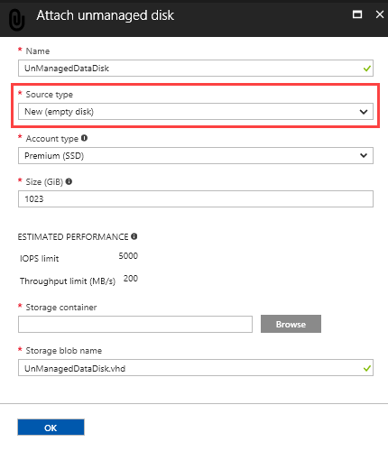
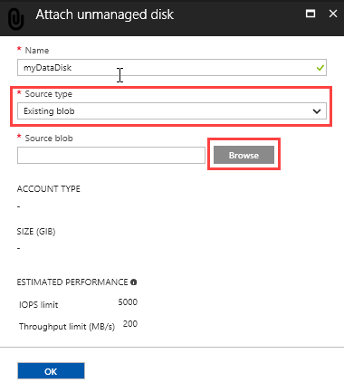

# How to attach an unmanaged data disk to a Windows VM in the Azure portal

This article shows you how to attach both new and existing unmanaged disks to Windows virtual machines through the Azure portal. You can also [attach a data disk using PowerShell](./attach-disk-ps.md). Before you do this, review these tips:

* The size of the virtual machine controls how many data disks you can attach. For details, see [Sizes for virtual machines](sizes.md).
* To use Premium storage, you need a DS-series or GS-series virtual machine. You can use disks from both Premium and Standard storage accounts with these virtual machines. Premium storage is available in certain regions. For details, see [Premium Storage: High-Performance Storage for Azure Virtual Machine Workloads](../../storage/storage-premium-storage.md?toc=%2fazure%2fvirtual-machines%2fwindows%2ftoc.json).
* For a new disk, you don't need to create it first because Azure creates it when you attach it.


You can also [attach a data disk using Powershell](attach-disk-ps.md).


## Find the virtual machine
1. Sign in to the [Azure portal](https://portal.azure.com/).
2. In the menu on the left, click **Virtual Machines**.
3. Select the virtual machine from the list.
4. In the Virtual machines blade, click **Disks**.
   
Continue by following instructions for attaching either a [new disk](#option-1-attach-a-new-disk) or an [existing disk](#option-2-attach-an-existing-disk).

## Option 1: Attach and initialize a new disk
1. On the **Disks** blade, click **+ Add data disk**.
2. In the **Attach managed disk** blade, type a name for the disk in **Name** and then select **New (empty disk)** in **Source type**.
3. Under **Storage container**, click the **Browse** button and browse to the storage account and container where you would like the new VHD to be stored and then click **Select**. 
  
   
   
3. When you are done with the settings for the data disk, click **OK**.
4. Back in the **Disks** blade, click **Save** to add the disk to the VM configuration.


### Initialize a new data disk

1. Connect to the virtual machine. For instructions, see [How to connect and log on to an Azure virtual machine running Windows](connect-logon.md?toc=%2fazure%2fvirtual-machines%2fwindows%2ftoc.json).
1. Click the **Start** menu inside the VM and type **diskmgmt.msc** and hit **Enter**. This starts the Disk Management snap-in.
2. Disk Management recognizes that you have a new, uninitialized disk and the Initialize Disk window will pop up.
3. Make sure the new disk is selected and click **OK** to initialize it.
4. The new disk now appears as **unallocated**. Right-click anywhere on the disk and select **New simple volume**. The **New Simple Volume Wizard** starts.
5. Go through the wizard, keeping all of the defaults, when you are done select **Finish**.
6. Close Disk Management.
7. You get a pop-up that you need to format the new disk before you can use it. Click **Format disk**.
8. In the **Format new disk** dialog, check the settings and then click **Start**.
9. You get a warning that formatting the disks erases all of the data, click **OK**.
10. When the format is complete, click **OK**.


## Option 2: Attach an existing disk
1. On the **Disks** blade, click **+ Add data disk**.
2. On the **Attach unmanaged disk** blade, in **Source type** select **Existing blob**.

    

	3. Click **Browse** to navigate to the storage account and container where the existing VHD is located. Click and the VHD and then click **Select**.
4. Click **OK** in the **Attach unmanaged disk** blade.
5. In the **Disks** blade, click **Save** to add the disk to the configuration for the VM.
   


## Use TRIM with standard storage

If you use standard storage (HDD), you should enable TRIM. TRIM discards unused blocks on the disk so you are only billed for storage that you are actually using. This can save on costs if you create large files and then delete them. 

You can run this command to check the TRIM setting. Open a command prompt on your Windows VM and type:

```
fsutil behavior query DisableDeleteNotify
```

If the command returns 0, TRIM is enabled correctly. If it returns 1, run the following command to enable TRIM:
```
fsutil behavior set DisableDeleteNotify 0
```

After deleting data from your disk, you can ensure the TRIM operations flush properly by running defrag with TRIM:

```
defrag.exe <volume:> -l
```

You can also ensure the entire volume is trimmed by formatting the volume.


## Next steps
If you application needs to use the D: drive to store data, you can [change the drive letter of the Windows temporary disk](change-drive-letter.md?toc=%2fazure%2fvirtual-machines%2fwindows%2fclassic%2ftoc.json).

