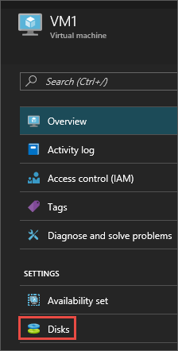
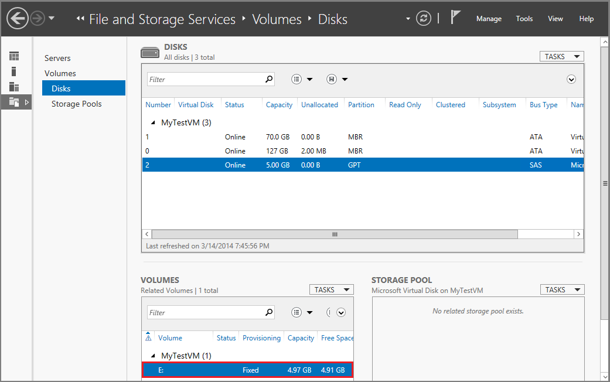

# How to attach a data disk to a Windows VM in the Azure portal
This article shows you how to attach both new and existing disks to a Windows virtual machine through the Azure portal. You can also [attach a data disk to a Linux VM in the Azure portal](../linux/attach-disk-portal.md?toc=%2fazure%2fvirtual-machines%2flinux%2ftoc.json). Before you do this, review these tips:

* The size of the virtual machine controls how many data disks you can attach. For details, see [Sizes for virtual machines](sizes.md?toc=%2fazure%2fvirtual-machines%2fwindows%2ftoc.json).
* To use Premium storage, you'll need a DS-series or GS-series virtual machine. You can use disks from both Premium and Standard storage accounts with these virtual machines. Premium storage is available in certain regions. For details, see [Premium Storage: High-Performance Storage for Azure Virtual Machine Workloads](../../storage/storage-premium-storage.md?toc=%2fazure%2fvirtual-machines%2fwindows%2ftoc.json).
* For a new disk, you don't need to create it first because Azure creates it when you attach it.
* For an existing disk, the .vhd file must be available in an Azure storage account. You can use a .vhd that's already there, if it's not attached to another virtual machine, or upload your own .vhd file to the storage account.

You can also [attach a data disk using Powershell](attach-disk-ps.md).


## Find the virtual machine
1. Sign in to the [Azure portal](https://portal.azure.com/).
2. On the Hub menu, click **Virtual Machines**.
3. Select the virtual machine from the list.
4. To the Virtual machines blade, in **Essentials**, click **Disks**.
   
    

Continue by following instructions for attaching either a [new disk](#option-1-attach-a-new-disk) or an [existing disk](#option-2-attach-an-existing-disk).

## Option 1: Attach and initialize a new disk
1. On the **Disks** blade, click **Attach new**.
2. Review the default settings, update as necessary, and then click **OK**.
   
   
3. After Azure creates the disk and attaches it to the virtual machine, the new disk is listed in the virtual machine's disk settings under **Data Disks**.

### Initialize a new data disk

1. Connect to the virtual machine. For instructions, see [How to connect and log on to an Azure virtual machine running Windows](connect-logon.md?toc=%2fazure%2fvirtual-machines%2fwindows%2ftoc.json).
2. After you log on to the virtual machine, open **Server Manager**. In the left pane, select **File and Storage Services**.
   
    
3. Expand the menu and select **Disks**.
4. The **Disks** section lists the disks. In most cases, it will have disk 0, disk 1, and disk 2. Disk 0 is the operating system disk, disk 1 is the temporary disk, and disk 2 is the data disk you just attached to the VM. The new data disk will list the Partition as **Unknown**. Right-click the disk and select **Initialize**.
5. You're notified that all data will be erased when the disk is initialized. Click **Yes** to acknowledge the warning and initialize the disk. Once complete, the partition will be listed as **GPT**. Right-click the disk again and select **New Volume**.
6. Complete the wizard using the default values. When the wizard is done, the **Volumes** section lists the new volume. The disk is now online and ready to store data.

    


## Option 2: Attach an existing disk
1. On the **Disks** blade, click **Attach existing**.
2. Under **Attach existing disk**, click **VHD File**.
   
   
3. Under **Storage accounts**, select the account and container that holds the .vhd file.
   
   
4. Select the .vhd file.
5. Under **Attach existing disk**, the file you just selected is listed under **VHD File**. Click **OK**.
6. After Azure attaches the disk to the virtual machine, it's listed in the virtual machine's disk settings under **Data Disks**.


## Use TRIM with standard storage

If you use standard storage (HDD), you should enable TRIM. TRIM discards unused blocks on the disk so you are only billed for storage that you are actually using. This can save on costs if you create large files and then delete them. 

You can run this command to check the TRIM setting. Open a command prompt on your Windows VM and type:

```
fsutil behavior query DisableDeleteNotify
```

If the command returns 0, TRIM is enabled correctly. If it returns 1, run the following command to enable TRIM:
```
fsutil behavior set DisableDeleteNotify 0
```
				
After deleting data from your disk you can ensure the TRIM operations flush properly by running defrag with TRIM:

```
defrag.exe <volume:> -l
```

## Next steps
If you application needs to use the D: drive to store data, you can [change the drive letter of the Windows temporary disk](change-drive-letter.md?toc=%2fazure%2fvirtual-machines%2fwindows%2fclassic%2ftoc.json).

