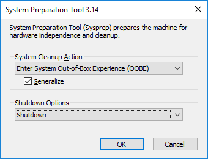

# Create a managed image of a generalized VM in Azure

A managed image resource can be created from a generalized virtual machine (VM) that is stored as either a managed disk or an unmanaged disk in a storage account. The image can then be used to create multiple VMs. For information on how managed images are billed, see [Managed Disks pricing](https://azure.microsoft.com/pricing/details/managed-disks/). 

[!INCLUDE [updated-for-az.md](../../../includes/updated-for-az.md)]

## Generalize the Windows VM using Sysprep

Sysprep removes all your personal account and security information, and then prepares the machine to be used as an image. For information about Sysprep, see [Sysprep overview](https://docs.microsoft.com/windows-hardware/manufacture/desktop/sysprep--system-preparation--overview).

Make sure the server roles running on the machine are supported by Sysprep. For more information, see [Sysprep support for server roles](https://docs.microsoft.com/windows-hardware/manufacture/desktop/sysprep-support-for-server-roles).

> [!IMPORTANT]
> After you have run Sysprep on a VM, that VM is considered *generalized* and cannot be restarted. The process of generalizing a VM is not reversible. If you need to keep the original VM functioning, you should create a [copy of the VM](create-vm-specialized.md#option-3-copy-an-existing-azure-vm) and generalize its copy. 
>
> If you plan to run Sysprep before uploading your virtual hard disk (VHD) to Azure for the first time, make sure you have [prepared your VM](prepare-for-upload-vhd-image.md?toc=%2fazure%2fvirtual-machines%2fwindows%2ftoc.json).  
> 
> 

To generalize your Windows VM, follow these steps:

1. Sign in to your Windows VM.
   
2. Open a Command Prompt window as an administrator. Change the directory to %windir%\system32\sysprep, and then run `sysprep.exe`.
   
3. In the **System Preparation Tool** dialog box, select **Enter System Out-of-Box Experience (OOBE)** and select the **Generalize** check box.
   
4. For **Shutdown Options**, select **Shutdown**.
   
5. Select **OK**.
   
    

6. When Sysprep completes, it shuts down the VM. Do not restart the VM.


## Create a managed image in the portal 

1. Open the [Azure portal](https://portal.azure.com).

2. In the menu on the left, select **Virtual machines** and then select the VM from the list.

3. In the **Virtual machine** page for the VM, on the upper menu, select **Capture**.

   The **Create image** page appears.

4. For **Name**, either accept the pre-populated name or enter a name that you would like to use for the image.

5. For **Resource group**, either select **Create new** and enter a name, or select **Use existing** and select a resource group to use from the drop-down list.

6. If you want to delete the source VM after the image has been created, select **Automatically delete this virtual machine after creating the image**.

7. If you want the ability to use the image in any [availability zone](../../availability-zones/az-overview.md), select **On** for **Zone resiliency**.

8. Select **Create** to create the image.

9. After the image is created, you can find it as an **Image** resource in the list of resources in the resource group.


## Create an image of a VM using Powershell

[!INCLUDE [updated-for-az](../../../includes/updated-for-az.md)]

Creating an image directly from the VM ensures that the image includes all of the disks associated with the VM, including the OS disk and any data disks. This example shows how to create a managed image from a VM that uses managed disks.

Before you begin, make sure that you have the latest version of the Azure PowerShell module. To find the version, run `Get-Module -ListAvailable Az` in PowerShell. If you need to upgrade, see [Install Azure PowerShell on Windows with PowerShellGet](/powershell/azure/install-az-ps). If you are running PowerShell locally, run `Connect-AzAccount` to create a connection with Azure.


> [!NOTE]
> If you would like to store your image in zone-redundant storage, you need to create it in a region that supports [availability zones](../../availability-zones/az-overview.md) and include the `-ZoneResilient` parameter in the image configuration (`New-AzImageConfig` command).

To create a VM image, follow these steps:

1. Create some variables.

    ```azurepowershell-interactive
	$vmName = "myVM"
	$rgName = "myResourceGroup"
	$location = "EastUS"
	$imageName = "myImage"
	```
2. Make sure the VM has been deallocated.

    ```azurepowershell-interactive
	Stop-AzVM -ResourceGroupName $rgName -Name $vmName -Force
	```
	
3. Set the status of the virtual machine to **Generalized**. 
   
    ```azurepowershell-interactive
    Set-AzVm -ResourceGroupName $rgName -Name $vmName -Generalized
	```
	
4. Get the virtual machine. 

    ```azurepowershell-interactive
	$vm = Get-AzVM -Name $vmName -ResourceGroupName $rgName
	```

5. Create the image configuration.

    ```azurepowershell-interactive
	$image = New-AzImageConfig -Location $location -SourceVirtualMachineId $vm.Id 
	```
6. Create the image.

    ```azurepowershell-interactive
    New-AzImage -Image $image -ImageName $imageName -ResourceGroupName $rgName
    ```	

## Create an image from a managed disk using PowerShell

If you want to create an image of only the OS disk, specify the managed disk ID as the OS disk:

	
1. Create some variables. 

    ```azurepowershell-interactive
	$vmName = "myVM"
	$rgName = "myResourceGroup"
	$location = "EastUS"
	$imageName = "myImage"
	```

2. Get the VM.

   ```azurepowershell-interactive
   $vm = Get-AzVm -Name $vmName -ResourceGroupName $rgName
   ```

3. Get the ID of the managed disk.

    ```azurepowershell-interactive
	$diskID = $vm.StorageProfile.OsDisk.ManagedDisk.Id
	```
   
3. Create the image configuration.

    ```azurepowershell-interactive
	$imageConfig = New-AzImageConfig -Location $location
	$imageConfig = Set-AzImageOsDisk -Image $imageConfig -OsState Generalized -OsType Windows -ManagedDiskId $diskID
	```
	
4. Create the image.

    ```azurepowershell-interactive
    New-AzImage -ImageName $imageName -ResourceGroupName $rgName -Image $imageConfig
    ```	


## Create an image from a snapshot using Powershell

You can create a managed image from a snapshot of a generalized VM by following these steps:

	
1. Create some variables. 

    ```azurepowershell-interactive
	$rgName = "myResourceGroup"
	$location = "EastUS"
	$snapshotName = "mySnapshot"
	$imageName = "myImage"
	```

2. Get the snapshot.

   ```azurepowershell-interactive
   $snapshot = Get-AzSnapshot -ResourceGroupName $rgName -SnapshotName $snapshotName
   ```
   
3. Create the image configuration.

    ```azurepowershell-interactive
	$imageConfig = New-AzImageConfig -Location $location
	$imageConfig = Set-AzImageOsDisk -Image $imageConfig -OsState Generalized -OsType Windows -SnapshotId $snapshot.Id
	```
4. Create the image.

    ```azurepowershell-interactive
    New-AzImage -ImageName $imageName -ResourceGroupName $rgName -Image $imageConfig
    ```	


## Create an image from a VHD in a storage account

Create a managed image from a generalized OS VHD in a storage account. You need the URI of the VHD in the storage account, which is in the following format: https://*mystorageaccount*.blob.core.windows.net/*vhdcontainer*/*vhdfilename.vhd*. In this example, the VHD is in *mystorageaccount*, in a container named *vhdcontainer*, and the VHD filename is *vhdfilename.vhd*.


1.  Create some variables.

    ```azurepowershell-interactive
	$vmName = "myVM"
	$rgName = "myResourceGroup"
	$location = "EastUS"
	$imageName = "myImage"
	$osVhdUri = "https://mystorageaccount.blob.core.windows.net/vhdcontainer/vhdfilename.vhd"
    ```
2. Stop/deallocate the VM.

    ```azurepowershell-interactive
	Stop-AzVM -ResourceGroupName $rgName -Name $vmName -Force
	```
	
3. Mark the VM as generalized.

    ```azurepowershell-interactive
	Set-AzVm -ResourceGroupName $rgName -Name $vmName -Generalized	
	```
4.  Create the image by using your generalized OS VHD.

    ```azurepowershell-interactive
	$imageConfig = New-AzImageConfig -Location $location
	$imageConfig = Set-AzImageOsDisk -Image $imageConfig -OsType Windows -OsState Generalized -BlobUri $osVhdUri
	$image = New-AzImage -ImageName $imageName -ResourceGroupName $rgName -Image $imageConfig
    ```

	
## Next steps
- [Create a VM from a managed image](create-vm-generalized-managed.md?toc=%2fazure%2fvirtual-machines%2fwindows%2ftoc.json).	

