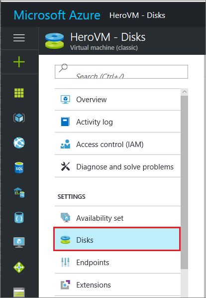
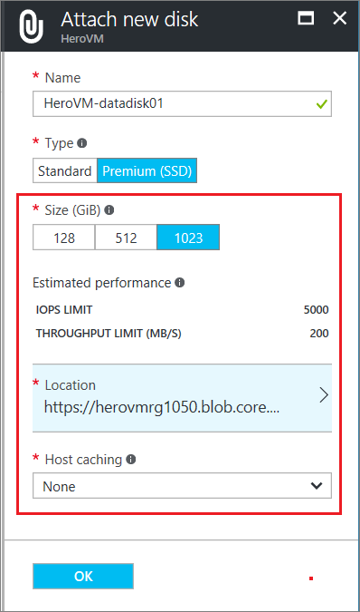
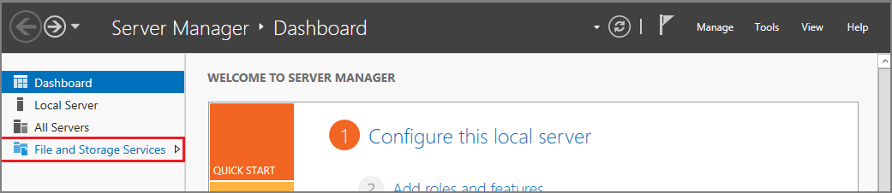
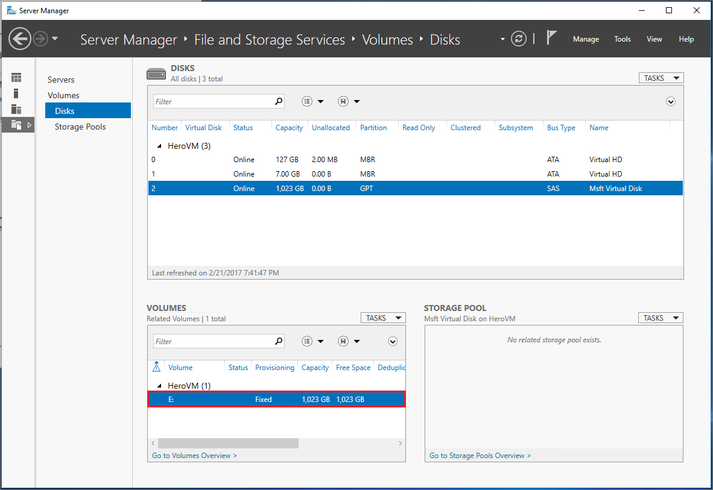
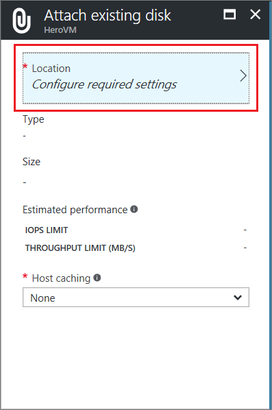
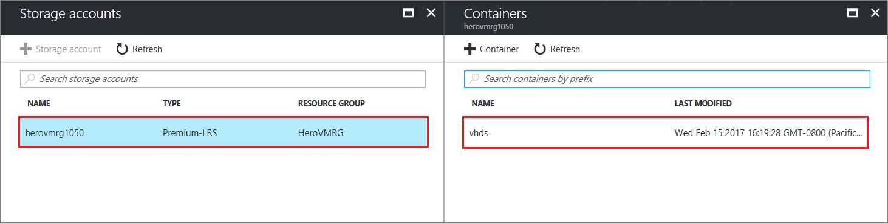

# Attach a data disk to a Windows virtual machine created with the classic deployment model
<!--
Refernce article:
    If you want to use the new portal, see [How to attach a data disk to a Windows VM in the Azure portal](../../virtual-machines-windows-attach-disk-portal.md?toc=%2fazure%2fvirtual-machines%2fwindows%2ftoc.json).
-->

This article shows you how to attach new and existing disks created with the Classic deployment model to a Windows virtual machine using the Azure portal.

You can also [attach a data disk to a Linux VM in the Azure portal](../../linux/attach-disk-portal.md).

Before you attach a disk, review these tips:

* The size of the virtual machine controls how many data disks you can attach. For details, see [Sizes for virtual machines](../../virtual-machines-windows-sizes.md?toc=%2fazure%2fvirtual-machines%2fwindows%2ftoc.json).

* To use Premium storage, you need a DS-series or GS-series virtual machine. You can use disks from both Premium and Standard storage accounts with these virtual machines. Premium storage is available in certain regions. For details, see [Premium Storage: High-Performance Storage for Azure Virtual Machine Workloads](../../../storage/storage-premium-storage.md?toc=%2fazure%2fvirtual-machines%2fwindows%2ftoc.json).

* For a new disk, you don't need to create it first because Azure creates it when you attach it.

You can also [attach a data disk using Powershell](../../virtual-machines-windows-attach-disk-ps.md).

> [!IMPORTANT]
> Azure has two different deployment models for creating and working with resources: [Resource Manager and Classic](../../../resource-manager-deployment-model.md).

## Find the virtual machine
1. Sign in to the [Azure portal](https://portal.azure.com/).
2. Select the virtual machine from the resource listed on the dashboard.
3. In the left pane under **Settings**, click **Disks**.

    

Continue by following instructions for attaching either a [new disk](#option-1-attach-a-new-disk) or an [existing disk](#option-2-attach-an-existing-disk).

## Option 1: Attach and initialize a new disk

1. On the **Disks** blade, click **Attach new**.
2. Review the default settings, update as necessary, and then click **OK**.

   

3. After Azure creates the disk and attaches it to the virtual machine, the new disk is listed in the virtual machine's disk settings under **Data Disks**.

### Initialize a new data disk

1. Connect to the virtual machine. For instructions, see [How to connect and log on to an Azure virtual machine running Windows](../../virtual-machines-windows-connect-logon.md?toc=%2fazure%2fvirtual-machines%2fwindows%2ftoc.json).
2. After you log on to the virtual machine, open **Server Manager**. In the left pane, select **File and Storage Services**.

    

3. Select **Disks**.
4. The **Disks** section lists the disks. Most often, a virtual machine has disk 0, disk 1, and disk 2. Disk 0 is the operating system disk, disk 1 is the temporary disk, and disk 2 is the data disk newly attached to the virtual machine. The data disk lists the Partition as **Unknown**.

 Right-click the disk and select **Initialize**.

5. You're notified that all data will be erased when the disk is initialized. Click **Yes** to acknowledge the warning and initialize the disk. Once complete, the partition will be listed as **GPT**. Right-click the disk again and select **New Volume**.

6. Complete the wizard using the default values. When the wizard is done, the **Volumes** section lists the new volume. The disk is now online and ready to store data.

    

## Option 2: Attach an existing disk
1. On the **Disks** blade, click **Attach existing**.
2. Under **Attach existing disk**, click **Location**.

   
3. Under **Storage accounts**, select the account and container that holds the .vhd file.

   

4. Select the .vhd file.
5. Under **Attach existing disk**, the file you just selected is listed under **VHD File**. Click **OK**.
6. After Azure attaches the disk to the virtual machine, it's listed in the virtual machine's disk settings under **Data Disks**.

## Use TRIM with standard storage

If you use standard storage (HDD), you should enable TRIM. TRIM discards unused blocks on the disk so you are only billed for storage that you are actually using. Using TRIM can save costs, including unused blocks that result from deleting large files.

You can run this command to check the TRIM setting. Open a command prompt on your Windows VM and type:

```
fsutil behavior query DisableDeleteNotify
```

If the command returns 0, TRIM is enabled correctly. If it returns 1, run the following command to enable TRIM:
```
fsutil behavior set DisableDeleteNotify 0
```

## Next steps
If your application needs to use the D: drive to store data, you can [change the drive letter of the Windows temporary disk](../../virtual-machines-windows-change-drive-letter.md).

## Additional resources
[About disks and VHDs for virtual machines](../../virtual-machines-linux-about-disks-vhds.md)
