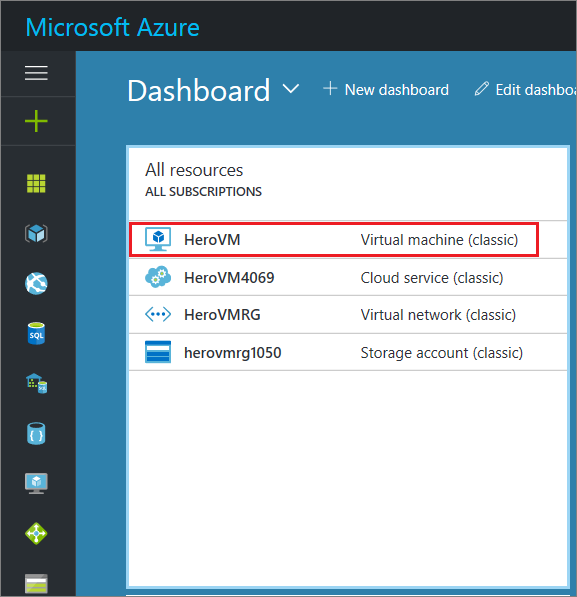
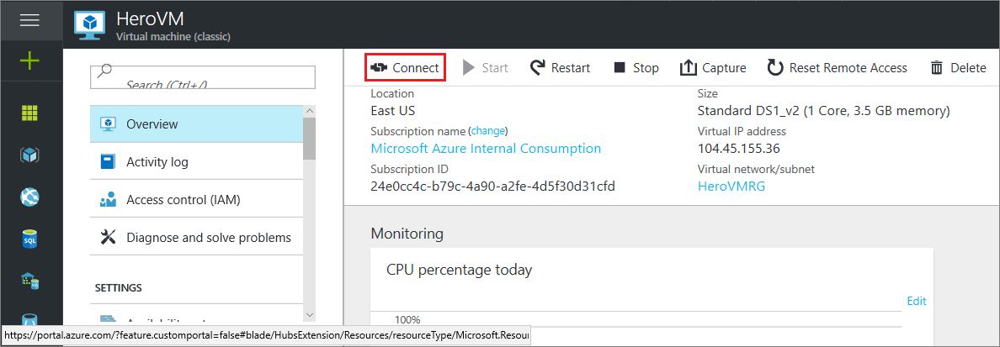
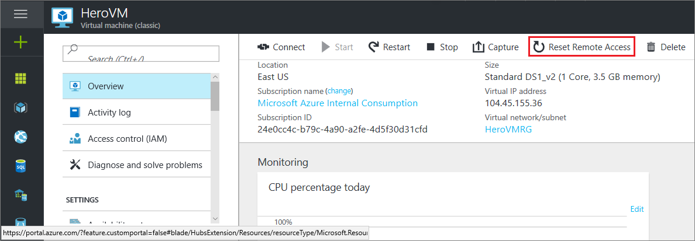
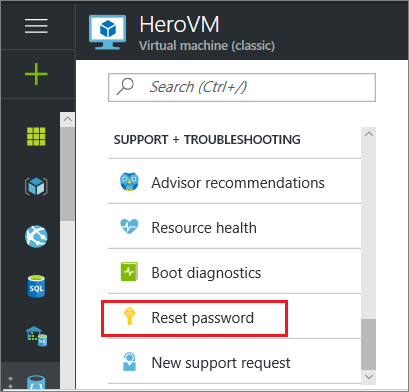

# Log on to a Windows virtual machine using the Azure portal
In the Azure portal, you use the **Connect** button to start a Remote Desktop session and log on to a Windows VM.

Do you want to connect to a Linux VM? See [How to log on to a virtual machine running Linux](../../linux/mac-create-ssh-keys.md).

<!--
Deleting, but not 100% sure
Learn how to [perform these steps using new Azure portal](../connect-logon.md?toc=%2fazure%2fvirtual-machines%2fwindows%2ftoc.json).
-->

> [!IMPORTANT]
> Azure has two different deployment models for creating and working with resources: [Resource Manager and Classic](../../../resource-manager-deployment-model.md). This article covers using the Classic deployment model. Microsoft recommends that most new deployments use the Resource Manager model. For information about how to log on to a VM using the Resource Manager model, see [here](../connect-logon.md?toc=%2fazure%2fvirtual-machines%2fwindows%2ftoc.json).

## Connect to the virtual machine
1. Sign in to the Azure portal.
2. Click on the virtual machine that you want to access. The name is listed in the **All resources** pane.

    

3. Click **Connect** on the command bar atop the virtual machine dashboard.

    

<!-- Don't know if this still applies
     I think we can zap this.
> [!TIP]
> If the **Connect** button isn't available, see the troubleshooting tips at the end of this article.
>
>
-->

## Log on to the virtual machine
[!INCLUDE [virtual-machines-log-on-win-server](../../../../includes/virtual-machines-log-on-win-server.md)]

## Next steps
* If the **Connect** button is inactive or you are having other problems with the Remote Desktop connection, try resetting the configuration. click **Reset remote access** from the virtual machine dashboard.

    

* For problems with your password, try resetting it. Click **Reset password** along the left edge of virtual machine dashboard, under **Support + Troubleshooting**.

    

If those tips don't work or aren't what you need, see [Troubleshoot Remote Desktop connections to a Windows-based Azure Virtual Machine](../troubleshoot-rdp-connection.md?toc=%2fazure%2fvirtual-machines%2fwindows%2ftoc.json). This article walks you through diagnosing and resolving common problems.
