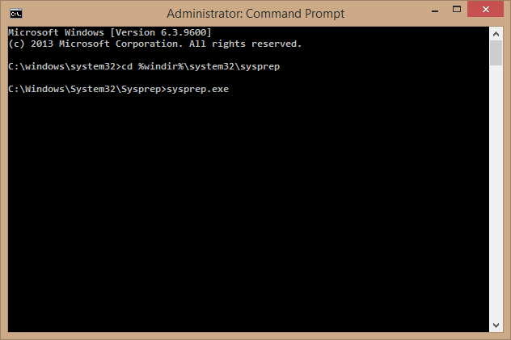

---
title: Create and upload a VM image using Powershell | Microsoft Docs
description: Learn to create and upload a generalized Windows Server image (VHD) using the classic deployment model and Azure Powershell.
services: virtual-machines-windows
documentationcenter: ''
author: cynthn
manager: timlt
editor: tysonn
tags: azure-service-management

ms.assetid: 8c4a08fe-7714-4bf0-be87-c728a7806d3f
ms.service: virtual-machines-windows
ms.workload: infrastructure-services
ms.tgt_pltfrm: vm-windows
ms.devlang: na
ms.topic: article
ms.date: 07/21/2016
ms.author: cynthn

---
# Create and upload a Windows Server VHD to Azure
This article shows you how to upload your own generalized VM image as a virtual hard disk (VHD) so you can use it to create virtual machines. For more details about disks and VHDs in Microsoft Azure, see [About Disks and VHDs for Virtual Machines](../../../storage/storage-about-disks-and-vhds-windows.md?toc=%2fazure%2fvirtual-machines%2fwindows%2ftoc.json).

> [!IMPORTANT]
> Azure has two different deployment models for creating and working with resources: [Resource Manager and Classic](../../../resource-manager-deployment-model.md). This article covers using the Classic deployment model. Microsoft recommends that most new deployments use the Resource Manager model. You can also [upload](../../virtual-machines-windows-upload-image.md?toc=%2fazure%2fvirtual-machines%2fwindows%2ftoc.json) a virtual machine using the Resource Manager model.

## Prerequisites
This article assumes you have:

* **An Azure subscription** - If you don't have one, you can [open an Azure account for free](https://azure.microsoft.com/pricing/free-trial/?WT.mc_id=A261C142F).
* **[Microsoft Azure PowerShell](/powershell/azure/overview)** - You have the Microsoft Azure PowerShell module installed and configured to use your subscription.
* **A .VHD file** - supported Windows operating system stored in a .vhd file and attached to a virtual machine. Check to see if the server roles running on the VHD are supported by Sysprep. For more information, see [Sysprep Support for Server Roles](https://msdn.microsoft.com/windows/hardware/commercialize/manufacture/desktop/sysprep-support-for-server-roles).

    > [!IMPORTANT]
    > The VHDX format is not supported in Microsoft Azure. You can convert the disk to VHD format using Hyper-V Manager or the [Convert-VHD cmdlet](http://technet.microsoft.com/library/hh848454.aspx). For details, see this [blogpost](http://blogs.msdn.com/b/virtual_pc_guy/archive/2012/10/03/using-powershell-to-convert-a-vhd-to-a-vhdx.aspx).

## Step 1: Prep the VHD
Before you upload the VHD to Azure, it needs to be generalized by using the Sysprep tool. This prepares the VHD to be used as an image. For details about Sysprep, see [How to Use Sysprep: An Introduction](http://technet.microsoft.com/library/bb457073.aspx). Back up the VM before running Sysprep.

From the virtual machine that the operating system was installed to, complete the following procedure:

1. Sign in to the operating system.
2. Open a command prompt window as an administrator. Change the directory to **%windir%\system32\sysprep**, and then run `sysprep.exe`.

    
3. The **System Preparation Tool** dialog box appears.

   
4. In the **System Preparation Tool**, select **Enter System Out of Box Experience (OOBE)** and make sure that **Generalize** is checked.
5. In **Shutdown Options**, select **Shutdown**.
6. Click **OK**.

## Step 2: Create a storage account and a container
You need a storage account in Azure so you have a place to upload the .vhd file. This step shows you how to create an account, or get the info you need from an existing account. Replace the variables in &lsaquo; brackets &rsaquo; with your own information.

1. Login

    ```powershell
    Add-AzureAccount
    ```

2. Set your Azure subscription.

    ```powershell
    Select-AzureSubscription -SubscriptionName <SubscriptionName>
    ```

3. Create a new storage account. The name of the storage account should be unique, 3-24 characters. The name can be any combination of letters and numbers. You also need to specify a location like "East US"

    ```powershell
    New-AzureStorageAccount –StorageAccountName <StorageAccountName> -Location <Location>
    ```

4. Set the new storage account as the default.

    ```powershell
    Set-AzureSubscription -CurrentStorageAccountName <StorageAccountName> -SubscriptionName <SubscriptionName>
    ```

5. Create a new container.

    ```powershell
    New-AzureStorageContainer -Name <ContainerName> -Permission Off
    ```

## Step 3: Upload the .vhd file
Use the [Add-AzureVhd](https://docs.microsoft.com/en-us/powershell/module/azure/add-azurevhd) to upload the VHD.

From the Azure PowerShell window you used in the previous step, type the following command and replace the variables in &lsaquo; brackets &rsaquo; with your own information.

```powershell
Add-AzureVhd -Destination "https://<StorageAccountName>.blob.core.windows.net/<ContainerName>/<vhdName>.vhd" -LocalFilePath <LocalPathtoVHDFile>
```

## Step 4: Add the image to your list of custom images
Use the [Add-AzureVMImage](https://docs.microsoft.com/en-us/powershell/module/azure/add-azurevmimage) cmdlet to add the image to the list of your custom images.

```powershell
Add-AzureVMImage -ImageName <ImageName> -MediaLocation "https://<StorageAccountName>.blob.core.windows.net/<ContainerName>/<vhdName>.vhd" -OS "Windows"
```

## Next steps
You can now [create a custom VM](createportal.md) using the image you uploaded.
