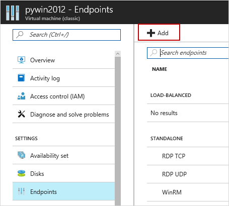
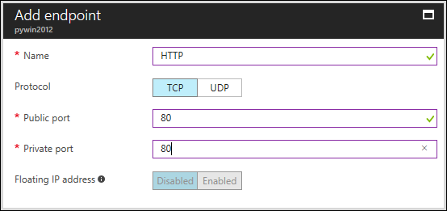

# Django Hello World web application on a Windows Server VM
> [!div class="op_single_selector"]
> * [Windows](python-django-web-app.md)
> * [Mac/Linux](../../linux/python-django-web-app.md)
> 
> 

 

> [!IMPORTANT] 
> Azure has two different deployment models for creating and working with resources: [Resource Manager and Classic](../../../resource-manager-deployment-model.md). This article covers using the Classic deployment model. Microsoft recommends that most new deployments use the Resource Manager model. For a Resource Manager template to deploy Django, see [here](https://azure.microsoft.com/documentation/templates/django-app/).

This tutorial describes how to host a Django-based website on Microsoft
Azure using a Windows Server virtual machine. This tutorial assumes you have no prior experience using Azure. After completing this tutorial, you will have a Django-based application up and running in the cloud.

You will learn how to:

* Set up an Azure virtual machine to host Django. While this tutorial explains how to accomplish this under Windows Server, the same could also be done with a Linux VM hosted in Azure.
* Create a new Django application from Windows.

By following this tutorial, you will build a simple Hello World web
application. The application will be hosted in an Azure virtual machine.

A screenshot of the completed application appears next.

![A browser window displaying the hello world page on Azure][1]

[!INCLUDE [create-account-and-vms-note](../../../../includes/create-account-and-vms-note.md)]

## Creating and configuring an Azure virtual machine to host Django
1. Follow the instructions given [here](tutorial.md) to create an Azure virtual machine of the Windows Server 2012 R2 Datacenter distribution.
2. Instruct Azure to direct port 80 traffic from the web to port 80 on the virtual machine:
   
   * In the Azure portal, go to the dashboard and select your newly created virtual machine.
   * Click **Endpoints** and then click **Add** at the top of the pane.

     

   * For **Name**, enter `HTTP`. Set the public and private TCP ports to 80.

     

   * When you're done, click **OK** at the bottom of the pane.
     
3. In the dashboard, select your VM and click **Connect** at the top of the pane to use Remote Desktop to remotely log into the newly created Azure virtual machine.  

**Important Note:** All instructions below assume you logged into the virtual machine correctly and are issuing commands there rather than your local machine.

## Installing Python, Django, WFastCGI
**Note:** In order to download using Internet Explorer you may have to configure IE ESC settings (Start/Administrative Tools/Server Manager/Local Server, then click  **IE Enhanced Security Configuration**, set to Off).

1. Install the latest Python 2.7 or 3.4 from [python.org][python.org].
2. Install the wfastcgi and django packages using pip.
   
    For Python 2.7, use the following command.
   
        c:\python27\scripts\pip install wfastcgi
        c:\python27\scripts\pip install django
   
    For Python 3.4, use the following command.
   
        c:\python34\scripts\pip install wfastcgi
        c:\python34\scripts\pip install django

## Installing IIS with FastCGI
1. Install IIS with FastCGI support.  This may take several minutes to execute.
   
        start /wait %windir%\System32\PkgMgr.exe /iu:IIS-WebServerRole;IIS-WebServer;IIS-CommonHttpFeatures;IIS-StaticContent;IIS-DefaultDocument;IIS-DirectoryBrowsing;IIS-HttpErrors;IIS-HealthAndDiagnostics;IIS-HttpLogging;IIS-LoggingLibraries;IIS-RequestMonitor;IIS-Security;IIS-RequestFiltering;IIS-HttpCompressionStatic;IIS-WebServerManagementTools;IIS-ManagementConsole;WAS-WindowsActivationService;WAS-ProcessModel;WAS-NetFxEnvironment;WAS-ConfigurationAPI;IIS-CGI

## Creating a new Django application
1. From *C:\inetpub\wwwroot*, enter the following command to create a new Django project:
   
   For Python 2.7, use the following command.
   
       C:\Python27\Scripts\django-admin.exe startproject helloworld
   
   For Python 3.4, use the following command.
   
       C:\Python34\Scripts\django-admin.exe startproject helloworld
   
   
2. The **django-admin** command generates a basic structure for Django-based websites:
   
   * **helloworld\manage.py** helps you to start hosting and stop hosting your Django-based website
   * **helloworld\helloworld\settings.py** contains Django settings for your application.
   * **helloworld\helloworld\urls.py** contains the mapping code between each url and its view.
3. Create a new file named **views.py** in the *C:\inetpub\wwwroot\helloworld\helloworld* directory. This will contain the view that renders the "hello world" page. Start your editor and enter the following:
   
       from django.http import HttpResponse
       def home(request):
           html = "<html><body>Hello World!</body></html>"
           return HttpResponse(html)
4. Replace the contents of the urls.py file with the following.
   
       from django.conf.urls import patterns, url
       urlpatterns = patterns('',
           url(r'^$', 'helloworld.views.home', name='home'),
       )

## Configuring IIS
1. Unlock the handlers section in the global applicationhost.config.  This will enable the use of the python handler in your web.config.
   
        %windir%\system32\inetsrv\appcmd unlock config -section:system.webServer/handlers
2. Enable WFastCGI.  This will add an application to the global applicationhost.config that refers to your Python interpreter executable and the wfastcgi.py script.
   
    Python 2.7:
   
        c:\python27\scripts\wfastcgi-enable
   
    Python 3.4:
   
        c:\python34\scripts\wfastcgi-enable
3. Create a web.config file in *C:\inetpub\wwwroot\helloworld*.  The value of the `scriptProcessor` attribute should match the output of the previous step.  See the page for [wfastcgi][wfastcgi] on pypi for more on wfastcgi settings.
   
    Python 2.7:
   
        <configuration>
          <appSettings>
            <add key="WSGI_HANDLER" value="django.core.handlers.wsgi.WSGIHandler()" />
            <add key="PYTHONPATH" value="C:\inetpub\wwwroot\helloworld" />
            <add key="DJANGO_SETTINGS_MODULE" value="helloworld.settings" />
          </appSettings>
          <system.webServer>
            <handlers>
                <add name="Python FastCGI" path="*" verb="*" modules="FastCgiModule" scriptProcessor="C:\Python27\python.exe|C:\Python27\Lib\site-packages\wfastcgi.pyc" resourceType="Unspecified" />
            </handlers>
          </system.webServer>
        </configuration>
   
    Python 3.4:
   
        <configuration>
          <appSettings>
            <add key="WSGI_HANDLER" value="django.core.handlers.wsgi.WSGIHandler()" />
            <add key="PYTHONPATH" value="C:\inetpub\wwwroot\helloworld" />
            <add key="DJANGO_SETTINGS_MODULE" value="helloworld.settings" />
          </appSettings>
          <system.webServer>
            <handlers>
                <add name="Python FastCGI" path="*" verb="*" modules="FastCgiModule" scriptProcessor="C:\Python34\python.exe|C:\Python34\Lib\site-packages\wfastcgi.py" resourceType="Unspecified" />
            </handlers>
          </system.webServer>
        </configuration>
4. Update the location of the IIS Default Web Site to point to the django project folder.
   
        %windir%\system32\inetsrv\appcmd set vdir "Default Web Site/" -physicalPath:"C:\inetpub\wwwroot\helloworld"
5. Finally, load the web page in your browser.

![A browser window displaying the hello world page on Azure][1]

## Shutting down your Azure virtual machine
When you're done with this tutorial, shut down and/or remove your newly created Azure virtual machine to free up resources for other tutorials and avoid incurring Azure usage charges.

[1]: ./media/python-django-web-app/django-helloworld-browser-azure.png

[port80]: ./media/python-django-web-app/django-helloworld-port80.png

[Web Platform Installer]: http://www.microsoft.com/web/downloads/platform.aspx
[python.org]: https://www.python.org/downloads/
[wfastcgi]: https://pypi.python.org/pypi/wfastcgi
