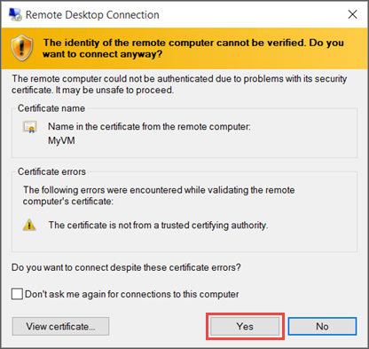

# How to connect and sign on to an Azure virtual machine running Windows
You'll use the **Connect** button in the Azure portal to start a Remote Desktop (RDP) session from a Windows desktop. First you connect to the virtual machine, and then you sign on.

To connect to a Windows VM from a Mac, you will need to install an RDP client for Mac such as [Microsoft Remote Desktop](https://aka.ms/rdmac).

## Connect to the virtual machine
1. Go to the [Azure portal](https://portal.azure.com/) to connect to a VM. Search for and select **Virtual machines**.
2. Select the virtual machine from the list.
3. At the beginning of the virtual machine page, select **Connect**.
4. On the **Connect to virtual machine** page, select **RDP**, and then select the appropriate **IP address** and **Port number**. In most cases, the default IP address and port should be used. Select **Download RDP File**. If the VM has a just-in-time policy set, you first need to select the **Request access** button to request access before you can download the RDP file. For more information about the just-in-time policy, see [Manage virtual machine access using the just in time policy](../../security-center/security-center-just-in-time.md).
5. Open the downloaded RDP file and select **Connect** when prompted. You will get a warning that the `.rdp` file is from an unknown publisher. This is expected. In the **Remote Desktop Connection** window, select **Connect** to continue.
   
    
3. In the **Windows Security** window, select **More choices** and then **Use a different account**. Enter the credentials for an account on the virtual machine and then select **OK**.
   
     **Local account**: This is usually the local account user name and password that you specified when you created the virtual machine. In this case, the domain is the name of the virtual machine and it is entered as *vmname*&#92;*username*.  
   
    **Domain joined VM**: If the VM belongs to a domain, enter the user name in the format *Domain*&#92;*Username*. The account also needs to either be in the Administrators group or have been granted remote access privileges to the VM.
   
    **Domain controller**: If the VM is a domain controller, enter the user name and password of a domain administrator account for that domain.
4. Select **Yes** to verify the identity of the virtual machine and finish logging on.
   
   


   > [!TIP]
   > If the **Connect** button in the portal is grayed-out and you are not connected to Azure via an [Express Route](../../expressroute/expressroute-introduction.md) or [Site-to-Site VPN](../../vpn-gateway/vpn-gateway-howto-site-to-site-resource-manager-portal.md) connection, you will need to create and assign your VM a public IP address before you can use RDP. For more information, see [Public IP addresses in Azure](../../virtual-network/public-ip-addresses.md).
   > 
   > 

## Connect to the virtual machine using PowerShell

 

If you are using PowerShell and have the Azure PowerShell  module installed you may also connect using the `Get-AzRemoteDesktopFile` cmdlet, as shown below.

This example will immediately launch the RDP connection, taking you through similar prompts as above.

```powershell
Get-AzRemoteDesktopFile -ResourceGroupName "RgName" -Name "VmName" -Launch
```

You may also save the RDP file for future use.

```powershell
Get-AzRemoteDesktopFile -ResourceGroupName "RgName" -Name "VmName" -LocalPath "C:\Path\to\folder"
```

## Next steps
If you have difficulty connecting, see [Troubleshoot Remote Desktop connections](troubleshoot-rdp-connection.md?toc=%2fazure%2fvirtual-machines%2fwindows%2ftoc.json). 

