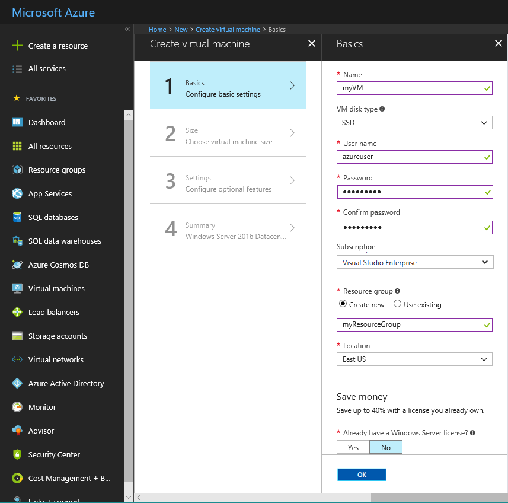
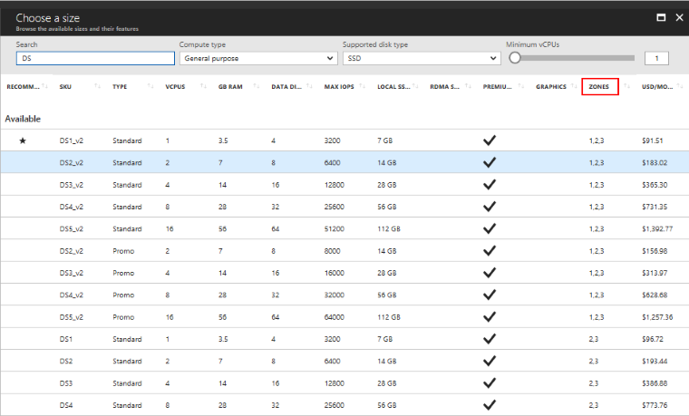
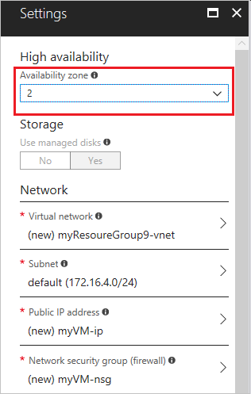
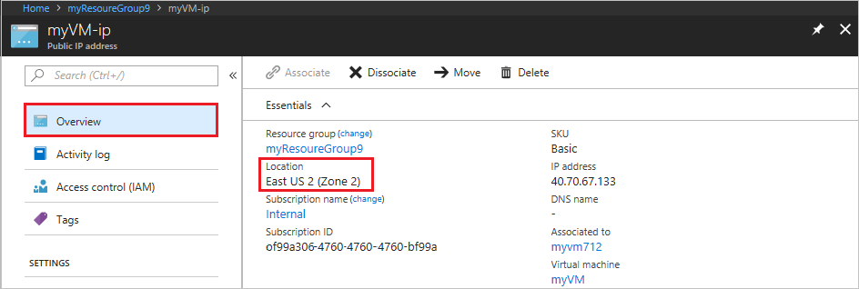

# Create a Windows virtual machine in an availability zone with the Azure portal

This article steps through using the Azure portal to create a virtual machine in an Azure availability zone. An [availability zone](../../availability-zones/az-overview.md) is a physically separate zone in an Azure region. Use availability zones to protect your apps and data from an unlikely failure or loss of an entire datacenter.

To use an availability zone, create your virtual machine in a [supported Azure region](../../availability-zones/az-region.md).

## Sign in to Azure 

Sign in to the Azure portal at https://portal.azure.com.

## Create virtual machine

1. Click **Create a resource** in the upper left-hand corner of the Azure portal.

2. Select **Compute**, and then select **Windows Server 2016 Datacenter**. 

3. Enter the virtual machine information. The user name and password entered here is used to sign in to the virtual machine. The password must be at least 12 characters long and meet the [defined complexity requirements](faq.md#what-are-the-password-requirements-when-creating-a-vm). Choose a Location such as East US 2 that supports availability zones. When complete, click **OK**.

    

4. Choose a size for the VM. Select a recommended size, or filter based on features. Confirm the size is available in the zone you want to use.

      

5. Under **Settings** > **High availability**, select one of the numbered zones from the **Availability zone** dropdown, keep the remaining defaults, and click **OK**.

    

6. On the summary page, click **Create** to start the virtual machine deployment.

7. The VM will be pinned to the Azure portal dashboard. Once the deployment has completed, the VM summary automatically opens.

## Confirm zone for managed disk and IP address

When the VM is deployed in an availability zone, a managed disk for the VM is created in the same availability zone. By default, a public IP address is also created in that zone.

You can confirm the zone settings for these resources in the portal.  

1. Click **Resource groups** and then the name of the resource group for the VM, such as *myResourceGroup*.

2. Click the name of the Disk resource. The **Overview** page includes details about the location and availability zone of the resource.

    

3. Click the name of the Public IP address resource. The **Overview** page includes details about the location and availability zone of the resource.

    

## Next steps

In this article, you learned how to create a VM in an availability zone. Learn more about [availability](availability.md) for Azure VMs.
