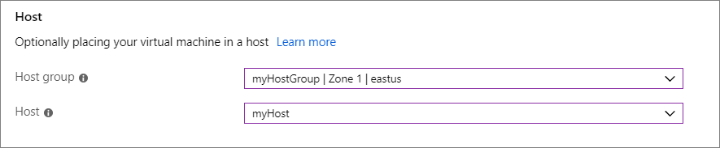

# Deploy VMs to dedicated hosts using the portal

This article guides you through how to create an Azure [dedicated host](dedicated-hosts.md) to host your virtual machines (VMs). 

[!INCLUDE [virtual-machines-common-dedicated-hosts-portal](../../../includes/virtual-machines-common-dedicated-hosts-portal.md)]

## Create a VM

1. Choose **Create a resource** in the upper left-hand corner of the Azure portal.
1. In the **New** page, under **Popular**, select **Windows Server 2016 Datacenter**.
1. In the **Basics** tab, under **Project details**, make sure the correct subscription is selected and then select *myDedicatedHostsRG* as the **Resource group**. 
1. Under **Instance details**, type *myVM* for the **Virtual machine name** and choose *East US* for your **Location**.
1. In **Availability options** select **Availability zone**, select *1* from the drop-down.
1. For the size, select **Change size**. In the list of available sizes, choose one from the Esv3 series, like **Standard E2s v3**. You may need to clear the filter in order to see all of the available sizes.
1. Under **Administrator account**,  provide a username, such as *azureuser* and a password. The password must be at least 12 characters long and meet the [defined complexity requirements](faq.md#what-are-the-password-requirements-when-creating-a-vm).
1. Under **Inbound port rules**, choose **Allow selected ports** and then select **RDP (3389)** from the drop-down.
1. At the top of the page, select the **Advanced** tab and in the **Host** section, select *myHostGroup* for **Host group** and *myHost* for the **Host**. 
	
1. Leave the remaining defaults and then select the **Review + create** button at the bottom of the page.
1. When you see the message that validation has passed, select **Create**.

## Add an existing VM 

You can add an existing VM to a dedicated host, but the VM must first be Stop\Deallocated. Before you move a VM to a dedicated host, make sure that the VM configuration is supported:

- The VM size must be in the same size family as the dedicated host. For example, if your dedicated host is DSv3, then the VM size could be Standard_D4s_v3, but it could not be a Standard_A4_v2. 
- The VM needs to be located in same region as the dedicated host.
- The VM can't be part of a proximity placement group. Remove the VM from the proximity placement group before moving it to a dedicated host. For more information, see [Move a VM out of a proximity placement group](https://docs.microsoft.com/azure/virtual-machines/windows/proximity-placement-groups#move-an-existing-vm-out-of-a-proximity-placement-group)
- The VM can't be in an availability set.
- If the VM is in an availability zone, it must be the same availability zone as the host group. The availability zone settings for the VM and the host group must match.

Move the VM to a dedicated host using the [portal](https://portal.azure.com).

1. Open the page for the VM.
1. Select **Stop** to stop\deallocate the VM.
1. Select **Configuration** from the left menu.
1. Select a host group and a host from the drop-down menus.
1. When you are done, select **Save** at the top of the page.
1. After the VM has been added to the host, select **Overview** from the left menu.
1. At the top of the page, select **Start** to restart the VM.

## Next steps

- For more information, see the [Dedicated hosts](dedicated-hosts.md) overview. 

- There is sample template, found [here](https://github.com/Azure/azure-quickstart-templates/blob/master/201-vm-dedicated-hosts/README.md), that uses both zones and fault domains for maximum resiliency in a region.

- You can also deploy a dedicated host using [Azure PowerShell](dedicated-hosts-powershell.md).
