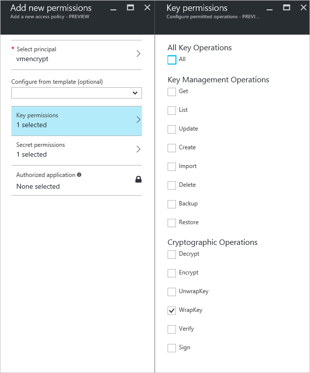

# Creating and configuring a key vault for Azure Disk Encryption with Microsoft Entra ID (previous release)

**Applies to:** :heavy_check_mark: Windows VMs

**The new release of Azure Disk Encryption eliminates the requirement for providing a Microsoft Entra application parameter to enable VM disk encryption. With the new release, you are no longer required to provide Microsoft Entra credentials during the enable encryption step. All new VMs must be encrypted without the Microsoft Entra application parameters using the new release. To view instructions to enable VM disk encryption using the new release, see [Azure Disk Encryption](disk-encryption-overview.md). VMs that were already encrypted with Microsoft Entra application parameters are still supported and should continue to be maintained with the Microsoft Entra syntax.**

Azure Disk Encryption uses Azure Key Vault to control and manage disk encryption keys and secrets.  For more information about key vaults, see [Get started with Azure Key Vault](../../key-vault/general/overview.md) and [Secure your key vault](../../key-vault/general/security-features.md).

Creating and configuring a key vault for use with Azure Disk Encryption with Microsoft Entra ID (previous release) involves three steps:

1. Create a key vault.
2. Set up a Microsoft Entra application and service principal.
3. Set the key vault access policy for the Microsoft Entra app.
4. Set key vault advanced access policies.

You may also, if you wish, generate or import a key encryption key (KEK).

See the main [Creating and configuring a key vault for Azure Disk Encryption](disk-encryption-key-vault.md) article for steps on how to [Install tools and connect to Azure](disk-encryption-key-vault.md#install-tools-and-connect-to-azure).

> [!Note]
> The steps in this article are automated in the [Azure Disk Encryption prerequisites CLI script](https://github.com/ejarvi/ade-cli-getting-started) and [Azure Disk Encryption prerequisites PowerShell script](https://github.com/Azure/azure-powershell/tree/master/src/Compute/Compute/Extension/AzureDiskEncryption/Scripts).


## Create a key vault
Azure Disk Encryption is integrated with [Azure Key Vault](../../key-vault/index.yml) to help you control and manage the disk-encryption keys and secrets in your key vault subscription. You can create a key vault or use an existing one for Azure Disk Encryption. For more information about key vaults, see [Get started with Azure Key Vault](../../key-vault/general/overview.md) and [Secure your key vault](../../key-vault/general/security-features.md). You can use a Resource Manager template, Azure PowerShell, or the Azure CLI to create a key vault.


>[!WARNING]
>In order to make sure the encryption secrets don’t cross regional boundaries, Azure Disk Encryption needs the Key Vault and the VMs to be co-located in the same region. Create and use a Key Vault that is in the same region as the VM to be encrypted.


### Create a key vault with PowerShell

You can create a key vault with Azure PowerShell using the [New-AzKeyVault](/powershell/module/az.keyvault/New-azKeyVault) cmdlet. For another cmdlets for Key Vault, see [Az.KeyVault](/powershell/module/az.keyvault/).

1. Create a new resource group, if needed, with [New-AzResourceGroup](/powershell/module/az.Resources/New-azResourceGroup).  To list data center locations, use [Get-AzLocation](/powershell/module/az.resources/get-azlocation).

     ```azurepowershell-interactive
     # Get-AzLocation
     New-AzResourceGroup –Name 'MyKeyVaultResourceGroup' –Location 'East US'
     ```

1. Create a new key vault using [New-AzKeyVault](/powershell/module/az.keyvault/New-azKeyVault)

      ```azurepowershell-interactive
     New-AzKeyVault -VaultName 'MySecureVault' -ResourceGroupName 'MyKeyVaultResourceGroup' -Location 'East US'
     ```

4. Note the **Vault Name**, **Resource Group Name**, **Resource ID**, **Vault URI**, and the **Object ID** that are returned for later use when you encrypt the disks.


### Create a key vault with Azure CLI
You can manage your key vault with Azure CLI using the [az keyvault](/cli/azure/keyvault#commands) commands. To create a key vault, use [az keyvault create](/cli/azure/keyvault#az-keyvault-create).

1. Create a new resource group, if needed, with [az group create](/cli/azure/group#az-group-create). To  list locations, use [az account list-locations](/cli/azure/account#az-account-list)

     ```azurecli-interactive
     # To list locations: az account list-locations --output table
     az group create -n "MyKeyVaultResourceGroup" -l "East US"
     ```

3. Create a new key vault using [az keyvault create](/cli/azure/keyvault#az-keyvault-create).

     ```azurecli-interactive
     az keyvault create --name "MySecureVault" --resource-group "MyKeyVaultResourceGroup" --location "East US"
     ```

4. Note the **Vault Name** (name), **Resource Group Name**, **Resource ID** (ID), **Vault URI**, and the **Object ID** that are returned for use later.

### Create a key vault with a Resource Manager template

You can create a key vault by using the [Resource Manager template](https://github.com/Azure/azure-quickstart-templates/tree/master/quickstarts/microsoft.keyvault/key-vault-create).

1. On the Azure Quickstart Template, select **Deploy to Azure**.
2. Select the subscription, resource group, resource group location, Key Vault name, Object ID,  legal terms, and agreement, and then select **Purchase**.


<a name='set-up-an-azure-ad-app-and-service-principal'></a>

## Set up a Microsoft Entra app and service principal
When you need encryption to be enabled on a running VM in Azure, Azure Disk Encryption generates and writes the encryption keys to your key vault. Managing encryption keys in your key vault requires Microsoft Entra authentication. Create a Microsoft Entra application for this purpose. For authentication purposes, you can use either client secret-based authentication or [client certificate-based Microsoft Entra authentication](../../active-directory/authentication/active-directory-certificate-based-authentication-get-started.md).


<a name='set-up-an-azure-ad-app-and-service-principal-with-azure-powershell'></a>

### Set up a Microsoft Entra app and service principal with Azure PowerShell
To execute the following commands, get and use the [Azure AD PowerShell module](/powershell/azure/active-directory/install-adv2).

1. Use the [New-AzADApplication](/powershell/module/az.resources/new-azadapplication) PowerShell cmdlet to create a Microsoft Entra application. MyApplicationHomePage and the MyApplicationUri can be any values you wish.

     ```azurepowershell
     $aadClientSecret = "My AAD client secret"
     $aadClientSecretSec = ConvertTo-SecureString -String $aadClientSecret -AsPlainText -Force
     $azureAdApplication = New-AzADApplication -DisplayName "My Application Display Name" -HomePage "https://MyApplicationHomePage" -IdentifierUris "https://MyApplicationUri" -Password $aadClientSecretSec
     $servicePrincipal = New-AzADServicePrincipal –ApplicationId $azureAdApplication.ApplicationId -Role Contributor
     ```

3. The $azureAdApplication.ApplicationId is the Microsoft Entra ClientID and the $aadClientSecret is the client secret that you'll use later to enable Azure Disk Encryption. Safeguard the Microsoft Entra client secret appropriately. Running `$azureAdApplication.ApplicationId` will show you the ApplicationID.


<a name='set-up-an-azure-ad-app-and-service-principal-with-azure-cli'></a>

### Set up a Microsoft Entra app and service principal with Azure CLI

You can manage your service principals with Azure CLI using the [az ad sp](/cli/azure/ad/sp) commands. For more information, see [Create an Azure service principal](/cli/azure/create-an-azure-service-principal-azure-cli).

1. Create a new service principal.

     ```azurecli-interactive
     az ad sp create-for-rbac --name "ServicePrincipalName" --password "My-AAD-client-secret" --role Contributor --scopes /subscriptions/<subscription_id>
     ```
3.  The appId returned is the Microsoft Entra ClientID used in other commands. It's also the SPN you'll use for az keyvault set-policy. The password is the client secret that you should use later to enable Azure Disk Encryption. Safeguard the Microsoft Entra client secret appropriately.

<a name='set-up-an-azure-ad-app-and-service-principal-through-the-azure-portal'></a>

### Set up a Microsoft Entra app and service principal through the Azure portal
Use the steps from the [Use portal to create a Microsoft Entra application and service principal that can access resources](../../active-directory/develop/howto-create-service-principal-portal.md) article to create a Microsoft Entra application. Each of these steps will take you directly to the article section to complete.

1. [Verify required permissions](../../active-directory/develop/howto-create-service-principal-portal.md#permissions-required-for-registering-an-app)
2. [Create a Microsoft Entra application](../../active-directory/develop/howto-create-service-principal-portal.md#register-an-application-with-azure-ad-and-create-a-service-principal)
     - You can use any name and sign-on URL you would like when creating the application.
3. [Get the application ID and the authentication key](../../active-directory/develop/howto-create-service-principal-portal.md#sign-in-to-the-application).
     - The authentication key is the client secret and is used as the AadClientSecret for Set-AzVMDiskEncryptionExtension.
        - The authentication key is used by the application as a credential to sign in to Microsoft Entra ID. In the Azure portal, this secret is called keys, but has no relation to key vaults. Secure this secret appropriately.
     - The application ID will be used later as the AadClientId for Set-AzVMDiskEncryptionExtension and as the ServicePrincipalName for Set-AzKeyVaultAccessPolicy.

<a name='set-the-key-vault-access-policy-for-the-azure-ad-app'></a>

## Set the key vault access policy for the Microsoft Entra app
To write encryption secrets to a specified Key Vault, Azure Disk Encryption needs the Client ID and the Client Secret of the Microsoft Entra application that has permissions to write secrets to the Key Vault.

> [!NOTE]
> Azure Disk Encryption requires you to configure the following access policies to your Microsoft Entra client application: _WrapKey_ and _Set_ permissions.

<a name='set-the-key-vault-access-policy-for-the-azure-ad-app-with-azure-powershell'></a>

### Set the key vault access policy for the Microsoft Entra app with Azure PowerShell
Your Microsoft Entra application needs rights to access the keys or secrets in the vault. Use the [Set-AzKeyVaultAccessPolicy](/powershell/module/az.keyvault/set-azkeyvaultaccesspolicy) cmdlet to grant permissions to the application, using the client ID (which was generated when the application was registered) as the _–ServicePrincipalName_ parameter value. To learn more, see the blog post [Azure Key Vault - Step by Step](/archive/blogs/kv/azure-key-vault-step-by-step).

1. Set the key vault access policy for the AD application with PowerShell.

     ```azurepowershell
     $keyVaultName = 'MySecureVault'
     $aadClientID = 'MyAadAppClientID'
     $KVRGname = 'MyKeyVaultResourceGroup'
     Set-AzKeyVaultAccessPolicy -VaultName $keyVaultName -ServicePrincipalName $aadClientID -PermissionsToKeys 'WrapKey' -PermissionsToSecrets 'Set' -ResourceGroupName $KVRGname
     ```

<a name='set-the-key-vault-access-policy-for-the-azure-ad-app-with-azure-cli'></a>

### Set the key vault access policy for the Microsoft Entra app with Azure CLI
Use [az keyvault set-policy](/cli/azure/keyvault#az-keyvault-set-policy) to set the access policy. For more information, see [Manage Key Vault using CLI 2.0](../../key-vault/general/manage-with-cli2.md#authorizing-an-application-to-use-a-key-or-secret).

Give the service principal you created via the Azure CLI access to get secrets and wrap keys with the following command:

```azurecli-interactive
az keyvault set-policy --name "MySecureVault" --spn "<spn created with CLI/the Azure AD ClientID>" --key-permissions wrapKey --secret-permissions set
```

<a name='set-the-key-vault-access-policy-for-the-azure-ad-app-with-the-portal'></a>

### Set the key vault access policy for the Microsoft Entra app with the portal

1. Open the resource group with your key vault.
2. Select your key vault, go to **Access Policies**, then select **Add new**.
3. Under **Select principal**, search for the Microsoft Entra application you created and select it.
4. For **Key permissions**, check **Wrap Key** under **Cryptographic Operations**.
5. For **Secret permissions**, check **Set** under **Secret Management Operations**.
6. Select **OK** to save the access policy.




## Set key vault advanced access policies
The Azure platform needs access to the encryption keys or secrets in your key vault to make them available to the VM for booting and decrypting the volumes. Enable disk encryption on the key vault or deployments will fail.

### Set key vault advanced access policies with Azure PowerShell
 Use the key vault PowerShell cmdlet [Set-AzKeyVaultAccessPolicy](/powershell/module/az.keyvault/set-azkeyvaultaccesspolicy) to enable disk encryption for the key vault.

  - **Enable Key Vault for disk encryption:** EnabledForDiskEncryption is required for Azure Disk encryption.

     ```azurepowershell-interactive
     Set-AzKeyVaultAccessPolicy -VaultName 'MySecureVault' -ResourceGroupName 'MyKeyVaultResourceGroup' -EnabledForDiskEncryption
     ```

  - **Enable Key Vault for deployment, if needed:** Enables the Microsoft. Compute resource provider to retrieve secrets from this key vault when this key vault is referenced in resource creation, for example when creating a virtual machine.

     ```azurepowershell-interactive
      Set-AzKeyVaultAccessPolicy -VaultName 'MySecureVault' -ResourceGroupName 'MyKeyVaultResourceGroup' -EnabledForDeployment
     ```

  - **Enable Key Vault for template deployment, if needed:** Enables Azure Resource Manager to get secrets from this key vault when this key vault is referenced in a template deployment.

     ```azurepowershell-interactive
     Set-AzKeyVaultAccessPolicy -VaultName 'MySecureVault' -ResourceGroupName 'MyKeyVaultResourceGroup' -EnabledForTemplateDeployment
     ```

### Set key vault advanced access policies using the Azure CLI
Use [az keyvault update](/cli/azure/keyvault#az-keyvault-update) to enable disk encryption for the key vault.

 - **Enable Key Vault for disk encryption:** Enabled-for-disk-encryption is required.

     ```azurecli-interactive
     az keyvault update --name "MySecureVault" --resource-group "MyKeyVaultResourceGroup" --enabled-for-disk-encryption "true"
     ```

 - **Enable Key Vault for deployment, if needed:** Allow Virtual Machines to retrieve certificates stored as secrets from the vault.
     ```azurecli-interactive
     az keyvault update --name "MySecureVault" --resource-group "MyKeyVaultResourceGroup" --enabled-for-deployment "true"
     ```

 - **Enable Key Vault for template deployment, if needed:** Allow Resource Manager to retrieve secrets from the vault.
     ```azurecli-interactive
     az keyvault update --name "MySecureVault" --resource-group "MyKeyVaultResourceGroup" --enabled-for-template-deployment "true"
     ```


### Set key vault advanced access policies through the Azure portal

1. Select your keyvault, go to **Access Policies**, and **Click to show advanced access policies**.
2. Select the box labeled **Enable access to Azure Disk Encryption for volume encryption**.
3. Select **Enable access to Azure Virtual Machines for deployment** and/or **Enable Access to Azure Resource Manager for template deployment**, if needed.
4. Select **Save**.


## Set up a key encryption key (optional)
If you want to use a key encryption key (KEK) for an additional layer of security for encryption keys, add a KEK to your key vault. Use the [Add-AzKeyVaultKey](/powershell/module/az.keyvault/add-azkeyvaultkey) cmdlet to create a key encryption key in the key vault. You can also import a KEK from your on-premises key management HSM. For more information, see [Key Vault Documentation](../../key-vault/keys/hsm-protected-keys.md). When a key encryption key is specified, Azure Disk Encryption uses that key to wrap the encryption secrets before writing to Key Vault.

* When generating keys, use an RSA key type. Azure Disk Encryption doesn't yet support using Elliptic Curve keys.

* Your key vault secret and KEK URLs must be versioned. Azure enforces this restriction of versioning. For valid secret and KEK URLs, see the following examples:

  * Example of a valid secret URL:
      *https://contosovault.vault.azure.net/secrets/EncryptionSecretWithKek/xxxxxxxxxxxxxxxxxxxxxxxxxxxxxxxx*
  * Example of a valid KEK URL:
      *https://contosovault.vault.azure.net/keys/diskencryptionkek/xxxxxxxxxxxxxxxxxxxxxxxxxxxxxxxx*

* Azure Disk Encryption doesn't support specifying port numbers as part of key vault secrets and KEK URLs. For examples of non-supported and supported key vault URLs, see the following examples:

  * Unacceptable key vault URL
     *https://contosovault.vault.azure.net:443/secrets/contososecret/xxxxxxxxxxxxxxxxxxxxxxxxxxxxxxxx*
  * Acceptable key vault URL:
      *https://contosovault.vault.azure.net/secrets/contososecret/xxxxxxxxxxxxxxxxxxxxxxxxxxxxxxxx*

### Set up a key encryption key with Azure PowerShell
Before using the PowerShell script, you should be familiar with the Azure Disk Encryption prerequisites to understand the steps in the script. The sample script might need changes for your environment. This script creates all Azure Disk Encryption prerequisites and encrypts an existing IaaS VM, wrapping the disk encryption key by using a key encryption key.

 ```powershell
 # Step 1: Create a new resource group and key vault in the same location.
	 # Fill in 'MyLocation', 'MyKeyVaultResourceGroup', and 'MySecureVault' with your values.
	 # Use Get-AzLocation to get available locations and use the DisplayName.
	 # To use an existing resource group, comment out the line for New-AzResourceGroup

     $Loc = 'MyLocation';
     $KVRGname = 'MyKeyVaultResourceGroup';
     $KeyVaultName = 'MySecureVault';
     New-AzResourceGroup –Name  $KVRGname –Location $Loc;
     New-AzKeyVault -VaultName $KeyVaultName -ResourceGroupName $KVRGname -Location $Loc;
     $KeyVault = Get-AzKeyVault -VaultName $KeyVaultName -ResourceGroupName  $KVRGname;
     $KeyVaultResourceId = (Get-AzKeyVault -VaultName $KeyVaultName -ResourceGroupName  $KVRGname).ResourceId;
     $diskEncryptionKeyVaultUrl = (Get-AzKeyVault -VaultName $KeyVaultName -ResourceGroupName  $KVRGname).VaultUri;

 # Step 2: Create the AD application and service principal.
	 # Fill in 'MyAADClientSecret', "<My Application Display Name>", "<https://MyApplicationHomePage>", and "<https://MyApplicationUri>" with your values.
	 # MyApplicationHomePage and the MyApplicationUri can be any values you wish.

	 $aadClientSecret =  'MyAADClientSecret';
     $aadClientSecretSec = ConvertTo-SecureString -String $aadClientSecret -AsPlainText -Force;
     $azureAdApplication = New-AzADApplication -DisplayName "<My Application Display Name>" -HomePage "<https://MyApplicationHomePage>" -IdentifierUris "<https://MyApplicationUri>" -Password $aadClientSecretSec
     $servicePrincipal = New-AzADServicePrincipal –ApplicationId $azureAdApplication.ApplicationId -Role Contributor;
     $aadClientID = $azureAdApplication.ApplicationId;

 #Step 3: Enable the vault for disk encryption and set the access policy for the Microsoft Entra application.

	 Set-AzKeyVaultAccessPolicy -VaultName $KeyVaultName -ResourceGroupName $KVRGname -EnabledForDiskEncryption;
     Set-AzKeyVaultAccessPolicy -VaultName $keyVaultName -ServicePrincipalName $aadClientID -PermissionsToKeys 'WrapKey' -PermissionsToSecrets 'Set' -ResourceGroupName  $KVRGname;

 #Step 4: Create a new key in the key vault with the Add-AzKeyVaultKey cmdlet.
	 # Fill in 'MyKeyEncryptionKey' with your value.

	 $keyEncryptionKeyName = 'MyKeyEncryptionKey';
     Add-AzKeyVaultKey -VaultName $KeyVaultName -Name $keyEncryptionKeyName -Destination 'Software';
     $keyEncryptionKeyUrl = (Get-AzKeyVaultKey -VaultName $KeyVaultName -Name $keyEncryptionKeyName).Key.kid;

 #Step 5: Encrypt the disks of an existing IaaS VM
	 # Fill in 'MySecureVM' and 'MyVirtualMachineResourceGroup' with your values.

	 $VMName = 'MySecureVM';
      $VMRGName = 'MyVirtualMachineResourceGroup';
     Set-AzVMDiskEncryptionExtension -ResourceGroupName $VMRGName -VMName $vmName -AadClientID $aadClientID -AadClientSecret $aadClientSecret -DiskEncryptionKeyVaultUrl $diskEncryptionKeyVaultUrl -DiskEncryptionKeyVaultId $KeyVaultResourceId -KeyEncryptionKeyUrl $keyEncryptionKeyUrl -KeyEncryptionKeyVaultId $KeyVaultResourceId;
```

## Certificate-based authentication (optional)
If you would like to use certificate authentication, you can upload one to your key vault and deploy it to the client. Before using the PowerShell script, you should be familiar with the Azure Disk Encryption prerequisites to understand the steps in the script. The sample script might need changes for your environment.


 ```powershell

 # Fill in "MyKeyVaultResourceGroup", "MySecureVault", and 'MyLocation' ('My location' only if needed)

   $KVRGname = 'MyKeyVaultResourceGroup'
   $KeyVaultName= 'MySecureVault'

   # Create a key vault and set enabledForDiskEncryption property on it.
   # Comment out the next three lines if you already have an existing key vault enabled for encryption. No need to set 'My location' in this case.

   $Loc = 'MyLocation'
   New-AzKeyVault -VaultName $KeyVaultName -ResourceGroupName $KVRGname -Location $Loc
   Set-AzKeyVaultAccessPolicy -VaultName $KeyVaultName -ResourceGroupName $KVRGname -EnabledForDiskEncryption

   #Setting some variables with the key vault information
   $KeyVault = Get-AzKeyVault -VaultName $KeyVaultName -ResourceGroupName $KVRGname
   $DiskEncryptionKeyVaultUrl = $KeyVault.VaultUri
   $KeyVaultResourceId = $KeyVault.ResourceId

   # Create the Microsoft Entra application and associate the certificate with it.
   # Fill in "C:\certificates\mycert.pfx", "Password", "<My Application Display Name>", "<https://MyApplicationHomePage>", and "<https://MyApplicationUri>" with your values.
   # MyApplicationHomePage and the MyApplicationUri can be any values you wish

   $CertPath = "C:\certificates\mycert.pfx"
   $CertPassword = "Password"
   $Cert = New-Object System.Security.Cryptography.X509Certificates.X509Certificate2($CertPath, $CertPassword)
   $CertValue = [System.Convert]::ToBase64String($cert.GetRawCertData())

   $AzureAdApplication = New-AzADApplication -DisplayName "<My Application Display Name>" -HomePage "<https://MyApplicationHomePage>" -IdentifierUris "<https://MyApplicationUri>" -CertValue $CertValue
   $ServicePrincipal = New-AzADServicePrincipal -ApplicationId $AzureAdApplication.ApplicationId -Role Contributor

   $AADClientID = $AzureAdApplication.ApplicationId
   $aadClientCertThumbprint= $cert.Thumbprint

   Set-AzKeyVaultAccessPolicy -VaultName $keyVaultName -ServicePrincipalName $aadClientID -PermissionsToKeys 'WrapKey' -PermissionsToSecrets 'Set' -ResourceGroupName $KVRGname

   # Upload the pfx file to the key vault.
   # Fill in "MyAADCert".

   $KeyVaultSecretName = "MyAADCert"
   $FileContentBytes = get-content $CertPath -Encoding Byte
   $FileContentEncoded = [System.Convert]::ToBase64String($fileContentBytes)
           $JSONObject = @"
           {
               "data" : "$filecontentencoded",
               "dataType" : "pfx",
               "password" : "$CertPassword"
           }
"@

   $JSONObjectBytes = [System.Text.Encoding]::UTF8.GetBytes($jsonObject)
   $JSONEncoded = [System.Convert]::ToBase64String($jsonObjectBytes)

   #Set the secret and set the key vault policy for -EnabledForDeployment

   $Secret = ConvertTo-SecureString -String $JSONEncoded -AsPlainText -Force
   Set-AzKeyVaultSecret -VaultName $KeyVaultName -Name $KeyVaultSecretName -SecretValue $Secret
   Set-AzKeyVaultAccessPolicy -VaultName $KeyVaultName -ResourceGroupName $KVRGname -EnabledForDeployment

   # Deploy the certificate to the VM
   # Fill in 'MySecureVM' and 'MyVirtualMachineResourceGroup' with your values.

   $VMName = 'MySecureVM'
   $VMRGName = 'MyVirtualMachineResourceGroup'
   $CertUrl = (Get-AzKeyVaultSecret -VaultName $KeyVaultName -Name $KeyVaultSecretName).Id
   $SourceVaultId = (Get-AzKeyVault -VaultName $KeyVaultName -ResourceGroupName $KVRGName).ResourceId
   $VM = Get-AzVM -ResourceGroupName $VMRGName -Name $VMName
   $VM = Add-AzVMSecret -VM $VM -SourceVaultId $SourceVaultId -CertificateStore "My" -CertificateUrl $CertUrl
   Update-AzVM -VM $VM -ResourceGroupName $VMRGName

   #Enable encryption on the VM using Microsoft Entra client ID and the client certificate thumbprint

   Set-AzVMDiskEncryptionExtension -ResourceGroupName $VMRGName -VMName $VMName -AadClientID $AADClientID -AadClientCertThumbprint $AADClientCertThumbprint -DiskEncryptionKeyVaultUrl $DiskEncryptionKeyVaultUrl -DiskEncryptionKeyVaultId $KeyVaultResourceId
 ```

## Certificate-based authentication and a KEK (optional)

If you would like to use certificate authentication and wrap the encryption key with a KEK, you can use the below script as an example. Before using the PowerShell script, you should be familiar with  all of the previous Azure Disk Encryption prerequisites to understand the steps in the script. The sample script might need changes for your environment.


```powershell
# Fill in 'MyKeyVaultResourceGroup', 'MySecureVault', and 'MyLocation' (if needed)

   $KVRGname = 'MyKeyVaultResourceGroup'
   $KeyVaultName= 'MySecureVault'

   # Create a key vault and set enabledForDiskEncryption property on it.
   # Comment out the next three lines if you already have an existing key vault enabled for encryption.

   $Loc = 'MyLocation'
   New-AzKeyVault -VaultName $KeyVaultName -ResourceGroupName $KVRGname -Location $Loc
   Set-AzKeyVaultAccessPolicy -VaultName $KeyVaultName -ResourceGroupName $KVRGname -EnabledForDiskEncryption

   # Create the Azure AD application and associate the certificate with it.
   # Fill in "C:\certificates\mycert.pfx", "Password", "<My Application Display Name>", "<https://MyApplicationHomePage>", and "<https://MyApplicationUri>" with your values.
   # MyApplicationHomePage and the MyApplicationUri can be any values you wish

   $CertPath = "C:\certificates\mycert.pfx"
   $CertPassword = "Password"
   $Cert = New-Object System.Security.Cryptography.X509Certificates.X509Certificate2($CertPath, $CertPassword)
   $CertValue = [System.Convert]::ToBase64String($cert.GetRawCertData())

   $AzureAdApplication = New-AzADApplication -DisplayName "<My Application Display Name>" -HomePage "<https://MyApplicationHomePage>" -IdentifierUris "<https://MyApplicationUri>" -CertValue $CertValue
   $ServicePrincipal = New-AzADServicePrincipal -ApplicationId $AzureAdApplication.ApplicationId -Role Contributor

   $AADClientID = $AzureAdApplication.ApplicationId
   $aadClientCertThumbprint= $cert.Thumbprint

   ## Give access for setting secrets and wraping keys
   Set-AzKeyVaultAccessPolicy -VaultName $keyVaultName -ServicePrincipalName $aadClientID -PermissionsToKeys 'WrapKey' -PermissionsToSecrets 'Set' -ResourceGroupName $KVRGname

   # Upload the pfx file to the key vault.
   # Fill in "MyAADCert".

   $KeyVaultSecretName = "MyAADCert"
   $FileContentBytes = get-content $CertPath -Encoding Byte
   $FileContentEncoded = [System.Convert]::ToBase64String($fileContentBytes)
           $JSONObject = @"
           {
               "data" : "$filecontentencoded",
               "dataType" : "pfx",
               "password" : "$CertPassword"
           }
"@

   $JSONObjectBytes = [System.Text.Encoding]::UTF8.GetBytes($jsonObject)
   $JSONEncoded = [System.Convert]::ToBase64String($jsonObjectBytes)

   #Set the secret and set the key vault policy for deployment

   $Secret = ConvertTo-SecureString -String $JSONEncoded -AsPlainText -Force
   Set-AzKeyVaultSecret -VaultName $KeyVaultName -Name $KeyVaultSecretName -SecretValue $Secret
   Set-AzKeyVaultAccessPolicy -VaultName $KeyVaultName -ResourceGroupName $KVRGname -EnabledForDeployment

   #Setting some variables with the key vault information and generating a KEK
   # FIll in 'KEKName'

   $KEKName ='KEKName'
   $KeyVault = Get-AzKeyVault -VaultName $KeyVaultName -ResourceGroupName $KVRGname
   $DiskEncryptionKeyVaultUrl = $KeyVault.VaultUri
   $KeyVaultResourceId = $KeyVault.ResourceId
   $KEK = Add-AzKeyVaultKey -VaultName $KeyVaultName -Name $KEKName -Destination "Software"
   $KeyEncryptionKeyUrl = $KEK.Key.kid


   # Deploy the certificate to the VM
   # Fill in 'MySecureVM' and 'MyVirtualMachineResourceGroup' with your values.

   $VMName = 'MySecureVM';
   $VMRGName = 'MyVirtualMachineResourceGroup';
   $CertUrl = (Get-AzKeyVaultSecret -VaultName $KeyVaultName -Name $KeyVaultSecretName).Id
   $SourceVaultId = (Get-AzKeyVault -VaultName $KeyVaultName -ResourceGroupName $KVRGName).ResourceId
   $VM = Get-AzVM -ResourceGroupName $VMRGName -Name $VMName
   $VM = Add-AzVMSecret -VM $VM -SourceVaultId $SourceVaultId -CertificateStore "My" -CertificateUrl $CertUrl
   Update-AzVM -VM $VM -ResourceGroupName $VMRGName

   #Enable encryption on the VM using Azure AD client ID and the client certificate thumbprint

   Set-AzVMDiskEncryptionExtension -ResourceGroupName $VMRGName -VMName $VMName -AadClientID $AADClientID -AadClientCertThumbprint $AADClientCertThumbprint -DiskEncryptionKeyVaultUrl $DiskEncryptionKeyVaultUrl -DiskEncryptionKeyVaultId $KeyVaultResourceId -KeyEncryptionKeyUrl $keyEncryptionKeyUrl -KeyEncryptionKeyVaultId $KeyVaultResourceId
```


## Next steps

[Enable Azure Disk Encryption with Microsoft Entra ID on Windows VMs (previous release)](disk-encryption-windows-aad.md)
