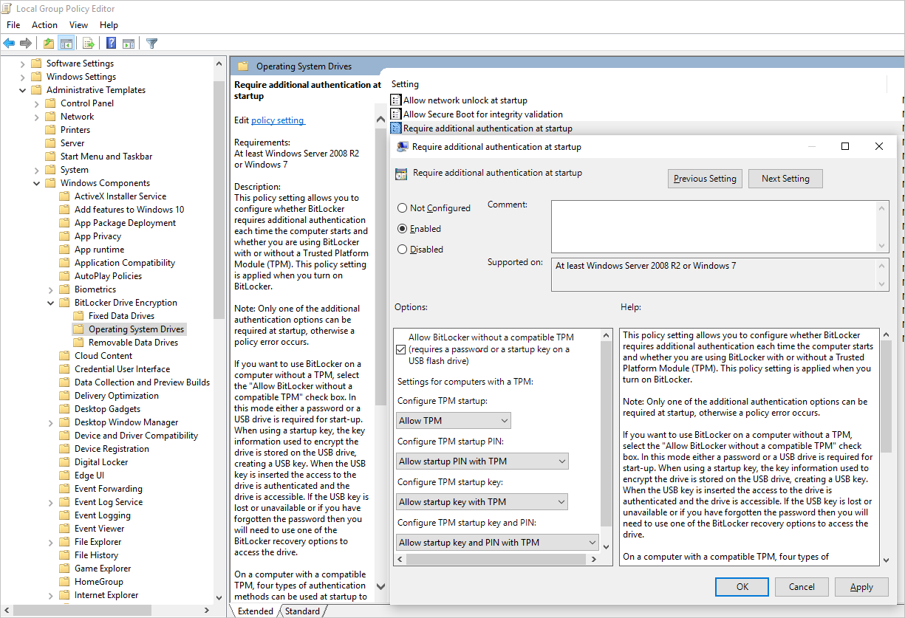

# Azure Disk Encryption sample scripts

**Applies to:** :heavy_check_mark: Windows VMs 

This article provides sample scripts for preparing pre-encrypted VHDs and other tasks.

> [!NOTE]
> All scripts refer to the latest, non-AAD version of ADE, except where noted.

## Sample PowerShell scripts for Azure Disk Encryption


- **List all encrypted VMs in your subscription**

  You can find all ADE-encrypted VMs and the extension version, in all resource groups present in a subscription, using [this PowerShell script](https://raw.githubusercontent.com/Azure/azure-powershell/master/src/Compute/Compute/Extension/AzureDiskEncryption/Scripts/Find_1passAdeVersion_VM.ps1).

  Alternatively, these cmdlets will show all ADE-encrypted VMs (but not the extension version):

    ```azurepowershell-interactive
    $osVolEncrypted = {(Get-AzVMDiskEncryptionStatus -ResourceGroupName $_.ResourceGroupName -VMName $_.Name).OsVolumeEncrypted}
    $dataVolEncrypted= {(Get-AzVMDiskEncryptionStatus -ResourceGroupName $_.ResourceGroupName -VMName $_.Name).DataVolumesEncrypted}
    Get-AzVm | Format-Table @{Label="MachineName"; Expression={$_.Name}}, @{Label="OsVolumeEncrypted"; Expression=$osVolEncrypted}, @{Label="DataVolumesEncrypted"; Expression=$dataVolEncrypted}
    ```

- **List all encrypted VMSS instances in your subscription**

    You can find all ADE-encrypted Virtual Machine Scale Sets instances and the extension version, in all resource groups present in a subscription, using [this PowerShell script](https://raw.githubusercontent.com/Azure/azure-powershell/master/src/Compute/Compute/Extension/AzureDiskEncryption/Scripts/Find_1passAdeVersion_VMSS.ps1).

- **List all disk encryption secrets used for encrypting VMs in a key vault**

```azurepowershell-interactive
Get-AzKeyVaultSecret -VaultName $KeyVaultName | where {$_.Tags.ContainsKey('DiskEncryptionKeyFileName')} | format-table @{Label="MachineName"; Expression={$_.Tags['MachineName']}}, @{Label="VolumeLetter"; Expression={$_.Tags['VolumeLetter']}}, @{Label="EncryptionKeyURL"; Expression={$_.Id}}
```

### Using the Azure Disk Encryption prerequisites PowerShell script

If you're already familiar with the prerequisites for Azure Disk Encryption, you can use the [Azure Disk Encryption prerequisites PowerShell script](https://raw.githubusercontent.com/Azure/azure-powershell/master/src/Compute/Compute/Extension/AzureDiskEncryption/Scripts/AzureDiskEncryptionPreRequisiteSetup.ps1). For an example of using this PowerShell script, see the [Encrypt a VM Quickstart](disk-encryption-powershell-quickstart.md). You can remove the comments from a section of the script, starting at line 211, to encrypt all disks for existing VMs in an existing resource group.

The following table shows which parameters can be used in the PowerShell script:

|Parameter|Description|Mandatory?|
|------|------|------|
|$resourceGroupName| Name of the resource group to which the KeyVault belongs.  A new resource group with this name will be created if one doesn't exist.| True|
|$keyVaultName|Name of the KeyVault in which encryption keys are to be placed. A new vault with this name will be created if one doesn't exist.| True|
|$location|Location of the KeyVault. Make sure the KeyVault and VMs to be encrypted are in the same location. Get a location list with `Get-AzLocation`.|True|
|$subscriptionId|Identifier of the Azure subscription to be used.  You can get your Subscription ID with `Get-AzSubscription`.|True|
|$aadAppName|Name of the Microsoft Entra application that will be used to write secrets to KeyVault. A new application with this name will be created if one doesn't exist. If this app already exists, pass aadClientSecret parameter to the script.|False|
|$aadClientSecret|Client secret of the Microsoft Entra application that was created earlier.|False|
|$keyEncryptionKeyName|Name of optional key encryption key in KeyVault. A new key with this name will be created if one doesn't exist.|False|

## Resource Manager templates

<a name='encrypt-or-decrypt-vms-without-an-azure-ad-app'></a>

### Encrypt or decrypt VMs without a Microsoft Entra app

- [Enable disk encryption on an existing or running Windows VM](https://github.com/Azure/azure-quickstart-templates/tree/master/quickstarts/microsoft.compute/encrypt-running-windows-vm-without-aad)
- [Disable encryption on a running Windows VM](https://github.com/Azure/azure-quickstart-templates/tree/master/quickstarts/microsoft.compute/decrypt-running-windows-vm-without-aad)

<a name='encrypt-or-decrypt-vms-with-an-azure-ad-app-previous-release'></a>

### Encrypt or decrypt VMs with a Microsoft Entra app (previous release)

- [Enable disk encryption on an existing or running Windows VM](https://github.com/Azure/azure-quickstart-templates/tree/master/quickstarts/microsoft.compute/encrypt-running-windows-vm)
- [Disable encryption on a running Windows VM](https://github.com/Azure/azure-quickstart-templates/tree/master/quickstarts/microsoft.compute/decrypt-running-windows-vm)
- [Create a new encrypted managed disk from a pre-encrypted VHD/storage blob](https://github.com/Azure/azure-quickstart-templates/tree/master/quickstarts/microsoft.compute/create-encrypted-managed-disk)
    - Creates a new encrypted managed disk provided a pre-encrypted VHD and its corresponding encryption settings

## Prepare a pre-encrypted Windows VHD
The sections that follow are necessary to prepare a pre-encrypted Windows VHD for deployment as an encrypted VHD in Azure IaaS. Use the information to prepare and boot a fresh Windows VM (VHD) on Azure Site Recovery or Azure. For more information on how to prepare and upload a VHD, see [Upload a generalized VHD and use it to create new VMs in Azure](upload-generalized-managed.md).

### Update group policy to allow non-TPM for OS protection
Configure the BitLocker Group Policy setting **BitLocker Drive Encryption**, which you'll find under **Local Computer Policy** > **Computer Configuration** > **Administrative Templates** > **Windows Components**. Change this setting to **Operating System Drives** > **Require additional authentication at startup** > **Allow BitLocker without a compatible TPM**, as shown in the following figure:



### Install BitLocker feature components
For Windows Server 2012 and later, use the following command:

```console
dism /online /Enable-Feature /all /FeatureName:BitLocker /quiet /norestart
```

For Windows Server 2008 R2, use the following command:

```console
ServerManagerCmd -install BitLockers
```

### Prepare the OS volume for BitLocker by using `bdehdcfg`
To compress the OS partition and prepare the machine for BitLocker, execute the [bdehdcfg](/windows/security/information-protection/bitlocker/bitlocker-basic-deployment) if needed:

```console
bdehdcfg -target c: shrink -quiet
```

### Protect the OS volume by using BitLocker
Use the [`manage-bde`](/previous-versions/windows/it-pro/windows-server-2012-R2-and-2012/ff829849(v=ws.11)) command to enable encryption on the boot volume using an external key protector. Also place the external key (.bek file) on the external drive or volume. Encryption is enabled on the system/boot volume after the next reboot.

```console
manage-bde -on %systemdrive% -sk [ExternalDriveOrVolume]
reboot
```

> [!NOTE]
> Prepare the VM with a separate data/resource VHD for getting the external key by using BitLocker.

## Upload encrypted VHD to an Azure storage account
After BitLocker encryption is enabled, the local encrypted VHD needs to be uploaded to your storage account.
```powershell
    Add-AzVhd [-Destination] <Uri> [-LocalFilePath] <FileInfo> [[-NumberOfUploaderThreads] <Int32> ] [[-BaseImageUriToPatch] <Uri> ] [[-OverWrite]] [ <CommonParameters>]
```

## Upload the secret for the pre-encrypted VM to your key vault
The disk encryption secret that you obtained previously must be uploaded as a secret in your key vault.  To do so, you must grant the set secret permission and the wrapkey permission to the account that will upload the secrets.

```powershell
# Typically, account Id is the user principal name (in user@domain.com format)
$upn = (Get-AzureRmContext).Account.Id
Set-AzKeyVaultAccessPolicy -VaultName $kvname -UserPrincipalName $acctid -PermissionsToKeys wrapKey -PermissionsToSecrets set

# In cloud shell, the account ID is a managed service identity, so specify the username directly
# $upn = "user@domain.com"
# Set-AzKeyVaultAccessPolicy -VaultName $kvname -UserPrincipalName $acctid -PermissionsToKeys wrapKey -PermissionsToSecrets set

# When running as a service principal, retrieve the service principal ID from the account ID, and set access policy to that
# $acctid = (Get-AzureRmContext).Account.Id
# $spoid = (Get-AzureRmADServicePrincipal -ServicePrincipalName $acctid).Id
# Set-AzKeyVaultAccessPolicy -VaultName $kvname -ObjectId $spoid -BypassObjectIdValidation -PermissionsToKeys wrapKey -PermissionsToSecrets set

```

### Disk encryption secret not encrypted with a KEK
To set up the secret in your key vault, use [Set-AzKeyVaultSecret](/powershell/module/az.keyvault/set-azkeyvaultsecret). The passphrase is encoded as a base64 string and then uploaded to the key vault. In addition, make sure that the following tags are set when you create the secret in the key vault.

```powershell

 # This is the passphrase that was provided for encryption during the distribution installation
 $passphrase = "contoso-password"

 $tags = @{"DiskEncryptionKeyEncryptionAlgorithm" = "RSA-OAEP"; "DiskEncryptionKeyFileName" = "LinuxPassPhraseFileName"}
 $secretName = [guid]::NewGuid().ToString()
 $secretValue = [Convert]::ToBase64String([System.Text.Encoding]::ASCII.GetBytes($passphrase))
 $secureSecretValue = ConvertTo-SecureString $secretValue -AsPlainText -Force

 $secret = Set-AzKeyVaultSecret -VaultName $KeyVaultName -Name $secretName -SecretValue $secureSecretValue -tags $tags
 $secretUrl = $secret.Id
```


Use the `$secretUrl` in the next step for [attaching the OS disk without using KEK](#without-using-a-kek).

### Disk encryption secret encrypted with a KEK
Before you upload the secret to the key vault, you can optionally encrypt it by using a key encryption key. Use the wrap [API](/rest/api/keyvault/keys/wrap-key) to first encrypt the secret using the key encryption key. The output of this wrap operation is a base64 URL encoded string, which you can then upload as a secret by using the [`Set-AzKeyVaultSecret`](/powershell/module/az.keyvault/set-azkeyvaultsecret) cmdlet.

```powershell
    # This is the passphrase that was provided for encryption during the distribution installation
    $passphrase = "contoso-password"

    Add-AzKeyVaultKey -VaultName $KeyVaultName -Name "keyencryptionkey" -Destination Software
    $KeyEncryptionKey = Get-AzKeyVaultKey -VaultName $KeyVault.OriginalVault.Name -Name "keyencryptionkey"

    $apiversion = "2015-06-01"

    ##############################
    # Get Auth URI
    ##############################

    $uri = $KeyVault.VaultUri + "/keys"
    $headers = @{}

    $response = try { Invoke-RestMethod -Method GET -Uri $uri -Headers $headers } catch { $_.Exception.Response }

    $authHeader = $response.Headers["www-authenticate"]
    $authUri = [regex]::match($authHeader, 'authorization="(.*?)"').Groups[1].Value

    Write-Host "Got Auth URI successfully"

    ##############################
    # Get Auth Token
    ##############################

    $uri = $authUri + "/oauth2/token"
    $body = "grant_type=client_credentials"
    $body += "&client_id=" + $AadClientId
    $body += "&client_secret=" + [Uri]::EscapeDataString($AadClientSecret)
    $body += "&resource=" + [Uri]::EscapeDataString("https://vault.azure.net")
    $headers = @{}

    $response = Invoke-RestMethod -Method POST -Uri $uri -Headers $headers -Body $body

    $access_token = $response.access_token

    Write-Host "Got Auth Token successfully"

    ##############################
    # Get KEK info
    ##############################

    $uri = $KeyEncryptionKey.Id + "?api-version=" + $apiversion
    $headers = @{"Authorization" = "Bearer " + $access_token}

    $response = Invoke-RestMethod -Method GET -Uri $uri -Headers $headers

    $keyid = $response.key.kid

    Write-Host "Got KEK info successfully"

    ##############################
    # Encrypt passphrase using KEK
    ##############################

    $passphraseB64 = [Convert]::ToBase64String([System.Text.Encoding]::ASCII.GetBytes($Passphrase))
    $uri = $keyid + "/encrypt?api-version=" + $apiversion
    $headers = @{"Authorization" = "Bearer " + $access_token; "Content-Type" = "application/json"}
    $bodyObj = @{"alg" = "RSA-OAEP"; "value" = $passphraseB64}
    $body = $bodyObj | ConvertTo-Json

    $response = Invoke-RestMethod -Method POST -Uri $uri -Headers $headers -Body $body

    $wrappedSecret = $response.value

    Write-Host "Encrypted passphrase successfully"

    ##############################
    # Store secret
    ##############################

    $secretName = [guid]::NewGuid().ToString()
    $uri = $KeyVault.VaultUri + "/secrets/" + $secretName + "?api-version=" + $apiversion
    $secretAttributes = @{"enabled" = $true}
    $secretTags = @{"DiskEncryptionKeyEncryptionAlgorithm" = "RSA-OAEP"; "DiskEncryptionKeyFileName" = "LinuxPassPhraseFileName"}
    $headers = @{"Authorization" = "Bearer " + $access_token; "Content-Type" = "application/json"}
    $bodyObj = @{"value" = $wrappedSecret; "attributes" = $secretAttributes; "tags" = $secretTags}
    $body = $bodyObj | ConvertTo-Json

    $response = Invoke-RestMethod -Method PUT -Uri $uri -Headers $headers -Body $body

    Write-Host "Stored secret successfully"

    $secretUrl = $response.id
```

Use `$KeyEncryptionKey` and `$secretUrl` in the next step for [attaching the OS disk using KEK](#using-a-kek).

##  Specify a secret URL when you attach an OS disk

###  Without using a KEK
While you're attaching the OS disk, you need to pass `$secretUrl`. The URL was generated in the "Disk-encryption secret not encrypted with a KEK" section.
```powershell
    Set-AzVMOSDisk `
            -VM $VirtualMachine `
            -Name $OSDiskName `
            -SourceImageUri $VhdUri `
            -VhdUri $OSDiskUri `
            -Windows `
            -CreateOption FromImage `
            -DiskEncryptionKeyVaultId $KeyVault.ResourceId `
            -DiskEncryptionKeyUrl $SecretUrl
```
### Using a KEK
When you attach the OS disk, pass `$KeyEncryptionKey` and `$secretUrl`. The URL was generated in the "Disk encryption secret encrypted with a KEK" section.
```powershell
    Set-AzVMOSDisk `
            -VM $VirtualMachine `
            -Name $OSDiskName `
            -SourceImageUri $CopiedTemplateBlobUri `
            -VhdUri $OSDiskUri `
            -Windows `
            -CreateOption FromImage `
            -DiskEncryptionKeyVaultId $KeyVault.ResourceId `
            -DiskEncryptionKeyUrl $SecretUrl `
            -KeyEncryptionKeyVaultId $KeyVault.ResourceId `
            -KeyEncryptionKeyURL $KeyEncryptionKey.Id
```
