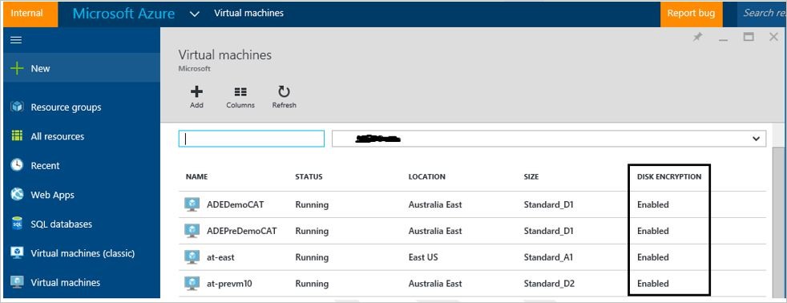

# Azure Disk Encryption with Microsoft Entra ID for Windows VMs (previous release)

**Applies to:** :heavy_check_mark: Windows VMs 

**The new release of Azure Disk Encryption eliminates the requirement for providing a Microsoft Entra application parameter to enable VM disk encryption. With the new release, you are no longer required to provide Microsoft Entra credentials during the enable encryption step. All new VMs must be encrypted without the Microsoft Entra application parameters using the new release. To view instructions to enable VM disk encryption using the new release, see [Azure Disk Encryption for Windows VMS](disk-encryption-windows.md). VMs that were already encrypted with Microsoft Entra application parameters are still supported and should continue to be maintained with the Microsoft Entra syntax.**


You can enable many disk-encryption scenarios, and the steps may vary according to the scenario. The following sections cover the scenarios in greater detail for Windows IaaS VMs. Before you can use disk encryption, the [Azure Disk Encryption prerequisites](disk-encryption-overview-aad.md) need to be completed. 


>[!IMPORTANT]
> - You should [take a snapshot](snapshot-copy-managed-disk.md) and/or create a backup before disks are encrypted. Backups ensure that a recovery option is possible if an unexpected failure occurs during encryption. VMs with managed disks require a backup before encryption occurs. Once a backup is made, you can use the [Set-AzVMDiskEncryptionExtension cmdlet](/powershell/module/az.compute/set-azvmdiskencryptionextension) to encrypt managed disks by specifying the -skipVmBackup parameter. For more information about how to back up and restore encrypted VMs, see [Back up and restore encrypted Azure VM](../../backup/backup-azure-vms-encryption.md). 
>
> - Encrypting or disabling encryption may cause a VM to reboot.

## Enable encryption on new IaaS VMs created from the Marketplace
You can enable disk encryption on new IaaS Windows VM from the Marketplace in Azure using a Resource Manager template. The template creates a new encrypted Windows VM using the Windows Server 2012 gallery image.

1. On the [Resource Manager template](https://github.com/Azure/azure-quickstart-templates/tree/master/quickstarts/microsoft.compute/encrypt-create-new-vm-gallery-image), click **Deploy to Azure**.

2. Select the subscription, resource group, resource group location, parameters, legal terms, and agreement. Click **Purchase** to deploy a new IaaS VM where encryption is enabled.

3. After you deploy the template, verify the VM encryption status using your preferred method:
     - Verify with the Azure CLI by using the [az vm encryption show](/cli/azure/vm/encryption#az-vm-encryption-show) command. 

         ```azurecli-interactive 
         az vm encryption show --name "MySecureVM" --resource-group "MyVirtualMachineResourceGroup"
         ```

     - Verify with Azure PowerShell by using the [Get-AzVmDiskEncryptionStatus](/powershell/module/az.compute/get-azvmdiskencryptionstatus) cmdlet. 

         ```azurepowershell-interactive
         Get-AzVmDiskEncryptionStatus -ResourceGroupName 'MyVirtualMachineResourceGroup' -VMName 'MySecureVM'
         ```

     -  Select the VM, then click on **Disks** under the **Settings** heading to verify encryption status in the portal. In the chart under **Encryption**, you'll see if it's enabled. 
           

The following table lists the Resource Manager template parameters for new VMs from the Marketplace scenario using Microsoft Entra client ID:

| Parameter | Description | 
| --- | --- |
| adminUserName | Admin user name for the virtual machine. |
| adminPassword | Admin user password for the virtual machine. |
| newStorageAccountName | Name of the storage account to store OS and data VHDs. |
| vmSize | Size of the VM. Currently, only Standard A, D, and G series are supported. |
| virtualNetworkName | Name of the VNet that the VM NIC should belong to. |
| subnetName | Name of the subnet in the VNet that the VM NIC should belong to. |
| AADClientID | Client ID of the Microsoft Entra application that has permissions to write secrets to your key vault. |
| AADClientSecret | Client secret of the Microsoft Entra application that has permissions to write secrets to your key vault. |
| keyVaultURL | URL of the key vault that the BitLocker key should be uploaded to. You can get it by using the cmdlet `(Get-AzKeyVault -VaultName "MyKeyVault" -ResourceGroupName "MyKeyVaultResourceGroupName").VaultURI` or the Azure CLI `az keyvault show --name "MySecureVault" --query properties.vaultUri` |
| keyEncryptionKeyURL | URL of the key encryption key that's used to encrypt the generated BitLocker key (optional). </br> </br>KeyEncryptionKeyURL is an optional parameter. You can bring your own KEK to further safeguard the data encryption key (Passphrase secret) in your key vault. |
| keyVaultResourceGroup | Resource group of the key vault. |
| vmName | Name of the VM that the encryption operation is to be performed on. |


## <a name="bkmk_RunningWinVM"></a> Enable encryption on existing or running IaaS Windows VMs
In this scenario, you can enable encryption by using a template, PowerShell cmdlets, or CLI commands. The following sections explain in greater detail how to enable Azure Disk Encryption. 


### <a name="bkmk_RunningWinVMPSH"></a> Enable encryption on existing or running VMs with Azure PowerShell 
Use the [Set-AzVMDiskEncryptionExtension](/powershell/module/az.compute/set-azvmdiskencryptionextension) cmdlet to enable encryption on a running IaaS virtual machine in Azure. 
For information about enabling encryption with Azure Disk Encryption by using PowerShell cmdlets, see the blog posts [Explore Azure Disk Encryption with Azure PowerShell - Part 1](/archive/blogs/azuresecurity/explore-azure-disk-encryption-with-azure-powershell) and [Explore Azure Disk Encryption with Azure PowerShell - Part 2](/archive/blogs/azuresecurity/explore-azure-disk-encryption-with-azure-powershell-part-2).

-  **Encrypt a running VM using a client secret:** The script below initializes your variables and runs the Set-AzVMDiskEncryptionExtension cmdlet. The resource group, VM, key vault, Microsoft Entra app, and client secret should have already been created as prerequisites. Replace MyKeyVaultResourceGroup, MyVirtualMachineResourceGroup, MySecureVM, MySecureVault, My-AAD-client-ID, and My-AAD-client-secret with your values.
     ```azurepowershell
      $KVRGname = 'MyKeyVaultResourceGroup';
      $VMRGName = 'MyVirtualMachineResourceGroup';
      $vmName = 'MySecureVM';
      $aadClientID = 'My-AAD-client-ID';
      $aadClientSecret = 'My-AAD-client-secret';
      $KeyVaultName = 'MySecureVault';
      $KeyVault = Get-AzKeyVault -VaultName $KeyVaultName -ResourceGroupName $KVRGname;
      $diskEncryptionKeyVaultUrl = $KeyVault.VaultUri;
      $KeyVaultResourceId = $KeyVault.ResourceId;

      Set-AzVMDiskEncryptionExtension -ResourceGroupName $VMRGName -VMName $vmName -AadClientID $aadClientID -AadClientSecret $aadClientSecret -DiskEncryptionKeyVaultUrl $diskEncryptionKeyVaultUrl -DiskEncryptionKeyVaultId $KeyVaultResourceId;
    ```
- **Encrypt a running VM using KEK to wrap the client secret:** Azure Disk Encryption lets you specify an existing key in your key vault to wrap disk encryption secrets that were generated while enabling encryption. When a key encryption key is specified, Azure Disk Encryption uses that key to wrap the encryption secrets before writing to Key Vault. 

     ```azurepowershell
     $KVRGname = 'MyKeyVaultResourceGroup';
     $VMRGName = 'MyVirtualMachineResourceGroup';
     $vmName = 'MyExtraSecureVM';
     $aadClientID = 'My-AAD-client-ID';
     $aadClientSecret = 'My-AAD-client-secret';
     $KeyVaultName = 'MySecureVault';
     $keyEncryptionKeyName = 'MyKeyEncryptionKey';
     $KeyVault = Get-AzKeyVault -VaultName $KeyVaultName -ResourceGroupName $KVRGname;
     $diskEncryptionKeyVaultUrl = $KeyVault.VaultUri;
     $KeyVaultResourceId = $KeyVault.ResourceId;
     $keyEncryptionKeyUrl = (Get-AzKeyVaultKey -VaultName $KeyVaultName -Name $keyEncryptionKeyName).Key.kid;

     Set-AzVMDiskEncryptionExtension -ResourceGroupName $VMRGname -VMName $vmName -AadClientID $aadClientID -AadClientSecret $aadClientSecret -DiskEncryptionKeyVaultUrl $diskEncryptionKeyVaultUrl -DiskEncryptionKeyVaultId $KeyVaultResourceId -KeyEncryptionKeyUrl $keyEncryptionKeyUrl -KeyEncryptionKeyVaultId $KeyVaultResourceId;

     ```
     
   >[!NOTE]
   > The syntax for the value of disk-encryption-keyvault parameter is the full identifier string:
/subscriptions/[subscription-id-guid]/resourceGroups/[resource-group-name]/providers/Microsoft.KeyVault/vaults/[keyvault-name]</br> 
   > The syntax for the value of the key-encryption-key parameter is the full URI to the KEK as in:
https://[keyvault-name].vault.azure.net/keys/[kekname]/[kek-unique-id] 

- **Verify the disks are encrypted:** To check on the encryption status of an IaaS VM, use the [Get-AzVmDiskEncryptionStatus](/powershell/module/az.compute/get-azvmdiskencryptionstatus) cmdlet. 
     ```azurepowershell-interactive
     Get-AzVmDiskEncryptionStatus -ResourceGroupName 'MyVirtualMachineResourceGroup' -VMName 'MySecureVM'
     ```
    
- **Disable disk encryption:** To disable the encryption, use the [Disable-Azure​RmVMDisk​Encryption](/powershell/module/az.compute/disable-azvmdiskencryption) cmdlet. 
     ```azurepowershell-interactive
     Disable-AzVMDiskEncryption -ResourceGroupName 'MyVirtualMachineResourceGroup' -VMName 'MySecureVM'
     ```

### <a name="bkmk_RunningWinVMCLI"></a>Enable encryption on existing or running VMs with  Azure CLI
Use the [az vm encryption enable](/cli/azure/vm/encryption#az-vm-encryption-enable) command to enable encryption on a running IaaS virtual machine in Azure.

- **Encrypt a running VM using a client secret:**

    ```azurecli-interactive
    az vm encryption enable --resource-group "MyVirtualMachineResourceGroup" --name "MySecureVM" --aad-client-id "<my spn created with CLI/my Azure AD ClientID>"  --aad-client-secret "My-AAD-client-secret" --disk-encryption-keyvault "MySecureVault" --volume-type [All|OS|Data]
    ```

- **Encrypt a running VM using KEK to wrap the client secret:**

     ```azurecli-interactive
     az vm encryption enable --resource-group "MyVirtualMachineResourceGroup" --name "MySecureVM" --aad-client-id "<my spn created with CLI which is the Azure AD ClientID>"  --aad-client-secret "My-AAD-client-secret" --disk-encryption-keyvault  "MySecureVault" --key-encryption-key "MyKEK_URI" --key-encryption-keyvault "MySecureVaultContainingTheKEK" --volume-type [All|OS|Data]
     ```

     >[!NOTE]
     > The syntax for the value of disk-encryption-keyvault parameter is the full identifier string: 
  /subscriptions/[subscription-id-guid]/resourceGroups/[resource-group-name]/providers/Microsoft.KeyVault/vaults/[keyvault-name] </br> 
     > The syntax for the value of the key-encryption-key parameter is the full URI to the KEK as in:
  https://[keyvault-name].vault.azure.net/keys/[kekname]/[kek-unique-id] 

- **Verify the disks are encrypted:** To check on the encryption status of an IaaS VM, use the [az vm encryption show](/cli/azure/vm/encryption#az-vm-encryption-show) command. 

     ```azurecli-interactive
     az vm encryption show --name "MySecureVM" --resource-group "MyVirtualMachineResourceGroup"
     ```

- **Disable encryption:** To disable encryption, use the [az vm encryption disable](/cli/azure/vm/encryption#az-vm-encryption-disable) command. 
     ```azurecli-interactive
     az vm encryption disable --name "MySecureVM" --resource-group "MyVirtualMachineResourceGroup" --volume-type [ALL, DATA, OS]
     ```


### <a name="bkmk_RunningWinVMwRM"> </a>Using the Resource Manager template
You can enable disk encryption on existing or running IaaS Windows VMs in Azure by using the [Resource Manager template to encrypt a running Windows VM](https://github.com/Azure/azure-quickstart-templates/tree/master/quickstarts/microsoft.compute/encrypt-running-windows-vm).


1. On the Azure quickstart template, click **Deploy to Azure**.

2. Select the subscription, resource group, resource group location, parameters, legal terms, and agreement. Click **Purchase** to enable encryption on the existing or running IaaS VM.

The following table lists the Resource Manager template parameters for existing or running VMs that use a Microsoft Entra client ID:

| Parameter | Description |
| --- | --- |
| AADClientID | Client ID of the Microsoft Entra application that has permissions to write secrets to the key vault. |
| AADClientSecret | Client secret of the Microsoft Entra application that has permissions to write secrets to the key vault. |
| keyVaultName | Name of the key vault that the BitLocker key should be uploaded to. You can get it by using the cmdlet `(Get-AzKeyVault -ResourceGroupName <MyKeyVaultResourceGroupName>). Vaultname` or the Azure CLI command `az keyvault list --resource-group "MySecureGroup"`|
|  keyEncryptionKeyURL | URL of the key encryption key that's used to encrypt the generated BitLocker key. This parameter is optional if you select **nokek** in the UseExistingKek drop-down list. If you select **kek** in the UseExistingKek drop-down list, you must enter the _keyEncryptionKeyURL_ value. |
| volumeType | Type of volume that the encryption operation is performed on. Valid values are _OS_, _Data_, and _All_. |
| sequenceVersion | Sequence version of the BitLocker operation. Increment this version number every time a disk-encryption operation is performed on the same VM. |
| vmName | Name of the VM that the encryption operation is to be performed on. |


## <a name="bkmk_VHDpre"> </a>New IaaS VMs created from customer-encrypted VHD and encryption keys
In this scenario, you can enable encrypting by using the Resource Manager template, PowerShell cmdlets, or CLI commands. The following sections explain in greater detail the Resource Manager template and CLI commands. 

Use the instructions in the appendix for preparing pre-encrypted images that can be used in Azure. After the image is created, you can use the steps in the next section to create an encrypted Azure VM.

* [Prepare a pre-encrypted Windows VHD](disk-encryption-sample-scripts.md#prepare-a-pre-encrypted-windows-vhd)


### <a name="bkmk_VHDprePSH"> </a> Encrypt VMs with pre-encrypted VHDs with Azure PowerShell
You can enable disk encryption on your encrypted VHD by using the PowerShell cmdlet [Set-AzVMOSDisk](/powershell/module/az.compute/set-azvmosdisk#examples). The example below gives you some common parameters. 

```powershell
$VirtualMachine = New-AzVMConfig -VMName "MySecureVM" -VMSize "Standard_A1"
$VirtualMachine = Set-AzVMOSDisk -VM $VirtualMachine -Name "SecureOSDisk" -VhdUri "os.vhd" Caching ReadWrite -Windows -CreateOption "Attach" -DiskEncryptionKeyUrl "https://mytestvault.vault.azure.net/secrets/Test1/514ceb769c984379a7e0230bddaaaaaa" -DiskEncryptionKeyVaultId "/subscriptions/00000000-0000-0000-0000-000000000000/resourceGroups/myKVresourcegroup/providers/Microsoft.KeyVault/vaults/mytestvault"
New-AzVM -VM $VirtualMachine -ResourceGroupName "MyVirtualMachineResourceGroup"
```

## Enable encryption on a newly added data disk
You can [add a new disk to a Windows VM using PowerShell](attach-disk-ps.md), or [through the Azure portal](attach-managed-disk-portal.md). 

### Enable encryption on a newly added disk with Azure PowerShell
When using PowerShell to encrypt a new disk for Windows VMs, a new sequence version should be specified. The sequence version has to be unique. The script below generates a GUID for the sequence version. In some cases, a newly added data disk might be encrypted automatically by the Azure Disk Encryption extension. Auto encryption usually occurs when the VM reboots after the new disk comes online. This is typically caused because "All" was specified for the volume type when disk encryption previously ran on the VM. If auto encryption occurs on a newly added data disk, we recommend running the Set-AzVmDiskEncryptionExtension cmdlet again with new sequence version. If your new data disk is auto encrypted and you do not wish to be encrypted, decrypt all drives first then re-encrypt with a new sequence version specifying OS for the volume type. 

-  **Encrypt a running VM using a client secret:** The script below initializes your variables and runs the Set-AzVMDiskEncryptionExtension cmdlet. The resource group, VM, key vault, Microsoft Entra app, and client secret should have already been created as prerequisites. Replace MyKeyVaultResourceGroup, MyVirtualMachineResourceGroup, MySecureVM, MySecureVault, My-AAD-client-ID, and My-AAD-client-secret with your values. This example uses "All" for the -VolumeType parameter, which includes both OS and Data volumes. If you only want to encrypt the OS volume, use "OS" for the -VolumeType parameter. 

     ```azurepowershell
      $sequenceVersion = [Guid]::NewGuid();
      $KVRGname = 'MyKeyVaultResourceGroup';
      $VMRGName = 'MyVirtualMachineResourceGroup';
      $vmName = 'MySecureVM';
      $aadClientID = 'My-AAD-client-ID';
      $aadClientSecret = 'My-AAD-client-secret';
      $KeyVaultName = 'MySecureVault';
      $KeyVault = Get-AzKeyVault -VaultName $KeyVaultName -ResourceGroupName $KVRGname;
      $diskEncryptionKeyVaultUrl = $KeyVault.VaultUri;
      $KeyVaultResourceId = $KeyVault.ResourceId;

      Set-AzVMDiskEncryptionExtension -ResourceGroupName $VMRGname -VMName $vmName -AadClientID $aadClientID -AadClientSecret $aadClientSecret -DiskEncryptionKeyVaultUrl $diskEncryptionKeyVaultUrl -DiskEncryptionKeyVaultId $KeyVaultResourceId -VolumeType 'all' –SequenceVersion $sequenceVersion;
    ```
- **Encrypt a running VM using KEK to wrap the client secret:** Azure Disk Encryption lets you specify an existing key in your key vault to wrap disk encryption secrets that were generated while enabling encryption. When a key encryption key is specified, Azure Disk Encryption uses that key to wrap the encryption secrets before writing to Key Vault. This example uses "All" for the -VolumeType parameter, which includes both OS and Data volumes. If you only want to encrypt the OS volume, use "OS" for the -VolumeType parameter. 

     ```azurepowershell
     $sequenceVersion = [Guid]::NewGuid();
     $KVRGname = 'MyKeyVaultResourceGroup';
     $VMRGName = 'MyVirtualMachineResourceGroup';
     $vmName = 'MyExtraSecureVM';
     $aadClientID = 'My-AAD-client-ID';
     $aadClientSecret = 'My-AAD-client-secret';
     $KeyVaultName = 'MySecureVault';
     $keyEncryptionKeyName = 'MyKeyEncryptionKey';
     $KeyVault = Get-AzKeyVault -VaultName $KeyVaultName -ResourceGroupName $KVRGname;
     $diskEncryptionKeyVaultUrl = $KeyVault.VaultUri;
     $KeyVaultResourceId = $KeyVault.ResourceId;
     $keyEncryptionKeyUrl = (Get-AzKeyVaultKey -VaultName $KeyVaultName -Name $keyEncryptionKeyName).Key.kid;

     Set-AzVMDiskEncryptionExtension -ResourceGroupName $VMRGname -VMName $vmName -AadClientID $aadClientID -AadClientSecret $aadClientSecret -DiskEncryptionKeyVaultUrl $diskEncryptionKeyVaultUrl -DiskEncryptionKeyVaultId $KeyVaultResourceId -KeyEncryptionKeyUrl $keyEncryptionKeyUrl -KeyEncryptionKeyVaultId $KeyVaultResourceId -VolumeType 'all' –SequenceVersion $sequenceVersion;

     ```

    >[!NOTE]
    > The syntax for the value of disk-encryption-keyvault parameter is the full identifier string: 
/subscriptions/[subscription-id-guid]/resourceGroups/[resource-group-name]/providers/Microsoft.KeyVault/vaults/[keyvault-name]</br> 
   > The syntax for the value of the key-encryption-key parameter is the full URI to the KEK as in:
https://[keyvault-name].vault.azure.net/keys/[kekname]/[kek-unique-id] 

### Enable encryption on a newly added disk with Azure CLI
  The Azure CLI command will automatically provide a new sequence version for you when you run the command to enable encryption. Acceptable values for the volume-yype parameter are All, OS, and Data. You may need to change the volume-type parameter to OS or Data if you're only encrypting one type of disk for the VM. The examples use "All" for the volume-type parameter. 

-  **Encrypt a running VM using a client secret:**

     ```azurecli-interactive
     az vm encryption enable --resource-group "MyVirtualMachineResourceGroup" --name "MySecureVM" --aad-client-id "<my spn created with CLI/my Azure AD ClientID>"  --aad-client-secret "My-AAD-client-secret" --disk-encryption-keyvault "MySecureVault" --volume-type "All"
     ```

- **Encrypt a running VM using KEK to wrap the client secret:**

     ```azurecli-interactive
     az vm encryption enable --resource-group "MyVirtualMachineResourceGroup" --name "MySecureVM" --aad-client-id "<my spn created with CLI which is the Azure AD ClientID>"  --aad-client-secret "My-AAD-client-secret" --disk-encryption-keyvault  "MySecureVault" --key-encryption-key "MyKEK_URI" --key-encryption-keyvault "MySecureVaultContainingTheKEK" --volume-type "all"
     ```


<a name='enable-encryption-using-azure-ad-client-certificate-based-authentication'></a>

## Enable encryption using Microsoft Entra client certificate-based authentication.
You can use client certificate authentication with or without KEK. Before using the PowerShell scripts, you should already have the certificate uploaded to the key vault and deployed to the VM. If you're using KEK too, the KEK should already exist. For more information, see the  [Certificate-based authentication for Microsoft Entra ID](disk-encryption-key-vault-aad.md#certificate-based-authentication-optional) section of the prerequisites article.


### Enable encryption using certificate-based authentication with Azure PowerShell

```powershell
## Fill in 'MyVirtualMachineResourceGroup', 'MyKeyVaultResourceGroup', 'My-AAD-client-ID', 'MySecureVault, and 'MySecureVM'.

$VMRGName = 'MyVirtualMachineResourceGroup'
$KVRGname = 'MyKeyVaultResourceGroup';
$AADClientID ='My-AAD-client-ID';
$KeyVaultName = 'MySecureVault';
$VMName = 'MySecureVM';
$KeyVault = Get-AzKeyVault -VaultName $KeyVaultName -ResourceGroupName $KVRGname;
$diskEncryptionKeyVaultUrl = $KeyVault.VaultUri;
$KeyVaultResourceId = $KeyVault.ResourceId;

# Fill in the certificate path and the password so the thumbprint can be set as a variable. 

$certPath = '$CertPath = "C:\certificates\mycert.pfx';
$CertPassword ='Password'
$Cert = New-Object System.Security.Cryptography.X509Certificates.X509Certificate2($CertPath, $CertPassword)
$aadClientCertThumbprint = $cert.Thumbprint;

# Enable disk encryption using the client certificate thumbprint

Set-AzVMDiskEncryptionExtension -ResourceGroupName $VMRGName -VMName $VMName -AadClientID $AADClientID -AadClientCertThumbprint $AADClientCertThumbprint -DiskEncryptionKeyVaultUrl $DiskEncryptionKeyVaultUrl -DiskEncryptionKeyVaultId $KeyVaultResourceId
```
  
### Enable encryption using certificate-based authentication and a KEK with Azure PowerShell

```powershell
# Fill in 'MyVirtualMachineResourceGroup', 'MyKeyVaultResourceGroup', 'My-AAD-client-ID', 'MySecureVault,, 'MySecureVM', and "KEKName.

$VMRGName = 'MyVirtualMachineResourceGroup';
$KVRGname = 'MyKeyVaultResourceGroup';
$AADClientID ='My-AAD-client-ID';
$KeyVaultName = 'MySecureVault';
$VMName = 'MySecureVM';
$keyEncryptionKeyName ='KEKName';
$KeyVault = Get-AzKeyVault -VaultName $KeyVaultName -ResourceGroupName $KVRGname;
$diskEncryptionKeyVaultUrl = $KeyVault.VaultUri;
$KeyVaultResourceId = $KeyVault.ResourceId;
$keyEncryptionKeyUrl = (Get-AzKeyVaultKey -VaultName $KeyVaultName -Name $keyEncryptionKeyName).Key.kid;

## Fill in the certificate path and the password so the thumbprint can be read and set as a variable.

$certPath = '$CertPath = "C:\certificates\mycert.pfx';
$CertPassword ='Password'
$Cert = New-Object System.Security.Cryptography.X509Certificates.X509Certificate2($CertPath, $CertPassword)
$aadClientCertThumbprint = $cert.Thumbprint;

# Enable disk encryption using the client certificate thumbprint and a KEK

Set-AzVMDiskEncryptionExtension -ResourceGroupName $VMRGName -VMName $VMName -AadClientID $AADClientID -AadClientCertThumbprint $AADClientCertThumbprint -DiskEncryptionKeyVaultUrl $DiskEncryptionKeyVaultUrl -DiskEncryptionKeyVaultId $KeyVaultResourceId -KeyEncryptionKeyUrl $keyEncryptionKeyUrl -KeyEncryptionKeyVaultId $KeyVaultResourceId
```

## Disable encryption
You can disable encryption using Azure PowerShell, the Azure CLI, or with a Resource Manager template. 

- **Disable disk encryption with Azure PowerShell:** To disable the encryption, use the [Disable-Azure​RmVMDisk​Encryption](/powershell/module/az.compute/disable-azvmdiskencryption) cmdlet. 
     ```azurepowershell-interactive
     Disable-AzVMDiskEncryption -ResourceGroupName 'MyVirtualMachineResourceGroup' -VMName 'MySecureVM'
     ```

- **Disable encryption with the Azure CLI:** To disable encryption, use the [az vm encryption disable](/cli/azure/vm/encryption#az-vm-encryption-disable) command. 
     ```azurecli-interactive
     az vm encryption disable --name "MySecureVM" --resource-group "MyVirtualMachineResourceGroup" --volume-type [ALL, DATA, OS]
     ```
- **Disable encryption with a Resource Manager Template:** 

    1. Click **Deploy to Azure** from the [Disable disk encryption on running Windows VM](https://github.com/Azure/azure-quickstart-templates/tree/master/quickstarts/microsoft.compute/decrypt-running-windows-vm)  template.
    2. Select the subscription, resource group, location, VM, legal terms, and agreement.
    3.  Click **Purchase** to disable disk encryption on a running Windows VM. 

## Next steps

> [!div class="nextstepaction"]
> [Azure Disk Encryption overview](disk-encryption-overview.md)
