# Experiment with installing a role on your Windows VM
Once you have your first virtual machine (VM) up and running, you can move on to installing software and services. For this tutorial, we are going to use Server Manager on the Windows Server VM to install IIS. Then, we will create a Network Security Group (NSG) using the Azure portal to open port 80 to IIS traffic. 

If you haven't already created your first VM, you should go back to [Create your first Windows virtual machine in the Azure portal](../virtual-machines-windows-hero-tutorial.md?toc=%2fazure%2fvirtual-machines%2fwindows%2ftoc.json) before continuing with this tutorial.

## Make sure the VM is running
1. Open the [Azure portal](https://portal.azure.com).
2. On the hub menu, click **Virtual Machines**. Select the virtual machine from the list.
3. If the status is **Stopped (Deallocated)**, click the **Start** button on the **Essentials** blade of the VM. If the status is **Running**, you can move on to the next step.

## Connect to the virtual machine and sign in
1. On the hub menu, click **Virtual Machines**. Select the virtual machine from the list.
2. On the blade for the virtual machine, click **Connect**. This creates and downloads a Remote Desktop Protocol file (.rdp file) that is like a shortcut to connect to your machine. You might want to save the file to your desktop for easy access. **Open** this file to connect to your VM.
   
    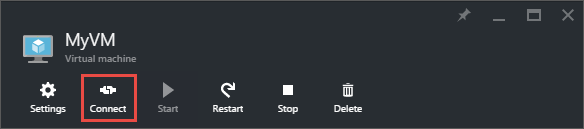
3. You get a warning that the .rdp is from an unknown publisher. This is normal. In the Remote Desktop window, click **Connect** to continue.
   
    
4. In the Windows Security window, type the username and password for the local account that you created when you created the VM. The username is entered as *vmname*&#92;*username*, then click **OK**.
   
    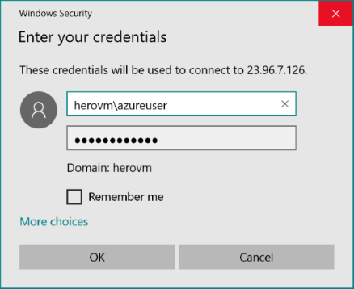
5. You get a warning that the certificate cannot be verified. This is normal. Click **Yes** to verify the identity of the virtual machine and finish logging on.
   
   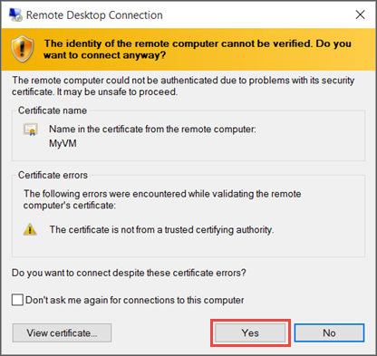

If you run in to trouble when you try to connect, see [Troubleshoot Remote Desktop connections to a Windows-based Azure Virtual Machine](troubleshoot-rdp-connection.md?toc=%2fazure%2fvirtual-machines%2fwindows%2ftoc.json).

## Install IIS on your VM
Now that you are logged in to the VM, we will install a server role so that you can experiment more.

1. Open **Server Manager** if it isn't already open. Click the **Start** menu, and then click **Server Manager**.
2. In **Server Manager**, select **Local Server** from the left pane. 
3. In the menu, select **Manage** > **Add Roles and Features**.
4. In the Add Roles and Features Wizard, on the **Installation Type** page, choose **Role-based or feature-based installation**, and then click **Next**.
   
    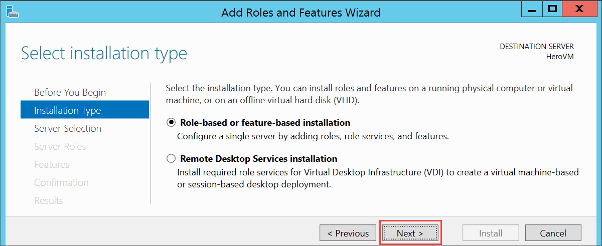
5. Select the VM from the server pool and click **Next**.
6. On the **Server Roles** page, select **Web Server (IIS)**.
   
    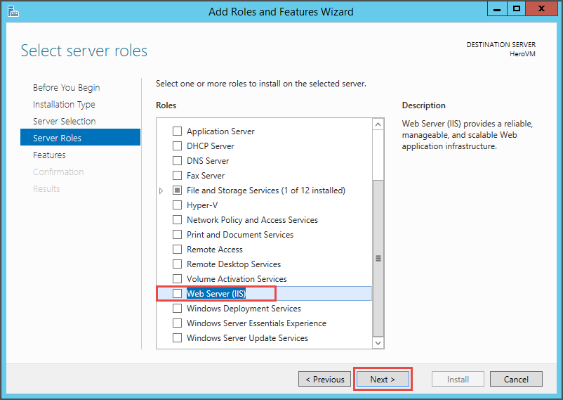
7. In the pop-up about adding features needed for IIS, make sure that **Include management tools** is selected and then click **Add Features**. When the pop-up closes, click **Next** in the wizard.
   
    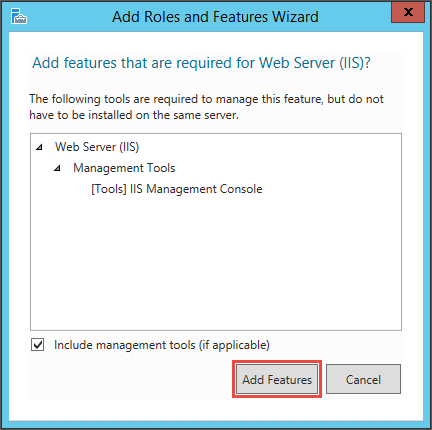
8. On the features page, click **Next**.
9. On the **Web Server Role (IIS)** page, click **Next**. 
10. On the **Role Services** page, click **Next**. 
11. On the **Confirmation** page, click **Install**. 
12. When the installation is complete, click **Close** on the wizard.

## Open port 80
In order for your VM to accept inbound traffic over port 80, you need to add an inbound rule to the network security group. 

1. Open the [Azure portal](https://portal.azure.com).
2. In **Virtual machines** select the VM that you created.
3. In the virtual machines settings, select **Network interfaces** and then select the existing network interface.
   
    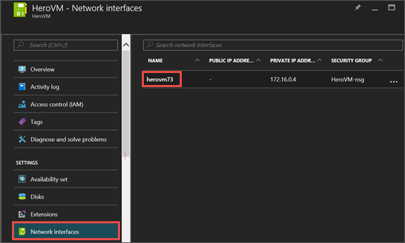
4. In **Essentials** for the network interface, click the **Network security group**.
   
    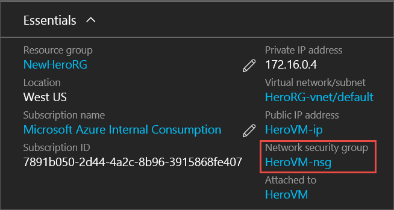
5. In the **Essentials** blade for the NSG, you should have one existing default inbound rule for **default-allow-rdp** which allows you to log in to the VM. You will add another inbound rule to allow IIS traffic. Click **Inbound security rule**.
   
    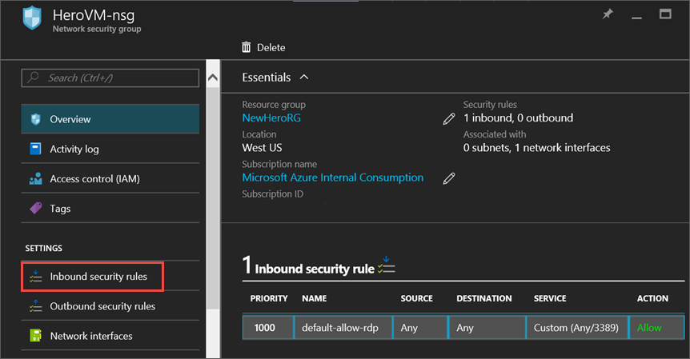
6. In **Inbound security rules**, click **Add**.
   
    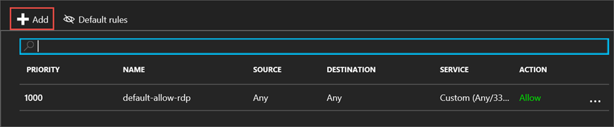
7. In **Inbound security rules**, click **Add**. Type **80** in the port range and make sure **Allow** is selected. When you are done, click **OK**.
   
    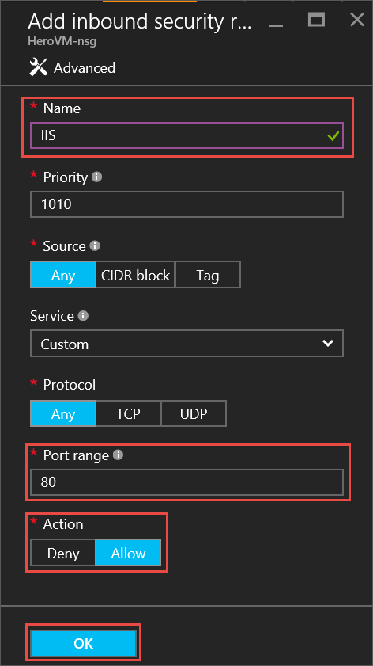

For more information about NSGs, inbound and outbound rules, see [Allow external access to your VM using the Azure portal](nsg-quickstart-portal.md?toc=%2fazure%2fvirtual-machines%2fwindows%2ftoc.json)

## Connect to the default IIS website
1. In the Azure portal, click **Virtual machines** and then select your VM.
2. In the **Essentials** blade, copy your **Public IP address**.
   
    
3. Open a browser and in the address bar, type in your public IP address like this: http://<publicIPaddress> and click **Enter** to go to that address.
4. Your browser should open the default IIS web page. It looks something like this:
   
    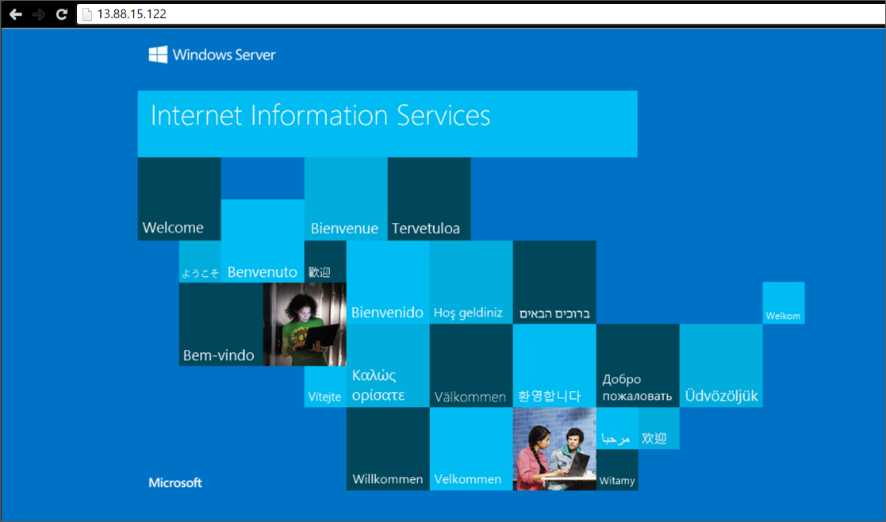

## Next steps
* You can also experiment with [attaching a data disk](attach-disk-portal.md?toc=%2fazure%2fvirtual-machines%2fwindows%2ftoc.json) to your virtual machine. Data disks provide more storage for your virtual machine.

