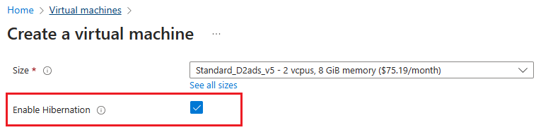

# Hibernating Windows virtual machines

**Applies to:** :heavy_check_mark: Windows VMs

[!INCLUDE [hibernate-resume-intro](../includes/hibernate-resume-intro.md)]

## How hibernation works
To learn how hibernation works, check out the [hibernation overview](../hibernate-resume.md).

## Supported configurations
Hibernation support is limited to certain VM sizes and OS versions. Make sure you have a supported configuration before using hibernation.

For a list of hibernation compatible VM sizes, check out the [supported VM sizes section in the hibernation overview](../hibernate-resume.md#supported-vm-sizes).

### Supported Windows versions
The following Windows operating systems support hibernation:

- Windows Server 2022
- Windows Server 2019
- Windows 11 Pro
- Windows 11 Enterprise
- Windows 11 Enterprise multi-session
- Windows 10 Pro
- Windows 10 Enterprise
- Windows 10 Enterprise multi-session

### Prerequisites and configuration limitations
- The Windows page file can't be on the temp disk.  
- Applications such as Device Guard and Credential Guard that require virtualization-based security (VBS) work with hibernation when you enable Trusted Launch on the VM and Nested Virtualization in the guest OS.

For general limitations, Azure feature limitations supported VM sizes, and feature prerequisites check out the ["Supported configurations" section in the hibernation overview](../hibernate-resume.md#supported-configurations).

## Creating a Windows VM with hibernation enabled

To hibernate a VM, you must first enable the feature on the VM.

To enable hibernation during VM creation, you can use the Azure portal, CLI, PowerShell, ARM templates and API. 

### [Portal](#tab/enableWithPortal)

To enable hibernation in the Azure portal, check the 'Enable hibernation' box during VM creation.




### [CLI](#tab/enableWithCLI)

To enable hibernation in the Azure CLI, create a VM by running the following [az vm create]() command with ` --enable-hibernation` set to `true`.

```azurecli
 az vm create --resource-group myRG \
   --name myVM \
   --image Win2019Datacenter \
   --public-ip-sku Standard \
   --size Standard_D2s_v5 \
   --enable-hibernation true 
```

### [PowerShell](#tab/enableWithPS)

To enable hibernation when creating a VM with PowerShell, run the following command:

```powershell
New-AzVm ` 
 -ResourceGroupName 'myRG' ` 
 -Name 'myVM' ` 
 -Location 'East US' ` 
 -VirtualNetworkName 'myVnet' ` 
 -SubnetName 'mySubnet' ` 
 -SecurityGroupName 'myNetworkSecurityGroup' ` 
 -PublicIpAddressName 'myPublicIpAddress' ` 
 -Size Standard_D2s_v5 ` 
 -Image Win2019Datacenter ` 
 -HibernationEnabled ` 
 -OpenPorts 80,3389 
```

### [REST](#tab/enableWithREST)

To create a VM with hibernation enabled, set *hibernationEnabled* to `true`.

```json
PUT https://management.azure.com/subscriptions/{subscription-id}/resourceGroups/myResourceGroup/providers/Microsoft.Compute/virtualMachines/{vm-name}?api-version=2021-11-01
```

```
{
  "location": "eastus",
  "properties": {
    "hardwareProfile": {
      "vmSize": "Standard_D2s_v5"
    },
    "additionalCapabilities": {
      "hibernationEnabled": true
    }
  }
}

```
To learn more about REST, check out an [API example](/rest/api/compute/virtual-machines/create-or-update#create-a-vm-with-hibernationenabled)

---

Once you've created a VM with hibernation enabled, you need to configure the guest OS to successfully hibernate your VM. 

## Enabling hibernation on an existing Windows VM 

To enable hibernation on an existing VM, you can use Azure CLI, PowerShell, or REST API. Before proceeding, ensure that the guest OS version supports hibernation on Azure. For more information, see [supported OS versions](hibernate-resume-windows.md#supported-windows-versions).

>[!NOTE]
> Ensure that the page file is located on the `C: drive`. Move the page file to the `C: drive` if necessary, before continuing.

### [CLI](#tab/enableWithCLIExisting)

To enable hibernation on an existing VM using Azure CLI, first deallocate your VM with [az vm deallocate](/cli/azure/vm#az-vm-deallocate). Once the VM is deallocated, update the OS disk and VM.

1. Update the OS disk to set *supportsHibernation* to `true`. If *supportsHibernation* is already set to `true`, you can skip this step and proceed to the next step.

    ```azurecli
       az disk update --resource-group myResourceGroup \
       --name MyOSDisk \   
       --set supportsHibernation=true 
    ```

1. Update the VM to enable hibernation.

   ```azurecli
      az vm update --resource-group myResourceGroup \
      --name myVM \
      --enable-hibernation true 
   ```
1. Start the VM and then proceed to configuring hibernation in the guest OS.

   ```azurecli
      az vm start --resource-group myResourceGroup \
      --name myVM \      
   ```

### [PowerShell](#tab/enableWithPSExisting)

1. To enable hibernation on an existing VM using Azure PowerShell, first stop your VM with [Stop-Az vm deallocate](/cli/azure/vm#az-vm-deallocate). Once the VM is deallocated, update the OS disk and VM. 

   ```powershell
   Stop-AzVM `
    -ResourceGroupName 'myResourceGroup' ` 
    -Name 'myVM'
   ```

 1. Once the VM is stopped, update the OS disk to set *SupportsHibernation* to `true`. If *SupportsHibernation* is already set to `true`, then you can skip this step and proceed to the next step.

    ```powershell
    $disk = Get-AzDisk `
       -ResourceGroupName "myResourceGroup" `
       -DiskName "myOSDisk"
    $disk.SupportsHibernation = $True
    Update-AzDisk `
      -ResourceGroupName ‘myResourceGroup' `
      -DiskName 'myOSDisk' `
      -Disk $disk
    ```
1. Enable hibernation on the VM.

   ```powershell
   $vm= Get-AzVM `
     -ResourceGroupName "myResourceGroup" `
     -Name "myVM"
   Update-AzVM `
     -ResourceGroupName "myResourceGroup" `
     -VM $vm `
     -HibernationEnabled
   ```
1. Start the VM and then proceed to configuring hibernation in the guest OS.

   ```powershell
   Start-AzVM `
    -ResourceGroupName 'myResourceGroup' ` 
    -Name 'myVM'
   ```
---  
## Configuring hibernation in the guest OS
Enabling hibernation while creating a Windows VM automatically installs the 'Microsoft.CPlat.Core.WindowsHibernateExtension' VM extension. This extension configures the guest OS for hibernation. This extension doesn't need to be manually installed or updated, as this extension is managed by the Azure platform.

>[!NOTE]
>When you create a VM with hibernation enabled, Azure automatically places the page file on the `C: drive`. If you're enabling hibernation on an existing VM or using a specialized image, then you'll need to follow additional steps to ensure that the page file is located on the `C: drive`. 

>[!NOTE]
>Using the WindowsHibernateExtension requires the Azure VM Agent to be installed on the VM. If you choose to opt-out of the Azure VM Agent, then you can configure the OS for hibernation by running powercfg /h /type full inside the guest. You can then verify if hibernation is enabled inside guest using the powercfg /a command.


[!INCLUDE [hibernate-resume-platform-instructions](../includes/hibernate-resume-platform-instructions.md)]

## Troubleshooting
Refer to the [Hibernate troubleshooting guide](../hibernate-resume-troubleshooting.md) and the [Windows VM hibernation troubleshooting guide](./hibernate-resume-troubleshooting-windows.md) for more information.

## FAQs
Refer to the [Hibernate FAQs](../hibernate-resume.md#faqs) for more information.

## Next steps
- [Learn more about Azure billing](/azure/cost-management-billing/)
- [Look into Azure VM Sizes](../sizes.md)
