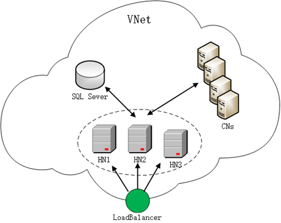
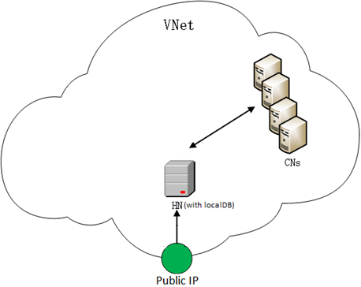
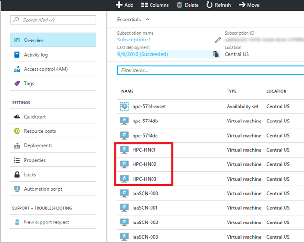

# Deploy an HPC Pack 2016 cluster in Azure

Follow the steps in this article to deploy a [Microsoft HPC Pack 2016](https://technet.microsoft.com/library/cc514029) cluster in Azure virtual machines. HPC Pack is Microsoft's free HPC solution built on Microsoft Azure and Windows Server technologies and supports a wide range of HPC workloads.

Use one of the [Azure Resource Manager templates](https://github.com/MsHpcPack/HPCPack2016) to deploy the HPC Pack 2016 cluster. You have several choices of cluster topology with different numbers of cluster head nodes, and with either Linux or Windows compute nodes.

## Prerequisites

### PFX certificate

A Microsoft HPC Pack 2016 cluster requires a Personal Information Exchange (PFX) certificate to secure the communication between the HPC nodes. The certificate must meet the following requirements:

* It must have a private key capable of key exchange
* Key usage includes Digital Signature and Key Encipherment
* Enhanced key usage includes Client Authentication and Server Authentication

If you don’t already have a certificate that meets these requirements, you can request the certificate from a certification authority. Alternatively, you can use the following commands to generate the self-signed certificate based on the operating system on which you run the command, and export the PFX format certificate with private key.

* **For Windows 10 or Windows Server 2016**, run the built-in **New-SelfSignedCertificate** PowerShell cmdlet as follows:

  ```PowerShell
  New-SelfSignedCertificate -Subject "CN=HPC Pack 2016 Communication" -KeySpec KeyExchange -TextExtension @("2.5.29.37={text}1.3.6.1.5.5.7.3.1,1.3.6.1.5.5.7.3.2") -CertStoreLocation cert:\CurrentUser\My -KeyExportPolicy Exportable -NotAfter (Get-Date).AddYears(5)
  ```
* **For operating systems earlier than Windows 10 or Windows Server 2016**, download the [self-signed certificate generator](https://gallery.technet.microsoft.com/scriptcenter/Self-signed-certificate-5920a7c6/) from the Microsoft Script Center. Extract its contents and run the following commands at a PowerShell prompt:

    ```PowerShell 
    Import-Module -Name c:\ExtractedModule\New-SelfSignedCertificateEx.ps1
  
    New-SelfSignedCertificateEx -Subject "CN=HPC Pack 2016 Communication" -KeySpec Exchange -KeyUsage "DigitalSignature,KeyEncipherment" -EnhancedKeyUsage "Server Authentication","Client Authentication" -StoreLocation CurrentUser -Exportable -NotAfter (Get-Date).AddYears(5)
    ```

### Upload certificate to an Azure key vault

Before deploying the HPC cluster, upload the certificate to an [Azure key vault](../../key-vault/index.md) as a secret, and record the following information for use during the deployment: **Vault name**, **Vault resource group**, **Certificate URL**, and **Certificate thumbprint**.

A sample PowerShell script to upload the certificate follows. For more information about uploading a certificate to an Azure key vault, see [Get started with Azure Key Vault](../../key-vault/key-vault-get-started.md).

```powershell
#Give the following values
$VaultName = "mytestvault"
$SecretName = "hpcpfxcert"
$VaultRG = "myresourcegroup"
$location = "westus"
$PfxFile = "c:\Temp\mytest.pfx"
$Password = "yourpfxkeyprotectionpassword"
#Validate the pfx file
try {
    $pfxCert = New-Object System.Security.Cryptography.X509Certificates.X509Certificate2 -ArgumentList $PfxFile, $Password
}
catch [System.Management.Automation.MethodInvocationException]
{
    throw $_.Exception.InnerException
}
$thumbprint = $pfxCert.Thumbprint
$pfxCert.Dispose()
# Create and encode the JSON object
$pfxContentBytes = Get-Content $PfxFile -Encoding Byte
$pfxContentEncoded = [System.Convert]::ToBase64String($pfxContentBytes)
$jsonObject = @"
{
"data": "$pfxContentEncoded",
"dataType": "pfx",
"password": "$Password"
}
"@
$jsonObjectBytes = [System.Text.Encoding]::UTF8.GetBytes($jsonObject)
$jsonEncoded = [System.Convert]::ToBase64String($jsonObjectBytes)
#Create an Azure key vault and upload the certificate as a secret
$secret = ConvertTo-SecureString -String $jsonEncoded -AsPlainText -Force
$rg = Get-AzureRmResourceGroup -Name $VaultRG -Location $location -ErrorAction SilentlyContinue
if($null -eq $rg)
{
    $rg = New-AzureRmResourceGroup -Name $VaultRG -Location $location
}
$hpcKeyVault = New-AzureRmKeyVault -VaultName $VaultName -ResourceGroupName $VaultRG -Location $location -EnabledForDeployment -EnabledForTemplateDeployment
$hpcSecret = Set-AzureKeyVaultSecret -VaultName $VaultName -Name $SecretName -SecretValue $secret
"The following Information will be used in the deployment template"
"Vault Name             :   $VaultName"
"Vault Resource Group   :   $VaultRG"
"Certificate URL        :   $($hpcSecret.Id)"
"Certificate Thumbprint :   $thumbprint"

```


## Supported topologies

Choose one of the [Azure Resource Manager templates](https://github.com/MsHpcPack/HPCPack2016) to deploy the HPC Pack 2016 cluster. Following are high-level architectures of three supported cluster topologies. High-availability topologies include multiple cluster head nodes.

1. High-availability cluster with Active Directory domain

    


2. High-availability cluster without Active Directory domain

    

3. Cluster with a single head node

   


## Deploy a cluster

To create the cluster, choose a template and click **Deploy to Azure**. In the [Azure portal](https://portal.azure.com), specify parameters for the template as described in the following steps. Each template creates all Azure resources required for the HPC cluster infrastructure. Resources include an Azure virtual network, public IP address, load balancer (only for a high-availability cluster), network interfaces, availability sets, storage accounts, and virtual machines.

### Step 1: Select the subscription, location, and resource group

The **Subscription** and the **Location** must be same that you specified when you uploaded your PFX certificate (see Prerequisites). We recommend that you create a **Resource group** for the deployment.

### Step 2: Specify the parameter settings

Enter or modify values for the template parameters. Click the icon next to each parameter for help information. Also see the guidance for [available VM sizes](sizes.md).

Specify the values you recorded in the Prerequisites for the following parameters: **Vault name**, **Vault resource group**, **Certificate URL**, and **Certificate thumbprint**.

### Step 3. Review legal terms and create
Click **Review legal terms** to review the terms. If you agree, click **Purchase**, and then click **Create** to start the deployment.

## Connect to the cluster
1. After the HPC Pack cluster is deployed, go to the [Azure portal](https://portal.azure.com). Click **Resource groups**, and find the resource group in which the cluster was deployed. You can find the head node virtual machines.

    

2. Click one head node (in a high-availability cluster, click any of the head nodes). In **Essentials**, you can find the public IP address or full DNS name of the cluster.

    

3. Click **Connect** to log on to any of the head nodes using Remote Desktop with your specified administrator user name. If the cluster you deployed is in an Active Directory Domain, the user name is of the form <privateDomainName>\<adminUsername> (for example, hpc.local\hpcadmin).

## Next steps
* Submit jobs to your cluster. See [Submit jobs to HPC an HPC Pack cluster in Azure](hpcpack-cluster-submit-jobs.md) and [Manage an HPC Pack 2016 cluster in Azure using Azure Active Directory](hpcpack-cluster-active-directory.md).

