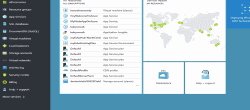
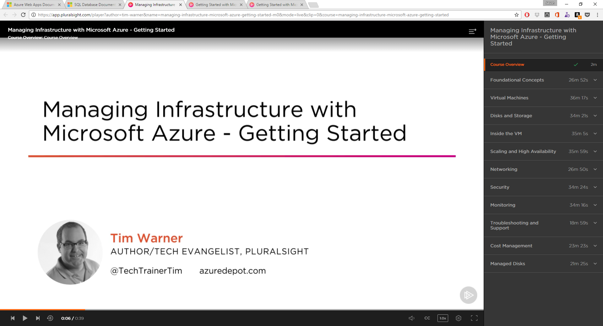
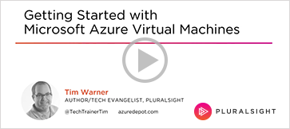
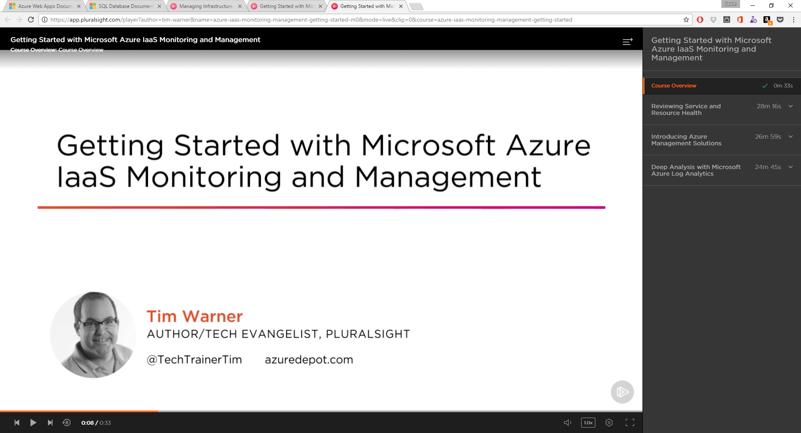

    <h1>Windows Virtual Machines Documentation</h1>
    

        

            
Azure Windows Virtual Machines provides on-demand, high-scale, secure, virtualized infrastructure using Windows Server. Learn how to create, configure, manage, and scale Windows VMs with our quickstarts, tutorials, and samples.

        

        <a href="https://azure.microsoft.com/en-us/resources/videos/create-windows-server-virtual-machine/">
            

                

                    
                

                

                    
Create a Windows Server Virtual Machine. (3:58)

                

            

        </a>
    

<h2 style="margin-top: 0px; margin-bottom: 0px;">5-Minute Quickstarts</h2>

Learn how to deploy an IIS web-server within a Virtual Machine running Windows Server 2016:

    

        <a href="/azure/virtual-machines/virtual-machines-windows-quick-create-portal?toc=%2fazure%2fvirtual-machines%2fwindows%2ftoc.json">
        
            Azure Portal
        </a>
    

    

        <a href="/azure/virtual-machines/virtual-machines-windows-quick-create-powershell?toc=%2fazure%2fvirtual-machines%2fwindows%2ftoc.json">
            
            Azure PowerShell
        </a>
    

    

        <a href="/azure/virtual-machines/virtual-machines-windows-quick-create-cli?toc=%2fazure%2fvirtual-machines%2fwindows%2ftoc.json">
            
            Azure CLI
        </a>
    

<h2 style="margin-top: 36px">Step-by-Step Tutorials</h2>

Learn how to deploy, manage, and monitor Windows VMs on Azure

<ol>
   <li><a href="/azure/virtual-machines/windows/tutorial-manage-vm">Create and manage Windows VMs</a></li>
    <li><a href="/azure/virtual-machines/windows/tutorial-manage-data-disk">Create and manage VM disks</a></li>
    <li><a href="/azure/virtual-machines/windows/tutorial-automate-vm-deployment">Automate VM configuration</a></li>
    <li><a href="/azure/virtual-machines/windows/tutorial-load-balancer">Load balance VMs</a></li>
    <li><a href="/azure/virtual-machines/windows/tutorial-virtual-network">Manage VM networking</a></li>
</ol>

<h2 style="margin-top: 36px">Free PluralSight Video Training</h2>
<ul class="panelContent cardsW">
    <li style="flex: 0 1 25%">
        <a href="https://www.pluralsight.com/courses/managing-infrastructure-microsoft-azure-getting-started?twoid=d6abac77-7dcc-4d33-9e03-f85e78989f02"> 
            

                

                    

                       

                            

                                
                            

                        

                        

                            
Managing Infrastructure

                        

                    

                

            

        </a>
    </li>
    <li style="flex: 0 1 25%">
        <a href="https://www.pluralsight.com/courses/azure-vms-getting-started?twoid=d6abac77-7dcc-4d33-9e03-f85e78989f02"> 
            

                

                    

                       

                            

                                
                            

                        

                        

                            
Getting Started with Virtual Machines

                        

                    

                

            

        </a>
    </li>
    <li style="flex: 0 1 25%">
        <a href="https://www.pluralsight.com/courses/azure-iaas-monitoring-management-getting-started?twoid=d6abac77-7dcc-4d33-9e03-f85e78989f02"> 
            

                

                    

                       

                            

                                
                            

                        

                        

                            
Getting Started with IaaS Monitoring

                        

                    

                

            

        </a>
    </li>
</ul>

<h2>Samples</h2>

Deploy your first application to Azure.

<ul class="spaced">
    <li><a href="/azure/virtual-machines/virtual-machines-windows-cli-samples?toc=%2fazure%2fvirtual-machines%2fwindows%2ftoc.json">Azure CLI</a></li>
    <li><a href="/azure/virtual-machines/virtual-machines-windows-powershell-samples?toc=%2fazure%2fvirtual-machines%2fwindows%2ftoc.json">Azure PowerShell</a></li>
</ul>

<h2 style="margin-top: 36px">Reference</h2>
<ul class="panelContent cardsW">
    <li>
        

            

                

                    

                        <h3>Command-Line</h3>
                        
<a href="/powershell/azureps-cmdlets-docs">Azure PowerShell</a>

                        
<a href="/cli/azure/vm">Azure CLI</a>

                    

                

            

        

    </li>
    <li>
        

            

                

                    

                        <h3>Languages</h3>
                        
<a href="/dotnet/api/microsoft.azure.management.compute">.NET</a>

                        
<a href="/java/api">Java</a>

                        
<a href="https://azure.microsoft.com/develop/nodejs/#azure-sdk">Node​.js</a>

                        
<a href="http://azure-sdk-for-python.readthedocs.io/en/latest/ref/azure.mgmt.compute.html">Python</a>

                    

                

            

        

    </li>
    <li>
        

            

                

                    

                        <h3>REST</h3>
                        
<a href="/rest/api/compute">Compute REST API Reference</a>

                    

                

            

        

    </li>
</ul>

