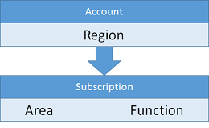

# Azure subscription and accounts guidelines for Windows VMs

[!INCLUDE [virtual-machines-windows-infrastructure-guidelines-intro](../../../includes/virtual-machines-windows-infrastructure-guidelines-intro.md)]

This article focuses on understanding how to approach subscription and account management as your environment and user base grows.

## Implementation guidelines for subscriptions and accounts
Decisions:

* What set of subscriptions and accounts do you need to host your IT workload or infrastructure?
* How to break down the hierarchy to fit your organization?

Tasks:

* Define your logical organization hierarchy as you would like to manage it from a subscription level.
* To match this logical hierarchy, define the accounts required and subscriptions under each account.
* Create the set of subscriptions and accounts using your naming convention.

## Subscriptions and accounts
To work with Azure, you need one or more Azure subscriptions. Resources like virtual machines (VMs) or virtual networks exist in of those subscriptions.

* Enterprise customers typically have an Enterprise Enrollment, which is the top-most resource in the hierarchy, and is associated to one or more accounts.
* For consumers and customers without an Enterprise Enrollment, the top-most resource is the account.
* Subscriptions are associated to accounts, and there can be one or more subscriptions per account. Azure records billing information at the subscription level.

Due to the limit of two hierarchy levels on the Account/Subscription relationship, it is important to align the naming convention of accounts and subscriptions to the billing needs. For instance, if a global company uses Azure, they might choose to have one account per region, and have subscriptions managed at the region level:

For instance, you might use the following structure:

If a region decides to have more than one subscription associated to a particular group, the naming convention should incorporate a way to encode the extra data on either the account or the subscription name. This organization allows massaging billing data to generate the new levels of hierarchy during billing reports:

The organization could look like the following example:

We provide detailed billing via a downloadable file for a single account, or for all accounts in an enterprise agreement.

## Next steps
[!INCLUDE [virtual-machines-windows-infrastructure-guidelines-next-steps](../../../includes/virtual-machines-windows-infrastructure-guidelines-next-steps.md)]

