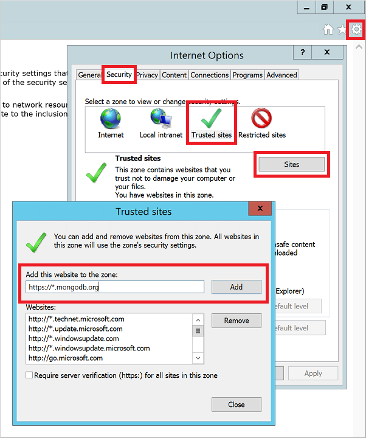
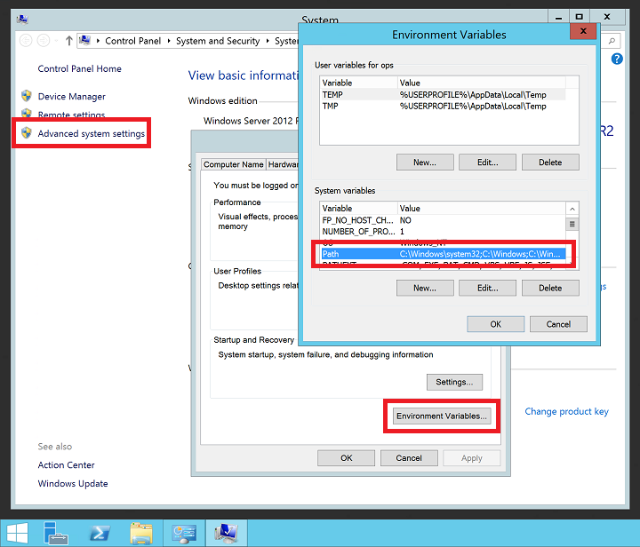

# Install and configure MongoDB on a Windows VM in Azure
[MongoDB](https://www.mongodb.org) is a popular open-source, high-performance NoSQL database. This article guides you through installing and configuring MongoDB on a Windows Server 2016 virtual machine (VM) in Azure. You can also [install MongoDB on a Linux VM in Azure](../linux/install-mongodb.md).

## Prerequisites
Before you install and configure MongoDB, you need to create a VM and, ideally, add a data disk to it. See the following articles to create a VM and add a data disk:

* Create a Windows Server VM using [the Azure portal](quick-create-portal.md) or [Azure PowerShell](quick-create-powershell.md).
* Attach a data disk to a Windows Server VM using [the Azure portal](attach-managed-disk-portal.md) or [Azure PowerShell](attach-disk-ps.md).

To begin installing and configuring MongoDB, [log on to your Windows Server VM](connect-logon.md) by using Remote Desktop.

## Install MongoDB
> [!IMPORTANT]
> MongoDB security features, such as authentication and IP address binding, are not enabled by default. Security features should be enabled before deploying MongoDB to a production environment. For more information, see [MongoDB Security and Authentication](https://www.mongodb.org/display/DOCS/Security+and+Authentication).


1. After you've connected to your VM using Remote Desktop, open Internet Explorer from the taskbar.
2. Select **Use recommended security, privacy, and compatibility settings** when Internet Explorer first opens, and click **OK**.
3. Internet Explorer enhanced security configuration is enabled by default. Add the MongoDB website to the list of allowed sites:
   
   * Select the **Tools** icon in the upper-right corner.
   * In **Internet Options**, select the **Security** tab, and then select the **Trusted Sites** icon.
   * Click the **Sites** button. Add *https://\*.mongodb.com* to the list of trusted sites, and then close the dialog box.
     
     
4. Browse to the [MongoDB - Downloads](https://www.mongodb.com/downloads) page (https://www.mongodb.com/downloads).
5. If needed, select the **Community Server** edition and then select the latest current stable release for*Windows Server 2008 R2 64-bit and later*. To download the installer, click **DOWNLOAD (msi)**.
   
    
   
    Run the installer after the download is complete.
6. Read and accept the license agreement. When you're prompted, select **Complete** install.
7. If desired, you can choose to also install Compass, a graphical interface for MongoDB.
8. On the final screen, click **Install**.

## Configure the VM and MongoDB
1. The path variables are not updated by the MongoDB installer. Without the MongoDB `bin` location in your path variable, you need to specify the full path each time you use a MongoDB executable. To add the location to your path variable:
   
   * Right-click the **Start** menu, and select **System**.
   * Click **Advanced system settings**, and then click **Environment Variables**.
   * Under **System variables**, select **Path**, and then click **Edit**.
     
     
     
     Add the path to your MongoDB `bin` folder. MongoDB is typically installed in *C:\Program Files\MongoDB*. Verify the installation path on your VM. The following example adds the default MongoDB install location to the `PATH` variable:
     
     ```
     ;C:\Program Files\MongoDB\Server\3.6\bin
     ```
     
     > [!NOTE]
     > Be sure to add the leading semicolon (`;`) to indicate that you are adding a location to your `PATH` variable.

2. Create MongoDB data and log directories on your data disk. From the **Start** menu, select **Command Prompt**. The following examples create the directories on drive F:
   
    ```
    mkdir F:\MongoData
    mkdir F:\MongoLogs
    ```
3. Start a MongoDB instance with the following command, adjusting the path to your data and log directories accordingly:
   
    ```
    mongod --dbpath F:\MongoData\ --logpath F:\MongoLogs\mongolog.log
    ```
   
    It may take several minutes for MongoDB to allocate the journal files and start listening for connections. All log messages are directed to the *F:\MongoLogs\mongolog.log* file as `mongod.exe` server starts and allocates journal files.
   
   > [!NOTE]
   > The command prompt stays focused on this task while your MongoDB instance is running. Leave the command prompt window open to continue running MongoDB. Or, install MongoDB as service, as detailed in the next step.

4. For a more robust MongoDB experience, install the `mongod.exe` as a service. Creating a service means you don't need to leave a command prompt running each time you want to use MongoDB. Create the service as follows, adjusting the path to your data and log directories accordingly:
   
    ```
    mongod --dbpath F:\MongoData\ --logpath F:\MongoLogs\mongolog.log --logappend  --install
    ```
   
    The preceding command creates a service named MongoDB, with a description of "Mongo DB". The following parameters are also specified:
   
   * The `--dbpath` option specifies the location of the data directory.
   * The `--logpath` option must be used to specify a log file, because the running service does not have a command window to display output.
   * The `--logappend` option specifies that a restart of the service causes output to append to the existing log file.
   
   To start the MongoDB service, run the following command:
   
    ```
    net start MongoDB
    ```
   
    For more information about creating the MongoDB service, see [Configure a Windows Service for MongoDB](https://docs.mongodb.com/manual/tutorial/install-mongodb-on-windows/#mongodb-as-a-windows-service).

## Test the MongoDB instance
With MongoDB running as a single instance or installed as a service, you can now start creating and using your databases. To start the MongoDB administrative shell, open another command prompt window from the **Start** menu, and enter the following command:

```
mongo  
```

You can list the databases with the `db` command. Insert some data as follows:

```
db.foo.insert( { a : 1 } )
```

Search for data as follows:

```
db.foo.find()
```

The output is similar to the following example:

```
{ "_id" : "ObjectId("57f6a86cee873a6232d74842"), "a" : 1 }
```

Exit the `mongo` console as follows:

```
exit
```

## Configure firewall and Network Security Group rules
Now that MongoDB is installed and running, open a port in Windows Firewall so you can remotely connect to MongoDB. To create a new inbound rule to allow TCP port 27017, open an administrative PowerShell prompt and enter the following command:

```powerahell
New-NetFirewallRule `
    -DisplayName "Allow MongoDB" `
    -Direction Inbound `
    -Protocol TCP `
    -LocalPort 27017 `
    -Action Allow
```

You can also create the rule by using the **Windows Firewall with Advanced Security** graphical management tool. Create a new inbound rule to allow TCP port 27017.

If needed, create a Network Security Group rule to allow access to MongoDB from outside of the existing Azure virtual network subnet. You can create the Network Security Group rules by using the [Azure portal](nsg-quickstart-portal.md) or [Azure PowerShell](nsg-quickstart-powershell.md). As with the Windows Firewall rules, allow TCP port 27017 to the virtual network interface of your MongoDB VM.

> [!NOTE]
> TCP port 27017 is the default port used by MongoDB. You can change this port by using the `--port` parameter when starting `mongod.exe` manually or from a service. If you change the port, make sure to update the Windows Firewall and Network Security Group rules in the preceding steps.


## Next steps
In this tutorial, you learned how to install and configure MongoDB on your Windows VM. You can now access MongoDB on your Windows VM, by following the advanced topics in the [MongoDB documentation](https://docs.mongodb.com/manual/).

