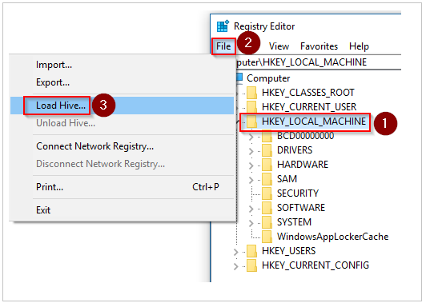
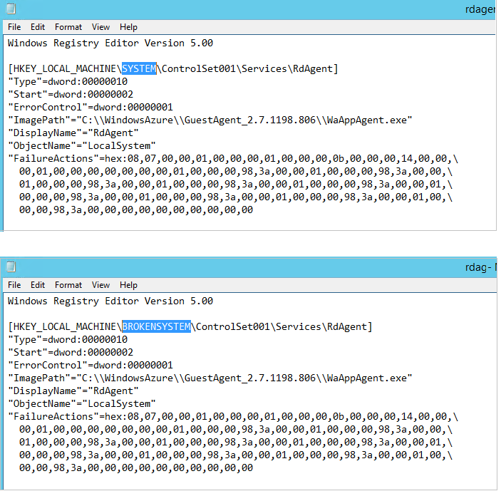

---
title: Install the VM Agent in Offline mode | Microsoft Docs
description: Learn Install the VM Agent in Offline mode.
services: virtual-machines-windows
documentationcenter: ''
author: genlin
manager: timlt
editor: ''
tags: azure-resource-manager

ms.assetid: 45c69812-d3e4-48de-a98d-39a0f5675777
ms.service: virtual-machines-windows
ms.workload: infrastructure-services
ms.tgt_pltfrm: vm-windows
ms.devlang: na
ms.topic: article
ms.date: 01/26/2018
ms.author: genli

---
# Install the VM Agent in Offline mode

The VM agent provides useful features likes local administrator
password reset, and script push. This article shows how to install the
VM Agent for a VM that is offline.

## Detail steps

**Step 1: Attach the OS disk of the VM to another (troubleshooter) VM as
a data disk**

1.  Delete the VM. Make sure that you select the **Keep the disks**
    option when you do this.

2.  Attach the OS disk as a data disk to another VM (a
    troubleshooting VM). For more information, see [How to attach a data
    disk to a Windows VM in the Azure
    portal](attach-managed-disk-portal.md)

3.  Connect to the troubleshooting VM. Open **Computer management** &gt;
    **Disk management**. Make sure that the OS disk is online and that
    its partitions have drive letters assigned.

**Step 2: Modify the OS disk to install VM Agent**

1.  Remote desktop to the troubleshoot VM.

2.  On the OS disk you attached, navigate to
    **\windows\system32\config**. Copy all the files as a backup in
    case a rollback is required.

3.  Open Registry Editor (regedit.exe).

4.  Click the **HKEY_LOCAL_MACHINE** key, and then select
    **File** > **Load Hive** on the menu.

    

5.  Navigate to **\windows\system32\config\SYSTEM** on the OS disk
    you attached, type BROKENSYSTEM as the name for the hive. After you do this, you will see the registry hive under
    **HKEY_LOCAL_MACHINE**.

6.  Navigate to **\windows\system32\config\SOFTWARE** on the OS disk
    you attached, type BROKENSOFTWARE as the name for the hive.

7.  If you have a current version of the agent that is not working,
    perform a backup of the current configuration. If the VM does not
    have VM agent installed, move to the next step.  
      
    1. Rename the folder \windowsazure to \windowsazure.old

    2. Export the following registries
        - HKEY_LOCAL_MACHINE\BROKENSYSTEM\ControlSet001\Services\WindowsAzureGuestAgent
        - HKEY_LOCAL_MACHINE
        \BROKENSYSTEM\\ControlSet001\Services\WindowsAzureTelemetryService
        - HKEY_LOCAL_MACHINE\BROKENSYSTEM\ControlSet001\Services\RdAgent

8.	Use the existing files on the troubleshooting VM as a repository for the VM agent installation: 

    1. From the troubleshooting VM export the following keys in .reg format: 

        - HKEY_LOCAL_MACHINE  \SYSTEM\ControlSet001\Services\WindowsAzureGuestAgent
        - HKEY_LOCAL_MACHINE  \SYSTEM\ControlSet001\Services\WindowsAzureTelemetryService
        - HKEY_LOCAL_MACHINE  \SYSTEM\ControlSet001\Services\RdAgent

        

    2. Edit these three reg file by changing the SYSTEM to BROKENSYSTEM and save the files.
        
    3. Import the reg file by double-clicking the reg files.
    4. Browse into the registry, make sure that the following keys are implaed into the BROKENSYSTEM hive successfully: WindowsAzureGuestAgent, WindowsAzureTelemetryService and RdAgent.

9.  Copy the VM agent folder from C:\windowsazure\packages
    to the &lt;OS disk you attached&gt;:\windowsazure\packages.
    
      
    **Note** Don’t copy the logs folder as we need fresh new logs, which
    will be generated after service starts.

10.  Click BROKENSYSTEM and select **File** > **Unload Hive**​ from the menu.

11.  Click BROKENSOFTWARE and select **File** > **Unload Hive**​ from the menu.

12.  Detach the disk and recreate the VM by using the OS disk.

13. Now if you access the VM you will see the RDAgent running and the
    logs getting created.

14. If this is an CRP VM you are done but if this is an RDFE
    VM, you must also use Azure PowerShell to update the
    ProvisionGuestAgent property so Azure knows the VM has the
    agent installed. To accomplish this, proceed with the following from
    Azure Powershell:

        $vm = Get-AzureVM –ServiceName <cloud service name> –Name <VM name>
        $vm.VM.ProvisionGuestAgent = $true
        Update-AzureVM –Name <VM name> –VM $vm.VM –ServiceName <cloud service name>

    Now if you run Get-AzureVM again, the GuestAgentStatus property should be populated instead of blank:

        Get-AzureVM –ServiceName <cloud service name> –Name <VM name>
        GuestAgentStatus:Microsoft.WindowsAzure.Commands.ServiceManagement.Model.PersistentVMModel.GuestAgentStatus